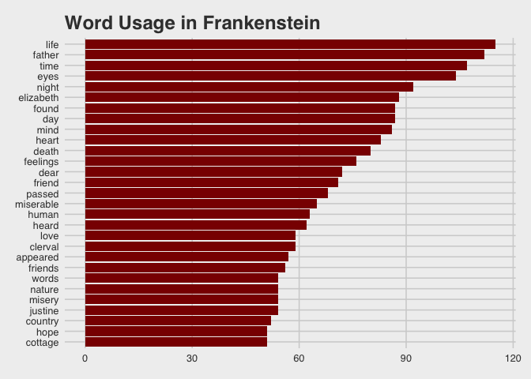
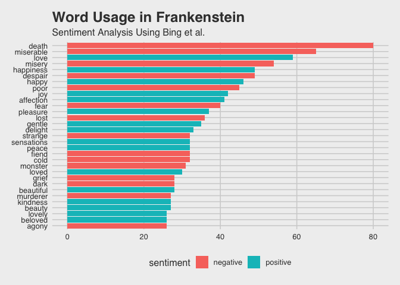
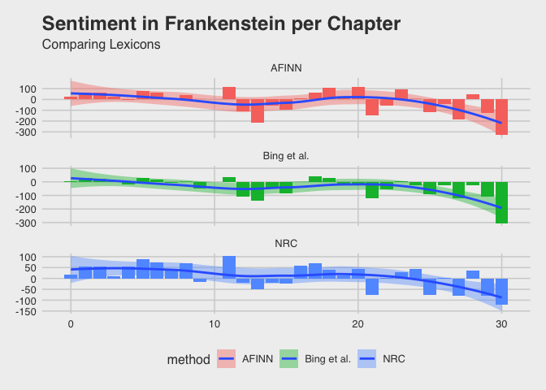
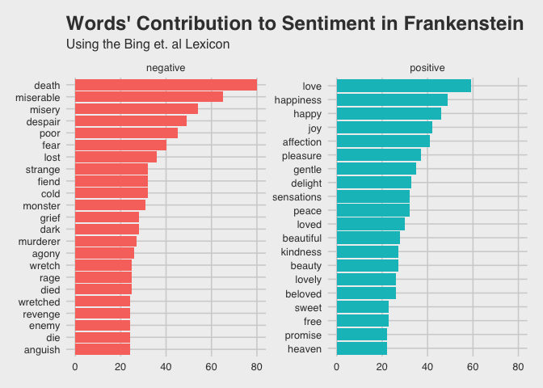
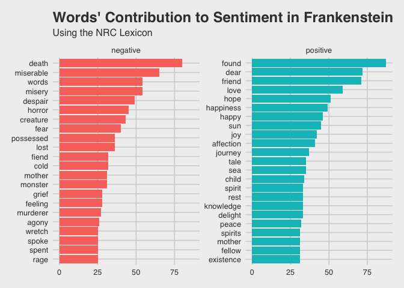
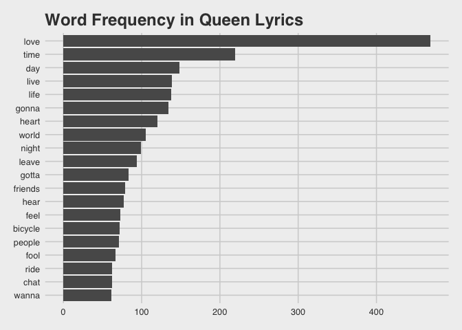
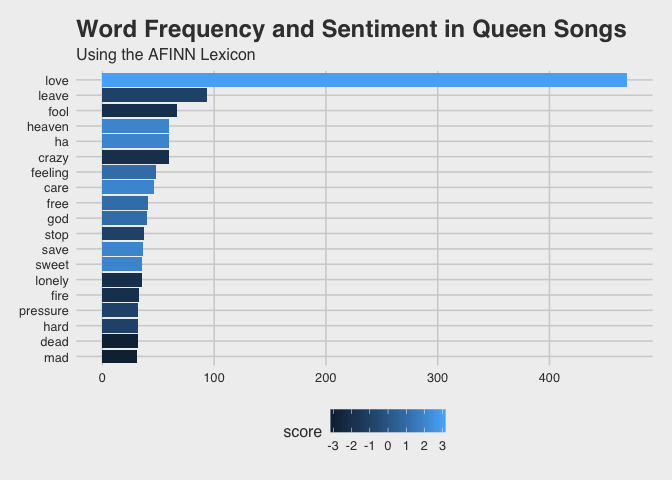
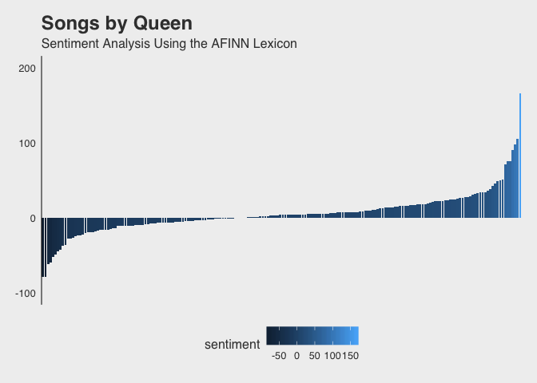
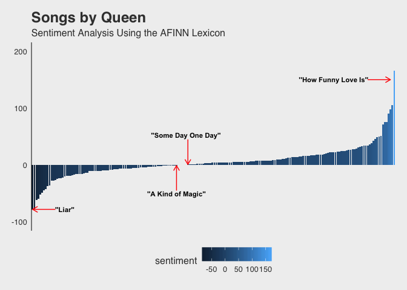

Introduction to TidyText
================
Kaylee Alexander, Duke University
2019-27-03

[RStudio](https://www.rstudio.com/) is a free and open-source integrated development environment (IDE) for R, a programming language for statistical computing and graphics. Working in RStudio, you can easy install R packages, such as the Tidyverse packages for data science. These packages (i.e. dplyr, tidyr, ggplot2, etc.) facilitate data cleaning, analysis and visualization. R can also be used to analyze non-quantitative data, such as texts. In this workshop we will use the **[tidytext](https://www.tidytextmining.com/)** package (as well as others) to analyze and visualize written works, such as novels and song lyrics.

### 1. Getting Started

To begin, we need to open RStudio and create a new script.

-   Go to **File** → **New File** → **R Script**

For this workshop, you will be using the following packages:

1.  [dplyr](https://dplyr.tidyverse.org/)
2.  [tidytext](https://cran.r-project.org/web/packages/tidytext/vignettes/tidytext.html)
3.  [gutenbergr](https://cran.r-project.org/web/packages/gutenbergr/vignettes/intro.html)
4.  [ggplot2](https://ggplot2.tidyverse.org/)
5.  [ggthemes](https://www.rdocumentation.org/packages/ggthemes/versions/3.5.0)
6.  [stringr](https://cran.r-project.org/web/packages/stringr/vignettes/stringr.html)
7.  [tidyr](https://tidyr.tidyverse.org/)

If you have not worked with these packages in RStudio before, you will need to install them. To install these packages in RStudio:

-   click select the **Packages** tab in the bottom right window
-   click **Install**
-   type in the names of the packages above (separated by a space or a comma)
-   click **Install**

### 2. Manually Loading Text & Creating a Data Frame

Text can be entered into RStudio manually and transformed into a data frame for analysis. You can separate multiple lines of text by separating each line with a comma ( , ). Go to your script window and type in the following code chunk:

``` r
text <- c("The time has come,' the Walrus said,",
          "To talk of many things:",
          "Of shoes — and ships — and sealing-wax —",
          "Of cabbages — and kings —",
          "And why the sea is boiling hot —",
          "And whether pigs have wings.'")

text
```

    ## [1] "The time has come,' the Walrus said,"    
    ## [2] "To talk of many things:"                 
    ## [3] "Of shoes — and ships — and sealing-wax —"
    ## [4] "Of cabbages — and kings —"               
    ## [5] "And why the sea is boiling hot —"        
    ## [6] "And whether pigs have wings.'"

Next, you will need to transform the value **text** into a **tibble** (data frame), which will allow you to perform text analysis. For this, you will use the **dplyr** package that you installed earlier. To use an installed package, you need to first load it into your R session. To load **dplyr**, run the following:

``` r
library(dplyr)
```

    ## 
    ## Attaching package: 'dplyr'

    ## The following objects are masked from 'package:stats':
    ## 
    ##     filter, lag

    ## The following objects are masked from 'package:base':
    ## 
    ##     intersect, setdiff, setequal, union

Now you can create a data frame from the value you previously created. Run the following:

``` r
text_df <- data_frame(line = 1:6, text = text)
```

    ## Warning: `data_frame()` is deprecated, use `tibble()`.
    ## This warning is displayed once per session.

``` r
text_df
```

    ## # A tibble: 6 x 2
    ##    line text                                    
    ##   <int> <chr>                                   
    ## 1     1 The time has come,' the Walrus said,    
    ## 2     2 To talk of many things:                 
    ## 3     3 Of shoes — and ships — and sealing-wax —
    ## 4     4 Of cabbages — and kings —               
    ## 5     5 And why the sea is boiling hot —        
    ## 6     6 And whether pigs have wings.'

### 3. Text Tokenization

In order to perform more analysis on this text, we want to convert the data frame so that we have one token (in this case, a word) per document per row, a process called **tokenization**. Tokenizing text will retain the line number, remove punctuation, and default all words to lowercase characters.[1] For this, we will be using the **tidytext** package.

Load the **tidytext** package into the session, as we did with **dplyr**.

``` r
library(tidytext)
```

Then, run the following to tokenize:

``` r
text_df %>% 
  unnest_tokens(word, text)
```

    ## # A tibble: 35 x 2
    ##     line word  
    ##    <int> <chr> 
    ##  1     1 the   
    ##  2     1 time  
    ##  3     1 has   
    ##  4     1 come  
    ##  5     1 the   
    ##  6     1 walrus
    ##  7     1 said  
    ##  8     2 to    
    ##  9     2 talk  
    ## 10     2 of    
    ## # … with 25 more rows

You can replace the data in your environment with this new tibble by running the following:

``` r
text_df <- text_df %>%
  unnest_tokens(word, text)

text_df
```

    ## # A tibble: 35 x 2
    ##     line word  
    ##    <int> <chr> 
    ##  1     1 the   
    ##  2     1 time  
    ##  3     1 has   
    ##  4     1 come  
    ##  5     1 the   
    ##  6     1 walrus
    ##  7     1 said  
    ##  8     2 to    
    ##  9     2 talk  
    ## 10     2 of    
    ## # … with 25 more rows

This is the format in which we can begin to analyze texts using R. In the next section, we will work with a larger text, and begin to perform some basic analyses and visualizations.

### 4. Analyzing Mary Shelley’s *Frankenstein* (1831)

Project Gutenberg is a free database of eBooks, predominately texts for which the U.S. copyright has expired. These ebooks are available in a variety of formats, including Plain Text UTF-8, which we can easily use for text analysis in R. Each e-book has its own unique e-book number, which we can use with the package **gutenbergr** to automatically load the text into an RStudio environment. In this section, we will load and analyze the text of Mary Shelley’s *Frankenstein* (e-book \# 42324).

Begin by loading the **gutenbergr** package into the session, as we did with **dplyr** and **tidytext**.

``` r
library(gutenbergr)
```

Then, run the following:

``` r
frankenstein <- gutenberg_download(c(42324))
```

    ## Determining mirror for Project Gutenberg from http://www.gutenberg.org/robot/harvest

    ## Using mirror http://aleph.gutenberg.org

``` r
frankenstein
```

    ## # A tibble: 7,631 x 2
    ##    gutenberg_id text                                                       
    ##           <int> <chr>                                                      
    ##  1        42324 "                             FRANKENSTEIN:"               
    ##  2        42324 ""                                                         
    ##  3        42324 "                                  OR,"                    
    ##  4        42324 ""                                                         
    ##  5        42324 "                         THE MODERN PROMETHEUS."          
    ##  6        42324 ""                                                         
    ##  7        42324 "                          BY MARY W. SHELLEY."            
    ##  8        42324 ""                                                         
    ##  9        42324 "            AUTHOR OF THE LAST MAN, PERKIN WARBECK, &c. &…
    ## 10        42324 ""                                                         
    ## # … with 7,621 more rows

If you look at the first few rows, you see that this also includes the novel’s front matter (i.e. title page, publishing info, introduction, etc.). If you were to examine the last rows, you would also see it includes additional publishing information and the transcriber’s notes. Since we’re only interested in analyzing Shelley’s novel, it would be useful to remove these rows.

Run the following to remove the front matter (rows 1-237) and back matter (rows 7620-7631):

``` r
frankenstein <- frankenstein[-c(1:237, 7620:7631), ]

frankenstein
```

    ## # A tibble: 7,382 x 2
    ##    gutenberg_id text                                                       
    ##           <int> <chr>                                                      
    ##  1        42324 PREFACE.                                                   
    ##  2        42324 ""                                                         
    ##  3        42324 ""                                                         
    ##  4        42324 The event on which this fiction is founded, has been suppo…
    ##  5        42324 Darwin, and some of the physiological writers of Germany, …
    ##  6        42324 impossible occurrence. I shall not be supposed as accordin…
    ##  7        42324 degree of serious faith to such an imagination; yet, in as…
    ##  8        42324 the basis of a work of fancy, I have not considered myself…
    ##  9        42324 weaving a series of supernatural terrors. The event on whi…
    ## 10        42324 interest of the story depends is exempt from the disadvant…
    ## # … with 7,372 more rows

Now we’re ready to tokenize. During this process, we can add an additional argument to order the words according to the word count. Run the following to create a new tibble with the tokenized text, ordered according to word count:

``` r
tidy_frankenstein <- frankenstein %>%
  unnest_tokens(word, text) %>%
  count(word, sort = TRUE)

tidy_frankenstein
```

    ## # A tibble: 7,117 x 2
    ##    word      n
    ##    <chr> <int>
    ##  1 the    4248
    ##  2 and    2993
    ##  3 i      2858
    ##  4 of     2684
    ##  5 to     2114
    ##  6 my     1781
    ##  7 a      1402
    ##  8 in     1141
    ##  9 was    1026
    ## 10 that   1020
    ## # … with 7,107 more rows

You may have noticed that these top used words don’t tell you too much about the text of Frankenstein. These types of words are called **stop words** (i.e. 'the', 'of', 'to', etc.). We can remove these types of words from our analysis by using the **anti\_join** function. Luckily, you won’t have to come up with a whole list of these words yourself; RStudio includes a preloaded package with a data frame, **stop\_words**, which contains English stop words compiled from three different lexicons.[2]

To remove the stop words from the **tidy\_frankenstein tibble**, you must first load the **stop\_words** data frame:

``` r
data("stop_words")
```

Now, you can remove the stop words from your data frame:

``` r
tidy_frankenstein <- tidy_frankenstein %>%
  anti_join(stop_words)
```

    ## Joining, by = "word"

``` r
tidy_frankenstein
```

    ## # A tibble: 6,637 x 2
    ##    word          n
    ##    <chr>     <int>
    ##  1 life        115
    ##  2 father      112
    ##  3 time        107
    ##  4 eyes        104
    ##  5 night        92
    ##  6 elizabeth    88
    ##  7 day          87
    ##  8 found        87
    ##  9 mind         86
    ## 10 heart        83
    ## # … with 6,627 more rows

### 5. Visualizing Mary Shelley's *Frankenstein* (1831)

We are now ready to plot the text of Frankenstein. To do this we will use the packages **ggplot2** and **ggthemes**. These packages are used to create data graphics, according to the Grammar of Graphics. This allows you to easily manipulate the design of your graphs, and to create the most visually appealing data visualizations in R.

First, we are going to plot the most commonly used words in Frankenstein. To do this, first load ggplot2 and ggthemes into your session.

``` r
library(ggplot2)
library(ggthemes)
```

Next, run the following to plot the words in *Frankenstein* that appear more than 50 times:

``` r
tidy_frankenstein %>%
  filter(n > 50) %>%
  mutate(word = reorder(word, n)) %>%
  ggplot(aes(word, n)) + 
  geom_col(fill = "darkred") + 
  theme_fivethirtyeight() +
  xlab(NULL) + 
  ylab("Word Count") +
  coord_flip() +
  ggtitle("Word Usage in Frankenstein")
```



This code chunk first calls the dataset that we would like to plot, then filters the dataset to only words that appear more than 50 times in the novel and orders the data according to the number of mentions. Then it calls **ggplot**, and plots **word** on the **x-axis** and **n** (word count) on the **y-axis**. **Geom\_col** tells R to use a bar chart with the value of the *y* variable (here, *n*), while the function **fill = “darkred”** colors in the bars.[3] **theme\_fivethirtyeight** is a pre-set design from the package [ggthemes](https://www.rdocumentation.org/packages/ggthemes/versions/3.5.0), which we then manipulate with the subsequent arguments to adjust the x-axis labels and y-axis labels, change the graph into a horizontal format, and add an appropriate title.

### 6. Sentiment Lexicons

One type of textual analysis that can be conducted using R is sentiment analysis in which the emotions of a given text or set of texts is examined. To conduct sentiment analysis, we can use sentiment lexicons. There are three lexicons that can be used for general sentiment analysis on English-language texts: **AFINN** (Finn Årup Nielsen), **bing** (Bing Liu et. Al) and **nrc** (Saif Mohammad and Peter Turney). These lexicons assign scores for positive and negative sentiment, and also emotions such as joy, anger, fear, etc.

-   **nrc** categorizes words as positive, negative, anger, anticipation, disgust, fear, joy, sadness, surprise and trust.
-   **bing** categorizes words as positive or negative.
-   **AFINN** assigns words a numeric score between -5 and 5, where the negative scores indicate negative sentiment and positive scores indicate positive sentiment.

All three of these lexicons are included in the **sentiments** dataset, and **tidytext** provides the function **get\_sentiments( )**, which can be used to call specific lexicons. To call the **bing** lexicon, for example, run the following:

``` r
get_sentiments("bing")
```

    ## # A tibble: 6,788 x 2
    ##    word        sentiment
    ##    <chr>       <chr>    
    ##  1 2-faced     negative 
    ##  2 2-faces     negative 
    ##  3 a+          positive 
    ##  4 abnormal    negative 
    ##  5 abolish     negative 
    ##  6 abominable  negative 
    ##  7 abominably  negative 
    ##  8 abominate   negative 
    ##  9 abomination negative 
    ## 10 abort       negative 
    ## # … with 6,778 more rows

Now, call the **AFINN** sentiment lexicon.

``` r
get_sentiments("afinn")
```

    ## # A tibble: 2,476 x 2
    ##    word       score
    ##    <chr>      <int>
    ##  1 abandon       -2
    ##  2 abandoned     -2
    ##  3 abandons      -2
    ##  4 abducted      -2
    ##  5 abduction     -2
    ##  6 abductions    -2
    ##  7 abhor         -3
    ##  8 abhorred      -3
    ##  9 abhorrent     -3
    ## 10 abhors        -3
    ## # … with 2,466 more rows

Finally, call the **nrc** lexicon.

``` r
get_sentiments("nrc")
```

    ## # A tibble: 13,901 x 2
    ##    word        sentiment
    ##    <chr>       <chr>    
    ##  1 abacus      trust    
    ##  2 abandon     fear     
    ##  3 abandon     negative 
    ##  4 abandon     sadness  
    ##  5 abandoned   anger    
    ##  6 abandoned   fear     
    ##  7 abandoned   negative 
    ##  8 abandoned   sadness  
    ##  9 abandonment anger    
    ## 10 abandonment fear     
    ## # … with 13,891 more rows

These sentiment lexicons can be joined with your tokenized text(s) to conduct sentiment analysis by using the **inner\_join** function from the **dplyr** package.

Run the following code chunk to create a new data frame connecting the **bing** sentiment lexicon to the **tidy\_frankenstein** tibble you created earlier.

``` r
frankenstein_bing <- tidy_frankenstein %>%
  inner_join(get_sentiments("bing"))
```

    ## Joining, by = "word"

``` r
frankenstein_bing
```

    ## # A tibble: 1,473 x 3
    ##    word          n sentiment
    ##    <chr>     <int> <chr>    
    ##  1 death        80 negative 
    ##  2 miserable    65 negative 
    ##  3 love         59 positive 
    ##  4 misery       54 negative 
    ##  5 despair      49 negative 
    ##  6 happiness    49 positive 
    ##  7 happy        46 positive 
    ##  8 poor         45 negative 
    ##  9 joy          42 positive 
    ## 10 affection    41 positive 
    ## # … with 1,463 more rows

Now, let's use **ggplot2** to produce a horizontal bar chart showing positive and negative word usage in *Frankenstein* usiong the Bing et al. sentiment lexicon.

``` r
frankenstein_bing %>%
  filter(n > 25) %>%
  mutate(word = reorder(word, n)) %>%
  ggplot(aes(word, n, fill=sentiment)) + 
  theme_fivethirtyeight() +
  geom_col() + 
  xlab(NULL) + 
  coord_flip() +
  ylab("Word Count") +
  ggtitle("Word Usage in Frankenstein", subtitle = "Sentiment Analysis Using Bing et al.")
```



We can also use the **nrc** sentiment lexicon to get a better insight into how specific emotions play a role in a given text by filtering the data and joining it to your tokenized text. To see how fear appears in Frankenstein, run the following code chunks:

``` r
nrc_fear <- get_sentiments("nrc") %>%
  filter(sentiment == "fear")

nrc_fear
```

    ## # A tibble: 1,476 x 2
    ##    word        sentiment
    ##    <chr>       <chr>    
    ##  1 abandon     fear     
    ##  2 abandoned   fear     
    ##  3 abandonment fear     
    ##  4 abduction   fear     
    ##  5 abhor       fear     
    ##  6 abhorrent   fear     
    ##  7 abominable  fear     
    ##  8 abomination fear     
    ##  9 abortion    fear     
    ## 10 absence     fear     
    ## # … with 1,466 more rows

``` r
tidy_frankenstein %>%
  inner_join(nrc_fear)
```

    ## Joining, by = "word"

    ## # A tibble: 493 x 3
    ##    word          n sentiment
    ##    <chr>     <int> <chr>    
    ##  1 death        80 fear     
    ##  2 misery       54 fear     
    ##  3 despair      49 fear     
    ##  4 horror       45 fear     
    ##  5 creature     43 fear     
    ##  6 fear         40 fear     
    ##  7 journey      37 fear     
    ##  8 possessed    36 fear     
    ##  9 fiend        32 fear     
    ## 10 monster      31 fear     
    ## # … with 483 more rows

Repeat this process looking at the words associated with **disgust**.

``` r
nrc_disgust <- get_sentiments("nrc") %>%
  filter(sentiment == "disgust")

nrc_disgust
```

    ## # A tibble: 1,058 x 2
    ##    word        sentiment
    ##    <chr>       <chr>    
    ##  1 aberration  disgust  
    ##  2 abhor       disgust  
    ##  3 abhorrent   disgust  
    ##  4 abject      disgust  
    ##  5 abnormal    disgust  
    ##  6 abominable  disgust  
    ##  7 abomination disgust  
    ##  8 abortion    disgust  
    ##  9 abundance   disgust  
    ## 10 abuse       disgust  
    ## # … with 1,048 more rows

``` r
tidy_frankenstein %>%
  inner_join(nrc_disgust)
```

    ## Joining, by = "word"

    ## # A tibble: 277 x 3
    ##    word          n sentiment
    ##    <chr>     <int> <chr>    
    ##  1 death        80 disgust  
    ##  2 miserable    65 disgust  
    ##  3 misery       54 disgust  
    ##  4 despair      49 disgust  
    ##  5 horror       45 disgust  
    ##  6 creature     43 disgust  
    ##  7 possessed    36 disgust  
    ##  8 fiend        32 disgust  
    ##  9 feeling      28 disgust  
    ## 10 murderer     27 disgust  
    ## # … with 267 more rows

### 7. Comparing Sentiment Lexicons

In performing sentiment analysis, it might be useful to compare how the use of a given lexicon impacts the analysis. In this section we will explore how the **AFINN**, **bing**, and **nrc** lexicons compare when we examine the narrative arc of *Frankenstein.* First, we will divide the text of *Frankenstein* into its narrative sections[4] using the package **stringr**. We will then use the **tidyr** package to bind the sections to the different sentiment lexicons while manipulating the nrc and bing sentiment lexicons to match the numeric scoring used by the AFINN lexicon.

First, load the **stringr** and **tidyr** packages into your session.

``` r
library(stringr)
library(tidyr)
```

Then, run the following code chunk to section off the text of *Frankenstein* according to each letter or chapter.

``` r
frankenstein_sections <- frankenstein %>%
  mutate(section = 
           cumsum(str_detect(text,regex("^chapter|letter [\\divxlc]",
                                        ignore_case = TRUE)))) %>%
  ungroup()%>%
  unnest_tokens(word, text) %>%
  anti_join(stop_words)
```

    ## Joining, by = "word"

``` r
frankenstein_sections
```

    ## # A tibble: 27,543 x 3
    ##    gutenberg_id section word         
    ##           <int>   <int> <chr>        
    ##  1        42324       0 preface      
    ##  2        42324       0 event        
    ##  3        42324       0 fiction      
    ##  4        42324       0 founded      
    ##  5        42324       0 supposed     
    ##  6        42324       0 dr           
    ##  7        42324       0 darwin       
    ##  8        42324       0 physiological
    ##  9        42324       0 writers      
    ## 10        42324       0 germany      
    ## # … with 27,533 more rows

Now, run the following to create a tibble summarizing the total sentiment score (according to the AFINN lexicon) per section of *Frankenstein*.

``` r
frankenstein_afinn <- frankenstein_sections %>%
  inner_join(get_sentiments("afinn")) %>%
  group_by(index = section) %>%
  summarize(sentiment = sum(score)) %>%
  mutate(method = "AFINN")
```

    ## Joining, by = "word"

``` r
frankenstein_afinn
```

    ## # A tibble: 30 x 3
    ##    index sentiment method
    ##    <int>     <int> <chr> 
    ##  1     0        23 AFINN 
    ##  2     1        66 AFINN 
    ##  3     2        61 AFINN 
    ##  4     3        27 AFINN 
    ##  5     4        -2 AFINN 
    ##  6     5        81 AFINN 
    ##  7     6        62 AFINN 
    ##  8     7         1 AFINN 
    ##  9     8        38 AFINN 
    ## 10     9         2 AFINN 
    ## # … with 20 more rows

Next, create a tibble joining the **bing** and **nrc** lexicons to **frankenstein\_sections**, and converting the binary values "positive" and "negative" to a numeric score comparable to the **AFINN** lexicon.

``` r
frankenstein_bingnrc <- bind_rows(frankenstein_sections %>%
                                    inner_join(get_sentiments("bing")) %>%
                                    mutate(method = "Bing et al."),
                                  frankenstein_sections %>%
                                    inner_join(get_sentiments("nrc") %>%
                                                 filter(sentiment %in%
                                                          c("positive",
                                                            "negative"))) %>%
                                    mutate(method = "NRC")) %>%
  count(method, index = section, sentiment) %>%
  spread(sentiment, n, fill = 0) %>%
  mutate(sentiment = positive - negative)
```

    ## Joining, by = "word"
    ## Joining, by = "word"

``` r
frankenstein_bingnrc
```

    ## # A tibble: 60 x 5
    ##    method      index negative positive sentiment
    ##    <chr>       <int>    <dbl>    <dbl>     <dbl>
    ##  1 Bing et al.     0       16       20         4
    ##  2 Bing et al.     1       32       58        26
    ##  3 Bing et al.     2       49       72        23
    ##  4 Bing et al.     3       10       15         5
    ##  5 Bing et al.     4      113       94       -19
    ##  6 Bing et al.     5       60       89        29
    ##  7 Bing et al.     6       84      102        18
    ##  8 Bing et al.     7       90       81        -9
    ##  9 Bing et al.     8      103       99        -4
    ## 10 Bing et al.     9      111       64       -47
    ## # … with 50 more rows

Now we can plot the **frankenstein\_afinn** and **frankenstein\_bingnrc** tibbles together using **ggplot2**.

``` r
bind_rows(frankenstein_afinn, 
          frankenstein_bingnrc) %>%
  ggplot(aes(index, sentiment, fill = method)) + 
  geom_col(show.legend = FALSE) +
  facet_wrap(~method, ncol = 1, scales = "free_y") +
  geom_smooth() +
  theme_fivethirtyeight() +
  xlab("Index") + 
  ylab("Sentiment Score") +
  ggtitle("Sentiment in Frankenstein per Chapter", subtitle = "Comparing Lexicons")
```

    ## `geom_smooth()` using method = 'loess' and formula 'y ~ x'



Discrepancies among sentiment scores can be due to the ways in which sentiment is categorized in or scored, as well as which words appear or do not appear in each lexicon. To understand these lexicons further, you can count the number of positive and negative words included in each. To look further into **nrc**, run the following:

``` r
get_sentiments("nrc") %>%
  filter(sentiment %in% c("positive",
                          "negative")) %>%
  count(sentiment)
```

    ## # A tibble: 2 x 2
    ##   sentiment     n
    ##   <chr>     <int>
    ## 1 negative   3324
    ## 2 positive   2312

Now, examine **bing**.

``` r
get_sentiments("bing") %>%
  count(sentiment)
```

    ## # A tibble: 2 x 2
    ##   sentiment     n
    ##   <chr>     <int>
    ## 1 negative   4782
    ## 2 positive   2006

It is also useful to know how much each word contributes to the overall sentiment of the book. To do this, we can create and plot a tibble joining a given lexicon to the text and creating a variable *n* to indicate the word count.

To create the tibble, run the following code chunk:

``` r
frank_bingcounts <- frankenstein_sections %>%
  inner_join(get_sentiments("bing")) %>%
  count(word, sentiment, sort = TRUE) %>%
  ungroup()
```

    ## Joining, by = "word"

``` r
frank_bingcounts
```

    ## # A tibble: 1,473 x 3
    ##    word      sentiment     n
    ##    <chr>     <chr>     <int>
    ##  1 death     negative     80
    ##  2 miserable negative     65
    ##  3 love      positive     59
    ##  4 misery    negative     54
    ##  5 despair   negative     49
    ##  6 happiness positive     49
    ##  7 happy     positive     46
    ##  8 poor      negative     45
    ##  9 joy       positive     42
    ## 10 affection positive     41
    ## # … with 1,463 more rows

To plot:

``` r
frank_bingcounts %>%
  group_by(sentiment) %>%
  top_n(20) %>%
  ungroup() %>%
  mutate(word = reorder(word, n)) %>%
  ggplot(aes(word, n, fill = sentiment)) +
  geom_col(show.legend = FALSE) + 
  facet_wrap(~sentiment, scales = "free_y") + 
  coord_flip() +
  theme_fivethirtyeight() +
  ggtitle("Words' Contribution to Sentiment in Frankenstein", subtitle = "Using the Bing et. al Lexicon")
```

    ## Selecting by n



Now, let's plot the contrubution to sentiment that positive and negative words in *Frankenstein* have using the nrc lexicon. (Note: you will have to include a filter to only include the categories “positive” and “negative.”)

Create the tibble:

``` r
frank_nrccounts <- frankenstein_sections %>%
  inner_join(get_sentiments("nrc")) %>%
  filter(sentiment %in% c("positive",
                          "negative")) %>%
  count(word, sentiment, sort = TRUE) %>%
  ungroup()
```

    ## Joining, by = "word"

``` r
frank_nrccounts
```

    ## # A tibble: 1,707 x 3
    ##    word      sentiment     n
    ##    <chr>     <chr>     <int>
    ##  1 found     positive     87
    ##  2 death     negative     80
    ##  3 dear      positive     72
    ##  4 friend    positive     71
    ##  5 miserable negative     65
    ##  6 love      positive     59
    ##  7 misery    negative     54
    ##  8 words     negative     54
    ##  9 hope      positive     51
    ## 10 despair   negative     49
    ## # … with 1,697 more rows

Plot:

``` r
frank_nrccounts %>%
  group_by(sentiment) %>%
  top_n(20) %>%
  ungroup() %>%
  mutate(word = reorder(word, n)) %>%
  ggplot(aes(word, n, fill = sentiment)) +
  geom_col(show.legend = FALSE) + 
  facet_wrap(~sentiment, scales = "free_y") + 
  coord_flip() +
  theme_fivethirtyeight() +
  ggtitle("Words' Contribution to Sentiment in Frankenstein", subtitle = "Using the NRC Lexicon")
```

    ## Selecting by n



### 8. Analyzing Queen Lyrics

In this section we will experiment with using sentiment analysis on song lyrics. To begin, we will import the Queen.csv file containing all of the lyrics to songs by the band Queen.

First, load the **Queen.csv** file into your environment.

``` r
queen <- read.csv("https://raw.githubusercontent.com/kayleealexander/TidyText/master/Queen.csv", stringsAsFactors = FALSE)

queen
```

    ##                                                                                                                 text
    ## 1                                                                   You say you love me, and I hardly know your name
    ## 2                                                                         And if I say I love you in the candlelight
    ## 3                                                                                 There's no-one but myself to blame
    ## 4                                                          But there's something inside, that's turning my mind away
    ## 5                                                                   Oh how I could love you, if I could let you stay
    ## 6                                                                            It's late, but I'm bleeding deep inside
    ## 7                                                                             It's late, is it just my sickly pride?
    ## 8                                                                 Too late, even now the feeling seems to steal away
    ## 9                                                           So late, though I'm crying I can't help but hear you say
    ## 10                                                                                   It's late, it's late, it's late
    ## 11                                                                                                  But not too late
    ## 12                                                                  The way you love me, is the sweetest love around
    ## 13                                                                      But after all this time, the more I'm trying
    ## 14                                                                                   The more I seem to let you down
    ## 15                                                Now you tell me you're leaving, and I just can't believe it's true
    ## 16                                                    Oh you know that I can love you, though I know I can't be true
    ## 17                                                         Oh you made me love you, don't tell me that we're through
    ## 18                                                                             It's late, but it's driving me so mad
    ## 19                                                          It's late, yes I know but don't try to tell me that it's
    ## 20                                                             Too late, save our love you can't turn out the lights
    ## 21                                                               So late, I've been wrong but I'll learn to be right
    ## 22                                                                                   It's late, it's late, it's late
    ## 23                                                                                                  But not too late
    ## 24                                                                           I've been so long - You've been so long
    ## 25                                                                          We've been so long trying to work it out
    ## 26                                                                             I ain't got long - You ain't got long
    ## 27                                                                         We gotta know what this life is all about
    ## 28                                                                                            Too late much too late
    ## 29                                                                                              You're staring at me
    ## 30                                                    With suspicion in your eye, you say what game are you playing?
    ## 31                                                        What's this that you're saying?, I know that I can't reply
    ## 32                                                                If I take you tonight, is it making my life a lie?
    ## 33                                                                Oh you make me wonder, did I live my life alright?
    ## 34                                                                           It's late, but it's time to set me free
    ## 35                                                             It's late, yes I know but there's no way it has to be
    ## 36                                                              Too late, so let the fire take our bodies this night
    ## 37                                                             So late, so let the waters take our guilt in the tide
    ## 38                                                                        It's late, it's late, it's late, it's late
    ## 39                                                                           It's late, it's late, it's all too late
    ## 40                                                                      Okay, we're gonna fool around a bit, come on
    ## 41                                                                                       You don't like crazy things
    ## 42                                                                                       You don't like rockin' baby
    ## 43                                                                               You just wanna go to the movie show
    ## 44                                                                                           Sit there holdin' hands
    ## 45                                                                              You're so square (baby I don't care)
    ## 46                                                                                                    Do wop, do wop
    ## 47                                                                                                    Do wop, do wop
    ## 48                                                                                             I don't ???? (do wop)
    ## 49                                                                                             I don't ???? (do wop)
    ## 50                                                                                        I only wanna love you baby
    ## 51                                                                                         I guess it's just because
    ## 52                                                                              You're so square (baby I don't care)
    ## 53                                                                                                    Do wop, do wop
    ## 54                                                                                                    Do wop, do wop
    ## 55                                                                                           I don't need ??? dances
    ## 56                                                                                                          But I do
    ## 57                                                                                                              ????
    ## 58                                                                                                               ???
    ## 59                                                                                                    I do I do I do
    ## 60                                                                                I don't like crazy things (do wop)
    ## 61                                                                                I don't like rockin' baby (do wop)
    ## 62                                                                                   I just wanna go to a movie show
    ## 63                                                                                           Sit there holdin' hands
    ## 64                                                                                                  You're so square
    ## 65                                                                                Baby I don't care (do wop, do wop)
    ## 66                                                                                Baby I don't care (do wop, do wop)
    ## 67                                                                                Baby I don't care (do wop, do wop)
    ## 68                                                                                                               Hey
    ## 69                                                          It's the sad eyed goodbye Yesterday's moments I remember
    ## 70                                                                It's the bleak street,week kneed partings I recall
    ## 71                                                                            It's the mistier mists the hazier days
    ## 72                                                                              The brighter sun and the easier lays
    ## 73                                                               There's all the more reason for laughing and crying
    ## 74                                                                 When you're younger and life isn't to hard at all
    ## 75                                                               It's the fantastic drowse, of the afternoon Sundays
    ## 76                                                          That bored you to rages of tears, the unending pleadings
    ## 77                                               To waste all your good times, In thoughts of your middle-aged years
    ## 78                                                            It's the vertical hold all the things that you're told
    ## 79                                       For the everyday hero it all turns to zero, and there's all the more reason
    ## 80                                       For living or dying when you're young, and your troubles are all very small
    ## 81                                            Out here on the street we'd gather and meet, and scuff up the sidewalk
    ## 82                                             With endlessly restless feet, half on the time we'd broaden our minds
    ## 83                                                             More in the pool hall, than we did in the school hall
    ## 84                                                                               With the down town chewing gum bums
    ## 85                                                                    watching the night life the lights and the fun
    ## 86                                        Never wanted to be the boy next door, always thought I'd be something more
    ## 87                                                      But it ain't easy for a small town boy, It ain't easy at all
    ## 88                                               Thinking it right and doing it wrong, It's easier from an arm chair
    ## 89                                                                     Waves of alternatives wash over my sleepiness
    ## 90                                                                        Have my eggs poached for breakfast I guess
    ## 91                                                          I think I'll be Clint Eastwood, Jimi Hendrix he was good
    ## 92                                                          Let's try William the Conqueror, now who else do I like?
    ## 93                                                           Scandal - now you've left me all the world's gonna know
    ## 94                                                          Scandal - they're gonna turn our lives into a freak show
    ## 95                                                             They'll see the heart ache,they'll see the love break
    ## 96                                                                 They'll hear me pleading,We'll say for God's sake
    ## 97                                                                                      Over and over and over again
    ## 98                                                        Scandal - now you've left me there's no healing the wounds
    ## 99                                                       Hey scandal - and all the world can make us out to be fools
    ## 100                                                                      Here come the bad news,open the flood gates
    ## 101                                                              They'll leave us bleeding,we'll say you cheapskates
    ## 102                                                                                     Over and over and over again
    ## 103                                                      So let them know when they start it's just a private affair
    ## 104                                                    They'll have us hung in the air and tell me what do they care
    ## 105                                                                        It's only a life to be twisted and broken
    ## 106                                                     They'll see the heart ache,they'll see our love break - yeah
    ## 107                                                                 They'll hear me pleading,I'll say for God's sake
    ## 108                                                                            Over and over and over and over again
    ## 109                                                                                                  Scandal scandal
    ## 110                                                                                                          Scandal
    ## 111                                                                       Scandal yes you're breaking my heart again
    ## 112                                                                           Scandal yes you're loving on out again
    ## 113                                                                          Today the headlines tomorrow hard times
    ## 114                                                             And no-one ever really knows the truth from the lies
    ## 115                                                                        And in the end the story deeper must hide
    ## 116                                                                              Deeper and deeper and deeper inside
    ## 117                                                                                                  Scandal scandal
    ## 118                                                                                                  Scandal scandal
    ## 119                                                                Oooh, oooh, pain is so close to pleasure, oh yeah
    ## 120                                                Sunshine and rainy weather go hand in hand together all your life
    ## 121                                                         Oooh, oooh, pain is so close to pleasure everybody knows
    ## 122                                          One day we love each other then we're fighting one another all the time
    ## 123                                                                        When I was young and just getting started
    ## 124                                                              And people talked to me they sounded broken hearted
    ## 125                                                                            Then I grew up and got my imagination
    ## 126                                                                     And all I wanted was to start a new relation
    ## 127                                                                           So in love but love had a bad reaction
    ## 128                                                                     I was looking for some good old satisfaction
    ## 129                                              But pain is all I got when all I needed was some love and affection
    ## 130                                                             Oooh, oooh, pain is so close to pleasure, yeah, yeah
    ## 131                                                Sunshine and rainy weather go hand in hand together all your life
    ## 132                                                                 Pain and pleasure, Oooh, oooh, pain and pleasure
    ## 133                                                              When your plans go wrong and you turn out the light
    ## 134                                                               But inside of your mind you have to put up a fight
    ## 135                                                               Where are the answers that we're all searching for
    ## 136                                                              There's nothing in this world to be sure of anymore
    ## 137                                                       Some days you're feeling good some days you're feeling bad
    ## 138                                                           But if you're feeling happy someone else is always sad
    ## 139                                                          Let the sweetness of love wipe the tears from your face
    ## 140                                             For better for worse so let's make the best of the rest of our years
    ## 141                                                             Oooh oooh pain is so close to pleasure I told you so
    ## 142                                                Sunshine and rainy weather go hand in hand together all your life
    ## 143                                          Pain and pleasure, Oooh, oooh, pain is so close to pleasure, yeah, yeah
    ## 144                                                Sunshine and rainy weather go hand in hand together all your life
    ## 145                                                                                                    All your life
    ## 146                                                                                                Pain - pleasure .
    ## 147                                                                             Empty spaces, what are we living for
    ## 148                                                                      Abandoned places, I guess we know the score
    ## 149                                                             On and on, does anybody know what we are looking for
    ## 150                                                                             Another hero, another mindless crime
    ## 151                                                                             Behind the curtain, in the pantomime
    ## 152                                                              Hold the line, does anybody want to take it anymore
    ## 153                                                                                              The show must go on
    ## 154                                                                                        The show must go on, yeah
    ## 155                                                                                      Inside my heart is breaking
    ## 156                                                                                        My make-up may be flaking
    ## 157                                                                                      But my smile still stays on
    ## 158                                                                    Whatever happens, I'll leave it all to chance
    ## 159                                                                        Another heartache, another failed romance
    ## 160                                                             On and on, does anybody know what we are living for?
    ## 161                                                            I guess I'm learning (I'm learning learning learning)
    ## 162                                                                                             I must be warmer now
    ## 163                                                                   I'll soon be turning (turning turning turning)
    ## 164                                                                                             Round the corner now
    ## 165                                                                                     Outside the dawn is breaking
    ## 166                                                                     But inside in the dark I'm aching to be free
    ## 167                                                                                              The show must go on
    ## 168                                                                                   The show must go on, yeah yeah
    ## 169                                                                                 Ooh, inside my heart is breaking
    ## 170                                                                                        My make-up may be flaking
    ## 171                                                                                      But my smile still stays on
    ## 172                                                                                         Yeah yeah, whoa wo oh oh
    ## 173                                                                 My soul is painted like the wings of butterflies
    ## 174                                                                 Fairy tales of yesterday will grow but never die
    ## 175                                                                                            I can fly, my friends
    ## 176                                                              The show must go on (go on, go on, go on) yeah yeah
    ## 177                                                                        The show must go on (go on, go on, go on)
    ## 178                                                                                         I'll face it with a grin
    ## 179                                                                                              I'm never giving in
    ## 180                                                                                                On, with the show
    ## 181                                                                            Ooh, I'll top the bill, I'll overkill
    ## 182                                                                              I have to find the will to carry on
    ## 183                                                                                                 On with the show
    ## 184                                                                                                 On with the show
    ## 185                                                                                    The show, the show must go on
    ## 186                                                                                Go on, go on, go on, go on, go on
    ## 187                                                                                Go on, go on, go on, go on, go on
    ## 188                                                                                Go on, go on, go on, go on, go on
    ## 189                                                                                Go on, go on, go on, go on, go on
    ## 190                                                                                                     Go on, go on
    ## 191                                                     There's no living in my life anymore, the seas have gone dry
    ## 192                                                                                  And the rain's stopped falling,
    ## 193                                                                                    please don't you cry any more
    ## 194                                                        Can't you see, listen to the breeze, whisper to me please
    ## 195                                                                           Don't send me to the path of nevermore
    ## 196                                                               Even the valley's below, where the rays of the sun
    ## 197                                                            Were so warm and tender, Now haven't anything to grow
    ## 198                                                                                                   Can't you see?
    ## 199                                                                        Why did you have to leave me? (nevermore)
    ## 200                                                                              Why did you deceive me? (nevermore)
    ## 201                                                                             You sent me to the path of nevermore
    ## 202                                                                          When you say you didn't love me anymore
    ## 203                                                                                        Ah ah nevermore nevermore
    ## 204                                                     I believe there's no evil out there we didn't have a hand in
    ## 205                                                   You believe it's a time for peace and a time for understanding
    ## 206                                                                            Some of us believe that we are chosen
    ## 207                                                                     And if God is on our side we'll win the game
    ## 208                                                                     And some of us believe that there's a heaven
    ## 209                                                            When the trumpets sound and the judges call your name
    ## 210                                                                                       But let's get it straight:
    ## 211                                            I believe there's just once chance in this world to hear our brothers
    ## 212                                                         You believe there's a better way to listen to each other
    ## 213                                                                        We don't get what the other guy is saying
    ## 214                                                                        We hear the words but we don't understand
    ## 215                                                                    So around the world the same old anger raging
    ## 216                                                      And we all cry for shame and the same old tragedy goes down
    ## 217                                                                         We believe there's a better way to fight
    ## 218                                                                 There's a way to make our children safe at night
    ## 219                                                                     We believe there's a war we could be winning
    ## 220                                                    But the only way to win it is to give what we need to receive
    ## 221                                                         I believe we need a hero to step boldly from the shadows
    ## 222                                                You believe there must be someone on the scene that fits the bill
    ## 223                                                                  A man or a woman who knows how to say I'm sorry
    ## 224                                                                     With courage in his heart to match his creed
    ## 225                                                                       A leader who can build a brand new morning
    ## 226                                                                                    And match the tide of changes
    ## 227                                                                                   Match the intent with the deed
    ## 228                                                                          We believe there's a deed of obligation
    ## 229                                                                                          To bring reconciliation
    ## 230                                                                    To make peace with every nation - in our time
    ## 231                                                             We believe there's not a minute we should be wasting
    ## 232                                                           When the darkness falls it's too late to fix the crime
    ## 233                                                                                          It's peace that we need
    ## 234                                                                      Every father every mother knows the meaning
    ## 235                                                                        Human treasure that our leaders do forget
    ## 236                                                                 And the bullets fly in the face of common reason
    ## 237                                                             And the pain we give is the legacy in the end we get
    ## 238                                                               We believe there's a song that's worth the singing
    ## 239                                                                              It's a song of truth we're bringing
    ## 240                                                                   There's a way to share the Earth with everyone
    ## 241                                                                            We believe every creature has a being
    ## 242                                                                               Has a right to respect and feeling
    ## 243                                                                      To live and breathe and flourish in the sun
    ## 244                                                                                           That's what we believe
    ## 245                                                                               Give me, body, give me, body, body
    ## 246                                                                                               Give me, your body
    ## 247                                                                   Don't talk, don't talk, don't talk, don't talk
    ## 248                                                                                                 Baby, don't talk
    ## 249                                                                      Body language, body language, body language
    ## 250                                                                 Give me your body, Just give me, yeah, your body
    ## 251                                                                                         Give me, yeah, your body
    ## 252                                                                                                       Don't talk
    ## 253                                                                                          Body language, huh, huh
    ## 254                                                                                     Body language, body language
    ## 255                                                                            You got red lips, snakes in your eyes
    ## 256                                                                                          Long legs, great thighs
    ## 257                                                                            You got the cutest ass I've ever seen
    ## 258                                                                                 Knock me down for a six any time
    ## 259                                                                        Look at me, I gotta case of body language
    ## 260                                                                        Look at me, I gotta case of body language
    ## 261                                                                        Look at me, I gotta case of body language
    ## 262                                                                        Look at me, I gotta case of body language
    ## 263                                                                               Of body language, of body language
    ## 264                                                                                Yeah, sexy, body, sexy, sexy body
    ## 265                                                                                I want your body, Baby you're hot
    ## 266                                                                      Body language, body language, body language
    ## 267                                                                      Body language, body language, body language
    ## 268                                                                      Body language, body language, body language
    ## 269                                                Oh oh people of the earth, listen to the warning the seer he said
    ## 270                                                       Beware the storm that gathers here, listen to the wise man
    ## 271                                    I dreamed I saw on a moonlit stair, spreading his hand to the multitude there
    ## 272                                       A man who cried for a love gone stale, and ice cold hearts of charity bare
    ## 273                                 I watched as fear took the old man's gaze, hopes of the young in troubled graves
    ## 274                                              'I see no day' I heard him say, so grey is the face of every mortal
    ## 275                                           Oh oh people of the earth! 'Listen to the warning' the prophet he said
    ## 276                                                  For soon the cold of night will fall, Summoned by your own hand
    ## 277                                                 Ah ah children of the land, quicken to the new life take my hand
    ## 278                                                     Fly and find the new green bough, return like the white dove
    ## 279                                     He told of death as a bone white haze, taking the lost and the unloved babes
    ## 280                                Late too late all the wretches run, these kings of beasts now counting their days
    ## 281                                       From mother's love is the son estranged, married his own his precious gain
    ## 282                                   The earth will shake in two will break, and death all round will be your dowry
    ## 283                                                Oh oh people of the earth, listen to the warning the seer he said
    ## 284                                                    For those who hear and mark my words, Listen to the good plan
    ## 285                                                          Oh oh oh oh, and two by two, my human zoo, (they'll be)
    ## 286                                                        Running for to come, running for to come, out of the rain
    ## 287                                              Oh flee for your lives who heed me not, let all your treasures make
    ## 288                                       Oh you fear for your life, deceive you not the fires of hell will take you
    ## 289                                                                                        Should death await you...
    ## 290                                                                                       Ah people can you hear me?
    ## 291                                                                                   And now I know, and now I know
    ## 292                                                                                   And now I know, and now I know
    ## 293                                                                                             That you can hear me
    ## 294                                                                                    And now I know and now I know
    ## 295                                                                                        And now I know now I know
    ## 296                                                                                           Now I know, now I know
    ## 297                                                                                           Now I know, now I know
    ## 298                                                                                                       Now I know
    ## 299                                                                          The earth will shake, in two will break
    ## 300                                                                         Death all around, around, around, around
    ## 301                                                                                   Around, around, around, around
    ## 302                                                                                           Now I know, now I know
    ## 303                                                                                           Now I know, now I know
    ## 304                                                                                           Now I know, now I know
    ## 305                                                                                           Now I know, now I know
    ## 306                                                                                           Now I know, now I know
    ## 307                                                                                                       Now I know
    ## 308                                                                               Wo, wo, wo, wo, wo, wo, wo, wo, wo
    ## 309                                                       Listen to the wise, listen to the wise, listen to the wise
    ## 310                                                                      Listen to the wise, listen to the wise, man
    ## 311                                                                                                           La, la
    ## 312                                                                                           La, la, la, la, la, la
    ## 313                                                                                           La, la, la, la, la, la
    ## 314                                                                                           La, la, la, la, la, la
    ## 315                                                                                           La, la, la, la, la, la
    ## 316                                                                                           La, la, la, la, la, la
    ## 317                                                                                           La, la, la, la, la, la
    ## 318                                                                                                           La, la
    ## 319                                                                                                           La, la
    ## 320                                                                                                           La, la
    ## 321                                                                                            Come here, I hear you
    ## 322                                                                                            Come here, I hear you
    ## 323                                                                                            Come here, I hear you
    ## 324                                                                                               Ah, ah, ah, ah, ah
    ## 325                                                                                               Ah, ah, ah, ah, ah
    ## 326                                   Listen to the man, listen to the man, listen to the man, listen to the mad man
    ## 327                                                                           God gave you grace to purge this place
    ## 328                                                                         And peace all around may be your fortune
    ## 329                                                Oh oh children of the land, love is still the answer take my hand
    ## 330                                                           The vision fades a voice I hear, listen to the madman!
    ## 331                                                      But still I fear and still I dare not, laugh at the madman!
    ## 332                                                                                Okay, this is a Ricky Nelson song
    ## 333                                                                             I say hello Mary Lou (goodbye heart)
    ## 334                                                                           Sweet Mary Lou I'm so in love with you
    ## 335                                                                                  I knew Mary Lou we'd never part
    ## 336                                                                                So hello Mary Lou (goodbye heart)
    ## 337                                                                                   You passed me by one sunny day
    ## 338                                                                              Flashed those big brown eyes my way
    ## 339                                                                                   Ooh, I wanted you forever more
    ## 340                                                                               Hey, I'm not one that get's around
    ## 341                                                                                Swear my feet stuck to the ground
    ## 342                                                                           And though I never did see you no more
    ## 343                                                                                                        Yeah neah
    ## 344                                                                            I said hello Mary Lou (goodbye heart)
    ## 345                                                                           Sweet Mary Lou I'm so in love with you
    ## 346                                                                             Hey, I knew Mary Lou we'd never part
    ## 347                                                                                So hello Mary Lou (goodbye heart)
    ## 348                                                                                So hello Mary Lou (goodbye heart)
    ## 349                                                                                                    One more time
    ## 350                                                                              Yes, hello Mary Lou (goodbye heart)
    ## 351                                                                                               Hey, wait a minute
    ## 352                                                                                                       One minute
    ## 353                                                                                      Ah, I need my fucking water
    ## 354                                                                                           I don't care, let's go
    ## 355                                                                     Right, give us the right key for fuck's sake
    ## 356                                                                                     Just walking down the street
    ## 357                                                                                          One cloudless sunny day
    ## 358                                                                                     Just minding my own business
    ## 359                                                                                           Thinking my thoughts -
    ## 360                                                                                              nothing much to say
    ## 361                                                                                          When suddenly I got hit
    ## 362                                                                                              Imagine my surprise
    ## 363                                                                                    Your smile came up and zapped
    ## 364                                                                                        Me right between the eyes
    ## 365                                                                               I'd never seen anything to compare
    ## 366                                                                                                  With your smile
    ## 367                                                                                          I'd never seen anything
    ## 368                                                                                           That came within miles
    ## 369                                                                                     My heart got hijacked by you
    ## 370                                                                                             Stuck in the traffic
    ## 371                                                                                              Stuck at the lights
    ## 372                                                                                                    What do I see
    ## 373                                                                                                Some stupid bimbo
    ## 374                                                                                         In a fast car next to me
    ## 375                                                                                                    She takes off
    ## 376                                                                                               Imagine my disgust
    ## 377                                                                                            Like a bat outta hell
    ## 378                                                                                            I get to eat her dust
    ## 379                                                                                I never known anything to compare
    ## 380                                                                                                   With her laugh
    ## 381                                                                                           I never known anything
    ## 382                                                                                             That counted by half
    ## 383                                                                                     My heart got hijacked by you
    ## 384                                                                                Hijack my heart (Hijack my heart)
    ## 385                                                                             Hijack my heart hijack hijack hijack
    ## 386                                                                                                   Steal my heart
    ## 387                                                                                Hijack my heart (Hijack my heart)
    ## 388                                                                                                  Hijack my heart
    ## 389                                                                                                 Look at the city
    ## 390                                                                                              Look at the streets
    ## 391                                                                                                What do you see ?
    ## 392                                                                                                Look at the faces
    ## 393                                                                               Of the people - they all wanted me
    ## 394                                                                                        Suddenly hit by something
    ## 395                                                                                          They don't get a chance
    ## 396                                                                                          It comes out of nowhere
    ## 397                                                                                            Right out of the blue
    ## 398                                                                                     Cos I've never seen anything
    ## 399                                                                                       To compare with your smile
    ## 400                                                                                         I've never seen anything
    ## 401                                                                                           That came within miles
    ## 402                                                                                     My heart got hijacked by you
    ## 403                                                                                                  Hijack my heart
    ## 404                                                                                         Now you got a hold on me
    ## 405                                                                                            You hijacked my heart
    ## 406                                                                                          But you won't let me be
    ## 407                                                                                                   Stole my heart
    ## 408                                                                                               Threw away the key
    ## 409                                                                                     Ooh baby what's become of me
    ## 410                                                                                            You hijacked my heart
    ## 411                                                                                         Now you got a hold on me
    ## 412                                                                                            You hijacked my heart
    ## 413                                                    Ride the wild wind (Push the envelope don't sit on the fence)
    ## 414                                                                               (Hey, hey, hey) Ride the wild wind
    ## 415                                                                    Live life on the razor's edge (Hey, hey, hey)
    ## 416                                                                                         Gonna ride the whirlwind
    ## 417                                                                               It ain't dangerous - enough for me
    ## 418                                                          Get your head down baby (yeah) we're gonna ride tonight
    ## 419                                                                               Your angel eyes are shining bright
    ## 420                                                                 I wanna take your hand, lead you from this place
    ## 421                                                            Gonna leave it all behind, check out of this rat race
    ## 422                                                                               Ride the wild wind (hey, hey, hey)
    ## 423                                                                               Ride the wild wind (hey, hey, hey)
    ## 424                                                                                         Gonna ride the wild wind
    ## 425                                                                               It ain't dangerous - enough for me
    ## 426                                                         Tie your hair back baby, we're gonna ride tonight (yeah)
    ## 427                                                             We got freaks to the left, we got jerks to the right
    ## 428                                                                      Sometimes I get so low, I just have to ride
    ## 429                                                                      Let me take your hand, let me be your guide
    ## 430                                                                 Oooh ride the wild wind (Don't sit on the fence)
    ## 431                                                                               (Hey, hey, hey) Ride the wild wind
    ## 432                                                                   (Live life on the razor's edge) (Hey, hey hey)
    ## 433                                                                                         Gonna ride the wild wind
    ## 434                                                                               It ain't dangerous - enough for me
    ## 435                                                                          Yeah ride the wild wind (hey, hey, hey)
    ## 436                                                                          Oooh ride the wild wind (hey, hey, hey)
    ## 437                                                                                 Gonna ride it ride the wild wind
    ## 438                                                                               It ain't dangerous - enough for me
    ## 439                                                                           Ride the wild wind, ride the wild wind
    ## 440                                                                                    (Hey, hey, hey) The wild wind
    ## 441                                                                                                    The wild wind
    ## 442                                                               She came without a farthing, a babe without a name
    ## 443                                                              So much ado about nothing, is what she's try to say
    ## 444                                                                                            So much ado my lover,
    ## 445                                                                                          so many games we played
    ## 446                                                         Through every fleeted summer, through every precious day
    ## 447                                                                        All dead, all dead, all the dreams we had
    ## 448                                                                                 And I wonder why I still live on
    ## 449                                                                         All dead, all dead, and alone I'm spared
    ## 450                                                            My sweeter half instead, All dead, and gone, all dead
    ## 451                                                                         All dead, all dead, at the rainbow's end
    ## 452                                                                              And still I hear her own sweet song
    ## 453                                                                           All dead, all dead, Take me back again
    ## 454                                                                   You know my little friend's, all dead and gone
    ## 455                                                              Her ways are always with me, I wander all the while
    ## 456                                                       But please you must forgive me, I am old but still a child
    ## 457                                                                      All dead, all dead, but I should not grieve
    ## 458                                                                 In time it comes to everyone, all dead, all dead
    ## 459                                                                 But in hope I breathe, of course I don't believe
    ## 460                                                                          You're dead and gone, all dead and gone
    ## 461                                                                                                   Ah ah ah ah ah
    ## 462                                                                                  Leave it in the lap of the gods
    ## 463                                                                                                         Ah ah ah
    ## 464                                                                                           I live my life for you
    ## 465                                                                      Think all my thoughts with you and only you
    ## 466                                                                                    Anything you ask I do for you
    ## 467                                                                                      I touch your lips with mine
    ## 468                                                                           But in the end I leave it to the lords
    ## 469                                                                                  Leave it in the lap of the gods
    ## 470                                                                                              What more can I do?
    ## 471                                                                                  Leave it in the lap of the gods
    ## 472                                                                                                I leave it to you
    ## 473                                                                                  Leave it in the lap of the gods
    ## 474                                                                                  Leave it in the lap of the gods
    ## 475                                                                                                    I want you to
    ## 476                                                                                  Leave it in the lap of the gods
    ## 477                                                                                  Leave it in the lap of the gods
    ## 478                                                                                  Leave it in the lap of the gods
    ## 479                                                                                                  Lap of the gods
    ## 480                                                                         Bring out the charge of the love brigade
    ## 481                                                                            There is spring in the air once again
    ## 482                                                                            Drink to the sound of the song parade
    ## 483                                                                               There is music and love everywhere
    ## 484                                                                                         Give a little love to me
    ## 485                                                                             (I wanna) Take a little love from me
    ## 486                                                                                      I want to share it with you
    ## 487                                                                                          Feel like a millionaire
    ## 488                                                                                   Once we were mad we were happy
    ## 489                                                                     We spent all our days holding hands together
    ## 490                                                                Do you remember my love,how we danced and played?
    ## 491                                                       In the rain we laid, we could stay there for ever and ever
    ## 492                                                                                 Now I am sad you are so far away
    ## 493                                                                              I sit counting the hours day by day
    ## 494                                                                        Come back to me, How I long for your love
    ## 495                                                                     Come back to me, Be happy like we used to be
    ## 496                                                                                       Come back, come back to me
    ## 497                                                                                       Come back, come back to me
    ## 498                                                                                    Oh come back to me oh my love
    ## 499                                                                                         How I long for your love
    ## 500                                                                        Won't you come back to me? my fine friend
    ## 501                                                                              Take me wiz you unt love me forever
    ## 502                                                                                 My fine friend, Forever, forever
    ## 503                                                                         Bring out the charge of the love brigade
    ## 504                                                                            There is spring in the air once again
    ## 505                                                                            Drink to the sound of the song parade
    ## 506                                                                               There is music and love everywhere
    ## 507                                                                                         Give a little love to me
    ## 508                                                                             (I wanna) Take a little love from me
    ## 509                                                                                      I want to share it with you
    ## 510                                                                                   Come back come back to me feel
    ## 511                                                                                  Make me feel like a millionaire
    ## 512                                                   Well you're just seventeen and all you want to do is disappear
    ## 513                                                    You know what I mean there's a lot of space between your ears
    ## 514                                                                     The way that you touch don't feel no nothing
    ## 515                                                                            Hey, hey, hey, hey, it was the D.N.A.
    ## 516                                                                        Hey, hey, hey, hey, that made me this way
    ## 517                                                          Do you know, do you know, do you know, just how I feel?
    ## 518                                                          Do you know, do you know, do you know, just how I feel?
    ## 519                                                                           Sheer heart attack, Sheer heart attack
    ## 520                                                                                                     Real cardiac
    ## 521                                             I feel so in-ar in-ar in-ar in-ar in-ar in-ar in-ar in-ar-tic-u-late
    ## 522                                                        Gotta feeling gotta feeling gotta feeling like a paralyse
    ## 523                                                         It ain't no it ain't no it ain't no it ain't no surprise
    ## 524                                                               Turn on the TV let it drip right down in your eyes
    ## 525                                                                            Hey, hey, hey, hey, it was the D.N.A.
    ## 526                                                                        Hey, hey, hey, hey, that made me this way
    ## 527                                                          Do you know, do you know, do you know, just how I feel?
    ## 528                                                          Do you know, do you know, do you know, just how I feel?
    ## 529                                                                           Sheer heart attack, Sheer heart attack
    ## 530                                                                                                     Real cardiac
    ## 531                                             I feel so in-ar in-ar in-ar in-ar in-ar in-ar in-ar in-ar-tic-u-late
    ## 532                                                                                                  Just how I feel
    ## 533                                             Do you know, do you know, do you know, do you know, just how I feel?
    ## 534                                                          Do you know, do you know, do you know, just how I feel?
    ## 535                                             Do you know, do you know, do you know, do you know, just how I feel?
    ## 536                                                                           Sheer heart attack, Sheer heart attack
    ## 537                                                                                                     Real cardiac
    ## 538                                                                                Hey you boy, hey you, hey you boy
    ## 539                                                                           Think that you know what you're doing?
    ## 540                                                                      You think you're gonna set things to rights
    ## 541                                                                    You're just another picture on a teenage wall
    ## 542                                                                      You're just another sucker ready for a fall
    ## 543                                                                                  You gonna fight from the inside
    ## 544                                                                      Attack from the rear, fight from the inside
    ## 545                                                                               You can't win with your hands tied
    ## 546                                                                     Fight from the inside, fight from the inside
    ## 547                                                                                              Right down the line
    ## 548                                                                                Hey you boy, hey you, hey you boy
    ## 549                                                                           Think that you know what you're doing?
    ## 550                                                                    You think that out in the streets is all true
    ## 551                                                                          You're just another, money spinner tool
    ## 552                                                                                        You're just another, fool
    ## 553                                                                                  You gotta fight from the inside
    ## 554                                                                      Attack from the rear, fight from the inside
    ## 555                                                                               You can't win with your hands tied
    ## 556                                                                     Fight from the inside, fight from the inside
    ## 557                                                                                              Right down the line
    ## 558                                                                                 Happy little day Jimmy went away
    ## 559                                                                         Met his little Jenny on a public holiday
    ## 560                                                                        A happy pair they made so decorously laid
    ## 561                                                             'Neath the gay illuminations all along the promenade
    ## 562                                                    "It's so good to know there's still a little magic in the air
    ## 563                                                                                             I'll weave my spell"
    ## 564                                                                         -"Jenny will you stay tarry with me pray
    ## 565                                                                                Nothing 'ere need come between us
    ## 566                                                                                  Tell me love what do you say?"-
    ## 567                                                                        -"Oh no I must away to my mum in disarray
    ## 568                                                              If my mother should discover how I spent my holiday
    ## 569                                                           It would be of small avail to talk of magic in the air
    ## 570                                                                                              I'll say farewell"-
    ## 571                                                          Oh rock of ages do not crumble, love is breathing still
    ## 572                                                       Oh lady moon shine down, a little people magic if you will
    ## 573                                                                       Jenny pines away writes a letter every day
    ## 574                                                          -"We must ever be together, nothing can my love erase"-
    ## 575                                                                                          -"Oh no I'm compromised
    ## 576                                            I must apologize if my lady should discover how I spent my holidays"-
    ## 577                                                                                         Everybody in the morning
    ## 578                                                                                 Should do a good time, all right
    ## 579                                                                                      Everybody in the night time
    ## 580                                                                                Should have a good time all night
    ## 581                                                                                            Now we got a movement
    ## 582                                                                                             Don't shun it fun it
    ## 583                                                                            Can't you see now you're moving free?
    ## 584                                                                                    Get some fun join our dynasty
    ## 585                                                                              Can't you tell when we get it down?
    ## 586                                                                           You're the one you're the best in town
    ## 587                                                         Hey everybody, everybody, gonna have a good time tonight
    ## 588                                                                              Just shaking the soles of your feet
    ## 589                                                             Everybody, everybody, gonna have a good time tonight
    ## 590                                                                            That's the only soul you'll ever meet
    ## 591                                                             They say that moving the body's right it's all right
    ## 592                                                      That's the only one part of being alive all right all right
    ## 593                                                                                    Groove on out groove on up OK
    ## 594                                                                            Do your thing, do your thing your way
    ## 595                                                                           Get your kicks, get you tricks with me
    ## 596                                                                           Get up and dance honey, fun's for free
    ## 597                                                         Hey everybody, everybody, gonna have a good time tonight
    ## 598                                                                              Just shaking the soles of your feet
    ## 599                                               Everybody gonna have a good time tonight time tonight time tonight
    ## 600                                                                            That's the only soul you'll ever meet
    ## 601                                                                                            Don't shun it, fun it
    ## 602                                                                                            Don't shun it, fun it
    ## 603                                                                                            Don't shun it, fun it
    ## 604                                                                             Flash - ah - Saviour of the universe
    ## 605                                                                          Flash - ah - He'll save ev'ry one of us
    ## 606                                                                                                           #NAME?
    ## 607                                                                                                           #NAME?
    ## 608                                                                                       - What's happening Flash ?
    ## 609                                                                                                           #NAME?
    ## 610                                                                                                           #NAME?
    ## 611                                                                                      Flash - ah - he's a miracle
    ## 612                                                                     - This morning's unprecedented solar eclipse
    ## 613                                                                                                           #NAME?
    ## 614                                                                              Flash - ah - king of the impossible
    ## 615                                                                                         He's for ev'ry one of us
    ## 616                                                                                        Stand for ev'ry one of us
    ## 617                                                                                    He'll save with a mighty hand
    ## 618                                                                                Ev'ry man ev'ry woman ev'ry child
    ## 619                                                                                              With a mighty flash
    ## 620                                                                                                           #NAME?
    ## 621                                                                                                           #NAME?
    ## 622                                                                                                           #NAME?
    ## 623                                                                                                           #NAME?
    ## 624                                                                                                       Flash - ah
    ## 625                                                                                                - Gordon's alive!
    ## 626                                                                          Flash - ah - he'll save ev'ry one of us
    ## 627                                                                                  Just a man with a man's courage
    ## 628                                                                                       He knows nothing but a man
    ## 629                                                                                            But he can never fail
    ## 630                                                                                     No one but the pure in heart
    ## 631                                                                                        May find the golden grail
    ## 632                                                                                                    Oh oh - oh oh
    ## 633                                                                                                           #NAME?
    ## 634                                                                                                           #NAME?
    ## 635                                                                                                            Flash
    ## 636                                                                         Open up your mind and let me step inside
    ## 637                                                                   Rest your weary head and let your heart decide
    ## 638                                                                             It's so easy when you know the rules
    ## 639                                                                                  It's so easy all you have to do
    ## 640                                                                                   Is fall in love, play the game
    ## 641                                                                                  Everybody play the game of love
    ## 642                                                              When you're feeling down and your resistance is low
    ## 643                                                                      Light another cigarette and let yourself go
    ## 644                                                                        This is your life, don't play hard to get
    ## 645                                                                                                It's a free world
    ## 646                                                                               All you have to do is fall in love
    ## 647                                                                    Play the game, everyone play the game of love
    ## 648                                                                                   My game of love has just begun
    ## 649                                                                           Love runs from my head down to my toes
    ## 650                                                              My love is pumping through my veins (play the game)
    ## 651                                                                        Driving me insane, Come, come, come, come
    ## 652                                                       Play the game, play the game, play the game, play the game
    ## 653                                                                  Play the game, everybody play the game, of love
    ## 654                                                                       This is your life - don't play hard to get
    ## 655                                                        It's a free free world all you have to do is fall in love
    ## 656                                                                         Play the game yeah play the game of love
    ## 657                                                                               Your life - don't play hard to get
    ## 658                                                        It's a free free world all you have to do is fall in love
    ## 659                                                                       Play the game - everybody play the game...
    ## 660                                                                      Call me if you need my love (my love, babe)
    ## 661                                                                                      Call me if you need my love
    ## 662                                                                                      Call me if you need my love
    ## 663                                                                                      Call me if you need my love
    ## 664                                                                                      Call me if you need my love
    ## 665                                                                                      Call me if you need my love
    ## 666                                                                                            She lives in a luxury
    ## 667                                                                                   Apartment in the heart of town
    ## 668                                                                                        I live in the country and
    ## 669                                                                              My house is tumbling down (ooh ooh)
    ## 670                                                                                      Call me if you need my love
    ## 671                                                                                      Call me if you need my love
    ## 672                                                                                      Call me if you need my love
    ## 673                                                                                      Call me if you need my love
    ## 674                                                                                   I met her in her neighbourhood
    ## 675                                                                                       I was just passing through
    ## 676                                                                                    One look was all I took, yeah
    ## 677                                                                                        One look or two (ooh ooh)
    ## 678                                                                                      Call me if you need my love
    ## 679                                                                                      Call me if you need my love
    ## 680                                                                                      Call me if you need my love
    ## 681                                                                                      Call me if you need my love
    ## 682                                                                               You got my name, you got my number
    ## 683                                                                               You got my number, you got my name
    ## 684                                                                                                 Yeah, yeah, yeah
    ## 685                                                                                                     (Have mercy)
    ## 686                                                                                        Now I'm gonna settle down
    ## 687                                                                                         Get myself a wife or two
    ## 688                                                                                   No more of this running around
    ## 689                                                                                                Like I used to do
    ## 690                                                                                Call me if you need my love, babe
    ## 691                                                                                      Call me if you need my love
    ## 692                                                                           Call me if you need my love (oh, babe)
    ## 693                                                                                      Call me if you need my love
    ## 694                                                                           Call me if you need my love (oh, babe)
    ## 695                                                                                      Call me if you need my love
    ## 696                                                                           Call me if you need my love (oh, babe)
    ## 697                                                                                      Call me if you need my love
    ## 698                                                                                                I've paid my dues
    ## 699                                                                                                 Time after time.
    ## 700                                                                                            I've done my sentence
    ## 701                                                                                          But committed no crime.
    ## 702                                                                                                And bad mistakes‒
    ## 703                                                                                                 I've made a few.
    ## 704                                                                      I've had my share of sand kicked in my face
    ## 705                                                                                           But I've come through.
    ## 706                                                                      And I need to go on and on, and on, and on.
    ## 707                                                                                We are the champions, my friends.
    ## 708                                                                         And we'll keep on fighting 'til the end.
    ## 709                                                                                            We are the champions.
    ## 710                                                                                            We are the champions.
    ## 711                                                                                               No time for losers
    ## 712                                                                        'Cause we are the champions of the world.
    ## 713                                                                                              I've taken my bows,
    ## 714                                                                                            And my curtain calls.
    ## 715                                               You brought me fame and fortune, and everything that goes with it.
    ## 716                                                                                                 I thank you all.
    ## 717                                                                                   But it's been no bed of roses,
    ## 718                                                                                              No pleasure cruise.
    ## 719                                                           I consider it a challenge before the whole human race,
    ## 720                                                                                          And I ain't gonna lose.
    ## 721                                                                    And I need just go on and on, and on, and on.
    ## 722                                                                                We are the champions, my friends.
    ## 723                                                                         And we'll keep on fighting 'til the end.
    ## 724                                                                                            We are the champions.
    ## 725                                                                                            We are the champions.
    ## 726                                                                                               No time for losers
    ## 727                                                                        'Cause we are the champions of the world.
    ## 728                                                                                We are the champions, my friends,
    ## 729                                                                         And we'll keep on fighting 'til the end.
    ## 730                                                                                            We are the champions.
    ## 731                                                                                            We are the champions.
    ## 732                                                                                               No time for losers
    ## 733                                                                                     'Cause we are the champions.
    ## 734                                                                       Don't lose your head, Don't lose your head
    ## 735                                                                      Don't lose your head (Don't lose your head)
    ## 736                                                                     No don't lose you head (Don't lose you head)
    ## 737                                                                      Hear what I say, Don't lose your way - yeah
    ## 738                                                               Remember love's stronger, remember love walks tall
    ## 739                                                                    Don't lose your heart (Don't lose your heart)
    ## 740                                                                 No don't lose your heart (Don't lose your heart)
    ## 741                                                                         (Hear what I say) Hear what I say - yeah
    ## 742                                                                 (Don't lose your way) Don't lose your way - yeah
    ## 743                                                      Remember love's stronger, remember love walks through walls
    ## 744                                                             Don't drink and drive my car, Don't get breathalised
    ## 745                                                                                             Don't lose your head
    ## 746                                                              If you make it to the top, and you wanna stay alive
    ## 747                                                                                             Don't lose your head
    ## 748                                                                                             Don't lose your head
    ## 749                                                                      Don't lose your head (Don't lose your head)
    ## 750                                                                   No don't lose your head (Don't lose your head)
    ## 751                                                                         (Hear what I say) Hear what I say - yeah
    ## 752                                                                    (Don't lose your way) Hey don't lose your way
    ## 753                                                              Remember love's stronger remember love conquers all
    ## 754                                                                       Don't lose your head, Don't lose your head
    ## 755                                                                       Don't lose your head, Don't lose your head
    ## 756                                                                       Don't lose your head, Don't lose your head
    ## 757                                                               (God works in mysterious ways ... mysterious ways)
    ## 758                                                                                   One man, one goal, one mission
    ## 759                                                                             One heart one goal just one solution
    ## 760                                                                     One flash of light, yeah one God, one vision
    ## 761                                                                           One flesh, one bone, one true religion
    ## 762                                                                           One voice, one hope, one real decision
    ## 763                                                                                 Wo, wo, wo, wo, gimme one vision
    ## 764                                                                                               No wrong, no right
    ## 765                                                                 I'm gonna tell you there's no black and no white
    ## 766                                                                                               No blood, no stain
    ## 767                                                                             All we need is one world wide vision
    ## 768                                                                           One flesh, one bone, one true religion
    ## 769                                                                            One race, one hope, one real decision
    ## 770                                                                        Wo, wo, wo, wo, oh yeah, oh yeah, oh yeah
    ## 771                                                                                  I had a dream, When I was young
    ## 772                                                                                        A dream of sweet illusion
    ## 773                                                                                      A glimpse of hope and unity
    ## 774                                                                                   And visions of one sweet union
    ## 775                                                                      But a cold wind blows and a dark rain falls
    ## 776                                                                                         And in my heart it shows
    ## 777                                                                              Look what they've done to my dreams
    ## 778                                                          So give me your hands, give me your hearts... I'm ready
    ## 779                                                                                       There's only one direction
    ## 780                                                                          One world, one nation, Yeah, one vision
    ## 781                                                                               No hate, no fight, just excitation
    ## 782                                                     All through the night it's a celebration wo, wo, wo, wo yeah
    ## 783                                                                                            One, one, one, one...
    ## 784                                                                           One flesh, one bone, one true religion
    ## 785                                                                           One voice, one hope, one real decision
    ## 786                                                                                  Gimme one light, Gimme one hope
    ## 787                                                                                                       Just gimme
    ## 788                                                                                                 One man, one man
    ## 789                                                                                               One bar, one night
    ## 790                                                                                                One day, hey, hey
    ## 791                                                                                 Just, gimme, gimme, gimme, gimme
    ## 792                                                                                                    Fried chicken
    ## 793                                                             You might believe in heaven, I would not care to say
    ## 794                                                          For every star in heaven, there's a sad soul here today
    ## 795                                               Wake up in the morning with a good face, stare at the moon all day
    ## 796                                                    Lonely as a whisper on a star chase, does anyone care anyway?
    ## 797                                                        For all the prayers in heaven, so much of life's this way
    ## 798                                                   Did we leave our way behind us? Such a long long way behind us
    ## 799                                          Who knows when now who knows where Where the light of day will find us?
    ## 800                                                                                                 Look for the day
    ## 801                                              Take heart my friend we love you, though it seems like you're alone
    ## 802                                                           A million light's above you, smile down upon your home
    ## 803                                               Hurry put your troubles in a suitcase, come let the new child play
    ## 804                                              Lonely as a whisper on a star chase, I'm leaving here,I'm long away
    ## 805                                          For all the stars in heaven, I would not live I could not live this way
    ## 806                                                   Did we leave our way behind us? Such a long long way behind us
    ## 807                                                                                  Leave it for some hopeless lane
    ## 808                                                                       Such a long long way, such a long long way
    ## 809                                                                            Such a long long way, I'm looking for
    ## 810                                                                                       Still looking for that day
    ## 811                                                                                                          Oh yeah
    ## 812                                                                                   Ain't got no hope, got no idea
    ## 813                                                                                       What to do or why I'm here
    ## 814                                                                                 I wanna get my face on your T.V.
    ## 815                                                                                                 I wanna be heard
    ## 816                                                                                                I want to be seen
    ## 817                                                                                 I ain't got nothing, no, nothing
    ## 818                                                                                                  Nothing to show
    ## 819                                                                                           (Make me a celebrity!)
    ## 820                                                                                                     I want to be
    ## 821                                                                                                   A face on T.V.
    ## 822                                                                                      (I wanna be on your screen)
    ## 823                                                                                                 Then you can see
    ## 824                                                                                                  I'm a C-lebrity
    ## 825                                                                             I wanna get my features in magazines
    ## 826                                                                See this creature on every street on every screen
    ## 827                                                                        Write my life story before I'm twenty-one
    ## 828                                                                                        I've gotta tell the world
    ## 829                                                                                   They may say I'm dumb - but er
    ## 830                                                                                    Ain't got nothing, no nothing
    ## 831                                                                                                  Nothing to show
    ## 832                                                                                           (Make me a celebrity!)
    ## 833                                                                                                     I want to be
    ## 834                                                                                                   A face on T.V.
    ## 835                                                                                      (I wanna be on your screen)
    ## 836                                                                                                 Then you can see
    ## 837                                                                                                  I'm a C-lebrity
    ## 838                                                                                                          (Yeah!)
    ## 839                                                                        I want to be a star in a Broadway musical
    ## 840                                                              They're gonna love me, I can't sing or dance at all
    ## 841                                                            Some may say I'm lackadaisical and if I was real good
    ## 842                                                                               I'd stand no chance at all - but I
    ## 843                                                                                                     I want to be
    ## 844                                                                                                   A face on T.V.
    ## 845                                                                                (yeah, I wanna be on your screen)
    ## 846                                                                                                 Then you can see
    ## 847                                                                                                  I'm a C-lebrity
    ## 848                                                                                               (Then you can say)
    ## 849                                                                                                 Then you can say
    ## 850                                                                                              You knew me one day
    ## 851                                                                                          (And then you will see)
    ## 852                                                                                                Then you will see
    ## 853                                                                                                  I'm a C-lebrity
    ## 854                                                                                                       (Oh oh oh)
    ## 855                                                                                                     C, c-lebrity
    ## 856                                                                                         Wanna be a c-c-c-lebrity
    ## 857                                                                                        (Make my dream come true)
    ## 858                                                                                                     C, c-lebrity
    ## 859                                                                                       Wanna be a c-c-c-c-lebrity
    ## 860                                                                                               I want to be heard
    ## 861                                                                           I want to be seen on every T.V. screen
    ## 862                                                                                                              Yeh
    ## 863                                                                                              That's the way I am
    ## 864                                                                                      Does anybody want to know ?
    ## 865                                                                         This is the way I lead my life, you know
    ## 866                                                                Wheelin' and dealin' and a little bit of stealin'
    ## 867                                                                               You know, that's the way I grew up
    ## 868                                                                                        It's the only life I know
    ## 869                                                                                 That's the way my mother told me
    ## 870                                                                                                      And they go
    ## 871                                                                                                         Stealin'
    ## 872                                                                                    I gave you the key to my home
    ## 873                                                                                                 I left you alone
    ## 874                                                                                            In charge of my heart
    ## 875                                                                                                    Hey, stealin'
    ## 876                                                                                  You got me wheelin' and dealin'
    ## 877                                                                                          Playin' with my feelin'
    ## 878                                                                                             Right from the start
    ## 879                                                                                      Can't afford to pay my rent
    ## 880                                                                                     I had to use my common sense
    ## 881                                                                                   To get some money I owe, uh oh
    ## 882                                                                                    This guy said look in my head
    ## 883                                                                                             Make some easy bread
    ## 884                                                                          Stealin' is the only way that I know oh
    ## 885                                                                                                     Stealin' hey
    ## 886                                                                                             Only way that I know
    ## 887                                                                             Yeah that I'm stealin' baby stealin'
    ## 888                                                                           I gave you board and my own and my own
    ## 889                                                                                                   Left you alone
    ## 890                                                                            Now you're stealin' stealin' stealin'
    ## 891                                                                                                      Of my heart
    ## 892                                                                                           You're my baby's heart
    ## 893                                                                                                     Uh huh eeeee
    ## 894                                                                                                Baby let it bleed
    ## 895                                                                                     You're in charge of my heart
    ## 896                                                                                    You are in charge of my heart
    ## 897                                                                                             You are in charge of
    ## 898                                                                                                You are in charge
    ## 899                                                                                                  Ba la ba la dap
    ## 900                                                                                               Ba la da da da dap
    ## 901                                                                                                   Ba da da da da
    ## 902                                                                            Because you are in charge of my heart
    ## 903                                                                                               I gave you the key
    ## 904                                                                                              And told of the man
    ## 905                                                                                               I gave you the key
    ## 906                                                                                       Looked down on what I said
    ## 907                                                                                               What have I done ?
    ## 908                                                                                               What have I done ?
    ## 909                                                                                          Yes I have got to bleed
    ## 910                                                                                                    On, on and on
    ## 911                                                                                                  Got to bleed on
    ## 912                                                                                                        On and on
    ## 913                                                                                                 Yes got my heart
    ## 914                                                                                                Ha ha uh uh uh uh
    ## 915                                                                                                             Wooh
    ## 916                                                         If you're searching out for something, don't try so hard
    ## 917                                                             If you're feeling kind of nothing, don't try so hard
    ## 918                                                                           When your problems seem like mountains
    ## 919                                                                           You feel the need to find some answers
    ## 920                                                            You can leave it for another day... don't try so hard
    ## 921                                                               But if you fall and take a tumble, it won't be far
    ## 922                                                          If you fail you mustn't grumble, thank your lucky stars
    ## 923                                                            Just savour every mouthful, and treasure every moment
    ## 924                                                   When the storms are raging round you, stay right where you are
    ## 925                                                                                             Oh don't try so hard
    ## 926                                                                                    Oh don't take it all to heart
    ## 927                                                                            It's only fools they make these rules
    ## 928                                                                                                Don't try so hard
    ## 929                                                        One day you'll be a sergeant major, Oh you'll be so proud
    ## 930                                                          Screaming out your bloody orders, Hey, but not too loud
    ## 931                                                   Polish all your shiny buttons, Dress as lamb instead of mutton
    ## 932                                                             But you never had to try to stand out from the crowd
    ## 933                                                               Oh what a beautiful world, this is the life for me
    ## 934                                                           Oh what a beautiful world, it's the simple life for me
    ## 935                                                                                             Oh don't try so hard
    ## 936                                                                                    Oh don't take it all to heart
    ## 937                                                                          It's only fools - they make these rules
    ## 938                                                                               Don't try so hard, Don't try so...
    ## 939                                                                                                Don't try so hard
    ## 940                                                                                         I can't live without you
    ## 941                                                                                         I can't live without you
    ## 942                                                                                         I can't live without you
    ## 943                                                                                         I can't live without you
    ## 944                                                                                         I can't live without you
    ## 945                                                                                         I can't live without you
    ## 946                                                                                                          Oh Ohhh
    ## 947                                                                                                          I Can't
    ## 948                                                                                                             Yeah
    ## 949                                                                                            I can't live with you
    ## 950                                                                                     But I can't live without you
    ## 951                                                                                             I can't let you stay
    ## 952                                                                            Oooh, but I can't live if you go away
    ## 953                                                                                    I don't know just how it goes
    ## 954                                                                              All I know is I can't live with you
    ## 955                                                                                     Yeah, I'm having a hard time
    ## 956                                                                                          I'm walking a fine line
    ## 957                                                                                         Between hope and despair
    ## 958                                                                                  You may think that I don't care
    ## 959                                                                                   But I travelled a long road to
    ## 960                                                                                          Get a hold of my sorrow
    ## 961                                                                                         I tried to catch a dream
    ## 962                                                                                      But nothing's what it seems
    ## 963                                                                               Love is saying baby it's all right
    ## 964                                                                         When deep inside you're really petrified
    ## 965                                                                                             Lover turns to hater
    ## 966                                                                                                On this escalator
    ## 967                                                                                            I can't live with you
    ## 968                                                                               Yeah, but I can't live without you
    ## 969                                                                                    I can't breathe - if you stay
    ## 970                                                                                  But I can't bear you to go away
    ## 971                                                                                     I don't know what time it is
    ## 972                                                                              All I know is I can't live with you
    ## 973                                                                                       We're stuck in a bad place
    ## 974                                                                                      We're trapped in a rat race
    ## 975                                                                                              And we can't escape
    ## 976                                                                                  Maybe there's been some mistake
    ## 977                                                                                We're trying to make a high score
    ## 978                                                                              We're walking through a closed door
    ## 979                                                                                             And nobody's winning
    ## 980                                                                             We're just sinning against ourselves
    ## 981                                                                              Hold on baby tell me it's all right
    ## 982                                                                            Anger's breaking from the hurt inside
    ## 983                                                                                        Passions screaming hotter
    ## 984                                                                                    Doin' what we gotta do - yeah
    ## 985                                                                     I can't live with you, I can't live with you
    ## 986                                                                                       I can't live, I can't live
    ## 987                                                                                   I can't, I can't live with you
    ## 988                                                                               But baby I'll never ever leave you
    ## 989                                                                                            I can't live with you
    ## 990                                                                                     But I can't live without you
    ## 991                                                                                       Cause I'm in love with you
    ## 992                                                                                    Ooh, and everything about you
    ## 993                                                                                            I can't live with you
    ## 994                                                                          No I just can't live, I just can't live
    ## 995                                                                                       Ooh, I can't live with you
    ## 996                                                                               Yeah, and I can't live without you
    ## 997                                                                           Through the madness, through the tears
    ## 998                                                                                       We've still got each other
    ## 999                                                                                              For a million years
    ## 1000                                                                                            Yeah, ooh yeah, yeah
    ## 1001                                                                              I can't live without you - eh yeah
    ## 1002                                                                                        I can't live without you
    ## 1003                                                                                                   Yeah eah yeah
    ## 1004                                                                                                    Whoa whooooa
    ## 1005                                                                                        I can't live without you
    ## 1006                                                                                        I can't live without you
    ## 1007                                                                                        I can't live without you
    ## 1008                                                                                                            Whoa
    ## 1009                                                                                        I can't live without you
    ## 1010                                                                                                  Baby baby baby
    ## 1011                                                                                        I can't live without you
    ## 1012                                                                                        I can't live without you
    ## 1013                                                                                 Ma ma ma ma ma whoa whoooa yeah
    ## 1014                                                                                                            Yeah
    ## 1015                                                                             Calling all boys, calling all girls
    ## 1016                                                                 Calling all people on streets, around the world
    ## 1017                                                                            Take this message, a message for you
    ## 1018                                                                                       This message is old, yeah
    ## 1019                                                                           This message is true, this message is
    ## 1020                                                               This message is, this message is, this message is
    ## 1021                                                                      Love, take a message of love, Far and near
    ## 1022                                                        Take a message of love, for all to hear, for all to hear
    ## 1023                                                                           Some sleepless nights in wait for you
    ## 1024                                                           Some foreign presence you feel, comes seeping through
    ## 1025                                                                    Some stream of hope, The whole world through
    ## 1026                                                           Spread like some silent disease, You'll get yours too
    ## 1027                                                                                This message is, this message is
    ## 1028                                                                                This message is, this message is
    ## 1029                                                                       Love take a message of love, Far and near
    ## 1030                                                        Take a message of love, for all to hear, for all to hear
    ## 1031                                                                       Love take a message of love, Far and near
    ## 1032                                                        Take a message of love, for all to hear, for all to hear
    ## 1033                                                                             Calling all boys, calling all girls
    ## 1034                                                                             Calling all boys, calling all girls
    ## 1035                                                                                               Calling all girls
    ## 1036                                                                                    This is the only life for me
    ## 1037                                                                           Surround myself around my own fantasy
    ## 1038                                                                You just gotta be strong and believe in yourself
    ## 1039                                                                Forget all the sadness cos' love is all you need
    ## 1040                                                                                            Love is all you need
    ## 1041                                                            Do you know what it's like to be alone in this world
    ## 1042                                                     When you're down and out on your luck and you're a failure?
    ## 1043                                                                    Wake up screaming in the middle of the night
    ## 1044                                                   You think it's all been a waste of time, It's been a bad year
    ## 1045                                                               You start believing everything's gonna be alright
    ## 1046                                                            Next minute you're down and you're flat on your back
    ## 1047                                                                                    A brand new day is beginning
    ## 1048                                                                   Get that sunny feeling and you're on your way
    ## 1049                                                               Just believe - just keep passing the open windows
    ## 1050                                                               Just believe - just keep passing the open windows
    ## 1051                                                           Do you know how it feels when you don't have a friend
    ## 1052                                                         Without a job and no money to spend?, You're a stranger
    ## 1053                                                                                  All you think about is suicide
    ## 1054                                                                   One of these days you're gonna lose the fight
    ## 1055                                                                         You'd better keep out of danger - yeah!
    ## 1056                                                            That same old feeling just keeps burning deep inside
    ## 1057                                                                     Keep telling yourself it's gonna be the end
    ## 1058                                                    Oh get yourself together, Things are looking better everyday
    ## 1059                                                               Just believe - just keep passing the open windows
    ## 1060                                                               Just believe - just keep passing the open windows
    ## 1061                                                                                    This is the only life for me
    ## 1062                                                                           Surround myself around my own fantasy
    ## 1063                                                                You just gotta be strong and believe in yourself
    ## 1064                                                             Forget all the sadness because love is all you need
    ## 1065                                                                                            Love is all you need
    ## 1066                                                               Just believe - just keep passing the open windows
    ## 1067                                                               Just believe - just keep passing the open windows
    ## 1068                                                                You just gotta be strong and believe in yourself
    ## 1069                                                      Forget all the sadness because love is all you need - yeah
    ## 1070                                                               Love is all you need, Baby - love is all you need
    ## 1071                                                               Just believe - just keep passing the open windows
    ## 1072                                                               Just believe - just keep passing the open windows
    ## 1073                                                                           Just keep passing the open windows...
    ## 1074                                                       I'm not invited to the party, Been sitting here all night
    ## 1075                                                              I'm all alone at the party, I don't feel all right
    ## 1076                                                                       Ain't got no black coat, Ain't got no tie
    ## 1077                                                          I gotta shape up now, Come on baby, you gotta know why
    ## 1078                                                                                                       Take off!
    ## 1079                                                   Dancer, dancer, I can't live with it I'm gonna die without it
    ## 1080                                                                         Dancer, dancer, Ain't no doubt about it
    ## 1081                            Dancer, dancer, Why don't you kick off your dancing shoes and come and ride with me?
    ## 1082                                                                                                            Cool
    ## 1083                                                 You're the life and soul of the funk-tion, It took me all night
    ## 1084                                                     To get hold of the right introduction, Blew me out of sight
    ## 1085                                                                      I taste your lipstick, I look in your eyes
    ## 1086                                                                               You feel fantastic, My body cries
    ## 1087                                                                                                        Take off
    ## 1088                                                   Dancer, dancer, I can't live with it I'm gonna die without it
    ## 1089                                                                         Dancer, dancer, Ain't no doubt about it
    ## 1090                                                        Dancer dancer, Why don't you kick off your dancing shoes
    ## 1091                                                                                      And come and ride with me?
    ## 1092                                                                                             Hot space let's go!
    ## 1093                                                                                       Yeah, can I see you baby?
    ## 1094                                                                  Dancer, dancer, I can't believe you're dancing
    ## 1095                                                    Dancer, dancer, Can't take you home I can't take you dancing
    ## 1096                                                     Dancer, dancer, Bring out the funk and dance the night away
    ## 1097                                                                                    Dancer, dancer, We got bully
    ## 1098                                                 Dancer, dancer, "Guten abend. Sie wuenschen, geweckt zu werden"
    ## 1099                                                                                  Dancer, dancer, Dancer, dancer
    ## 1100                                                                                      Dance, dance, dance, dance
    ## 1101                                                                                                  Dancer, dancer
    ## 1102                                                                                              Don't touch me now
    ## 1103                                                                                               Don't hold me now
    ## 1104                                                                 Don't break the spell darling, now you are near
    ## 1105                                                                                                 Look in my eyes
    ## 1106                                                                                                 And speak to me
    ## 1107                                                                           Those special promises I long to hear
    ## 1108                                                                                            Las palabras de amor
    ## 1109                                                                                   Let me hear the words of love
    ## 1110                                                                                               Despacito mi amor
    ## 1111                                                                                         Love me slow and gently
    ## 1112                                                                                One foolish world, so many souls
    ## 1113                                                                Senselessly hurled through the never ending cold
    ## 1114                                                                             And all for fear, and all for greed
    ## 1115                                                                     Speak any tongue but for God's sake we need
    ## 1116                                                                                            Las palabras de amor
    ## 1117                                                                                   Let me hear the words of love
    ## 1118                                                                                               Despacito mi amor
    ## 1119                                                                            Let me know, this night and evermore
    ## 1120                                                                                               This room is bare
    ## 1121                                                                                              This night is cold
    ## 1122                                                                             We're far apart and I'm growing old
    ## 1123                                                                             But while we live, we'll meet again
    ## 1124                                                                        So then my love we may whisper once more
    ## 1125                                                                                                It's you I adore
    ## 1126                                                                                            Las palabras de amor
    ## 1127                                                                                   Let me hear the words of love
    ## 1128                                                                                               Despacito mi amor
    ## 1129                                                                                      Touch me now - oh wooh hoo
    ## 1130                                                                                            Las palabras de amor
    ## 1131                                                                                  Let us share the words of love
    ## 1132                                                                                     For evermore (for evermore)
    ## 1133                                                                                                    For evermore
    ## 1134                                                                                                            Wooo
    ## 1135                                                                                      Oooh oooh ooh ooh ooh yeah
    ## 1136                                                                                                            Yeah
    ## 1137                                                                               Oh, every morning, I face the sun
    ## 1138                                                                            I lift my head and smile at everyone
    ## 1139                                                                       Every afternoon you'll find me working on
    ## 1140                                                                                           I got my new shoes on
    ## 1141                                                                      Got to be moving on - that's what they say
    ## 1142                                                                                          Every night I'm tossed
    ## 1143                                                                                     And I shake my fevered brow
    ## 1144                                                                                 Thinking of my lost opportunity
    ## 1145                                                                                                         Oh yeah
    ## 1146                                                                                                            Oooh
    ## 1147                                                                                Yes every morning I face the sun
    ## 1148                                                                             And I get so positive with everyone
    ## 1149                                                   Oh and every afternoon you'll find the cracks showing through
    ## 1150                                                                                They know what I'm going through
    ## 1151                                                                                                  Oh yes they do
    ## 1152                                                                                          Every evening finds me
    ## 1153                                                                                          The optimist behind me
    ## 1154                                                                                     On with my lost opportunity
    ## 1155                                                                  Tonight I'm gonna have myself a real good time
    ## 1156                                                          I feel alive... and the world turning inside out Yeah!
    ## 1157                                                                                  And floating around in ecstasy
    ## 1158                                                                             So don't stop me now, don't stop me
    ## 1159                                                                  Cos' I'm having a good time having a good time
    ## 1160                                                                     I'm a shooting star leaping through the sky
    ## 1161                                                                        Like a tiger defying the laws of gravity
    ## 1162                                                                    I'm a racing car passing by like Lady Godiva
    ## 1163                                                                    I'm gonna go, go, go, there's no stopping me
    ## 1164                                                                               I'm burning through the sky Yeah!
    ## 1165                                                  Two hundred degrees, that's why they call me Mister Fahrenheit
    ## 1166                                                                            I'm travelling at the speed of light
    ## 1167                                                                        I wanna make a supersonic man out of you
    ## 1168                                                                   Don't stop me now I'm having such a good time
    ## 1169                                                                            I'm having a ball, don't stop me now
    ## 1170                                                               If you wanna have a good time just give me a call
    ## 1171                                                              Don't stop me now (because I'm having a good time)
    ## 1172                                                                  Don't stop me now (yes I'm having a good time)
    ## 1173                                                                                     I don't want to stop at all
    ## 1174                                                                             I'm a rocket ship on my way to Mars
    ## 1175                                                                                           On a collision course
    ## 1176                                                                             I am a satellite I'm out of control
    ## 1177                                                                              I am a sex machine ready to reload
    ## 1178                                                                                      Like an atom bomb about to
    ## 1179                                                                                          Oh oh oh oh oh explode
    ## 1180                                                          I'm burning through the sky Yeah!, two hundred degrees
    ## 1181                                                                       That's why they call me Mister Fahrenheit
    ## 1182                                                                            I'm travelling at the speed of light
    ## 1183                                                                          I wanna make a supersonic woman of you
    ## 1184                                                                                    Don't stop me, don't stop me
    ## 1185                                                                                     Don't stop me, hey hey hey!
    ## 1186                                                          Don't stop me don't stop me oooh oooh oooh (I like it)
    ## 1187                                                                                     Don't stop me don't stop me
    ## 1188                                                                                      Have a good time good time
    ## 1189                                                                                  Don't stop me don't stop me Ah
    ## 1190                                                          I'm burning through the sky, Yeah! two hundred degrees
    ## 1191                                                                       That's why they call me Mister Fahrenheit
    ## 1192                                                                            I'm travelling at the speed of light
    ## 1193                                                                        I wanna make a supersonic man out of you
    ## 1194                                                                   Don't stop me now I'm having such a good time
    ## 1195                                                                             I'm having a ball don't stop me now
    ## 1196                                                               If you wanna have a good time just give me a call
    ## 1197                                                              Don't stop me now (because I'm having a good time)
    ## 1198                                                                  Don't stop me now (yes I'm having a good time)
    ## 1199                                                                                     I don't want to stop at all
    ## 1200                                                                                     I can't wake in the mornin'
    ## 1201                                                                                          I can't sleep at night
    ## 1202                                                                                       I got a pain in my memory
    ## 1203                                                                                       That just won't sit right
    ## 1204                                                                                You might say I'm losing my mind
    ## 1205                                                                                      What a shame, shame, shame
    ## 1206                                                                               But I don't want and I don't need
    ## 1207                                                                                         To play the cryin' game
    ## 1208                                                                                   Music lights this flame in me
    ## 1209                                                                        I won't let it go and it won't let me be
    ## 1210                                                                  I'm just a happy slave and oh I can't leave it
    ## 1211                                                             'Cause I'm still, and I always will - be a believer
    ## 1212                                                                                            Still burnin' (yeah)
    ## 1213                                                                                Still yearnin' (and the wheel's)
    ## 1214                                                                         Still turnin' (ooh let me tell you why)
    ## 1215                                                                                   We're jivin' (and the beat's)
    ## 1216                                                                                  Still drivin' (and we are all)
    ## 1217                                                                            Sky divin' (rock 'n' roll never die)
    ## 1218                                                                                     I can't breathe in the city
    ## 1219                                                                                            Got dust in my lungs
    ## 1220                                                                                        I get mad in the country
    ## 1221                                                                                     Everythin' seem to go wrong
    ## 1222                                                                              You might think I'm playin' around
    ## 1223                                                                                            But my heart is true
    ## 1224                                                                                         I got reason to believe
    ## 1225                                                                                           That sweet soul magic
    ## 1226                                                                                      Gonna tear my heart in two
    ## 1227                                                                                  Music makes the world go round
    ## 1228                                                                      I've been flyin' on the wings of the sound
    ## 1229                                                                               It feels so good from way up here
    ## 1230                                                                                            I'm still a believer
    ## 1231                                                                                           Headin' for the stars
    ## 1232                                                                                                         Oh yeah
    ## 1233                                                                                   Still burnin', still yearnin'
    ## 1234                                                                                                   Still burnin'
    ## 1235                                                                                                  Still yearnin'
    ## 1236                                                                           Still turnin' (better than every guy)
    ## 1237                                                                                                    We're jivin'
    ## 1238                                                                                                   Still drivin'
    ## 1239                                                                            Sky divin' (rock 'n' roll never die)
    ## 1240                                                                 Don't say that you love me I can't go that road
    ## 1241                                                            But don't think for a moment that my heart went cold
    ## 1242                                                                               I keep thinkin' about what I lost
    ## 1243                                                                                     And what I might have found
    ## 1244                                                                                 I went to sleep and when I woke
    ## 1245                                                                                    Everything had turned around
    ## 1246                                                                                            Still burnin' (yeah)
    ## 1247                                                                                                  Still yearnin'
    ## 1248                                                                               Still turnin' (a new day dawnin')
    ## 1249                                                                                                    We're jivin'
    ## 1250                                                                                                   Still drivin'
    ## 1251                                                                               Sky divin' (early in the morning)
    ## 1252                                                                                            Still burnin' (yeah)
    ## 1253                                                                                Still yearnin' (and the wheel's)
    ## 1254                                                                           Still turnin' (better than every guy)
    ## 1255                                                                                   We're jivin' (and the beat's)
    ## 1256                                                                                   Still drivin' (and we're all)
    ## 1257                                                                            Sky divin' (rock 'n' roll never die)
    ## 1258                                                                 Guilt stains on my pillow, Blood on my terraces
    ## 1259                                                                       Torsos in my closet, Shadows from my past
    ## 1260                                                                                      Life is real, life is real
    ## 1261                                                                                           Life is real, so real
    ## 1262                                                                Sleeping is my leisure, Waking up in a minefield
    ## 1263                                                         Dream in just a pleasure dome, Love is a roulette wheel
    ## 1264                                                                                      Life is real, life is real
    ## 1265                                                                                           Life is real, oh yeah
    ## 1266                                                           Success is my breathing space, I brought it on myself
    ## 1267                                                      I will price it, I will cash it, I can take it or leave it
    ## 1268                                                            Loneliness is my hiding place, Breast feeding myself
    ## 1269                                                           What more can I say? I have swallowed the bitter pill
    ## 1270                                                                                  I can taste it, I can taste it
    ## 1271                                                                                      Life is real, life is real
    ## 1272                                                                                                    Life is real
    ## 1273                                                                  Music will be my mistress, Loving like a whore
    ## 1274                                                                        Lennon is a genius, Living in every pore
    ## 1275                                                                                      Life is real, life is real
    ## 1276                                                                                           Life is real, so real
    ## 1277                                                                                  Life is cruel, life is a bitch
    ## 1278                                                                                           Life is real, so real
    ## 1279                                                                                Life is real, life is real, yeah
    ## 1280                                                                                                    Life is real
    ## 1281                                                                     Is this the real life, is this just fantasy
    ## 1282                                                                   Caught in a landslide, no escape from reality
    ## 1283                                                                   Open your eyes , look up to the skies and see
    ## 1284                                                                         I'm just a poor boy, I need no sympathy
    ## 1285                                                         Because I'm easy come, easy go, little high, little low
    ## 1286                                                              Anyway the wind blows, doesn't really matter to me
    ## 1287                                                                                                        ...to me
    ## 1288                                                             Mama, just killed a man, put a gun against his head
    ## 1289                                                                                Pulled my trigger, now he's dead
    ## 1290                                                                                       Mama, life had just begun
    ## 1291                                                                        But now I've gone and thrown it all away
    ## 1292                                                                        Mama oooh... Didn't mean to make you cry
    ## 1293                                                                        If I'm not back again this time tomorrow
    ## 1294                                                                Carry on, carry on, as if nothing really matters
    ## 1295                                                         Too late, my time has come, sends shivers down my spine
    ## 1296                                                                                      Body's aching all the time
    ## 1297                                                                               Goodbye everybody, I've got to go
    ## 1298                                                                   Gotta leave you all behind and face the truth
    ## 1299                                                                              Mama oooh (any way the wind blows)
    ## 1300                                                I don't want to die, I sometimes wish I'd never been born at all
    ## 1301                                                                              I see a little silhouetto of a man
    ## 1302                                                              Scaramouche, scaramouche, will you do the Fandango
    ## 1303                                                             Thunderbolt and lightning, very very frightening me
    ## 1304                                                                                               Galileo (Galileo)
    ## 1305                                                                                               Galileo (Galileo)
    ## 1306                                                                                      Galileo figaro (Magnifico)
    ## 1307                                                                     But I'm just a poor boy and nobody loves me
    ## 1308                                                                         He's just a poor boy from a poor family
    ## 1309                                                                        Spare him his life from this monstrosity
    ## 1310                                                                           Easy come easy go, will you let me go
    ## 1311                                                               Bismillah! No, we will not let you go, let him go
    ## 1312                                                                   Bismillah! We will not let you go, let him go
    ## 1313                                                                    Bismillah! We will not let you go, let me go
    ## 1314                                                                                  Will not let you go, let me go
    ## 1315                                                                                   Will not let you go let me go
    ## 1316                                                                                      No, no, no, no, no, no, no
    ## 1317                                                                          Mama mia, mama mia, mama mia let me go
    ## 1318                                                          Beelzebub has a devil put aside for me, for me, for me
    ## 1319                                                                So you think you can stone me and spit in my eye
    ## 1320                                                                So you think you can love me and leave me to die
    ## 1321                                                                               Oh baby, can't do this to me baby
    ## 1322                                                            Just gotta get out, just gotta get right out of here
    ## 1323                                                                          Nothing really matters, anyone can see
    ## 1324                                                            Nothing really matters, nothing really matters to me
    ## 1325                                                                                      Any way the wind blows....
    ## 1326                                                                                            Back Chat, Back Chat
    ## 1327                                                                                          You burn all my energy
    ## 1328                                                                                            Back Chat, Back Chat
    ## 1329                                                                                         Criticising all you see
    ## 1330                                                                                            Back Chat, Back Chat
    ## 1331                                                                                            Analysing what I say
    ## 1332                                                                                            Back Chat, Back Chat
    ## 1333                                                                                     And you always get your way
    ## 1334                                                                              Oh yeah see what you've done to me
    ## 1335                                                                                            Back Chat, Back Chat
    ## 1336                                                                                        You're driving me insane
    ## 1337                                                         It's a battle to the end, knock you down you come again
    ## 1338                                                                  Talk back, talk back you've got me on the rack
    ## 1339                                                                                       Twisting every word I say
    ## 1340                                                                                     Wind me up and get your way
    ## 1341                                                                           Fat chance I have of making a romance
    ## 1342                                                                                        If I'm ever going to win
    ## 1343                                                                               I'll have to get the last word in
    ## 1344                                                                                              Take it from there
    ## 1345                                                                                       Twisting every word I say
    ## 1346                                                                                     Wind me up and get your way
    ## 1347                                                                                            Back Chat, Back Chat
    ## 1348                                                                                          You burn all my energy
    ## 1349                                                                                            Back Chat, Back Chat
    ## 1350                                                                                         Criticising all you see
    ## 1351                                                                                            Back Chat, Back Chat
    ## 1352                                                                                            Analysing what I say
    ## 1353                                                                                            Back Chat, Back Chat
    ## 1354                                                                                     And you always get your way
    ## 1355                                                                       Wake up stand up and drag yourself on out
    ## 1356                                                                                              Get down get ready
    ## 1357                                                                                                Scream and shout
    ## 1358                                                                                               Back off, be cool
    ## 1359                                                                                   And learn to change your ways
    ## 1360                                                                                Cos you're talking in your sleep
    ## 1361                                                                                    And you're walking in a daze
    ## 1362                                                                                            Don't push your luck
    ## 1363                                                                                             I'm ready to attack
    ## 1364                                                                              Cos when I'm trying to talk to you
    ## 1365                                                                                    All you do is just talk back
    ## 1366                                                                 You stand so tall, you don't frighten me at all
    ## 1367                                                               Don't talk back, don't talk back, don't talk back
    ## 1368                                                                                             Just leave me alone
    ## 1369                                                                                            Back Chat, Back Chat
    ## 1370                                                                                          You burn all my energy
    ## 1371                                                                                            Back Chat, Back Chat
    ## 1372                                                                                         Criticising all you see
    ## 1373                                                                                            Back Chat, Back Chat
    ## 1374                                                                                            Analysing what I say
    ## 1375                                                                                            Back Chat, Back Chat
    ## 1376                                                                                     And you always get your way
    ## 1377                                                                                                  Yes you do ...
    ## 1378                                                                              If you're feeling tired and lonely
    ## 1379                                                                                           Uninspired and lonely
    ## 1380                                                                       If you're thinking how the days seem long
    ## 1381                                                                     All you're given, is what you've been given
    ## 1382                                                                                         A thousand times before
    ## 1383                                                                                                  Just more more
    ## 1384                                                                                               More of that jazz
    ## 1385                                                                                      More, no more of that jazz
    ## 1386                                                                                                 Give me no more
    ## 1387                                                                                            No more of that jazz
    ## 1388                                                                                  Only football gives us thrills
    ## 1389                                                                                 Rock'n'roll just pays the bills
    ## 1390                                                                                  Only our team is the real team
    ## 1391                                                                             Bring out the dogs get on your feet
    ## 1392                                                                                                Lay on the floor
    ## 1393                                                                 Can't help thinking I've heard that line before
    ## 1394                                                                                                  Just more more
    ## 1395                                                                                               More of that jazz
    ## 1396                                                                                      More, no more of that jazz
    ## 1397                                                                                                 Give me no more
    ## 1398                                                                                            No more of that jazz
    ## 1399                                                                                                    Oh no matter
    ## 1400                                                           -Fool got no business hanging round and telling lies-
    ## 1401                                                                             -Bicycle races are coming your way-
    ## 1402                                                                               -If you can't beat 'em join them-
    ## 1403                                                                                                        -Fun it-
    ## 1404                                                                            -Oh you're gonna let it all hang out
    ## 1405                                                         fat bottomed girls you make the rocking world go round-
    ## 1406                                                                                       No more, no more, no more
    ## 1407                                                                                                    Of that jazz
    ## 1408                                                                    The machine of a dream, such a clean machine
    ## 1409                                                          With the pistons a pumping, and the hub caps all gleam
    ## 1410                                                            When I'm holding your wheel, all I hear is your gear
    ## 1411                                                   When my hand's on your grease gun, Oh it's like a disease son
    ## 1412                                                           I'm in love with my car, gotta feel for my automobile
    ## 1413                                      Get a grip on my boy racer rollbar, such a thrill when your radials squeal
    ## 1414                                            Told my girl I'll have to forget her, rather buy me a new carburetor
    ## 1415                                                                  So she made tracks saying, this is the end now
    ## 1416                                                     Cars don't talk back, they're just four wheeled friends now
    ## 1417                                                            When I'm holding your wheel, all I hear is your gear
    ## 1418                                                                                  When I'm cruising in overdrive
    ## 1419                                                            Don't have to listen to no run of the mill talk jive
    ## 1420                                                           I'm in love with my car, gotta feel for my automobile
    ## 1421                                                    I'm in love with my car, string back gloves in my automolove
    ## 1422                                                                                          It's a Machine's world
    ## 1423                                                                               Don't tell me I ain't got no soul
    ## 1424                                                                                     When the machines take over
    ## 1425                                                                               It ain't no place for you and me.
    ## 1426                                                                                       They tell me I don't care
    ## 1427                                                                                  But deep inside I'm just a man
    ## 1428                                                                                     They freeze me they burn me
    ## 1429                                                                                  They squeeze me they stress me
    ## 1430                                                          With smoke-blackened pistons of steel they compress me
    ## 1431                                                            But no-one, but no-one, but no-one can wrest me away
    ## 1432                                                                                                 Back to Humans.
    ## 1433                                                                         We have no disease, no troubles of mind
    ## 1434                                                                     No thank you please, no regard for the time
    ## 1435                                                                                  We never cry, we never retreat
    ## 1436                                                                        We have no conception of love or defeat.
    ## 1437                                                                                       What's that Machine noise
    ## 1438                                                                                It's bytes and megachips for tea
    ## 1439                                                                                         It's that Machine, boys
    ## 1440                                                                                       With Random Access Memory
    ## 1441                                                                                         Never worry, never mind
    ## 1442                                                                                    Not for money, not for gold.
    ## 1443                                                                                     It's software it's hardware
    ## 1444                                                                                    It's heartbeat is time-share
    ## 1445                                                                                     It's midwife's a disk drive
    ## 1446                                                                                      It's sex-life is quantised
    ## 1447                                                                 It's self-perpetuating a parahumanoidarianised.
    ## 1448                                                                                                  Back to Humans
    ## 1449                                                                                                 Back to Humans.
    ## 1450                                                                                               Back to Machines.
    ## 1451                                                                                           Living in a new world
    ## 1452                                                                                            Thinking in the past
    ## 1453                                                                                           Living in a new world
    ## 1454                                                                                              How you gonna last
    ## 1455                                                                                                Machine world...
    ## 1456                                                                                       It's a Machine's world...
    ## 1457                                                                                                         Change.
    ## 1458                                                                                                 Back to Humans.
    ## 1459                                                                      A one, two, three, four, one... Yeah... OK
    ## 1460                                                                              Don't do it, don't you try it baby
    ## 1461                                                                              Don't do that, don't, don't, don't
    ## 1462                                                                   Don't do that, You got a good thing going now
    ## 1463                                                                               Don't do it, don't do it... Don't
    ## 1464                                                                            Don't try suicide, nobody's worth it
    ## 1465                                                                                 Don't try suicide, Nobody cares
    ## 1466                                                                    Don't try suicide, you're just gonna hate it
    ## 1467                                                                          Don't try suicide, nobody gives a damn
    ## 1468                                                                             So you think it's the easy way out?
    ## 1469                                                               Think you're gonna slash your wrists... this time
    ## 1470                                                                Baby when you do it all you do is get on my tits
    ## 1471                                                                              Don't do that, try, try, try, baby
    ## 1472                                                                   Don't do that, you got a good thing going now
    ## 1473                                                                                Don't do it don't do it... Don't
    ## 1474                                                                            Don't try suicide, nobody's worth it
    ## 1475                                                                                 Don't try suicide, nobody cares
    ## 1476                                                                    Don't try suicide, you're just gonna hate it
    ## 1477                                                                          Don't try suicide, nobody gives a damn
    ## 1478                                                                   You need help, look at yourself you need help
    ## 1479                                                                           You need life, So don't hang yourself
    ## 1480                                                                                             It's ok, ok, ok, ok
    ## 1481                                                                You just can't be a prick teaser all of the time
    ## 1482                                                                              A little bit attention, you got it
    ## 1483                                                                                 Need some affection, you got it
    ## 1484                                                                                  Suicide, suicide, suicide, bid
    ## 1485                                                                       Suicide, suicide, suicide, bid... Suicide
    ## 1486                                                                 Don't do it don't do it don't do it babe (yeah)
    ## 1487                                                                    Don't do it don't do it don't, do it... Yeah
    ## 1488                                                                                 Don't put your neck on the line
    ## 1489                                                                    Don't drown on me babe, blow your brains out
    ## 1490                                                                                            Don't do that (yeah)
    ## 1491                                                                  Don't do that, you got a good thing going baby
    ## 1492                                                                         Don't do it (no) don't do it (no) don't
    ## 1493                                                                            Don't try suicide, Nobody's worth it
    ## 1494                                                                                 Don't try suicide, Nobody cares
    ## 1495                                                                    Don't try suicide, You're just gonna hate it
    ## 1496                                                                                               Don't try suicide
    ## 1497                                                                 Nobody gives, nobody cares, Nobody gives a damn
    ## 1498                                                                                         Turn it up a bit please
    ## 1499                                                                                                         My baby
    ## 1500                                                                                                       Baby does
    ## 1501                                                                                            My baby does me good
    ## 1502                                                                                                    My baby does
    ## 1503                                                                                                 My baby does me
    ## 1504                                                                                            My baby does me good
    ## 1505                                                                                                         My lady
    ## 1506                                                                                                     Understands
    ## 1507                                                                                            Understands me right
    ## 1508                                                                                              She understands me
    ## 1509                                                                                              She understands me
    ## 1510                                                                                            Understands me right
    ## 1511                                                                                                   My baby cares
    ## 1512                                                                                                She really cares
    ## 1513                                                                            She knows what's really right for me
    ## 1514                                                                               Does me good then she hurts me so
    ## 1515                                                                             She winds me up and then lets me go
    ## 1516                                                                                Turns me on and then tells me no
    ## 1517                                                                                          She's just a pussy cat
    ## 1518                                                                                                My baby loves me
    ## 1519                                                                                                My baby loves me
    ## 1520                                                                                                My baby cuffs me
    ## 1521                                                                             One day she tells me that she cares
    ## 1522                                                                      Another day she tells me she don't love me
    ## 1523                                                                                       She really really does me
    ## 1524                                                                                                             Ooh
    ## 1525                                                                                  Now people do you believe this
    ## 1526                                                                                                          Do you
    ## 1527                                                                                                             Ooh
    ## 1528                                                                                                            Oooh
    ## 1529                                                                   She really really really really really really
    ## 1530                                                                                                         Does me
    ## 1531                                     Sleeping very soundly on a Saturday morning, I was dreaming I was Al Capone
    ## 1532                                                                                  There's a rumour going round ,
    ## 1533                                                                                         gotta clear out of town
    ## 1534                                  I'm smelling like a dry fish bone, here come the law gonna break down the door
    ## 1535                                                                                   Gonna carry me away once more
    ## 1536                                                                             Never never I never want it anymore
    ## 1537                                                                       Gotta get away from this stone cold floor
    ## 1538                                                                              Crazy... stone cold crazy you know
    ## 1539                                    Rainy afternoon I gotta blow a typhoon, and I'm playing on my slide trombone
    ## 1540                               Anymore anymore cannot take it anymore, Gotta get away from this stone cold floor
    ## 1541                                                                              Crazy... stone cold crazy you know
    ## 1542                            Walking down the street, shooting people that I meet, with my rubber Tommy water gun
    ## 1543                                     Here come the deputy, He's gonna come and get me, I gotta get me up and run
    ## 1544                                                             They got the sirens loose, I ran right out of juice
    ## 1545                          They're gonna put me in a cell, if I can't go to heaven , Will they let me go to hell?
    ## 1546                                                                              Crazy... stone cold crazy you know
    ## 1547                                                                                        I had this perfect dream
    ## 1548                                                                                            Un sueño me envolvio
    ## 1549                                                                                       This dream was me and you
    ## 1550                                                                                              Tal vez estas aqui
    ## 1551                                                                                     I want all the world to see
    ## 1552                                                                                           Un instinto me guiaba
    ## 1553                                                                                             A miracle sensation
    ## 1554                                                                                        My guide and inspiration
    ## 1555                                                                              Now my dream is slowly coming true
    ## 1556                                                                                     The wind is a gentle breeze
    ## 1557                                                                                               El me hablo de ti
    ## 1558                                                                                       The bells are ringing out
    ## 1559                                                                                                  El canto vuela
    ## 1560                                                                                     They're calling us together
    ## 1561                                                                                              Guiding us forever
    ## 1562                                                                               Wish my dream would never go away
    ## 1563                                                                   Barcelona - It was the first time that we met
    ## 1564                                                                                    Barcelona - How can I forget
    ## 1565                                               The moment that you stepped into the room you took my breath away
    ## 1566                                                                                     Barcelona - La musica vibro
    ## 1567                                                                                     Barcelona - Y ella nos unio
    ## 1568                                                                   And if God willing we will meet again someday
    ## 1569                                                                                             Let the songs begin
    ## 1570                                                                                                    Dejalo nacer
    ## 1571                                                                                              Let the music play
    ## 1572                                                                                                    Ahhhhhhhh...
    ## 1573                                                                                            Make the voices sing
    ## 1574                                                                                               Nace un gran amor
    ## 1575                                                                                           Start the celebration
    ## 1576                                                                                                        Van a mi
    ## 1577                                                                                                         And cry
    ## 1578                                                                                                           Grita
    ## 1579                                                                                                      Come alive
    ## 1580                                                                                                            Vive
    ## 1581                                                                        And shake the foundations from the skies
    ## 1582                                                                               Ahhh ,Ahhh, Shaking all our lives
    ## 1583                                                                            Barcelona - Such a beautiful horizon
    ## 1584                                                                             Barcelona - Like a jewel in the sun
    ## 1585                                                                             Por ti sere gaviota de tu bella mar
    ## 1586                                                                                 Barcelona - Suenan las campamas
    ## 1587                                                                           Barcelona - Abre tus puertas al mundo
    ## 1588                                                                                               If God is willing
    ## 1589                                                                                               If God is willing
    ## 1590                                                                                               If God is willing
    ## 1591                                                                                           Friends until the end
    ## 1592                                                                                                Viva - Barcelona
    ## 1593                                                                 They called him a hero, In the land of the free
    ## 1594                                                           But he wouldn't shake my hand boy, He disappointed me
    ## 1595                                                                       So I got my hand gun, And I blew him away
    ## 1596                                                           That critter was a bad guy, And I had to make him pay
    ## 1597                                                        You might fear for my reason, I don't care what they say
    ## 1598                                                           Look out baby it's the season, For the mad masquerade
    ## 1599                                                            Put out the fire, put out the fire, put out the fire
    ## 1600                                                                    Oh you need a bullet like a hole in the head
    ## 1601                                                            Put out the fire, put out the fire, put out the fire
    ## 1602                                                                        Don't believe what your grand-daddy said
    ## 1603                                                                  She was my lover, It was a shame that she died
    ## 1604                                                                         But the constitution's right on my side
    ## 1605                                                                 Because I caught my lover in the neighbours bed
    ## 1606                                                                   I got retribution Filled 'em all full of lead
    ## 1607                                                 I've been told it's the fashion, To let me on the streets again
    ## 1608                                                       It's nothing but a crime of passion, And I'm not to blame
    ## 1609                                                            Put out the fire, put out the fire, put out the fire
    ## 1610                                                                       You need a weapon like a hole in the head
    ## 1611                                                      Put out the fire, put out the fire, baby, put out the fire
    ## 1612                                                       And let your sons and daughters sleep sound in their beds
    ## 1613                                                          You know a gun never killed nobody, You can ask anyone
    ## 1614                                                                     People get shot by people, People with guns
    ## 1615                                                            Put out the fire, put out the fire, put out the fire
    ## 1616                                                                          You need a gun like a hole in the head
    ## 1617                                                            Put out the fire, put out the fire, put out the fire
    ## 1618                                                                 Just tell me that old fashioned gun law is dead
    ## 1619                                                                                                   Shoot shoot..
    ## 1620                                                                                        Once I loved a butterfly
    ## 1621                                                                              Don't wonder how, don't ask me why
    ## 1622                                                                               But I believed what I'd been told
    ## 1623                                                                         'All things that glitter can't be gold'
    ## 1624                                                                                                  Ooooo ooo yeah
    ## 1625                                                                           All things that glitter can't be gold
    ## 1626                                                                            Those jealous minds conspired to say
    ## 1627                                                                                 Just let that creature fly away
    ## 1628                                                                                    How can it be she has it all
    ## 1629                                                                                  Her pride is headed for a fall
    ## 1630                                                                                                  Ooooo ooo yeah
    ## 1631                                                                           All things that glitter can't be gold
    ## 1632                                                                                      Oh Lord, what races we run
    ## 1633                                                                                    Seeking our place in the Sun
    ## 1634                                                                    Reaching and doping we'll find the right one
    ## 1635                                                                                  Now every day a new joy brings
    ## 1636                                                                                  My butterfly grew golden wings
    ## 1637                                                                                 It seems we find as we grow old
    ## 1638                                                                            Some things that glitter may be gold
    ## 1639                                                                                                  Ooooo ooo yeah
    ## 1640                                                                            Some things that glitter may be gold
    ## 1641                                                                              So let us mind what's there to see
    ## 1642                                                                               Before our hearts become too cold
    ## 1643                                                                            In spite of all that we've been told
    ## 1644                                                                            Some things that glitter may be gold
    ## 1645                                                                                                  Ooooo ooo yeah
    ## 1646                                                                            Some things that glitter may be gold
    ## 1647                                                                                                  Ooooo ooo yeah
    ## 1648                                                                                        Some things that glitter
    ## 1649                                                                                                     May be gold
    ## 1650                                                                              I'd sit alone and watch your light
    ## 1651                                                                           My only friend through teenage nights
    ## 1652                                                                                   And everything I had to know,
    ## 1653                                                                                          I heard it on my radio
    ## 1654                                                                          You gave them all those old time stars
    ## 1655                                                                        Through wars of worlds - invaded by Mars
    ## 1656                                                                           You made 'em laugh - you made 'em cry
    ## 1657                                                                              You made us feel like we could fly
    ## 1658                                                                           So don't become some background noise
    ## 1659                                                                               A backdrop for the girls and boys
    ## 1660                                                                          Who just don't know or just don't care
    ## 1661                                                                         And just complain when you're not there
    ## 1662                                                                             You had your time you had the power
    ## 1663                                                                             You've yet to have your finest hour
    ## 1664                                                                                                           Radio
    ## 1665                                                                                      All we hear is Radio ga-ga
    ## 1666                                                                                      Radio goo-goo, Radio ga-ga
    ## 1667                                                                     All we hear is Radio ga-ga, Radio blah blah
    ## 1668                                                                Radio what's new?, Radio someone still loves you
    ## 1669                                                                         We watch the shows - we watch the stars
    ## 1670                                                                                   On videos for hours and hours
    ## 1671                                                                                  We hardly need to use our ears
    ## 1672                                                                             How music changes through the years
    ## 1673                                                                           Let's hope you never leave old friend
    ## 1674                                                                           Like all good things on you we depend
    ## 1675                                                                       So stick around because we might miss you
    ## 1676                                                                           When we grow tired of all this visual
    ## 1677                                                                             You had your time you had the power
    ## 1678                                                                             You've yet to have your finest hour
    ## 1679                                                                                                           Radio
    ## 1680                                                                                      All we hear is Radio ga-ga
    ## 1681                                                                                      Radio goo-goo, Radio ga-ga
    ## 1682                                                                                      All we hear is Radio ga-ga
    ## 1683                                                                                      Radio goo-goo, Radio ga-ga
    ## 1684                                                                     All we hear is Radio ga-ga, Radio blah blah
    ## 1685                                                                       Radio what's new? Someone still loves you
    ## 1686                                                                                        Radio ga-ga, Radio ga-ga
    ## 1687                                                                                              Radio ga-ga, Radio
    ## 1688                                                                             You had your time you had the power
    ## 1689                                                                             You've yet to have your finest hour
    ## 1690                                                                                                           Radio
    ## 1691                                                                                           I'm the invisible man
    ## 1692                                                                                           I'm the invisible man
    ## 1693                                                                                          Incredible how you can
    ## 1694                                                                                            See right through me
    ## 1695                                                                                                 Freddie Mercury
    ## 1696                                                                                           When you hear a sound
    ## 1697                                                                                       That you just can't place
    ## 1698                                                                                             Feel somethin' move
    ## 1699                                                                                       That you just can't trace
    ## 1700                                                                                             When something sits
    ## 1701                                                                                          On the end of your bed
    ## 1702                                                                                               Don't turn around
    ## 1703                                                                                          When you hear me tread
    ## 1704                                                                                           I'm the invisible man
    ## 1705                                                                                           I'm the invisible man
    ## 1706                                                                                          Incredible how you can
    ## 1707                                                                                            See right through me
    ## 1708                                                                                           I'm the invisible man
    ## 1709                                                                                           I'm the invisible man
    ## 1710                                                                                         It's criminal how I can
    ## 1711                                                                                           See right through you
    ## 1712                                                                                                     John Deacon
    ## 1713                                                                                            And I'm in your room
    ## 1714                                                                                             And I'm in your bed
    ## 1715                                                                                            And I'm in your life
    ## 1716                                                                                            And I'm in your head
    ## 1717                                                                                                     Like C.I.A.
    ## 1718                                                                                                   Or the F.B.I.
    ## 1719                                                                                          You'll never get close
    ## 1720                                                                                             Never take me alive
    ## 1721                                                                                           I'm the invisible man
    ## 1722                                                                                           I'm the invisible man
    ## 1723                                                                                          Incredible how you can
    ## 1724                                                                                            See right through me
    ## 1725                                                                                           I'm the invisible man
    ## 1726                                                                                           I'm the invisible man
    ## 1727                                                                                         It's criminal how I can
    ## 1728                                                                                           See right through you
    ## 1729                                                                                            Hah, hah, hah, hello
    ## 1730                                                                                             Hah, hah, hah, o.k.
    ## 1731                                                                          Hah, hah, hah, hello-hello-hello-hello
    ## 1732                                                                Never had a real good friend - not a boy or girl
    ## 1733                                                        No-one knows what I've been through - let my flag unfurl
    ## 1734                                                                    So I make my mark from the edge of the world
    ## 1735                                                                                      From the edge of the world
    ## 1736                                                                                      From the edge of the world
    ## 1737                                                                                           Brian May - Brian May
    ## 1738                                                                                           Now I'm on your track
    ## 1739                                                                                            And I'm in your mind
    ## 1740                                                                                            And I'm on your back
    ## 1741                                                                                           But don't look behind
    ## 1742                                                                                        I'm your meanest thought
    ## 1743                                                                                           I'm your darkest fear
    ## 1744                                                                                       But I'll never get caught
    ## 1745                                                                               You can't shake me, shake me dear
    ## 1746                                                                                           I'm the invisible man
    ## 1747                                                                                           I'm the invisible man
    ## 1748                                                                                          Incredible how you can
    ## 1749                                                                                            See right through me
    ## 1750                                                                                                    Watch me now
    ## 1751                                                                                           I'm the invisible man
    ## 1752                                                                                           I'm the invisible man
    ## 1753                                                                                         It's criminal how I can
    ## 1754                                                                                           See right through you
    ## 1755                                                                                          Look at me, look at me
    ## 1756                                                                                            R-R-R-R-Roger Taylor
    ## 1757                                                                               Shake me, shake me, shake me dear
    ## 1758                                                                                                        Sh-shake
    ## 1759                                                                                                           Shake
    ## 1760                                                                                                             Fun
    ## 1761                                                                             Buddy you're a boy make a big noise
    ## 1762                                                               Playin' in the street gonna be a big man some day
    ## 1763                                                                                         You got mud on yo' face
    ## 1764                                                                                                You big disgrace
    ## 1765                                                                             Kickin' your can all over the place
    ## 1766                                                                                                         Singin'
    ## 1767                                                                                        We will we will rock you
    ## 1768                                                                                        We will we will rock you
    ## 1769                                                                               Buddy you're a young man hard man
    ## 1770                                                         Shoutin' in the street gonna take on the world some day
    ## 1771                                                                                       You got blood on yo' face
    ## 1772                                                                                                You big disgrace
    ## 1773                                                                           Wavin' your banner all over the place
    ## 1774                                                                                        We will we will rock you
    ## 1775                                                                                                      (Sing it!)
    ## 1776                                                                                        We will we will rock you
    ## 1777                                                                                Buddy you're an old man poor man
    ## 1778                                                      Pleadin' with your eyes gonna make you some peace some day
    ## 1779                                                                                        You got mud on your face
    ## 1780                                                                                                    Big disgrace
    ## 1781                                                                    Somebody better put you back into your place
    ## 1782                                                                                        We will we will rock you
    ## 1783                                                                                                      (Sing it!)
    ## 1784                                                                                        We will we will rock you
    ## 1785                                                                                                     (Everybody)
    ## 1786                                                                                        We will we will rock you
    ## 1787                                                                                        We will we will rock you
    ## 1788                                                                                                       (Alright)
    ## 1789                                                                                             Hey, it's a sellout
    ## 1790                                              Let me welcome you ladies and gentlemen, I would like to say hello
    ## 1791                                                                           Are you ready for some entertainment?
    ## 1792                                                                                       Are you ready for a show?
    ## 1793                                                    Gonna rock you gonna roll you, get you dancing in the aisles
    ## 1794                                                             Jazz you razzmatazz you, with a little bit of style
    ## 1795                                                                C'mon let me entertain you, let me entertain you
    ## 1796                                                                      Let me entertain you, let me entertain you
    ## 1797                                        I've come here to sell you my body, I can show you some good merchandise
    ## 1798                                                       I'll pull you and I'll pill you, I'll Cruela-de-ville you
    ## 1799                                                                           And to thrill you I'll use any device
    ## 1800                                            We'll give you crazy performance, we'll give you grounds for divorce
    ## 1801                                                         We'll give you piece de resistance, and a tour de force
    ## 1802                                                                                                       of course
    ## 1803                                                         We found the right location, got a lot of pretty lights
    ## 1804                                                                              The sound and amplification listen
    ## 1805                                                Hey if you need a fix, if you want a high, Stickells see to that
    ## 1806                                                              With Electra and EMI, We'll show you where it's at
    ## 1807                                                                                                        So c'mon
    ## 1808                                                                      Let me entertain you, let me entertain you
    ## 1809                                                                      Let me entertain you, let me entertain you
    ## 1810                                                       Just take a look at the menu ,we give you rock a la carte
    ## 1811                                                     We'll breakfast at Tiffany's, we'll sing to you in Japanese
    ## 1812                                                                                We're only here to entertain you
    ## 1813                                                    If you want to see some action, you get nothing but the best
    ## 1814                                                            The S and M attraction, We've got the pleasure chest
    ## 1815                                                            Chicago down to New Orleans, We get you on the line,
    ## 1816                                                                                   If you dig the New York scene
    ## 1817                                                                           We'll have a son of a bitch of a time
    ## 1818                                                                       C'mon, Let me entertain, let me entertain
    ## 1819                                                                                 Let me entertain you... tonight
    ## 1820                                                                                 (Hey where's my backstage pass)
    ## 1821                                                                                                (That was great)
    ## 1822                                                                                    (What an outrageous costume)
    ## 1823                                                                        (Hey that Brian May is out of sight man)
    ## 1824                                                                                             (Not many not many)
    ## 1825                                                                            (I've always wanted to be a groupie)
    ## 1826                                                      Great King Rat died today, born on the twenty first of May
    ## 1827                                            Died syphilis forty four on his birthday, every second word he swore
    ## 1828                                                         Yes he was the son of a whore, always wanted by the law
    ## 1829                                                   Wouldn't you like to know?, Wouldn't you like to know people?
    ## 1830                                                  Great King Rat was a dirty old man, and a dirty old man was he
    ## 1831                                                                 Now what did I tell you, would you like to see?
    ## 1832                                                 Now hear... Where will I be tomorrow? Will I beg will I borrow?
    ## 1833                                             I don't care I don't care anyway, Come on come on the time is right
    ## 1834                                              This man is evil and that is right,I told you... Ah yes I told you
    ## 1835                                                                                   And that's no lie oh no no no
    ## 1836                                Wouldn't you like to know? Wouldn't you like to know? Wouldn't you like to know?
    ## 1837                                                  Great King Rat was a dirty old man, and a dirty old man was he
    ## 1838                                                              How what did I tell you?... Would you like to see?
    ## 1839                                                    Wouldn't you like to know? Wouldn't you like to know people?
    ## 1840                                                  Great King Rat was a dirty old man, and a dirty old man was he
    ## 1841                                                               Now what did I tell you... Would you like to see?
    ## 1842                                                   Now listen all you people, put out the good and keep the bad,
    ## 1843                                                                         don't believe all you read in the Bible
    ## 1844                                                           You sinners get in line, saints you leave far behind,
    ## 1845                                                                          very soon you're gonna be his disciple
    ## 1846                                                Don't listen to what mama says, not a word, not a word mama says
    ## 1847                                     Or else you'll find yourself being the rival, the great Lord before he died
    ## 1848                                            Knelt sinners by his side, and said you're going to realise tomorrow
    ## 1849                                                                No I'm not gonna tell you, What you already know
    ## 1850                                            Because time and time again, The old man said it all a long time ago
    ## 1851                                                        Come come on the time is right, This evil man will fight
    ## 1852                                                                                          I told you once before
    ## 1853                                   Wouldn't you like to know? Wouldn't you like to know? Just like I said before
    ## 1854                                                  Great King Rat was a dirty old man, and a dirty old man was he
    ## 1855                                                             The last time I tell you... Would you like you see?
    ## 1856                                                      Don't you misfire fill me up , with the desire to carry on
    ## 1857                                              Don't you know honey that love's a game, It's always a hit or miss
    ## 1858                                                   So take your aim, Got to hold on tight, Shoot me out of sight
    ## 1859                                                       Don't you misfire fill me up, with the desire to carry on
    ## 1860                                                       Don't you misfire fill me up, with the desire to carry on
    ## 1861                                                                         Your gun is loaded, and pointing my way
    ## 1862                                                                         There's only one bullet, so don't delay
    ## 1863                                                                 Got to time it right, fire me through the night
    ## 1864                                                                             Come on take a shot, fire me higher
    ## 1865                                                                  Don't you miss this time, Please don't misfire
    ## 1866                                                                                                         Misfire
    ## 1867                                                      Don't you misfire fill me up , with the desire to carry on
    ## 1868                                              Don't you know honey that love's a game, It's always a hit or miss
    ## 1869                                                   So take your aim, Got to hold on tight, Shoot me out of sight
    ## 1870                                                       Don't you misfire fill me up, with the desire to carry on
    ## 1871                                                       Don't you misfire fill me up, with the desire to carry on
    ## 1872                                                                         Your gun is loaded, and pointing my way
    ## 1873                                                                         There's only one bullet, so don't delay
    ## 1874                                                                 Got to time it right, fire me through the night
    ## 1875                                                                             Come on take a shot, fire me higher
    ## 1876                                                                  Don't you miss this time, Please don't misfire
    ## 1877                                                                                                         Misfire
    ## 1878                                                          Well my temperature is rising got my feet on the floor
    ## 1879                                                                Crazy people rocking 'cause they want to go more
    ## 1880                                                                        Let me in baby I don't know what you got
    ## 1881                                                            But you better take it easy 'cause this place is hot
    ## 1882                                                                And I'm so glad you made it, so glad you made it
    ## 1883                                                           You got to gimme some lovin', gimme gimme some lovin'
    ## 1884                                                                   Well I feel so good, everybody's getting high
    ## 1885                                                             You better take it easy 'cause the place is on fire
    ## 1886                                                                     Been a hard day and I don't know what to do
    ## 1887                                                                    Wait a minute Baby, this could happen to you
    ## 1888                                                                   Well I feel so good, everybody's getting high
    ## 1889                                                             You better take it easy 'cause the place is on fire
    ## 1890                                                                           Been a hard day nothing went too good
    ## 1891                                                               Now we're gonna relax just like everybody should.
    ## 1892                                                                                                            Yeah
    ## 1893                                                                                              Get back, get back
    ## 1894                                                                    Back chat, back chat, You burn all my energy
    ## 1895                                                                   Back chat, back chat, Criticizing all you see
    ## 1896                                                                      Back chat, back chat, Analysing what I say
    ## 1897                                                               Back chat, back chat, And you always get your way
    ## 1898                                                                             Oh yeah! See what you've done to me
    ## 1899                                                                    Back chat, back chat, It's driving me insane
    ## 1900                                                              Survival to the end, Knock you down you come again
    ## 1901                                                                Talk back, talk back, You've got me on the wrack
    ## 1902                                                          Twisting every word I say, Wind me up and get your way
    ## 1903                                                                           Fat chance I have of making a romance
    ## 1904                                                          If I'm ever going to win, Have to get the last word in
    ## 1905                                                                                              Take it from there
    ## 1906                                                                                  Twisting every word I say Huh!
    ## 1907                                                                                      Wind me up and let me play
    ## 1908                                                                    Back chat, back chat, You burn all my energy
    ## 1909                                                                   Back chat, back chat, Criticizing all you see
    ## 1910                                                                      Back chat, back chat, Analysing what I say
    ## 1911                                                               Back chat, back chat, And you always get your way
    ## 1912                                                                                                     Come on now
    ## 1913                                                                      Wake up stand up, And drag yourself on out
    ## 1914                                                                            Get down get ready, Scream and shout
    ## 1915                                                              Back off me be cool, And learn to change your ways
    ## 1916                                                                            Because you're talking in your sleep
    ## 1917                                                                                    And you're walking in a daze
    ## 1918                                                                       Don't push your luck, I'm ready to attack
    ## 1919                                                                          Because when I'm trying to talk to you
    ## 1920                                                                                    All you do is just talk back
    ## 1921                                                                  You stand so tall you don't frighten me at all
    ## 1922                                                                                Don't talk back, don't talk back
    ## 1923                                                                            Don't talk back, just leave me alone
    ## 1924                                                                    Back chat, back chat, You burn all my energy
    ## 1925                                                                   Back chat, back chat, Criticizing all you see
    ## 1926                                                                      Back chat, back chat, Analysing what I say
    ## 1927                                                               Back chat, back chat, And you always get your way
    ## 1928                                                                                     Yes you do, Yes you do baby
    ## 1929                                                                                   Come on, back chat, back chat
    ## 1930                                                                                            Back chat, back chat
    ## 1931                                                                                            Back chat, back chat
    ## 1932                                                                            Go for it, go for it, go for it baby
    ## 1933                                                                                            Back chat, back chat
    ## 1934                                                                                  You're giving me the runaround
    ## 1935                                                                       Critisizing (oh yeah),analysing (oh yeah)
    ## 1936                                                                                             Yeah merci beaucoup
    ## 1937                                                                                                   Get on down..
    ## 1938                                                                                We had a good night jamming away
    ## 1939                                                                                   There was a full moon showing
    ## 1940                                                                                           And we wanted to play
    ## 1941                                                                       But in the cold light of day next morning
    ## 1942                                                                                            Party was over uh uh
    ## 1943                                                                                              The party was over
    ## 1944                                                                                    We got love and we got style
    ## 1945                                                           And we got sex and I know I know we got what it takes
    ## 1946                                                                                       Oh oh oh oh oh - oh oh oh
    ## 1947                                                                                Why don't you come back and play
    ## 1948                                                                 Come back and play (hey hey) come back and play
    ## 1949                                                                                        We got all night all day
    ## 1950                                                                                           Everybody's gone away
    ## 1951                                                             Why don't you come back and play come back and play
    ## 1952                                                                           Come back and play come back and play
    ## 1953                                                                                            Play play it play it
    ## 1954                                                                                    Go get 'em boy - let's party
    ## 1955                                                                                                            Yeah
    ## 1956                                                                                                 Give it give it
    ## 1957                                                                          We had a food fight in somebody's face
    ## 1958                                                                          We were up all night singing (singing)
    ## 1959                                                                                              And giving a chase
    ## 1960                                                                       But in the cold light of day next morning
    ## 1961                                                                                         Everybody was hung over
    ## 1962                                                           Hey come back and play (come back and play) come back
    ## 1963                                                                                                        and play
    ## 1964                                                                                        We got all night all day
    ## 1965                                                                                           Everybody's gone away
    ## 1966                                                           Why don't you come back and play (and play) come back
    ## 1967                                                                                                        and play
    ## 1968                                                                                 We got all night we got all day
    ## 1969                                                                                        We got all night to play
    ## 1970                                                           Come back come back come back come back back and play
    ## 1971                                                                                                     Hey hey hey
    ## 1972                                                               Goodbye goodbye goodbye goodbye the party is over
    ## 1973                                                                          Get down make love, get down make love
    ## 1974                                                                          Get down make love, get down make love
    ## 1975                                                                               You take my body, I give you heat
    ## 1976                                                                          You say you're hungry, I give you meat
    ## 1977                                                                              I suck your mind, You blow my head
    ## 1978                                                                          Make love, Inside your bed - everybody
    ## 1979                                                                          Get down make love, get down make love
    ## 1980                                                                          Get down make love, get down make love
    ## 1981                                                                       Every time I get hot, You wanna cool down
    ## 1982                                                              Every time I get high, You say you wanna come down
    ## 1983                                                                      You say it's enough, in fact it's too much
    ## 1984                                                   Every time I get a... get down, get down, get down, make love
    ## 1985                                                         (Get down) I can squeeze - (make love) you can shake me
    ## 1986                                                            (Get down) I can feel - (make love) you can break me
    ## 1987                                                                         (Get down) Come on so heavy (make love)
    ## 1988                                                                         (Get down) When you take me (make love)
    ## 1989                                                      You make love, you make love, you make love, you make love
    ## 1990                                                 You can make everybody get down make love... get down make love
    ## 1991                                                                      Every time I get high, you wanna come down
    ## 1992                                                               Every time I get hot, you say you wanna cool down
    ## 1993                                                                      You say it's enough, in fact it's too much
    ## 1994                                                                   Every time I wanna get down get down get down
    ## 1995                                                                          Get down make love, get down make love
    ## 1996                                                                          Get down make love, get down make love
    ## 1997                                                                       Every time I get hot, you wanna cool down
    ## 1998                                                              Every time I get high, you say you wanna come down
    ## 1999                                                                      You say it's enough, In fact it's too much
    ## 2000                                                       Every time I wanna, Get down get down, Get down make love
    ## 2001                                                          Are you running? (are you running?) (are you running?)
    ## 2002                                                          Are you running? (are you running?) (are you running?)
    ## 2003                                                          Are you running? (are you running?) (are you running?)
    ## 2004                                                                                                        Ha ha ha
    ## 2005                                                                                                     H'huu h'huu
    ## 2006                                                                                                            Fab!
    ## 2007                                                                             Who said that my party was all over
    ## 2008                                                                                Huh huh I'm in pretty good shape
    ## 2009                                                                  The best years of my life are like a supernova
    ## 2010                                                                             Huh huh perpetual craze I said that
    ## 2011                                                                      Everybody drank my wine - you get my drift
    ## 2012                                                           And then we took a holiday on Khashoggi's ship - well
    ## 2013                                                             We really had a good good time they was all so sexy
    ## 2014                                                                                       We was bad we was blitzed
    ## 2015                                                                            All in all it was a pretty good trip
    ## 2016                                                             This big bad sucker with a fist as big as your head
    ## 2017                                                                                 Wanted to get me I said go away
    ## 2018                                                                                        I said kiss my ass honey
    ## 2019                                                                         He pulled out a gun wanted to arrest me
    ## 2020                                                                                            I said uh uh uh babe
    ## 2021                                                                                Now listen no-one stops my party
    ## 2022                                                                                           No-one stops my party
    ## 2023                                                                             No-one no-one no-one stops my party
    ## 2024                                                                                                Just like I said
    ## 2025                                                                                    We were phased we was pissed
    ## 2026                                                                                     Just having a total eclipse
    ## 2027                                                                                                     That's good
    ## 2028                                                                     This one's on me so let us do it just right
    ## 2029                                                            This here one party don't get started 'till midnight
    ## 2030                                                                Everybody party to the left - party to the right
    ## 2031                                                                           ????? do it all night alright alright
    ## 2032                                                            Should I lay my hands on you all right (???????????)
    ## 2033                                                                                                    Left - right
    ## 2034                                                                                  Left right no-one stops my ...
    ## 2035                                                                            Don't slam the door, on your way out
    ## 2036                                                                             Don't leave without saying goodbye.
    ## 2037                                                                              Another long distance night alone,
    ## 2038                                                             you leave me wanting, always leave me wanting more.
    ## 2039                                                                           Last word today, coming home to stay?
    ## 2040                                                                             Wouldn't that be nice, for a while?
    ## 2041                                                                       But now my take-out food is growing cold,
    ## 2042                                                                    and the candle's burned a hole in the floor.
    ## 2043                                                                And I'm still waiting for the ring of the phone.
    ## 2044                                                                                                   I'm all alone
    ## 2045                                                                     It's just another rainy night, without you.
    ## 2046                                                                            Guess I'll leave a light on for you.
    ## 2047                                                                     It's just another rainy night, without you.
    ## 2048                                                                               Listen, there's a foghorn blowing
    ## 2049                                                                                          from the coast tonight
    ## 2050                                                                               Remember making love in the rain?
    ## 2051                                                            Strange how laughter looks like crying with no sound
    ## 2052                                                                    Raindrops taste like tears without the pain.
    ## 2053                                                                           I'm not much without you, can't leave
    ## 2054                                                                if I wanted to. maybe that's why you stay around
    ## 2055                                                                      But tonight I'll sit here tending the fire
    ## 2056                                                                and pace the floor one hundred times in an hour.
    ## 2057                                                           And check the voice-mail for a message you've called.
    ## 2058                                                                                                   I'm all alone
    ## 2059                                                                     It's just another rainy night, without you.
    ## 2060                                                                                    Waiting by the phone. Alone.
    ## 2061                                                                     It's just another rainy night, without you.
    ## 2062                                                                            Guess I'll leave a light on for you.
    ## 2063                                                                                      I know I've said it before
    ## 2064                                                                              hate the sound of the closing door
    ## 2065                                                                                and your footsteps walking away.
    ## 2066                                                                                                          (solo)
    ## 2067                                                                       But now my take-out food is growing cold,
    ## 2068                                                                    and the candle's burned a hole in the floor.
    ## 2069                                                               And I'm still waiting for the ring of the phone.v
    ## 2070                                                                                                   I'm all alone
    ## 2071                                                                     It's just another rainy night, without you.
    ## 2072                                                                                    Waiting by the phone. Alone.
    ## 2073                                                                      And it's another rainy night, without you.
    ## 2074                                                                            Guess I'll leave a light on for you.
    ## 2075                                                             It's just another rainy night, another rainy night,
    ## 2076                                                                                another rainy night without you.
    ## 2077                                                             I can't live with you, but I can't live without you
    ## 2078                                                     I can't let you stay, Oooh, but I can't live if you go away
    ## 2079                                              I don't know just how it goes, all I know is I can't live with you
    ## 2080                                                                                     Yeah I'm having a hard time
    ## 2081                                                                I'm walking a fine line between hope and despair
    ## 2082                                                                                 You may think that I don't care
    ## 2083                                                            But I travelled a long road to get hold of my sorrow
    ## 2084                                                           I tried to catch a dream, but nothing's what it seems
    ## 2085                                                                              Love is saying baby it's all right
    ## 2086                                                                        When deep inside you're really petrified
    ## 2087                                                                          Lover turns to hater on this escalator
    ## 2088                                                       I can't live with you, yeah, but I can't live without you
    ## 2089                                                    I can't breathe if you stay, but I can't bear you to go away
    ## 2090                                               I don't know what time it is, all I know is I can't live with you
    ## 2091                                                         We're stuck in a bad place, we're trapped in a rat race
    ## 2092                                                         And we can't escape... maybe, there's been some mistake
    ## 2093                                          We're trying to make a high score, we're walking through a closed door
    ## 2094                                                      And nobody's winning, we're just sinning against ourselves
    ## 2095                                                                             Hold on baby tell me it's all right
    ## 2096                                                                           Anger's breaking from the hurt inside
    ## 2097                                                                                       Passions screaming hotter
    ## 2098                                                                                   Doing what we gotta do - yeah
    ## 2099                                                                    I can't live with you, I can't live with you
    ## 2100                                                                                      I can't live, I can't live
    ## 2101                                                                                  I can't, I can't live with you
    ## 2102                                                                            But baby, I'll never ever, leave you
    ## 2103                                                             I can't live with you, but I can't live without you
    ## 2104                                                       Cos' I'm in love with you, Oooh, and everything about you
    ## 2105                                                                                           I can't live with you
    ## 2106                                                                         No I just can't live, I just can't live
    ## 2107                                                                                           I can't live with you
    ## 2108                                                                              Yeah, and I can't live without you
    ## 2109                                                                           Through the madness through the tears
    ## 2110                                                           We've still got each other for a million years - yeah
    ## 2111                                                                                                       Oooh yeah
    ## 2112                                                                    Yeah - I can't live without you - yeah, yeah
    ## 2113                                                                                        I can't live without you
    ## 2114                                                                                           Yeah, yeah oh, oh, oh
    ## 2115                                    I can't live without you, I can't live without you, I can't live without you
    ## 2116                                                               Oh oh, I can't live without you, baby, baby, baby
    ## 2117                                                                         Without you... I can't live without you
    ## 2118                                                                          A word in your ear, from father to son
    ## 2119                                                                     Hear the word that I say, I fought with you
    ## 2120                                                                  Fought on your side, long before you were born
    ## 2121                                                                          Joyful the sound, the word goes around
    ## 2122                                                                                    From father to son to son...
    ## 2123                                                                                       and the voice is so clear
    ## 2124                                                           Time after time it keeps, calling you, calling you on
    ## 2125                                                                  Don't destroy what you see, your country to be
    ## 2126                                                               Just keep building on the ground, that's been won
    ## 2127                                                                     Kings will be crowned, the word goes around
    ## 2128                                                                                    From father to son to son...
    ## 2129                                                                                          Won't you hear us sing
    ## 2130                                                                        Our family song? Ba ba ba ba ba ba ba ba
    ## 2131                                                                 Now we hand it on, but I've heard it all before
    ## 2132                                                    Take this letter that I give you, take it sonny hold it high
    ## 2133                                                                        You won't understand a word that's in it
    ## 2134                                                                    But you'll write it all again before you die
    ## 2135                                                                          A word in your ear, from father to son
    ## 2136                                                                  Funny you don't hear, a single word that I say
    ## 2137                                                                    But my letter to you, will stay by your side
    ## 2138                                                                    Thru' the years, till the loneliness is gone
    ## 2139                                                   Sing if you will, but the air you breathe, I live to give you
    ## 2140                                                        Father to son father to son, father to son father to son
    ## 2141                                                                              Joyful the sound, Word goes around
    ## 2142                                                                                           Father to son, to son
    ## 2143                                                                        Kings will be crowned, Earth goes around
    ## 2144                                                                                            Father to son to son
    ## 2145                                                                              So sad her eyes, smiling dark eyes
    ## 2146                                                                                    So sad her eyes, as it began
    ## 2147                                              On such a breathless night as this, upon my brow the lightest kiss
    ## 2148                                                                                               I walked alone...
    ## 2149                                                And all around the air did sway, my lady soon will stir this way
    ## 2150                                                                          In sorrow known, the white queen walks
    ## 2151                                                       And the night grows pale, stars of lovingness in her hair
    ## 2152                                                                             Heeding, unheard, pleading one word
    ## 2153                                                                                 So sad, my eyes, she cannot see
    ## 2154                                                                           How did thee fare what have thee seen
    ## 2155                                                                 The mother of the willow green, I call her name
    ## 2156                                        And 'neath her window have I stayed, I loved the footsteps that she made
    ## 2157                                                            And when she came, white queen how my heart did ache
    ## 2158                                                             And dry my lips no word would make, so still I wait
    ## 2159                                                               My goddess hear my darkest fear, I speak too late
    ## 2160                                                                                   It's for evermore that I wait
    ## 2161                                                                        Dear friend goodbye, no tears in my eyes
    ## 2162                                                                                     So sad, it ends as it began
    ## 2163                                                                                 And then I saw Him in the crowd
    ## 2164                               A lot of people had gathered round Him, the beggars shouted the lepers called him
    ## 2165                                                              The old man said nothing, he just stared about him
    ## 2166                                      All going down to see the Lord Jesus, all going down to see the Lord Jesus
    ## 2167                                                                                                  All going down
    ## 2168                               Then came a man before His feet he fell, unclean said the leper and rang his bell
    ## 2169                                  Felt the palm of a hand touch his head, go now go now you're a new man instead
    ## 2170                                      All going down to see the Lord Jesus, all going down to see the Lord Jesus
    ## 2171                                                                                                  All going down
    ## 2172                                    It all began with the three wise men, followed a star took them to Bethlehem
    ## 2173                                                 And made it heard throughout the land, born was a leader of man
    ## 2174                                      All going down to see the Lord Jesus, all going down to see the Lord Jesus
    ## 2175                                                                                                  All going down
    ## 2176                                    It all began with the three wise men, followed a star took them to Bethlehem
    ## 2177                                                 And made it heard throughout the land, born was a leader of man
    ## 2178                                      All going down to see the Lord Jesus, all going down to see the Lord Jesus
    ## 2179                                                                                                  All going down
    ## 2180                                                                        From the moment you walked in the joint,
    ## 2181                                                                      I could see you were a man of distinction,
    ## 2182                                                                                              A real big spender
    ## 2183                                                                                         Good lookin' so refined
    ## 2184                                                        Say wouldn't you like to know what's going on in my mind
    ## 2185                                                                                So let me get right to the point
    ## 2186                                                                         I don't pop my cork for every GUY I see
    ## 2187                                                                                                 Hey big spender
    ## 2188                                                                                     Spend a little time with me
    ## 2189                                                                                  I don't want to sleep with you
    ## 2190                                                                                    I don't need the passion too
    ## 2191                                                                                    I don't want a stormy affair
    ## 2192                                                                    To make me feel my life is heading somewhere
    ## 2193                                                                              All I want is the comfort and care
    ## 2194                                                           Just to know that my woman gives me sweet mother love
    ## 2195                                                                        I've walked too long in this lonely lane
    ## 2196                                                                           I've had enough of this same old game
    ## 2197                                                             I'm a man of the world and they say that I'm strong
    ## 2198                                                                      But my heart is heavy, and my hope is gone
    ## 2199                                                                      Out in the city, in the cold world outside
    ## 2200                                                                    I don't want pity, just a safe place to hide
    ## 2201                                                                                 Mama please, let me back inside
    ## 2202                                                                                   I don't want to make no waves
    ## 2203                                                                   But you can give me all the love that I crave
    ## 2204                                                                               I can't take it if you see me cry
    ## 2205                                                                                   I long for peace before I die
    ## 2206                                                                         All I want is to know that you're there
    ## 2207                                                                 You're gonna give me all your sweet mother love
    ## 2208                                                                             My body's aching, but I can't sleep
    ## 2209                                                                            My dreams are all the company I keep
    ## 2210                                                                         Got such a feeling as the sun goes down
    ## 2211                                                                         I'm coming home to my sweet mother love
    ## 2212                                                                                             Oooh.... Oh, Oh, Oh
    ## 2213                                                                     I get some headaches when I hit the heights
    ## 2214                                                               Like in the morning after crazy nights (Ohh, Ohh)
    ## 2215                                                                     Like some mother in law in her nylon tights
    ## 2216                                                                                  They're always, They're always
    ## 2217                                                                   They're always, They're always... Coming soon
    ## 2218                                                                       Coming soon, on the outside of the tracks
    ## 2219                                                                                                    You take 'em
    ## 2220                                                                      The same old babies with the same old toys
    ## 2221                                                                  The neighbours screaming when the noise annoys
    ## 2222                                                              Somebody nagging you when you're out with the boys
    ## 2223                                                                                  They're always, They're always
    ## 2224                                                                   They're always, They're always... Coming soon
    ## 2225                                                                         Coming soon on the outside of the track
    ## 2226                                                                                  They're always, They're always
    ## 2227                                                                   They're always, They're always... Coming soon
    ## 2228                                                                        Coming soon, on the outside of the track
    ## 2229                                                           Coming soon, Coming soon, on the outside of the track
    ## 2230                                                                                                Yeah, yeah, yeah
    ## 2231                                                                                            Oh my love we've had
    ## 2232                                                                                              Our share of tears
    ## 2233                                                                                         Oh my friends we've had
    ## 2234                                                                                             Our hopes and fears
    ## 2235                                                                                          Oh my friend it's been
    ## 2236                                                                                                A long hard year
    ## 2237                                                                                          But now it's Christmas
    ## 2238                                                                                              Yes it's Christmas
    ## 2239                                                                                        Thank God it's Christmas
    ## 2240                                                                                              The moon and stars
    ## 2241                                                                                      Seem awful cold and bright
    ## 2242                                                                                        Let's hope the snow will
    ## 2243                                                                                       Make this Christmas right
    ## 2244                                                                                  My friend the world will share
    ## 2245                                                                                              This special night
    ## 2246                                                                                          Because it's Christmas
    ## 2247                                                                                              Yes it's Christmas
    ## 2248                                                                                        Thank God it's Christmas
    ## 2249                                                                                                   For one night
    ## 2250                                                                                        Thank God it's Christmas
    ## 2251                                                                                   Yeah thank God it's Christmas
    ## 2252                                                                                        Thank God it's Christmas
    ## 2253                                                                                             Can it be Christmas
    ## 2254                                                                                   Let it be Christmas every day
    ## 2255                                                                                              Oh my love we live
    ## 2256                                                                                                In troubled days
    ## 2257                                                                                            Oh my friend we have
    ## 2258                                                                                              The strangest ways
    ## 2259                                                                                           Oh my friends on this
    ## 2260                                                                                                 One day of days
    ## 2261                                                                                        Thank God it's Christmas
    ## 2262                                                                                              Yes it's Christmas
    ## 2263                                                                                        Thank God it's Christmas
    ## 2264                                                                                                     For one day
    ## 2265                                                                                        Thank God it's Christmas
    ## 2266                                                                                              Yes it's Christmas
    ## 2267                                                                                        Thank God it's Christmas
    ## 2268                                                                                                       Wooh yeah
    ## 2269                                                                                        Thank God it's Christmas
    ## 2270                                                                               Yeah yeah yeah yes it's Christmas
    ## 2271                                                                                        Thank God it's Christmas
    ## 2272                                                                                    For one day yeah - Christmas
    ## 2273                                                                               A very merry Christmas to you all
    ## 2274                                                                                                        Oh oh...
    ## 2275                                                                            You don't fool me, you don't fool me
    ## 2276                                                                            You don't fool me, you don't fool me
    ## 2277                                                                                               You don't fool me
    ## 2278                                                                            You don't fool me, you don't fool me
    ## 2279                                                                            You don't fool me, you don't fool me
    ## 2280                                                                                               You don't fool me
    ## 2281                                                                                                 Da da da da dah
    ## 2282                                                                                                    Da da da dah
    ## 2283                                                                                                    Da da dah ah
    ## 2284                                                                           You don't fool me - those pretty eyes
    ## 2285                                                                         That sexy smile - you don't fool me, uh
    ## 2286                                                                          You don't rule me - you're no surprise
    ## 2287                                                                    You're telling lies - hey, you don't fool me
    ## 2288                                                                          Mmm, mama said be careful of that girl
    ## 2289                                                                           Mama said you know that she's no good
    ## 2290                                                                         Mama said be cool, don't you be no fool
    ## 2291                                                                                Yup bup ba ba ba ba da da da dah
    ## 2292                                                                                               You don't fool me
    ## 2293                                                                                               You don't fool me
    ## 2294                                                                              You don't fool me, she'll take you
    ## 2295                                                                                You don't fool me, and break you
    ## 2296                                                                                You don't fool me, and break you
    ## 2297                                                                  Sooner or later you'll be playing by her rules
    ## 2298                                                                                    Baby you don't fool me, yeah
    ## 2299                                                           You don't fool me, you don't have to say 'don't mind'
    ## 2300                                                                        You don't have to teach me things I know
    ## 2301                                                                  Sooner or later you'll be playing by her rules
    ## 2302                                                          Oh (fool you) oh (rule you) she'll take you (take you)
    ## 2303                                                                                       And break you (break you)
    ## 2304                                                                                                            Yeah
    ## 2305                                                                                               Mama said be cool
    ## 2306                                                                            Mama said she'll take you for a fool
    ## 2307                                                                                   She'll take you and break you
    ## 2308                                                                    Ba ba ba ba ba bah bah bah da da dah dah dah
    ## 2309                                                                                                 Na na na na nah
    ## 2310                                                                                                    Na na na nah
    ## 2311                                                                                                    Na na nah ah
    ## 2312                                                                            You don't fool me, you don't fool me
    ## 2313                                                          Na na na na nah (you don't fool me, you don't fool me)
    ## 2314                                                             Na na na nah (you don't fool me, you don't fool me)
    ## 2315                                                             Na na nah ah (you don't fool me, you don't fool me)
    ## 2316                                                          Na na na na nah (you don't fool me, you don't fool me)
    ## 2317                                                             Na na na nah (you don't fool me, you don't fool me)
    ## 2318                                                             Na na nah ah (you don't fool me, you don't fool me)
    ## 2319                                                          Na na na na nah (you don't fool me, you don't fool me)
    ## 2320                                                             Na na na nah (you don't fool me, you don't fool me)
    ## 2321                                                             Na na nah ah (you don't fool me, you don't fool me)
    ## 2322                                                                                               You don't fool me
    ## 2323                                                                                                      Here we go
    ## 2324                                                                                     Oooh yeah, yeah, yeah, yeah
    ## 2325                                                                                Hey, I'm the hitman, stand aside
    ## 2326                                                                                I'm the hitman, I want your life
    ## 2327                                                                           Ain't no escaping, don't run and hide
    ## 2328                                                                                    There goes the neighbourhood
    ## 2329                                                                    I'm gonna kill for your love... that's right
    ## 2330                                                                                       Hitman, Now don't you cry
    ## 2331                                                                        I'm just it man, and you might get fried
    ## 2332                                                                            Gun in my pocket, don't get me wrong
    ## 2333                                                                   I'll be your hitman, I'm a fool for your love
    ## 2334                                                                            I'm a head shredder... that's better
    ## 2335                                                                                                Baby, baby, baby
    ## 2336                                                                                    I'm a hitman, hitman, hitman
    ## 2337                                                                Yeah - trouble in the East, troubled in the West
    ## 2338                                                               Struggle with the beast, what a thief what a pest
    ## 2339                                                                              Come back mother, nuke that sucker
    ## 2340                                                                                                Yeah, yeah, yeah
    ## 2341                                               Who knows what I'm talking about, waste that brother... all right
    ## 2342                                                                                   Oooh, That's the way to do it
    ## 2343                                                                                  I'm the hitman, I'm your prize
    ## 2344                                                                        But this hitman can cut you down to size
    ## 2345                                                                                  Love me baby, Don't be so cool
    ## 2346                                                                                           Love me, love me baby
    ## 2347                                                                                  I've been to the hitman school
    ## 2348                                                                                                      Yeah, yeah
    ## 2349                                                                   You're gonna make my day, gonna blow you away
    ## 2350                                                                             That's when the fun begins (hitman)
    ## 2351                                                                                     Are you ready for the sting
    ## 2352                                                                                 Gonna waste that thing (hitman)
    ## 2353                                                                                                  Hitman is king
    ## 2354                                                                                        Go, go, Oh hitman hitman
    ## 2355                                                       In the year of thirty-nine' assembled here the volunteers
    ## 2356                                                                                 In the days when lands were few
    ## 2357                                                           Here the ship sailed out into the blue and sunny morn
    ## 2358                                                                                   The sweetest sight ever seen.
    ## 2359                                                           and the night followed day, and the story tellers say
    ## 2360                                                                               That the score brave souls inside
    ## 2361                                                              For many a lonely day sailed across the milky seas
    ## 2362                                                                    Never looked back, never feared, never cried
    ## 2363                                                           Don't you hear my call, though you're many years away
    ## 2364                                                   Don't you hear me calling you, write your letters in the sand
    ## 2365                                       For the day I'll take your hand, in the land that our grand-children knew
    ## 2366                                                          In the year of thirty-nine', came a ship from the blue
    ## 2367                                                     The volunteers came home that day, and they bring good news
    ## 2368                                                  Of a world so newly born, though their hearts so heavily weigh
    ## 2369                                                        For the earth is old and grey, little darling we'll away
    ## 2370                                                                                   But my love this cannot be...
    ## 2371                                                        Oh so many years have gone, though I'm older than a year
    ## 2372                                                                      Your mothers eyes from your eyes cry to me
    ## 2373                                                           Don't you hear my call, though you're many years away
    ## 2374                                                                                   Don't you hear me calling you
    ## 2375                                                 Write your letters in the sand, for the day I'll take your hand
    ## 2376                                                                        In the land that our grand-children knew
    ## 2377                                                           Don't you hear my call, though you're many years away
    ## 2378                                                     Don't you hear me calling you, all your letters in the sand
    ## 2379                                               Cannot heal me like your hand, for my life still ahead... pity me
    ## 2380                                                                                     Let me show it to you, yeah
    ## 2381                                                                          See what I got - I got a hell of a lot
    ## 2382                                                                  Tell me what you feel, Is it real, is it real?
    ## 2383                                                              You know I got what it takes, and I can take a lot
    ## 2384                                                                                Did you hear the last call baby?
    ## 2385                                              You and me got staying power yeah! You and me we got staying power
    ## 2386                                                                              Staying power (I got it, I got it)
    ## 2387                                           I wonder when we're gonna make it, I wonder when we're gonna shake it
    ## 2388                                                                    Rock me baby rock me, C'mon you can shock me
    ## 2389                                                        Let's catch on to the groove, make it move, make it move
    ## 2390                                               You know how to shake that thing, we'll work it, work it, work it
    ## 2391                                                You and I can play ball baby, you and me got staying power, yeah
    ## 2392                                                                                 You and me we got staying power
    ## 2393                                           I wonder when we're gonna make it, I wonder when we're gonna shake it
    ## 2394                                                                      Fire down below, I'm just a regular dynamo
    ## 2395                                           Want some smooth company, Don't lose control just hang on out with me
    ## 2396                                                        Got to get to know each other, but we got plenty of time
    ## 2397                                            Did you hear the last call baby?, you and me got staying power, yeah
    ## 2398                                                                                 You and me we got staying power
    ## 2399                                                                                            Power power power...
    ## 2400                                          I wonder when we're gonna stick it, I wonder when we're gonna trick it
    ## 2401                                                                        Blow baby blow, let's get down and go go
    ## 2402                                                  Get yourself in the mood, got to give a little bit of attitude
    ## 2403                                                              Baby don't you crash, let just trash, trash, trash
    ## 2404                                             Did you hear the last call baby? You and me got staying power, yeah
    ## 2405                                                       You and me we got staying power (I like it) Staying power
    ## 2406                                                                                                      Yeah, yeah
    ## 2407                                                                                                          Gotcha
    ## 2408                                                                                        Oh how wrong can you be?
    ## 2409                                                                    Oh to fall in love was my very first mistake
    ## 2410                                                                                               How was I to know
    ## 2411                                                                             I was far too much in love too see?
    ## 2412                                                         Oh jealousy look at me now, Jealousy you got me somehow
    ## 2413                                                                     You gave me no warning, took me by surprise
    ## 2414                                                     Jealousy you led me on, you couldn't lose you couldn't fail
    ## 2415                                                                                   You had suspicion on my trail
    ## 2416                                                                                   How, how, how all my jealousy
    ## 2417                                                                    I wasn't man enough to let you hurt my pride
    ## 2418                                                                          Now I'm only left with my own jealousy
    ## 2419                                                            Oh how strong can you be, with matters of the heart?
    ## 2420                                                                Life is much too short, to while away with tears
    ## 2421                                                                   If only you could see, just what you do to me
    ## 2422                                                     Oh jealousy you tripped me up, Jealousy you brought me down
    ## 2423                                                                           You bring me sorrow you cause me pain
    ## 2424                                                                                  Jealousy when will you let go?
    ## 2425                                                  Gotta hold of my possessive mind, turned me into a jealous guy
    ## 2426                                                                                   How, how, how all my jealousy
    ## 2427                                                                    I wasn't man enough to let you hurt my pride
    ## 2428                                                                          Now I'm only left with my own jealousy
    ## 2429                                                                 But now it matters not, if I should live or die
    ## 2430                                                                      Because I'm only left with my own jealousy
    ## 2431                                                                                  Bop bam a lu lop a wam bam boo
    ## 2432                                                                                             Tutti frutti unruly
    ## 2433                                                                                             Tutti frutti unruly
    ## 2434                                                                                             Tutti frutti unruly
    ## 2435                                                                                             Tutti frutti unruly
    ## 2436                                                                                             Tutti frutti unruly
    ## 2437                                                                                  Wop bam a lu lam a wam bam boo
    ## 2438                                                                                          I got a girl named Sue
    ## 2439                                                                                       She knows just what to do
    ## 2440                                                                                            Got a girl named Sue
    ## 2441                                                                                       She knows just what to do
    ## 2442                                                                                           She rocks to the east
    ## 2443                                                                                           She rocks to the west
    ## 2444                                                                                 She's the girl that I know best
    ## 2445                                                                                             Tutti frutti unruly
    ## 2446                                                                                             Tutti frutti unruly
    ## 2447                                                                                             Tutti frutti unruly
    ## 2448                                                                                  Wop bam a lu lam a wam bam boo
    ## 2449                                                                                        I got a girl named Daisy
    ## 2450                                                                                      She almost drives me crazy
    ## 2451                                                                                          Got a girl named Daisy
    ## 2452                                                                                      She almost drives me crazy
    ## 2453                                                                            She knows how to love me, yes indeed
    ## 2454                                                                              Boy I don't know what you do to me
    ## 2455                                                                                             Tutti frutti unruly
    ## 2456                                                                                             Tutti frutti unruly
    ## 2457                                                                                             Tutti frutti unruly
    ## 2458                                                                                  Wop bam a lu lam a wam bam boo
    ## 2459                                                                                  Wop bam a lu lam a wam bam boo
    ## 2460                                                                                  Wop bam a lu lam a wam bam boo
    ## 2461                                                                                                            Yeah
    ## 2462                                                                                                          Unruly
    ## 2463                                                                                             Tutti frutti unruly
    ## 2464                                                                                             Tutti frutti unruly
    ## 2465                                                                                             Tutti frutti unruly
    ## 2466                                                                                             Tutti frutti unruly
    ## 2467                                                                                  Wop bam a lu lam a wam bam boo
    ## 2468                                                                                        I got a girl named Daisy
    ## 2469                                                                                      She almost drives me crazy
    ## 2470                                                                                          Got a girl named Daisy
    ## 2471                                                                                      She almost drives me crazy
    ## 2472                                                                            She knows how to love me, yes indeed
    ## 2473                                                                              Boy I don't know what you do to me
    ## 2474                                                                                             Tutti frutti unruly
    ## 2475                                                                                             Tutti frutti unruly
    ## 2476                                                                                             Tutti frutti unruly
    ## 2477                                                                                  Wop bam a lu lam a wam bam boo
    ## 2478                                                                                                          Ey hey
    ## 2479                                                                      Seaside, whenever you stroll along with me
    ## 2480                                                                   I'm merely contemplating what you feel inside
    ## 2481                                                                         Meanwhile I ask you to be my Clementine
    ## 2482                                                                     You say you will if you could but you can't
    ## 2483                                                                                                I love you madly
    ## 2484                                                                   Let my imagination (run away) with you gladly
    ## 2485                                                                            A brand new angle highly commendable
    ## 2486                                                                                              Seaside rendezvous
    ## 2487                                                                          I feel so romantic can we do it again?
    ## 2488                                                                    Can we do it again sometime, (I'd like that)
    ## 2489                                                                   Fantastic, c'est la vie mesdames et messieurs
    ## 2490                                                                                   And at the peak of the season
    ## 2491                                                      The Mediterranean (this time of year) it's so fashionable.
    ## 2492                                                         I feel like dancing in the rain Can I have a volunteer?
    ## 2493                                                        (Just keep right on dancing) What a damn jolly good idea
    ## 2494                                                                   It's such a jollification as a matter of fact
    ## 2495                                                                                      So 'tres charmant' my dear
    ## 2496                                                    Underneath the moonlight, together we'll sail across the sea
    ## 2497                                                  Reminiscing every night, meantime I ask you to be my Valentine
    ## 2498                                                                You say you'd have to tell your daddy if you can
    ## 2499                                          I'll be your Valentino, we'll ride upon an omnibus and then the casino
    ## 2500                                           Get a new facial start a sensational Seaside rendezvous (so adorable)
    ## 2501                                                                   Seaside rendezvous (oooh), Seaside rendezvous
    ## 2502                                                                                                 Give us a kiss!
    ## 2503                                                                    Keep your chin up when you're feeling lonely
    ## 2504                                                                                     Don't let them get you down
    ## 2505                                                                          Ain't no use in your sitting all alone
    ## 2506                                                                              Hanging around for someone to call
    ## 2507                                                                            Oooh they won't come knocking at all
    ## 2508                                                                 Don't run and hide, even if it hurts you inside
    ## 2509                                                                              So I said, give as good as you get
    ## 2510                                                                                If you can't beat them,join them
    ## 2511                                                               You'd better do it because it makes you feel good
    ## 2512                                                                                If you can't beat them,join them
    ## 2513                                                                                You're never gonna help yourself
    ## 2514                                                                                                 Come on, Get up
    ## 2515                                                                                                 Sure feels good
    ## 2516                                                      Keep your fingers off my money, don't try and pull me down
    ## 2517                                                                        You're taking me out to wine and dine me
    ## 2518                                                                              Trying to wind me round and around
    ## 2519                                                                     Invite me to your little contract, Ha!, Ha!
    ## 2520                                                                         Rumour has it that you could play dirty
    ## 2521                                                                           I'll tell you what I'll do about that
    ## 2522                                                                            I'm playing at the wrong game, yeah!
    ## 2523                                                                               If you can't beat them, join them
    ## 2524                                                               You'd better do it because it makes you feel good
    ## 2525                                                                                If you can't beat them,join them
    ## 2526                                                                                You're never gonna help yourself
    ## 2527                                                                                      That's good, play it again
    ## 2528                                                             If you can't beat them,join them you'd better do it
    ## 2529                                                                                  Because it makes you feel good
    ## 2530                                                                                If you can't beat them,join them
    ## 2531                                                                                    It's everyone for themselves
    ## 2532                                                                                                     Move on out
    ## 2533                                                          You never heard my song before, the music was too loud
    ## 2534                                                      But now I think you hear me well, for now we both know how
    ## 2535                                                                                      No star can light our way,
    ## 2536                                                                                  in this cloud of dark and fear
    ## 2537                                                                                          But someday one day...
    ## 2538                                                                Funny how the pages turn, and hold us in between
    ## 2539                                                          A misty castle waits for you, and you shall be a queen
    ## 2540                                                               Today the cloud it hangs, over us and all is grey
    ## 2541                                                                                          But someday one day...
    ## 2542                                                          When I was you and you were me, and we were very young
    ## 2543                                                         Together took us nearly there, the rest may not be sung
    ## 2544                                                            So still the cloud it hangs, over us and we're alone
    ## 2545                                                                           But some day one day, we'll come home
    ## 2546                                                                             I am forever searching high and low
    ## 2547                                                                                But why does everyone tell me no
    ## 2548                                                                     Neptune of the seas an answer for me please
    ## 2549                                                                             The lily of the valley doesn't know
    ## 2550                                                                                    I lie in wait with open eyes
    ## 2551                                                                                 I carry on through stormy skies
    ## 2552                                                                    I follow every course my kingdom for a horse
    ## 2553                                                                                        But each time I grow old
    ## 2554                                                                      Serpent of the Nile relieve me for a while
    ## 2555                                                                       And cast me from your spell and let me go
    ## 2556                                                                             Messenger from seven seas has flown
    ## 2557                                                                   To tell the king of Rhye he's lost his throne
    ## 2558                                                                                           Wars will never cease
    ## 2559                                                                                 Is there time enough for peace?
    ## 2560                                                                             The lily of the valley doesn't know
    ## 2561                                                      Every drop of rain that falls in Sahara Desert says it all
    ## 2562                                                                                                  It's a miracle
    ## 2563                                                                             All God's creations great and small
    ## 2564                                                                               The Golden Gate and the Taj Mahal
    ## 2565                                                                                                That's a miracle
    ## 2566                                                                                     Test tube babies being born
    ## 2567                                                                                   Mothers,fathers dead and gone
    ## 2568                                                                                                  It's a miracle
    ## 2569                                                                                 We're having a miracle on earth
    ## 2570                                                                                Mother nature does it all for us
    ## 2571                                                                                 The wonders of this world go on
    ## 2572                                                                                  The hanging Gardens of Babylon
    ## 2573                                                                                  Captain Cook and Cain and Able
    ## 2574                                                                              Jimi Hendrix to the Tower of Babel
    ## 2575                                                                    It's a miracle it's a miracle it's a miracle
    ## 2576                                                                                                  It's a miracle
    ## 2577                                                  The one thing we're all waiting for is peace on earth - an end
    ## 2578                                                                                                          to war
    ## 2579                                                                            It's a miracle we need - the miracle
    ## 2580                                                                         The miracle we're all waiting for today
    ## 2581                                                  If every leaf on every tree could tell a story that would be a
    ## 2582                                                                                                         miracle
    ## 2583                                                  If every child on every street had clothes to wear and food to
    ## 2584                                                                                                             eat
    ## 2585                                                                                                That's a miracle
    ## 2586                                                    If all God's people could be free to live in perfect harmony
    ## 2587                                                                                                  It's a miracle
    ## 2588                                                                                 We're having a miracle on earth
    ## 2589                                                                                Mother nature does it all for us
    ## 2590                                                                                         Open hearts and surgery
    ## 2591                                                                                   (wonders of this world go on)
    ## 2592                                                                               Sunday mornings with a cup of tea
    ## 2593                                                                                    Super powers always fighting
    ## 2594                                                                             But Mona Lisa just keeps on smiling
    ## 2595                                                                    It's a miracle it's a miracle it's a miracle
    ## 2596                                                                                   (wonders of this world go on)
    ## 2597                                                                    It's a miracle it's a miracle it's a miracle
    ## 2598                                                                                                  It's a miracle
    ## 2599                                                  The one thing (the one thing) we're all waiting for (we're all
    ## 2600                                                                                                    waiting for)
    ## 2601                                                    Is peace on earth (peace on earth) and an end to war (an end
    ## 2602                                                                                                         to war)
    ## 2603                                                                            It's a miracle we need - the miracle
    ## 2604                                                                 The miracle peace on earth and end to war today
    ## 2605                                                       That time will come one day you'll see when we can all be
    ## 2606                                                                                                         friends
    ## 2607                                                       That time will come one day you'll see when we can all be
    ## 2608                                                                                                         friends
    ## 2609                                                       That time will come one day you'll see when we can all be
    ## 2610                                                                                                         friends
    ## 2611                                                       That time will come one day you'll see when we can all be
    ## 2612                                                                                                         friends
    ## 2613                                                         When I hear that rock and roll, it gets down to my soul
    ## 2614                                                                                    When it's real rock and roll
    ## 2615                                                         When I hear that rock and roll, It gets down to my soul
    ## 2616                                                                  When it's real rock and roll, Oh rock and roll
    ## 2617                                                                                               Oh Oh Oh Oh Oh Oh
    ## 2618                                                                     You really think they like to rock in space
    ## 2619                                                                                               Well I don't know
    ## 2620                                                                             What do you know?, What do you hear
    ## 2621                                                                           On the radio?, Coming through the air
    ## 2622                                                                                      I said Mama, I ain't crazy
    ## 2623                                                                                       I'm all right - all right
    ## 2624                                                                              Hey c'mon baby said it's all right
    ## 2625                                                                              To rock'n'roll on a Saturday night
    ## 2626                                                         I said 'shoot and get your suit and come along with me'
    ## 2627                                                    I said 'c'mon baby down come and rock with me' I said 'yeah'
    ## 2628                                                                            What do you do? To get to feel alive
    ## 2629                                                                You go downtown, and get some of that prime jive
    ## 2630                                                                                      I said Mama, I ain't crazy
    ## 2631                                                                                       I'm all right - all right
    ## 2632                                                                              Hey c'mon baby said it's all right
    ## 2633                                                                              To rock'n'roll on a Saturday night
    ## 2634                                                         I said 'shoot and get your suit and come along with me'
    ## 2635                                                    I said 'c'mon baby down come and rock with me' I said 'yeah'
    ## 2636                                                                                             We're gonna rock it
    ## 2637                                                                              Hey c'mon baby said it's all right
    ## 2638                                                                              To rock'n'roll on a Saturday night
    ## 2639                                                         I said 'shoot and get your suit and come along with me'
    ## 2640                                                    I said 'c'mon baby down come and rock with me' I said 'yeah'
    ## 2641                                                                               We're gonna rock it.......tonight
    ## 2642                                                          (We want some prime jive) (We want some prime jive)...
    ## 2643                                                        We're gonna rock it tonight (We want some prime jive)...
    ## 2644                                                                           C'mon honey (We want some prime jive)
    ## 2645                                                                                           We're rocking tonight
    ## 2646                                                                                      C'mon, c'mon, c'mon, c'mon
    ## 2647                                                                                           We're rocking tonight
    ## 2648                                                                               C'mon honey we're rocking tonight
    ## 2649                                                                                         Get, get, get, get, get
    ## 2650                                                        Get some of that prime jive, get some of that prime jive
    ## 2651                                                                       C'mon c'mon c'mon c'mon c'mon c'mon honey
    ## 2652                                               Get some of that prime jive, get some of that get get down (down)
    ## 2653                                                         C'mon honey - c'mon honey - we're gonna rock it tonight
    ## 2654                                                                                              One two three four
    ## 2655                                                                                                         Ooh ooh
    ## 2656                                                          While the sun hangs in the sky and the desert has sand
    ## 2657                                                              While the waves crash in the sea and meet the land
    ## 2658                                                              While there's a wind and the stars and the rainbow
    ## 2659                                                                       Till the mountains crumble into the plain
    ## 2660                                                                                    Oh yes, we'll keep on trying
    ## 2661                                                                                            Tread that fine line
    ## 2662                                                                                        Oh, we'll keep on trying
    ## 2663                                                                                                            Yeah
    ## 2664                                                                                           Just passing our time
    ## 2665                                                                                                         Ooh ooh
    ## 2666                                                                While we live according to race, colour or creed
    ## 2667                                                                   While we rule by blind madness and pure greed
    ## 2668                                                   Our lives dictated by tradition, superstition, false religion
    ## 2669                                                                                  Through the eons and on and on
    ## 2670                                                                             Oh, yes, we'll keep on trying, yeah
    ## 2671                                                                                      We'll tread that fine line
    ## 2672                                                                                      Oh oh we'll keep on trying
    ## 2673                                                                                            Till the end of time
    ## 2674                                                                                            Till the end of time
    ## 2675                                                                    Through the sorrow all through our splendour
    ## 2676                                                                               Don't take offence at my innuendo
    ## 2677                                                                                     Duh duh duh duh duh duh duh
    ## 2678                                                                     Duh duh duh duh duh duh duh duh duh duh duh
    ## 2679                                                                              You can be anything you want to be
    ## 2680                                               Just turn yourself into anything you think that you could ever be
    ## 2681                                                                       Be free with your tempo, be free, be free
    ## 2682                                                               Surrender your ego - be free, be free to yourself
    ## 2683                                                                                                   Ooh ooh, yeah
    ## 2684                                                           If there's a God or any kind of justice under the sky
    ## 2685                                                          If there's a point, if there's a reason to live or die
    ## 2686                                                  Ha, if there's an answer to the questions we feel bound to ask
    ## 2687                                                           Show yourself - destroy our fears - release your mask
    ## 2688                                                                                    Oh yes, we'll keep on trying
    ## 2689                                                                                       Hey, tread that fine line
    ## 2690                                                                                                     (Yeah) yeah
    ## 2691                                                                                     We'll keep on smiling, yeah
    ## 2692                                                                                            (Yeah) (yeah) (yeah)
    ## 2693                                                                                  And whatever will be - will be
    ## 2694                                                                                       We'll just keep on trying
    ## 2695                                                                                       We'll just keep on trying
    ## 2696                                                                                            Till the end of time
    ## 2697                                                                                            Till the end of time
    ## 2698                                                                                            Till the end of time
    ## 2699                                                            Just look at all those hungry mouths we have to feed
    ## 2700                                                                       Take a look at all the suffering we breed
    ## 2701                                                                       So many lonely faces scattered all around
    ## 2702                                                                                    Searching for what they need
    ## 2703                                                           Is this the world we created?, What did we do it for?
    ## 2704                                                                  Is this the world we invaded, against the law?
    ## 2705                                                So it seems in the end, Is this what we're all living for today?
    ## 2706                                                                                       The world that we created
    ## 2707                                                                You know that every day a helpless child is born
    ## 2708                                                                  Who needs some loving care inside a happy home
    ## 2709                                                                Somewhere a wealthy man is sitting on his throne
    ## 2710                                                                                       Waiting for life to go by
    ## 2711                                                            Is this the world we created?, We made it on our own
    ## 2712                                                             Is this the world we devastated, right to the bone?
    ## 2713                                                                        If there's a God in the sky looking down
    ## 2714                                                                            What can he think of what we've done
    ## 2715                                                                                   To the world that He created?
    ## 2716                                                                                   Pressure: pushing down on me,
    ## 2717                                                                           Pressing down on you, no man ask for.
    ## 2718                                                                      Under pressure that burns a building down,
    ## 2719                                                                                         Splits a family in two,
    ## 2720                                                                                         Puts people on streets.
    ## 2721                                                                                                      That's OK.
    ## 2722                                                                                    That's the terror of knowing
    ## 2723                                                                                       What this world is about.
    ## 2724                                                                           Watching some good friends screaming,
    ## 2725                                                                                                   "Let me out!"
    ## 2726                                                                                        Tomorrow gets me higher.
    ## 2727                                                                          Pressure on people, people on streets.
    ## 2728                                                                                                             OK.
    ## 2729                                                               Chippin' around, kick my brains 'round the floor.
    ## 2730                                                                These are the days: it never rains but it pours.
    ## 2731                                                                                              People on streets.
    ## 2732                                                                                              People on streets.
    ## 2733                                                                                      It's the terror of knowing
    ## 2734                                                                                       What this world is about.
    ## 2735                                                                           Watching some good friends screaming,
    ## 2736                                                                                                   "Let me out!"
    ## 2737                                                                          Tomorrow gets me higher, higher, high!
    ## 2738                                                                          Pressure on people, people on streets.
    ## 2739                                                                       Turned away from it all like a blind man.
    ## 2740                                                                              Sat on a fence, but it don't work.
    ## 2741                                                         Keep coming up with love, but it's so slashed and torn.
    ## 2742                                                                                                 Why, why, why!?
    ## 2743                                                                                   Love, love, love, love, love.
    ## 2744                                                                                 Insanity laughs under pressure.
    ## 2745                                                                                                 We're breaking.
    ## 2746                                                                        Can't we give ourselves one more chance?
    ## 2747                                                                    Why can't we give love that one more chance?
    ## 2748 Why can't we give love, give love, give love, give love, give love, give love, give love, give love, give love?
    ## 2749                                                                       'Cause love's such an old-fashioned word,
    ## 2750                                             And love dares you to care for the people on the edge of the night,
    ## 2751                                                 And love dares you to change our way of caring about ourselves.
    ## 2752                                                                                         This is our last dance.
    ## 2753                                                                                         This is our last dance.
    ## 2754                                                                                              This is ourselves.
    ## 2755                                                                                                 Under pressure.
    ## 2756                                                                                                 Under pressure.
    ## 2757                                                                                                       Pressure.
    ## 2758                                                      I can dim the lights and sing you songs full of sad things
    ## 2759                                                                                We can do the tango just for two
    ## 2760                                                            I can serenade and gently play on your heart strings
    ## 2761                                                                                  Be your Valentino just for you
    ## 2762                                                                                       Oooh love, oooh lover boy
    ## 2763                                                   What are doing tonight hey boy? Set my alarm turn on my charm
    ## 2764                                                               That's because I'm a good old fashioned lover boy
    ## 2765                                                             Oooh let me feel you heartbeat (Grow faster faster)
    ## 2766                                          Oooh can you feel my love heat, come on and sit on my hot seat of love
    ## 2767                                                                     And tell me how do you feel right after all
    ## 2768                                                                          I'd like for you and I to go romancing
    ## 2769                                                                            Say the word your wish is my command
    ## 2770                                                    Oooh love oooh lover boy, What are doing tonight? (hey boy!)
    ## 2771                                      Write my letter feel much better, and use my fancy patter on the telephone
    ## 2772                                                           When I'm not with you, think of you always I miss you
    ## 2773                                                     (I miss those long hot summer nights) when I'm not with you
    ## 2774                                                                        Think of me always, I love you, love you
    ## 2775                                                    Hey boy where did you get it from? Hey boy where did you go?
    ## 2776                                             I learned my passion in the good old fashioned school of lover boys
    ## 2777                                                                 Dining at the Ritz we'll meet at nine precisely
    ## 2778                                                  (One, two, three, four, five, six, seven, eight, nine o'clock)
    ## 2779                                                                          I will pay the bill you taste the wine
    ## 2780                                                         Driving back in style in my saloon will do quite nicely
    ## 2781                                                                    Just take me back to yours that will be fine
    ## 2782                                                                   (Come on and get it) Oooh love oooh lover boy
    ## 2783                                                                             What are you doing tonight hey boy?
    ## 2784                                                                       Everything's all right just hold on tight
    ## 2785                                                               That's because I'm a good old fashioned lover boy
    ## 2786                                              (This could be heaven)(This could be heaven)(This could be heaven)
    ## 2787                                                         This could be heaven, this could be heaven for everyone
    ## 2788                                                                     (This could be heaven) This could be heaven
    ## 2789                                                                                           this could be heaven,
    ## 2790                                                                               this could be heaven for everyone
    ## 2791                                                                   In these days of cool reflection (reflection)
    ## 2792                                                                     You come to me and everything seems alright
    ## 2793                                                                                In these days of cold affections
    ## 2794                                                                             You sit by me and everything's fine
    ## 2795                                                                               This could be heaven for everyone
    ## 2796                                                                This world could be fed, this world could be fun
    ## 2797                                                                               This could be heaven for everyone
    ## 2798                                                               This world could be free, this world could be one
    ## 2799                                                                                 In this world of cool deception
    ## 2800                                                                              Just your smile can smooth my ride
    ## 2801                                                                          These troubled days of cruel rejection
    ## 2802                                                                         You come to me, soothe my troubled mind
    ## 2803                                                                         Yeah, this could be heaven for everyone
    ## 2804                                                                This world could be fed, this world could be fun
    ## 2805                                                                         This should be love for everyone (yeah)
    ## 2806                                                              This world should be free, this world could be one
    ## 2807                                                                  We should bring love to our daughters and sons
    ## 2808                                                                                             Love,love,love,love
    ## 2809                                                                               This could be heaven for everyone
    ## 2810                                                                                                   You know that
    ## 2811                                                                        (this could be heaven for everyone) Yes!
    ## 2812                                                                             (this could be heaven for everyone)
    ## 2813                                                                               This could be heaven for everyone
    ## 2814                                                                                                       Listen...
    ## 2815                                                                                   what people do to other souls
    ## 2816                                                                       They take their lives,destroy their goals
    ## 2817                                                                                   Their basic pride and dignity
    ## 2818                                                                          Is stripped and torn and shown no pity
    ## 2819                                                                         When this should be heaven for everyone
    ## 2820                                                                      This could be heaven, this could be heaven
    ## 2821                                                                               This could be heaven for everyone
    ## 2822                                                              This could be heaven, could be heaven for everyone
    ## 2823                                                                     This could be heaven (this could be heaven)
    ## 2824                                                              This could be heaven, could be heaven for everyone
    ## 2825                                                                     This could be heaven (this could be heaven)
    ## 2826                                                              This could be heaven, could be heaven for everyone
    ## 2827                                                         This could be heaven, this could be heaven for everyone
    ## 2828                                                                      This could be heaven, this could be heaven
    ## 2829                                                                           This could be heaven.... for everyone
    ## 2830                                                                                                    For everyone
    ## 2831                                                                                 Love of my life, you've hurt me
    ## 2832                                                                    You've broken my heart, and now you leave me
    ## 2833                                                                               Love of my life, can't you see...
    ## 2834                                                        Bring it back, bring it back, don't take it away from me
    ## 2835                                                                     Because you don't know, what it means to me
    ## 2836                                                                                 Love of my life, don't leave me
    ## 2837                                                                         You've taken my love, you now desert me
    ## 2838                                                                                Love of my life can't you see...
    ## 2839                                                         Bring it back bring it back, don't take it away from me
    ## 2840                                                                     Because you don't know, what it means to me
    ## 2841                                                                      You will remember, when this is blown over
    ## 2842                                                                                 And everything's all by the way
    ## 2843                                                    When I grow older I will be there at your side to remind you
    ## 2844                                                                         How I still love you (I still love you)
    ## 2845                                                                Back hurry back, please bring it back home to me
    ## 2846                                                                     Because you don't know, what it means to me
    ## 2847                                                            Love of my life, Love of my life, Ooh, Ooh, Ooh, Ooh
    ## 2848                                                                                You had to kill the conversation
    ## 2849                                                                                   You always had the upper hand
    ## 2850                                                                  Got caught in love and stepped in sinking sand
    ## 2851                                                                            You had to go and ruin all our plans
    ## 2852                                                                        Packed your bags and you're leaving home
    ## 2853                                                                   Got a one-way ticket and you're all set to go
    ## 2854                                                                           But we have one more day together, so
    ## 2855                                                                                Love me like there's no tomorrow
    ## 2856                                                                       Hold me in your arms, tell me you mean it
    ## 2857                                                          This is our last goodbye and very soon it will be over
    ## 2858                                                                 But today just love me like there's no tomorrow
    ## 2859                                                                         I guess we drift alone in separate ways
    ## 2860                                                                                 I don't have all that far to go
    ## 2861                                                                       God knows I learnt to play the lonely man
    ## 2862                                                                           I've never felt so low in all my life
    ## 2863                                                                                  We were born to be just losers
    ## 2864                                                                     So I guess there's a limit on how far we go
    ## 2865                                                                       But we only have one more day together so
    ## 2866                                                                                Love me like there's no tomorrow
    ## 2867                                                                       Hold me in your arms, tell me you mean it
    ## 2868                                                          This is our last goodbye and very soon it will be over
    ## 2869                                                                 But today just love me like there's no tomorrow
    ## 2870                                                                           Tomorrow god knows just where I'll be
    ## 2871                                                                  Tomorrow who knows just what's in store for me
    ## 2872                                                Anything can happen but we only have one more day together, yeah
    ## 2873                                                                                   Just one more day forever, so
    ## 2874                                                                                Love me like there's no tomorrow
    ## 2875                                                                       Hold me in your arms, tell me you mean it
    ## 2876                                                          This is our last goodbye and very soon it will be over
    ## 2877                                                                 But today just love me like there's no tomorrow
    ## 2878                                                                                 Monday, the start of my holiday
    ## 2879                                                                                       Freedom for just one week
    ## 2880                                                                                     Feels good to get away oooh
    ## 2881                                                                            Tuesday, I saw her down on the beach
    ## 2882                                                                                     I stood and watched a while
    ## 2883                                                                                 And she looked and smiled at me
    ## 2884                                                                                     Wednesday, I didn't see her
    ## 2885                                                                             I hoped that she'd be back tomorrow
    ## 2886                                                                       And then on Thursday, my luck had changed
    ## 2887                                                            She stood there all alone, I went and asked her name
    ## 2888                                                                    I never thought that this could happen to me
    ## 2889                                                                                              In only seven days
    ## 2890                                                           It would take a hundred or more, for memories to fade
    ## 2891                                                                               I wish Friday would last for ever
    ## 2892                                                      I held her close to me, I couldn't bear to leave her there
    ## 2893                                                                                Saturday, just twenty four hours
    ## 2894                                                                             Oh no I'm going back home on Sunday
    ## 2895                                                                                               Oooh so sad alone
    ## 2896                                                          Just one year of love, is better than a lifetime alone
    ## 2897                                                                             One sentimental moment in your arms
    ## 2898                                                                  Is like a shooting star right through my heart
    ## 2899                                                                             It's always a rainy day without you
    ## 2900                                                                             I'm a prisoner of love inside you -
    ## 2901                                                                         I'm falling apart all around you - yeah
    ## 2902                                                                                My heart cries out to your heart
    ## 2903                                                                                  I'm lonely but you can save me
    ## 2904                                                                                My hand reaches for to your hand
    ## 2905                                                                           I'm cold but you light the fire in me
    ## 2906                                                                                    My lips search for your lips
    ## 2907                                                                                       I'm hungry for your touch
    ## 2908                                                                                   There's so much left unspoken
    ## 2909                                                                                   And all I can do is surrender
    ## 2910                                                                                    To the moment just surrender
    ## 2911                                        And no-one ever told me that love would hurt so much (Oooh yes it hurts)
    ## 2912                                                                                And pain is so close to pleasure
    ## 2913                                                                      And all I can do is surrender to your love
    ## 2914                                                                                     Just surrender to your love
    ## 2915                                                          Just one year of love, is better than a lifetime alone
    ## 2916                                                                             One sentimental moment in your arms
    ## 2917                                                                  Is like a shooting star right through my heart
    ## 2918                                                                             It's always a rainy day without you
    ## 2919                                                                               I'm a prisoner of love inside you
    ## 2920                                                                                I'm falling apart all around you
    ## 2921                                                                                   And all I can do is surrender
    ## 2922                                                       Bring back, bring back, bring back that Leroy Brown Yeah!
    ## 2923                                                       Bring back, bring back, gotta ring that Leroy Brown Yeah!
    ## 2924                                                         Bet your bottom dollar bill you're a playboy Yeah Yeah!
    ## 2925                                                               Daddy cool with a ninety dollar smile (oooh Yeah)
    ## 2926                                                    Took my money out of gratitude, and he git right out of town
    ## 2927                                                                  Well I gotta getty up steady up shoot him down
    ## 2928                                                                                    Gotta hit that latitude babe
    ## 2929                                                         Bring back bring back bring back that Leroy Brown Yeah!
    ## 2930                                                         Bring back bring back gotta ring that Leroy Brown Yeah!
    ## 2931                                                                      Big bad Leroy Brown he got no common sense
    ## 2932                                                           No no he got no brains but he sure gotta lot of style
    ## 2933                                      Can't stand no more in this here jail, I gotta rid myself of this sentence
    ## 2934                            Gotta get out of the heat step into the shade, Gotta get me there dead or alive babe
    ## 2935                                                              Woooh woooh big bad Leroy, Woooh woooh woooh woooh
    ## 2936                                                                                             Big bad Leroy Brown
    ## 2937                                                         Bring back bring back bring back that Leroy Brown Yeah!
    ## 2938                                                        Bring back bring back gotta bring back Leroy Brown Yeah!
    ## 2939                                                                 Big mama Lulu Belle she had a nervous breakdown
    ## 2940                                                 She had a nervous breakdown, Leroy's taken her honey chile away
    ## 2941                                                               But she met him down at the station (woooh woooh)
    ## 2942                                                              Put a shotgun to his head and unless I be mistaken
    ## 2943                                                                                           This is what she said
    ## 2944                                                                             Big bad big boy big bad Leroy Brown
    ## 2945                                                                                    I'm gonna get that cutie pie
    ## 2946                                                         Bring back bring back bring back that Leroy Brown Yeah!
    ## 2947                                                               Big bad caused a mighty fine sensation Yeah Yeah!
    ## 2948                                                                          Gone and got himself elected President
    ## 2949                                                                                     We want Leroy for President
    ## 2950                                                                 Next time (you gotta hit a bitty baddy weather)
    ## 2951                                                                        This time (like a shimmy shammy leather)
    ## 2952                                                                                    He's a big boy bad boy Leroy
    ## 2953                                                                             I don't care where you get him from
    ## 2954                                                                                   Bring that big bad Leroy back
    ## 2955                                                                                                   Want him back
    ## 2956                                                                                                   Oh! Let's go!
    ## 2957                                                                              Steve walks warily down the street
    ## 2958                                                                               With the brim pulled way down low
    ## 2959                                                                        Ain't no sound but the sound of his feet
    ## 2960                                                                                        Machine guns ready to go
    ## 2961                                                                     Are you ready, hey, are you ready for this?
    ## 2962                                                                       Are you hanging on the edge of your seat?
    ## 2963                                                                              Out of the doorway the bullets rip
    ## 2964                                                                                        To the sound of the beat
    ## 2965                                                                                      Another one bites the dust
    ## 2966                                                                                      Another one bites the dust
    ## 2967                                                                      And another one gone, and another one gone
    ## 2968                                                                                      Another one bites the dust
    ## 2969                                                                                     Hey, I'm gonna get you, too
    ## 2970                                                                                      Another one bites the dust
    ## 2971                                                                            How do you think I'm gonna get along
    ## 2972                                                                                   Without you when you're gone?
    ## 2973                                                                           You took me for everything that I had
    ## 2974                                                                                     And kicked me out on my own
    ## 2975                                                                               Are you happy, are you satisfied?
    ## 2976                                                                                How long can you stand the heat?
    ## 2977                                                                              Out of the doorway the bullets rip
    ## 2978                                                                                        To the sound of the beat
    ## 2979                                                                                      Another one bites the dust
    ## 2980                                                                                      Another one bites the dust
    ## 2981                                                                      And another one gone, and another one gone
    ## 2982                                                                                      Another one bites the dust
    ## 2983                                                                                     Hey, I'm gonna get you, too
    ## 2984                                                                                      Another one bites the dust
    ## 2985                                                                                                     Oh, take it
    ## 2986                                                                                                   Bite the dust
    ## 2987                                                                                                   Bite the dust
    ## 2988                                                                                      Another one bites the dust
    ## 2989                                                                                      Another one bites the dust
    ## 2990                                                                                      Another one bites the dust
    ## 2991                                                                                      Another one bites the dust
    ## 2992                                                                There are plenty of ways that you can hurt a man
    ## 2993                                                                                     And bring him to the ground
    ## 2994                                                                             You can beat him, you can cheat him
    ## 2995                                                              You can treat him bad and leave him when he's down
    ## 2996                                                                           But I'm ready, yes, I'm ready for you
    ## 2997                                                                                 I'm standing on my own two feet
    ## 2998                                                                              Out of the doorway the bullets rip
    ## 2999                                                                              Repeating to the sound of the beat
    ## 3000                                                                                      Another one bites the dust
    ## 3001                                                                                      Another one bites the dust
    ## 3002                                                                      And another one gone, and another one gone
    ## 3003                                                                                      Another one bites the dust
    ## 3004                                                                                     Hey, I'm gonna get you, too
    ## 3005                                                                                      Another one bites the dust
    ## 3006                                                                                                         Shooter
    ## 3007                                                                                                         Alright
    ## 3008                                                                                Music is playing in the darkness
    ## 3009                                                                                  And a lantern goes swinging by
    ## 3010                                                                        Shadows flickering, my heart's jittering
    ## 3011                                                                                                  Just you and I
    ## 3012                                                                                  No, not tonight, come tomorrow
    ## 3013                                                           When everything's sunny and bright (sunny and bright)
    ## 3014                                                                                       No, No, No, Come tomorrow
    ## 3015                                                                    'Cos then we'll be waiting for the moonlight
    ## 3016                                                                               We'll go walking in the moonlight
    ## 3017                                                                                        Walking in the moonlight
    ## 3018                                                                                Laughter ringing in the darkness
    ## 3019                                                                            People drinking for the days gone by
    ## 3020                                                                 Time don't mean a thing, when you're by my side
    ## 3021                                                                                             Please stay a while
    ## 3022                                             You know I never could forsee the future years(doo doo doo doo doo)
    ## 3023                                       You know I never could see where life was leading me(doo doo doo doo doo)
    ## 3024                                                                                 But will we be together forever
    ## 3025                                                      What will be my love, can't you see that I just don't know
    ## 3026                                                                                             No, no, not tonight
    ## 3027                                             Come tomorrow, when everything's gonna be alright(sunny and bright)
    ## 3028                                                                                       Wait and see, if tomorrow
    ## 3029                                                                      We'll be as happy as we're feeling tonight
    ## 3030                                                                               We'll go walking in the moonlight
    ## 3031                                                                                        Walking in the moonlight
    ## 3032                                                  I can hear music in the darkness, floating softly where to lie
    ## 3033                                                                      No more questions now, let's enjoy tonight
    ## 3034                                                                                                  Just you and I
    ## 3035                                                                                               Just you and... I
    ## 3036                                                                   I'm gonna take a little walk on the wild side
    ## 3037                                                                         I'm gonna loosen up and get me some gas
    ## 3038                                                                                   I'm gonna get me some action,
    ## 3039                                                                               go crazy driving is the fast lane
    ## 3040                                                                                           My baby left me alone
    ## 3041                                                                     She done me dirty and I'm feeling so lonely
    ## 3042                                                                                         So come home, come home
    ## 3043                                                                        If you don't you're gonna break my heart
    ## 3044                                                                        Man on the prowl, you'd better watch out
    ## 3045                                                                    I'm on the loose and I'm looking for trouble
    ## 3046                                                                So look out (yeah, yeah) - look out (yeah, yeah)
    ## 3047                                                                                          I'm a man on the prowl
    ## 3048                                                                           I don't wanna be a rock'n'roll steady
    ## 3049                                                                                  I just wanna be low down trash
    ## 3050                                                       I wanna go to the movies, all I wanna do is sit on my ass
    ## 3051                                                                       So honey come home (come home, come home)
    ## 3052                                                                       Don't leave me when I'm feeling so lonely
    ## 3053                                                                 Come home (yeah, yeah) - come home (yeah, yeah)
    ## 3054                                                                        If you don't you're gonna break my heart
    ## 3055                                                                        Man on the prowl, You'd better watch out
    ## 3056                                                                    I'm on the loose and I'm looking for trouble
    ## 3057                                                                So look out (yeah, yeah) - look out (yeah, yeah)
    ## 3058                                                                                  Because I'm a man on the prowl
    ## 3059                                                                              Well I keep dreaming about my baby
    ## 3060                                                                               But it ain't gonna get me nowhere
    ## 3061                                                                                 I'm gonna teach my baby dancing
    ## 3062                                                                                     But I ain't no Fred Astaire
    ## 3063                                                                       So baby look out - I'm a man on the prowl
    ## 3064                                                                             Look out - man on the prowl - yeah!
    ## 3065                                                                    Baby, baby, baby look out - man on the prowl
    ## 3066                                                                                               So baby come home
    ## 3067                                                                    I'm on the loose and I'm looking for trouble
    ## 3068                                                                                       Baby come home - oh yeah!
    ## 3069                                                                                  Because I'm a man on the prowl
    ## 3070                                                                                  So honey come home - come home
    ## 3071                                                                          Because I'm a man on the prowl - yeah!
    ## 3072                                                                                                Man on the prowl
    ## 3073                                                                           Sammy was low, just watching the show
    ## 3074                                                                           Over and over again, knew it was time
    ## 3075                                                                                          He'd made up his mind,
    ## 3076                                                                                   To leave his dead life behind
    ## 3077                                                                   His boss said to him, 'Boy you'd better begin
    ## 3078                                                               To get those crazy notions right out of your head
    ## 3079                                                                            Sammy who do you think that you are?
    ## 3080                                                                 You should've been sweeping up the Emerald bar'
    ## 3081                                                                                  Spread your wings and fly away
    ## 3082                                                                                              Fly away, far away
    ## 3083                                                                           Spread your little wings and fly away
    ## 3084                                                                                              Fly away, far away
    ## 3085                                                                                          Pull yourself together
    ## 3086                                                                           Because you know you should do better
    ## 3087                                                                                That's because you're a free man
    ## 3088                                                                  He spends his evenings alone in his hotel room
    ## 3089                                                            Keeping his thoughts to himself he'd be leaving soon
    ## 3090                                                                             Wishing he was miles and miles away
    ## 3091                                                             Nothing in this world, nothing, would make him stay
    ## 3092                                                                          Since he was small, had no luck at all
    ## 3093                                                                                        Nothing came easy to him
    ## 3094                                                                           Now it was time he'd made up his mind
    ## 3095                                                                                  'This could be my last chance'
    ## 3096                                                                         His boss said to him... 'now listen boy
    ## 3097                                                                                          You're always dreaming
    ## 3098                                                              You've got no real ambition you won't get very far
    ## 3099                                                                          Sammy boy, don't you know who you are?
    ## 3100                                                                     Why can't you be happy at the Emerald bar?'
    ## 3101                                                                         So honey Spread your wings and fly away
    ## 3102                                                                                              Fly away, far away
    ## 3103                                                                           Spread your little wings and fly away
    ## 3104                                                                                              Fly away, far away
    ## 3105                                                                                          Pull yourself together
    ## 3106                                                                           Because you know you should do better
    ## 3107                                                                                That's because you're a free man
    ## 3108                                                                                                   Come on honey
    ## 3109                                                                              I like to sit here in the sunshine
    ## 3110                                                                       The trees in the fields are green sublime
    ## 3111                                                                                               Suspended in time
    ## 3112                                                                               And don't it make you feel small?
    ## 3113                                                                          I like to sit here by the fire's light
    ## 3114                                                                   The trees in the fields lie bare to the night
    ## 3115                                                                                           The stars burn bright
    ## 3116                                                                               And don't it make you feel small?
    ## 3117                                                                            Everyone needs a place they can hide
    ## 3118                                                                              Hide away find a space to be alone
    ## 3119                                                                            Everyone needs a place they can hide
    ## 3120                                                                            Everyone needs to find peace sublime
    ## 3121                                                                           I like to sit here in the Autumn time
    ## 3122                                                                 The trees in the fields they rustle in the wind
    ## 3123                                                                                   The church bells gently chime
    ## 3124                                                                                             Gentle on your mind
    ## 3125                                                                                              Suspendend in time
    ## 3126                                                                               And don't it make you feel small?
    ## 3127                                                                            Everyone needs a place they can hide
    ## 3128                                                                            Everyone needs to find peace sublime
    ## 3129                                                                                                Oh peace of mind
    ## 3130                                                                            Everyone needs a place they can hide
    ## 3131                                                                              Hide away find a space to be alone
    ## 3132                                                                            Everyone needs a place they can hide
    ## 3133                                                                              Hide away find a space to be alone
    ## 3134                                                                            Everyone needs a place they can hide
    ## 3135                                                                              Hide away find a space to be alone
    ## 3136                                                                            Everyone needs a place they can hide
    ## 3137                                                                          Everyone needs to find - peace sublime
    ## 3138                                                                                                Oh peace of mind
    ## 3139                                                                      Oh - everything I do I do for you, Oh yeah
    ## 3140                                                                            We touch and you're afraid of me and
    ## 3141                                                                                We burn and now I'm at your feet
    ## 3142                                                                   High speed, but you know you're in safe hands
    ## 3143                                                                            In the dark we make a brighter light
    ## 3144                                                                              From one spark to the horizon wide
    ## 3145                                                                   We trust and together we tame the land - yeah
    ## 3146                                                                  You'd be forgiven if you think you're dreaming
    ## 3147                                                But we're working night and day to make a dream come true - yeah
    ## 3148                                                                                Everything I do is driven by you
    ## 3149                                                                                               Oh - come on babe
    ## 3150                                                                    Oh well it's tough to make a journey through
    ## 3151                                                                     The right stuff is dead ahead of you and me
    ## 3152                                                                               And you know we've still got time
    ## 3153                                                                              Hold on tight to the driving wheel
    ## 3154                                                                                 This ride is really out of line
    ## 3155                                                              Raw deal, but there's no other that's worth a dime
    ## 3156                                                                      You know I love you but you drive me crazy
    ## 3157                                                       Because you're saying all the things I want to say to you
    ## 3158                                                                                                         You say
    ## 3159                                                                                Everything I do is driven by you
    ## 3160                                                                              Everything we do, Everything we do
    ## 3161                                                                              Everything we do, Everything we do
    ## 3162                                                                               Everything we do is driven by you
    ## 3163                                                                                   Inner children lost their way
    ## 3164                                                                                 Now they know the price you pay
    ## 3165                                                                                 I'm holding on to life with you
    ## 3166                                                                          Because life without you just won't do
    ## 3167                                                                                                   Driven by you
    ## 3168                                                                 You know I'm never going to know who's dreaming
    ## 3169                                                But we're working night and day to make a dream come true - yeah
    ## 3170                                                                                Everything I do is driven by you
    ## 3171                                                                              Everything we do, Everything we do
    ## 3172                                                                              Everything we do, Everything we do
    ## 3173                                                                              Everything we do, Everything we do
    ## 3174                                                                              Everything we do, Everything we do
    ## 3175                                                                                   Everything we do is driven by
    ## 3176                                                                                                       Driven by
    ## 3177                                                                                                   Driven by you
    ## 3178                                                                               Oh - everything I do I do for you
    ## 3179                                                                              When the outside temperature rises
    ## 3180                                                                                  And the meaning is oh so clear
    ## 3181                                                                           One thousand and one yellow daffodils
    ## 3182                                                                        Begin to dance in front of you - oh dear
    ## 3183                                                                         Are they trying to tell you something ?
    ## 3184                                                                             You're missing that one final screw
    ## 3185                                                                           You're simply not in the pink my dear
    ## 3186                                                                             To be honest you haven't got a clue
    ## 3187                                                                                          I'm going slightly mad
    ## 3188                                                                                          I'm going slightly mad
    ## 3189                                                                                  It finally happened - happened
    ## 3190                                                                                   It finally happened - ooh woh
    ## 3191                                                              It finally happened - I'm slightly mad - oh dear !
    ## 3192                                                                                                  Ha ha ha ha ha
    ## 3193                                                                               I'm one card short of a full deck
    ## 3194                                                                                      I'm not quite the shilling
    ## 3195                                                                                   One wave short of a shipwreck
    ## 3196                                                                                    I'm not my usual top billing
    ## 3197                                                                                    I'm coming down with a fever
    ## 3198                                                                                           I'm really out to sea
    ## 3199                                                                                     This kettle is boiling over
    ## 3200                                                                                       I think I'm a banana tree
    ## 3201                                                                                                         Oh dear
    ## 3202                                                                                          I'm going slightly mad
    ## 3203                                                                 I'm going slightly mad (I'm going slightly mad)
    ## 3204                                                                                  It finally happened - happened
    ## 3205                                                                                    It finally happened - uh huh
    ## 3206                                                              It finally happened - I'm slightly mad - oh dear !
    ## 3207                                                                                                     Uh uh ah ah
    ## 3208                                                                                                     Uh uh ah ah
    ## 3209                                                                               I'm knitting with only one needle
    ## 3210                                                                                      Unravelling fast it's true
    ## 3211                                                                        I'm driving only three wheels these days
    ## 3212                                                                                    But my dear, how about you ?
    ## 3213                                                                                          I'm going slightly mad
    ## 3214                                                                                          I'm going slightly mad
    ## 3215                                                                                             It finally happened
    ## 3216                                                                                    It finally happened - oh yes
    ## 3217                                                                        It finally happened - I'm slightly mad !
    ## 3218                                                                                        Just very slightly mad !
    ## 3219                                                                                         And there you have it !
    ## 3220                                                                                         Bicycle bicycle bicycle
    ## 3221                                                                       I want to ride my bicycle bicycle bicycle
    ## 3222                                                                                       I want to ride my bicycle
    ## 3223                                                                                          I want to ride my bike
    ## 3224                                                                                       I want to ride my bicycle
    ## 3225                                                                                  I want to ride it where I like
    ## 3226                                                                                       You say black I say white
    ## 3227                                                                                         You say bark I say bite
    ## 3228                                                                                     You say shark I say hey man
    ## 3229                                                                                         Jaws was never my scene
    ## 3230                                                                                      And I don't like Star Wars
    ## 3231                                                                                       You say Rolls I say Royce
    ## 3232                                                                                    You say God give me a choice
    ## 3233                                                                                       You say Lord I say Christ
    ## 3234                                                                                    I don't believe in Peter Pan
    ## 3235                                                                                        Frankenstein or Superman
    ## 3236                                                                                               All I wanna do is
    ## 3237                                                                                         Bicycle bicycle bicycle
    ## 3238                                                                       I want to ride my bicycle bicycle bicycle
    ## 3239                                                                                       I want to ride my bicycle
    ## 3240                                                                                          I want to ride my bike
    ## 3241                                                                                       I want to ride my bicycle
    ## 3242                                                                                               I want to ride my
    ## 3243                                                                               Bicycle races are coming your way
    ## 3244                                                                              So forget all your duties oh yeah!
    ## 3245                                                                      Fat bottomed girls they'll be riding today
    ## 3246                                                                          So look out for those beauties oh yeah
    ## 3247                                                                                        On your marks get set go
    ## 3248                                                                          Bicycle race bicycle race bicycle race
    ## 3249                                                                                         Bicycle bicycle bicycle
    ## 3250                                                               I want to ride my bicycle bicycle bicycle bicycle
    ## 3251                                                                                                      (I want a)
    ## 3252                                                                                                    Bicycle race
    ## 3253                                                                                        You say coke I say caine
    ## 3254                                                                                        You say John I say Wayne
    ## 3255                                                                                       Hot dog I say cool it man
    ## 3256                                                                       I don't wanna be the President of America
    ## 3257                                                                                      You say smile I say cheese
    ## 3258                                                                                            Cartier I say please
    ## 3259                                                                                          Income tax I say Jesus
    ## 3260                                                                                    I don't wanna be a candidate
    ## 3261                                                                                        For Vietnam or Watergate
    ## 3262                                                                                      'Cause all I want to do is
    ## 3263                                                                                         Bicycle bicycle bicycle
    ## 3264                                                             I want to ride my bicycle, bicycle (c'mon), bicycle
    ## 3265                                                                                       I want to ride my bicycle
    ## 3266                                                                                          I want to ride my bike
    ## 3267                                                                                       I want to ride my bicycle
    ## 3268                                                                                  I want to ride it where I like
    ## 3269                                                                                                Delilah, Delilah
    ## 3270                                                                        Oh my, oh my, oh my, you're irresistible
    ## 3271                                                                    You make me smile when I'm just about to cry
    ## 3272                                                             You bring me hope you make me laugh - and I like it
    ## 3273                                                                            You get away with murder so innocent
    ## 3274                                                        But when you throw a moody you're all claws and you bite
    ## 3275                                                                                                That's all right
    ## 3276                                                                                                Delilah, Delilah
    ## 3277                                                                       Oh my, oh my, oh my, you're unpredictable
    ## 3278                                                                                       You make me so very happy
    ## 3279                                                                    When you cuddle up and go to sleep beside me
    ## 3280                                                                               And then you make me slightly mad
    ## 3281                                                                      When you pee all over my Chippendale suite
    ## 3282                                                                                                Delilah, Delilah
    ## 3283                                                                                      Oh, oh, oh, oh, oh, oh, oh
    ## 3284                                                                                 You take over my house and home
    ## 3285                                                                             You even try to answer my telephone
    ## 3286                                                                              Delilah you're the apple of my eye
    ## 3287                                                                                         Meeow, meeow.... meeow!
    ## 3288                                                                                     Delilah, I love you Delilah
    ## 3289                                                                                    Oh you make me so very happy
    ## 3290                                                                 You give me kisses and I go out of my mind oooh
    ## 3291                                                                                             Meeow, meeow, meeow
    ## 3292                                                                        You're irresistible - I love you Delilah
    ## 3293                                                                                              Delilah I love you
    ## 3294                                                                                Hah, hah, You make me very happy
    ## 3295                                                                                    Oh yeah - I love your kisses
    ## 3296                                                      I love your kisses, I love your kisses, I love your kisses
    ## 3297                                                                                  I love your, your, your kisses
    ## 3298                                                                                              I love your kisses
    ## 3299                                                        I was nothing but a city boy, my trumpet was my only toy
    ## 3300                                                              I've been blowing my horn, Since I knew I was born
    ## 3301                                                                            But there ain't nobody wants to know
    ## 3302                                                       I've been sleeping on the sidewalk, rolling down the road
    ## 3303                                                              I may get hungry, but I sure don't want to go home
    ## 3304                                         So round the corner comes a limousine, and the biggest grin I ever seen
    ## 3305                                                          Here sonny won't you sign, right along the dotted line
    ## 3306                                                        What you saying are you playing, sure you don't mean me?
    ## 3307                                                       I've been sleeping on the sidewalk, rolling down the road
    ## 3308                                                              I may get hungry, but I sure don't want to go home
    ## 3309                                                                               (Now I tell you what happened...)
    ## 3310                                 They took me to a room without a table, they said 'blow your trumpet into here'
    ## 3311                                   I played around as well as I was able, and soon we had the record of the year
    ## 3312                                            I was a legend all through the land, I was blowing to a million fans
    ## 3313                                                            Nothing was a missing, all the people want to listen
    ## 3314                                                                            You'd have thought I was a happy man
    ## 3315                                                                              And I was sleeping like a princess
    ## 3316                                                                        Never touch the road, I don't get hungry
    ## 3317                                                     And I sure don't want to go home (Have to have some fun...)
    ## 3318                                                                    Now they tell me that I ain't so fashionable
    ## 3319                                                                        And I owe the man a million bucks a year
    ## 3320                                                                   So I told them where to stick the fancy label
    ## 3321                                                                             It's just me and the road from here
    ## 3322                                                            I'm back to playing and laying, I'm back on the game
    ## 3323                                                             I'm sleeping on the sidewalk, rolling down the road
    ## 3324                                                           I sure get hungry and, I sure do wanna go home (Yeah)
    ## 3325                                                        I was told a million times of all the troubles in my way
    ## 3326                                                                                   Tried to grow a little wiser,
    ## 3327                                                                                         little better every day
    ## 3328                                                   But if I crossed a million rivers, and I rode a million miles
    ## 3329                                                  Then I'd still be where I started bread and butter for a smile
    ## 3330                                                            Well I sold a million mirrors in a shop in Alley Way
    ## 3331                                                                   But I never saw my face in any window any day
    ## 3332                                                      Well they say your folks are telling you to be a superstar
    ## 3333                                                    But I tell you just be satisfied to stay right where you are
    ## 3334                                                                         Keep yourself alive keep yourself alive
    ## 3335                                                   It'll take you all your time and a money honey you'll survive
    ## 3336                                                            Well I've loved a million women in a belladonic haze
    ## 3337                                                       And I ate a million dinners brought to me on silver trays
    ## 3338                                                           Give me everything I need to feed my body and my soul
    ## 3339                                                         And I'll grow a little bigger maybe that can be my goal
    ## 3340                                                          I was told a million times of all the people in my way
    ## 3341                                                            How I had to keep on trying and get better every day
    ## 3342                                                    But if I crossed a million rivers and I rode a million miles
    ## 3343                                                       Then I'd still be where I started, same as when I started
    ## 3344                                                                        Keep yourself alive, keep yourself alive
    ## 3345                                                   It'll take you all your time and a money honey you'll survive
    ## 3346                                                                        Keep yourself alive, keep yourself alive
    ## 3347                                                   It'll take you all your time and a money to keep me satisfied
    ## 3348                                                                           Do you think you're better every day?
    ## 3349                                                                     No I think I'm two steps nearer to my grave
    ## 3350                                                                        Keep yourself alive, keep yourself alive
    ## 3351                                                     You take your time and take more money, Keep yourself alive
    ## 3352                                                                              All you people keep yourself alive
    ## 3353                                                                                Take you all your time and money
    ## 3354                                                                                            Honey you'll survive
    ## 3355                                                                         ...garage and water from the sprinklers
    ## 3356                                                        It also left a man's decapitated body lying on the floor
    ## 3357                                                                                    next to his own severed head
    ## 3358                                                                           a head which at this time has no name
    ## 3359                                                                                               'I know his name'
    ## 3360                                                                        Here I am I'm the master of your destiny
    ## 3361                                                         I am the one the only one, I am the god of kingdom come
    ## 3362                                                                           Gimme the prize, just gimme the prize
    ## 3363                                                              Give me your kings let me squeeze then in my hands
    ## 3364                                                          Your puny princes, Your so called leaders of your land
    ## 3365                                                                             I'll eat them whole before I'm done
    ## 3366                                                                         The battle's fought and the game is won
    ## 3367                                                         I am the one the only one, I am the god of kingdom come
    ## 3368                                                                            Gimme the prize just gimme the prize
    ## 3369                                                                                                   'Now you die'
    ## 3370                                           'I have something to say,it's better to burn out than to fade away...
    ## 3371                                                                                          There can be only one'
    ## 3372                                                                                     Move over, I said move over
    ## 3373                                                                                    Hey, hey, hey, clear the way
    ## 3374                                                         There's no escape from my authority - Didn't I tell you
    ## 3375                                                          I am the one the only one I am the god of kingdom come
    ## 3376                                                                            Gimme the prize just gimme the prize
    ## 3377                                                         I am the one the only one, I am the god of kingdom come
    ## 3378                                                                                                 Gimme the prize
    ## 3379                                                                                         'THERE CAN BE ONLY ONE'
    ## 3380                                                                           Empty spaces - what are we living for
    ## 3381                                                                    Abandoned places - I guess we know the score
    ## 3382                                                         On and on, does anybody know what we are looking for...
    ## 3383                                                                            Another hero, another mindless crime
    ## 3384                                                                            Behind the curtain, in the pantomime
    ## 3385                                                             Hold the line, does anybody want to take it anymore
    ## 3386                                                                                             The show must go on
    ## 3387                                                                                       The show must go on, yeah
    ## 3388                                                                                     Inside my heart is breaking
    ## 3389                                                                                       My make-up may be flaking
    ## 3390                                                                                     But my smile still stays on
    ## 3391                                                                   Whatever happens, I'll leave it all to chance
    ## 3392                                                                       Another heartache, another failed romance
    ## 3393                                                           On and on, does anybody know what we are living for ?
    ## 3394                                                           I guess I'm learning (I'm learning learning learning)
    ## 3395                                                                                            I must be warmer now
    ## 3396                                                                  I'll soon be turning (turning turning turning)
    ## 3397                                                                                            Round the corner now
    ## 3398                                                                                    Outside the dawn is breaking
    ## 3399                                                                    But inside in the dark I'm aching to be free
    ## 3400                                                                                             The show must go on
    ## 3401                                                                                  The show must go on, yeah yeah
    ## 3402                                                                                Ooh, inside my heart is breaking
    ## 3403                                                                                       My make-up may be flaking
    ## 3404                                                                                     But my smile still stays on
    ## 3405                                                                                        Yeah yeah, whoa wo oh oh
    ## 3406                                                                My soul is painted like the wings of butterflies
    ## 3407                                                                 Fairytales of yesterday will grow but never die
    ## 3408                                                                                          I can fly - my friends
    ## 3409                                                             The show must go on (go on, go on, go on) yeah yeah
    ## 3410                                                                       The show must go on (go on, go on, go on)
    ## 3411                                                                                        I'll face it with a grin
    ## 3412                                                                                             I'm never giving in
    ## 3413                                                                                              On - with the show
    ## 3414                                                                           Ooh, I'll top the bill, I'll overkill
    ## 3415                                                                             I have to find the will to carry on
    ## 3416                                                                                                On with the show
    ## 3417                                                                                                On with the show
    ## 3418                                                                                  The show - the show must go on
    ## 3419                                                                               Go on, go on, go on, go on, go on
    ## 3420                                                                               Go on, go on, go on, go on, go on
    ## 3421                                                                               Go on, go on, go on, go on, go on
    ## 3422                                                                               Go on, go on, go on, go on, go on
    ## 3423                                                                                                    Go on, go on
    ## 3424                                                                               So you feel like you ain't nobody
    ## 3425                                                                                    Always needed to be somebody
    ## 3426                                                                                     Put your feet on the ground
    ## 3427                                                                                     Put your hand on your heart
    ## 3428                                                                                     Lift your head to the stars
    ## 3429                                                                                 And the world's for your taking
    ## 3430                                                                             All you got to do is save the world
    ## 3431                                                                                                            Yeah
    ## 3432                                                                              So you feel like it's end of story
    ## 3433                                                                                 Find it all pretty satisfactory
    ## 3434                                                                                       Well I tell you my friend
    ## 3435                                                                                    This might seem like the end
    ## 3436                                                                                         But the continuation is
    ## 3437                                                                                            Yours for the making
    ## 3438                                                                                               Yes you're a hero
    ## 3439                                                                                                        Ooh yeah
    ## 3440                                                                                                    Flash - a-ah
    ## 3441                                                                                         He's for everyone of us
    ## 3442                                                                                        Stand for everyone of us
    ## 3443                                                   He'll save with a mighty hand (he'll save with a mighty hand)
    ## 3444                                                   He'll save with a mighty hand (he'll save with a mighty hand)
    ## 3445                                                                   He'll save with a mighty hand (he'll save us)
    ## 3446                                                                               Every man every woman every child
    ## 3447                                                                                                   With a mighty
    ## 3448                                                                                                      Flash a-ah
    ## 3449                                                                           Don't touch me now, don't hold me now
    ## 3450                                                                 Don't break the spell darling, now you are near
    ## 3451                                                                                Look in my eyes and speak to me,
    ## 3452                                                                             the special promises I long to hear
    ## 3453                                                              Las palabras de amor Let me hear the words of love
    ## 3454                                                                       Despacito mi amor Love me slow and gently
    ## 3455                                                                                One foolish world, so many souls
    ## 3456                                                                Senselessly hurled through the never ending cold
    ## 3457                                                                             And all for fear, and all for greed
    ## 3458                                                                    Speak any tongue, but for God's sake we need
    ## 3459                                                             Las palabras de amor, Let me hear the words of love
    ## 3460                                                          Despacito mi amor, Let me know this night and evermore
    ## 3461                                                                           This room is bare, This night is cold
    ## 3462                                                                             We're far apart and I'm growing old
    ## 3463                                                                             But while we live, We'll meet again
    ## 3464                                                                       So then my love, We may whisper once more
    ## 3465                                                                                                It's you I adore
    ## 3466                                                             Las palabras de amor, Let me hear the words of love
    ## 3467                                                                                 Despacito mi amor, Touch me now
    ## 3468                                                            Las palabras de amor, Let us share the words of love
    ## 3469                                                                                          For evermore, evermore
    ## 3470                                                                                                    For evermore
    ## 3471                                                           A hand above the water, an angel reaching for the sky
    ## 3472                                                                 Is it raining in heaven, do you want us to cry?
    ## 3473                                                       And everywhere the broken-hearted, On every lonely avenue
    ## 3474                                                                         No-one could reach them, No-one but you
    ## 3475                                                                                                      One by one
    ## 3476                                                                                         Only the good die young
    ## 3477                                                                        They're only flying too close to the sun
    ## 3478                                                                                                And life goes on
    ## 3479                                                                                                     Without you
    ## 3480                                                        Another tricky situation, I get to drowning in the blues
    ## 3481                                                            And I find myself thinking, well, what would you do?
    ## 3482                                                         Yes, it was such an operation, forever paying every due
    ## 3483                                                                          Hell, you made a sensation (sensation)
    ## 3484                                                                   You found a way through (found a way through)
    ## 3485                                                                                                      One by one
    ## 3486                                                                                         Only the good die young
    ## 3487                                                                        They're only flying too close to the sun
    ## 3488                                                                                                  We'll remember
    ## 3489                                                                                                         Forever
    ## 3490                                                  And now the party must be over, I guess we'll never understand
    ## 3491                                                       The sense of your leaving, was it the way it was planned?
    ## 3492                                                  So we grace another table, and raise our glasses one more time
    ## 3493                                                                                    There's a face at the window
    ## 3494                                                                         And I ain't never, never saying goodbye
    ## 3495                                                                                                      One by one
    ## 3496                                                                                         Only the good die young
    ## 3497                                                                        They're only flying too close to the sun
    ## 3498                                                                                              Crying for nothing
    ## 3499                                                                                               Crying for no-one
    ## 3500                                                                                                  No-one but you
    ## 3501                                                                      Oh yes I'm the great pretender (oooh oooh)
    ## 3502                                                                           Pretending I'm doing well (oooh oooh)
    ## 3503                                                                              My need is such I pretend too much
    ## 3504                                                                                  I'm lonely but no-one can tell
    ## 3505                                                                      Oh yes I'm the great pretender (oooh oooh)
    ## 3506                                                                         Adrift in a world of my own (oooh oooh)
    ## 3507                                                                            I play the game but to my real shame
    ## 3508                                                                               You've left me to dream all alone
    ## 3509                                                                        Too real is this feeling of make believe
    ## 3510                                                                Too real when I feel what my heart can't conceal
    ## 3511                                                               Oooh oooh yes I'm the great pretender (oooh oooh)
    ## 3512                                                                  Just laughing and gay like a clown (oooh oooh)
    ## 3513                                                                             I seem to be what I'm not (you see)
    ## 3514                                                                               I'm wearing my heart like a crown
    ## 3515                                                                             Pretending that you're still around
    ## 3516                                                                                                   Yeah oooh hoo
    ## 3517                                                                Too real when I feel what my heart can't conceal
    ## 3518                                                                                  Oh yes I'm the great pretender
    ## 3519                                                                  Just laughing and gay like a clown (oooh oooh)
    ## 3520                                                                               I seem to be what I'm not you see
    ## 3521                                                                               I'm wearing my heart like a crown
    ## 3522                                                                                          Pretending that you're
    ## 3523                                                                             Pretending that you're still around
    ## 3524                                                                                         Far, far from the light
    ## 3525                                                                                   Here the night creatures call
    ## 3526                                                                                    In the cold breath they howl
    ## 3527                                                                       And the hollow tears, they're calling you
    ## 3528                                                                I'll be there, though maybe you wont see my babe
    ## 3529                                                             I'll still care, no mater where I'll still be there
    ## 3530                                                                                 When you make to the other side
    ## 3531                                                                          Lord I'm going back, back to the light
    ## 3532                                                                     Back to the dreams that are paved with gold
    ## 3533                                                                                               Back to the light
    ## 3534                                                              Back to the land, where the sunshine heals my soul
    ## 3535                                                                                         Deep, deep in the night
    ## 3536                                                                                  When the world fils with tears
    ## 3537                                                                  And the wind grows, colder and colder it grows
    ## 3538                                                                     And the fire dimes, with the same old fears
    ## 3539                                                              I'll be there, no matter what you're going through
    ## 3540                                                               In the dark I care, I'm holding on, I'm hoping on
    ## 3541                                                                              It's still the same old me inside#
    ## 3542                                                                          Lord I'm going back, back to the light
    ## 3543                                                                     Back to the dreams that are paved with gold
    ## 3544                                                                                               Back to the light
    ## 3545                                                              Back to the land, where the sunshine heals my soul
    ## 3546                                                                       On and on, searching for the clearer view
    ## 3547                                                                                Winning and loosing an inner war
    ## 3548                                                                                     Wondering what we do it for
    ## 3549                                                                              Though the road seems never ending
    ## 3550                                                                         Hold on to the hope I'm sending through
    ## 3551                                                                                 No matter where you're going to
    ## 3552                                                                                                   I'll be there
    ## 3553                                                                                      I'm holding on, believe it
    ## 3554                                                                                   We'll be walking in the light
    ## 3555                                                                          ?cos there'll be no place left to hide
    ## 3556                                                                                               Back to the light
    ## 3557                                                                     Back to the dreams that are paved with gold
    ## 3558                                                                                               Back to the light
    ## 3559                                                              Back to the land, where the sunshine heals my soul
    ## 3560                                                                        Let me hear you babes - yeah, yeah, yeah
    ## 3561                                                                                         I don't want my freedom
    ## 3562                                                                There's no reason for living with a broken heart
    ## 3563                                                                                     This is a tricky situation,
    ## 3564                                                                                   I've only got myself to blame
    ## 3565                                                        It's just a simple fact of life, It can happen to anyone
    ## 3566                                                                                              You win - you lose
    ## 3567                                                                        It's a chance you have to take with love
    ## 3568                                                                                        Oh yeah - I fell in love
    ## 3569                                                                 And now you say it's over and I'm falling apart
    ## 3570                                                                    It's a hard life, to be true lovers together
    ## 3571                                                                  To love and live forever in each others hearts
    ## 3572                                                         It's a long hard fight, to learn to care for each other
    ## 3573                                                                    To trust in one another right from the start
    ## 3574                                                                                             When you're in love
    ## 3575                                                 I try and mend the broken pieces, I try to fight back the tears
    ## 3576                                                  They say it's just a state of mind, But it happens to everyone
    ## 3577                                                                                      How it hurts - deep inside
    ## 3578                                                                         When your love has cut you down to size
    ## 3579                                                                                     Life is tough - on your own
    ## 3580                                                            Now I'm waiting for something to fall from the skies
    ## 3581                                                                                        And I'm waiting for love
    ## 3582                                                                       Yes it's a hard life, two lovers together
    ## 3583                                                                  To love and live forever in each others hearts
    ## 3584                                                         It's a long hard fight, to learn to care for each other
    ## 3585                                                                  To trust in one another - right from the start
    ## 3586                                                                                             When you're in love
    ## 3587                                                                                            Yes it's a hard life
    ## 3588                                                                            In a world that's filled with sorrow
    ## 3589                                                                There are people searching for love in every way
    ## 3590                                                       It's a long hard fight, But I'll always live for tomorrow
    ## 3591                                                              I'll look back on myself and say I did it for love
    ## 3592                                                           Yes I did it for love (for love) oh I did it for love
    ## 3593                                                                She keeps Moet and Chandon in her pretty cabinet
    ## 3594                                                        'Let them eat cake' she says, just like Marie Antoinette
    ## 3595                                                                    A built in remedy for Khrushchev and Kennedy
    ## 3596                                                                       And anytime an invitation you can decline
    ## 3597                                                                  Caviar and cigarettes well versed in etiquette
    ## 3598                                                                                            Extr'ordinarily nice
    ## 3599                                             She's a killer queen gunpowder gelatine, dynamite with a lazer beam
    ## 3600                                                                       Guaranteed to blow your mind... (anytime)
    ## 3601                                                    Recommended at the price Insatiable an appetite (wanna try?)
    ## 3602                                                         To avoid complications, she never kept the same address
    ## 3603                                                                 In conversation, she spoke just like a baroness
    ## 3604                                                                  Met a man from China went down to Geisha Minah
    ## 3605                                                             Then again incidentally if you're that way inclined
    ## 3606                                                                   Perfume came naturally from Paris (naturally)
    ## 3607                                                         For cars she couldn't care less, fastidious and precise
    ## 3608                                                                         She's a killer queen gunpowder gelatine
    ## 3609                                              Dynamite with a lazer beam, guaranteed to blow your mind (anytime)
    ## 3610                                                   Recommended at the price, Insatiable an appetite (wanna try?)
    ## 3611                                                      Drop of a hat she's as willing as a playful as a pussy cat
    ## 3612                                                          Then momentarily out of action, temporarily out of gas
    ## 3613                                                                              To absolutely drive you wild, wild
    ## 3614                                                                                            She's out to get you
    ## 3615                                                                         She's a killer queen gunpowder gelatine
    ## 3616                                              dynamite with a lazer beam, guaranteed to blow your mind (anytime)
    ## 3617                                                   Recommended at the price, insatiable an appetite (wanna try?)
    ## 3618                                                 Sometimes I get to feeling I was back in the old days, long ago
    ## 3619                                                                            When we were kids when we were young
    ## 3620                                                                              Things seemed so perfect, you know
    ## 3621                                                               The days were endless we were crazy we were young
    ## 3622                                                               The sun was always shining, we just lived for fun
    ## 3623                                                               Sometimes it seems like lately, I just don't know
    ## 3624                                                                          The rest of my life's been just a show
    ## 3625                                            Those were the days of our lives, the bad things in life were so few
    ## 3626                                                               Those days are all gone now but one thing is true
    ## 3627                                                                        When I look and I find, I still love you
    ## 3628                                You can't turn back the clock you can't turn back the tide... Ain't that a shame
    ## 3629                                I'd like to go back one time on a roller coaster ride, when life was just a game
    ## 3630                                                                  No use in sitting and thinking on what you did
    ## 3631                                                            When you can lay back and enjoy it through your kids
    ## 3632                                                               Sometimes it seems like lately, I just don't know
    ## 3633                                                                            Better sit back and go with the flow
    ## 3634                                                                         Because these are the days of our lives
    ## 3635                                                                          They've flown in the swiftness of time
    ## 3636                                                              These days are all gone now but some things remain
    ## 3637                                                                                When I look and I find no change
    ## 3638                                                                          Those were the days of our lives, yeah
    ## 3639                                                                              The bad things in life were so few
    ## 3640                                                          Those days are all gone now but one thing's still true
    ## 3641                                                                      When I look and I find... I still love you
    ## 3642                                                                                                I still love you
    ## 3643                                  Another red letter day, So the pound has dropped and the children are creating
    ## 3644                                    The other half ran away, Taking all the cash and leaving you with the lumber
    ## 3645                                            Got a pain in the chest, doctor's on strike, what you need is a rest
    ## 3646                                                         It's not easy love but you've got friends you can trust
    ## 3647                           Friends will be friends, When you're in need of love they give you care and attention
    ## 3648                                    Friends will be friends, When you're through with life, and all hope is lost
    ## 3649                                         Hold out your hands because friends will be friends, right till the end
    ## 3650                                        Now it's a beautiful day, The postman delivered a letter from your lover
    ## 3651                               Only a phone call away, You tried to track him down but somebody stole his number
    ## 3652                                        As a matter of fact, You're getting used to life without him in your way
    ## 3653                                                         It's so easy love because you got friends you can trust
    ## 3654                           Friends will be friends, When you're in need of love they give you care and attention
    ## 3655                                     Friends will be friends, When you're through with life and all hope is lost
    ## 3656                                         Hold out your hands because friends will be friends, right till the end
    ## 3657                                                         It's so easy love because you got friends you can trust
    ## 3658                           Friends will be friends, When you're in need of love they give you care and attention
    ## 3659                                     Friends will be friends, When you're through with life and all hope is lost
    ## 3660                                         Hold out your hands because friends will be friends, right till the end
    ## 3661                           Friends will be friends, When you're in need of love they give you care and attention
    ## 3662                                     Friends will be friends, When you're through with life and all hope is lost
    ## 3663                                                                  Hold out your hands because right till the end
    ## 3664                                                                                         Friends will be friends
    ## 3665                                                                                   Here I stand (here I stand..)
    ## 3666                                                                                Look around around around around
    ## 3667                                                                                 (Around around around around..)
    ## 3668                                                                       But you won't see me (you won't see me..)
    ## 3669                                                    Now I'm here (now I'm here..)Now I'm there (now I'm there..)
    ## 3670                                                                           I'm just a just a... (just a new man)
    ## 3671                                                                                      Yes you made me live again
    ## 3672                                                                              A baby I was when you took my hand
    ## 3673                                                                        And the light of the night burned bright
    ## 3674                                                                     And the people all stared didn't understand
    ## 3675                                                                                   But you knew my name on sight
    ## 3676                                                                                    Whatever came of you and me?
    ## 3677                                                                                       America's new bride to be
    ## 3678                                                                             Don't worry baby I'm safe and sound
    ## 3679                                                                         Down in the dungeon just Peaches and me
    ## 3680                                                                                            Don't I love her so?
    ## 3681                                                                                Yes she made me live again Yeah!
    ## 3682                                                                          A thin moon me in the smoke screen sky
    ## 3683                                                                        Where the beams of your love light chase
    ## 3684                                                                       Don't move don't speak don't feel no pain
    ## 3685                                                                              With the rain running down my face
    ## 3686                                                                             Your matches still light up the sky
    ## 3687                                                                              And many a tear lives on in my eye
    ## 3688                                                                             Down in the city just Hoople and me
    ## 3689                                                                        Don't I love him so don't I love him so?
    ## 3690                                                                                    Whatever comes of you and me
    ## 3691                                                                            I love to leave my memories with you
    ## 3692                                                                                    Now I'm here (now I'm here.)
    ## 3693                                                                            Think I'll stay around around around
    ## 3694                                                                                 (Around around around around..)
    ## 3695                                                                                Down in the city just you and me
    ## 3696                                                                            (Down in the city just you and me..)
    ## 3697                                                                                            Don't I love you so?
    ## 3698                                                                                         Go Go Go Little Queenie
    ## 3699                                                               And you're rushing headlong you've got a new goal
    ## 3700                                                                      And you're rushing headlong out of control
    ## 3701                                                                                  And you think you're so strong
    ## 3702                                                                 But there ain't no stopping and there's nothin'
    ## 3703                                                                                             You can do about it
    ## 3704                                                                                      There's nothin' you can do
    ## 3705                                                                          No there's nothin' you can do about it
    ## 3706                                                                     No there's nothin' you can, nothin' you can
    ## 3707                                                                                     Nothin' you can do about it
    ## 3708                                                               And you're rushing headlong you've got a new goal
    ## 3709                                                                      And you're rushing headlong out of control
    ## 3710                                                                                  And you think you're so strong
    ## 3711                                                                  But there ain't no stopping no there's nothin'
    ## 3712                                                                                             You can do about it
    ## 3713                                                                                                            Yeah
    ## 3714                                                               Hey, he used to be a man with a stick in his hand
    ## 3715                                                                                Hoop diddy diddy - hoop diddy do
    ## 3716                                                                     She used to be a woman with a hot dog stand
    ## 3717                                                                                Hoop diddy diddy - hoop diddy do
    ## 3718                                                                          Now you've got soup in the laundry bag
    ## 3719                                                              Now you've got strings, you're gonna lose your rag
    ## 3720                                                                                       You're gettin' in a fight
    ## 3721                                                      Then it ain't so groovy when you're screaming in the night
    ## 3722                                                                              Let me out of this cheap 'B' movie
    ## 3723                                                                    Headlong down the highway and you're rushing
    ## 3724                                                                                         Headlong out of control
    ## 3725                                                                                  And you think you're so strong
    ## 3726                                                          But there ain't no stopping and you can't stop rockin'
    ## 3727                                                                    And there's nothin' you can, nothin' you can
    ## 3728                                                                                     Nothin' you can do about it
    ## 3729                                                                       When a red hot man meets a white hot lady
    ## 3730                                                                           Hoop diddy diddy - hoop diddy do (ho)
    ## 3731                                                     Soon the fire starts a raging gets 'em more than half crazy
    ## 3732                                                                                Hoop diddy diddy - hoop diddy do
    ## 3733                                                                   Oh, now they start freaking everyway you turn
    ## 3734                                                               You can't start walking 'cos your feet got burned
    ## 3735                                                                     It ain't no time to figure wrong from right
    ## 3736                                                                                    Cause reasons out the window
    ## 3737                                                                  Better hold on tight - you're rushing headlong
    ## 3738                                                                                   Headlong out of control, yeah
    ## 3739                                                                                      You think you're so strong
    ## 3740                                                    There ain't no stopping and there's nothin' you, nothin' you
    ## 3741                                                                              Nothin' you can do about it at all
    ## 3742                                                                                            Yeah yeah alright go
    ## 3743                                                                    And you're rushing headlong down the highway
    ## 3744                                                                      And you're rushing headlong out of control
    ## 3745                                                                                  And you think you're so strong
    ## 3746                                                                                     But there ain't no stopping
    ## 3747                                                     There's nothin', nothin', nothin' you can do about it, yeah
    ## 3748                                                                                           Oooh oooh ooh ooh ooh
    ## 3749                                                                                                           Ha ha
    ## 3750                                                                                                        Headlong
    ## 3751                                                                                                        Headlong
    ## 3752                                                                                Rushing rushing, rushing rushing
    ## 3753                                                                                                  Yeah yeah yeah
    ## 3754                                                                                Rushing rushing, rushing rushing
    ## 3755                                                                                                        Headlong
    ## 3756                                                                                                          Yeahaw
    ## 3757                                                                                                        Headlong
    ## 3758                                                                             Gnoldaeh gnoldaeh gnoldaeh gnoldaeh
    ## 3759                                                                      It's a kind of magic, It's a kind of magic
    ## 3760                                                                                                 A kind of magic
    ## 3761                                                                        One dream, one soul, one prize, one goal
    ## 3762                                                                          One golden glance of what should be...
    ## 3763                                                                                            It's a kind of magic
    ## 3764                                                                           One shaft of light that shows the way
    ## 3765                                                                                  No mortal man can win this day
    ## 3766                                                                                            It's a kind of magic
    ## 3767                                                                            The bell that rings inside your mind
    ## 3768                                                        Is challenging the doors of time... It's a kind of magic
    ## 3769                                                         The waiting seems eternity, The day will dawn of sanity
    ## 3770                                                                  Is this a kind of magic (It's a kind of magic)
    ## 3771                                                                                           There can be only one
    ## 3772                                                        This rage that lasts a thousand years, will soon be done
    ## 3773                                                                              This flame that burns inside of me
    ## 3774                                                            I'm here in secret harmonies... It's a kind of magic
    ## 3775                                                                            The bell that rings inside your mind
    ## 3776                                                                                Is challenging the doors of time
    ## 3777                                                                                            It's a kind of magic
    ## 3778                                                                                            It's a kind of magic
    ## 3779                                                                            The rage that lasts a thousand years
    ## 3780                                                                 will soon be, will soon be, Will soon be (done)
    ## 3781                                                                  This is a kind of magic, There can be only one
    ## 3782                                                                           This rage that lasts a thousand years
    ## 3783                                                                                         Will soon be done, done
    ## 3784                                                                                     Magic, it's a kind of magic
    ## 3785                                                                                            It's a kind of magic
    ## 3786                                                                                      Magic, magic, magic, magic
    ## 3787                                                                                            Ha ha ha, it's magic
    ## 3788                                                                                            It's a kind of magic
    ## 3789                                                                                                   One two three
    ## 3790                                                                                                   One two three
    ## 3791                                                                             God bless my soul here he comes now
    ## 3792                                                                     The man with the most - how does he do it ?
    ## 3793                                                                               Sure he's got style he's so heavy
    ## 3794                                                                                     He's a trip can do anything
    ## 3795                                                                                               Anything anything
    ## 3796                                                                                            He's my soul brother
    ## 3797                                                                            He's my best friend he's my champion
    ## 3798                                                                          And he will rock you rock you rock you
    ## 3799                                                                         'Cause he's the saviour of the universe
    ## 3800                                                                             He can make you keep yourself alive
    ## 3801                                                                                    Make you keep yourself alive
    ## 3802                                                                       Ooh brother 'cause he's somebody somebody
    ## 3803                                                                                                    You can love
    ## 3804                                                                                            He's my soul brother
    ## 3805                                                               When you're under pressure feeling under pressure
    ## 3806                                                                                     Yeah pressure yeah pressure
    ## 3807                                                                                           He won't let you down
    ## 3808                                                                                      When you're under pressure
    ## 3809                                                                        Ooh feeling under pressure yeah pressure
    ## 3810                                                                                        So he won't let you down
    ## 3811                                                                                   My brother won't let you down
    ## 3812                                                                         He won't he won't he won't let you down
    ## 3813                                                                            He can do anything anything anything
    ## 3814                                                                                            He's my soul brother
    ## 3815                                                                                 Yea ah yeah yeah yeah yeah yeah
    ## 3816                                                                        Ooh soul brother anything (soul brother)
    ## 3817                                                                 Anything (soul brother) anything (soul brother)
    ## 3818                                                            He's my soul brother brother brother brother brother
    ## 3819                                         (Soul brother) anything (soul brother) anything (soul brother) anything
    ## 3820                                                                                                    He's my soul
    ## 3821                                                                                                    Soul brother
    ## 3822                                                                                              He can do anything
    ## 3823                                                                                              He can do anything
    ## 3824                                                                                 'Cause he, he's my soul brother
    ## 3825                                                                              In my defence what is there to say
    ## 3826                                                                    All the mistakes we made must be faced today
    ## 3827                                                                        It's not easy now knowing where to start
    ## 3828                                                                      While the world we love tears itself apart
    ## 3829                                                                                   I'm just a singer with a song
    ## 3830                                                                                How can I try to right the wrong
    ## 3831                                                                                 For just a singer with a melody
    ## 3832                                                                                           I'm caught in between
    ## 3833                                                                                             With a fading dream
    ## 3834                                                                              In my defence what is there to say
    ## 3835                                                                              We destroy the love - it's our way
    ## 3836                                                                     We never listen enough never face the truth
    ## 3837                                                                                        Then like a passing song
    ## 3838                                                                                 Love is here and then it's gone
    ## 3839                                                                                   I'm just a singer with a song
    ## 3840                                                                                How can I try to right the wrong
    ## 3841                                                                                 For just a singer with a melody
    ## 3842                                                                                           I'm caught in between
    ## 3843                                                                                             With a fading dream
    ## 3844                                                                                   I'm just a singer with a song
    ## 3845                                                                                How can I try to right the wrong
    ## 3846                                                                                 I'm just a singer with a melody
    ## 3847                                                                       I'm caught in between with a fading dream
    ## 3848                                                                           Caught in between with a fading dream
    ## 3849                                                                           Caught in between with a fading dream
    ## 3850                                                                                                Oh what on earth
    ## 3851                                                                                                Oh what on earth
    ## 3852                                                                                                    How do I try
    ## 3853                                                                                               Do we live or die
    ## 3854                                                                                                  Oh help me God
    ## 3855                                                                                                  Please help me
    ## 3856                                                                         You say New York, New York is dangerous
    ## 3857                                                                               Cause you read that where you may
    ## 3858                                                                        Even a blind man could see that's not so
    ## 3859                                                                                   Love love love love love.....
    ## 3860                                                                                                             Ray
    ## 3861                                                                                               People on streets
    ## 3862                                                                                                    Ha ha haa ey
    ## 3863                                                                                                     Mm ba ba de
    ## 3864                                                                                                    Um bum ba de
    ## 3865                                                                                              Um bu bu bum da de
    ## 3866                                                                     Why don't we give all that one more chance?
    ## 3867                                                                    Pressure pressure pressure pressure pressure
    ## 3868                                                                    Pressure pressure pressure pressure pressure
    ## 3869                                                                                              Pushing down on me
    ## 3870                                                                             Pressing down on you no man ask for
    ## 3871                                                                      Under pressure that brings a building down
    ## 3872                                                                                          Splits a family in two
    ## 3873                                                                                          Puts people on streets
    ## 3874                                                                                                     Um ba ba be
    ## 3875                                                                                                     Um ba ba be
    ## 3876                                                                                                       De day da
    ## 3877                                                                                         Ee day da - that's o.k.
    ## 3878                                                                                      It's the terror of knowing
    ## 3879                                                                                         What the world is about
    ## 3880                                                                                      Watching some good friends
    ## 3881                                                                                          Screaming 'Let me out'
    ## 3882                                                                                  Pray tomorrow - gets me higher
    ## 3883                                                                          Pressure on people - people on streets
    ## 3884                                                                                           Day day de day day de
    ## 3885                                                                                           Day day de day day de
    ## 3886                                                                                           Day day de day day de
    ## 3887                                                                                           Day day de day day de
    ## 3888                                                                                           Day day de day day de
    ## 3889                                                                                                            O.k.
    ## 3890                                                                 Chippin' around kick my brains around the floor
    ## 3891                                                                  These are the days it never rains but it pours
    ## 3892                                                                                                     Ee do ba be
    ## 3893                                                                                                  Ee da ba ba ba
    ## 3894                                                                                                        Um bo bo
    ## 3895                                                                                                          Be lap
    ## 3896                                                                              People on streets - ee da de da de
    ## 3897                                                                     People on streets - ee da de da de da de da
    ## 3898                                                                                      It's the terror of knowing
    ## 3899                                                                                        What this world is about
    ## 3900                                                                                      Watching some good friends
    ## 3901                                                                                          Screaming 'Let me out'
    ## 3902                                                                           Tomorrow - gets me higher higher high
    ## 3903                                                                          Pressure on people - people on streets
    ## 3904                                                                        Turned away from it all like a blind man
    ## 3905                                                                                Sat on a fence but it don't work
    ## 3906                                                           Keep coming up with love but it's so slashed and torn
    ## 3907                                                                                                Why - why - why?
    ## 3908                                                                              Love love love love love love love
    ## 3909                                                                   Insanity laughs under pressure we're breaking
    ## 3910                                                                         Can't we give ourselves one more chance
    ## 3911                                                                     Why can't we give love that one more chance
    ## 3912                                                            Why can't we give love give love give love give love
    ## 3913                                                               give love give love give love give love give love
    ## 3914                                                                        'Cause love's such an old fashioned word
    ## 3915                                                                                  And love dares you to care for
    ## 3916                                                         The people on the (People on streets) edge of the night
    ## 3917                                                    And loves (People on streets) dares you to change our way of
    ## 3918                                                                                          Caring about ourselves
    ## 3919                                                                                          This is our last dance
    ## 3920                                                                                          This is our last dance
    ## 3921                                                                                               This is ourselves
    ## 3922                                                                                                  Under pressure
    ## 3923                                                                                                  Under pressure
    ## 3924                                                                                                        Pressure
    ## 3925                                                                 Mama's got a problem She don't know what to say
    ## 3926                                                                   Her little baby boy, has just left home today
    ## 3927                                                                            She's got to be the loser in the end
    ## 3928                                                                            She's got to be the loser in the end
    ## 3929                                                                      Misuse her and you'll lose her as a friend
    ## 3930                                                                          She's ma on whom you can always depend
    ## 3931                                                                        She washed and fed and clothed and cared
    ## 3932                                                                                         For nearly twenty years
    ## 3933                                                                                And all she gets is 'Goodbye Ma'
    ## 3934                                                                               And the night times for her tears
    ## 3935                                                                            She's got to be the loser in the end
    ## 3936                                                                            She's got to be the loser in the end
    ## 3937                                                                      Misuse her and you'll lose her as a friend
    ## 3938                                                                          She's ma on whom you can always depend
    ## 3939                                                           So listen mothers everywhere, to just one mothers son
    ## 3940                                           You'll get forgotten on the way, if you don't let them have their fun
    ## 3941                                         Forget regrets and just remember, it's not so long since you were young
    ## 3942                                You're bound to be the loser in the end, You're bound to be the loser in the end
    ## 3943                                                           They'll chose their new shoes, that's not far to bend
    ## 3944                                                                        You're ma on whom they can always depend
    ## 3945                                                                           Don't let go don't lose your mystique
    ## 3946                                                                                            Wait a little longer
    ## 3947                                                                                   Tomorrow brings another feast
    ## 3948                                                                         Don't let go don't lose your reputation
    ## 3949                                                                                    Thank God you're still alive
    ## 3950                                                                                       You're still in one piece
    ## 3951                                                                       Hang on in there don't lose your appetite
    ## 3952                                                                        Hang on in there forget the danger signs
    ## 3953                                                       Pray for that magical moment (straight ahead) and it will
    ## 3954                                                                                                          appear
    ## 3955                                                                                   Don't fight for lost emotions
    ## 3956                                                                                            Wait for the sunrise
    ## 3957                                                                               And everything will seem so clear
    ## 3958                                                                       (Look straight ahead look straight ahead)
    ## 3959                                                                             Hang on in there (hang on in there)
    ## 3960                                                                             Hang on in there (hang on in there)
    ## 3961                                                                                       Your wish will be granted
    ## 3962                                                                                All your problems will disappear
    ## 3963                                                                   Don't be a fool you haven't reached your peak
    ## 3964                                                                         You got a fast car racing up inside you
    ## 3965                                                                                         Your life is incomplete
    ## 3966                                                                               Hang on in there hang on in there
    ## 3967                                                                 Pray for that magical moment and it will appear
    ## 3968                                                                                          (Wait for that moment)
    ## 3969                                                                                            Wait for the sunrise
    ## 3970                                                                     Just wait and see and it will seem so clear
    ## 3971                                                                                               Let's go let's go
    ## 3972                                                                                        OK now do the change now
    ## 3973                                                                                           Yeah hang on in there
    ## 3974                                                                                                Hang on in there
    ## 3975                                                                                                       Yeah yeah
    ## 3976                                                                                           Ooh, you make me live
    ## 3977                                                                              Whatever this world can give to me
    ## 3978                                                                                      It's you, you're all I see
    ## 3979                                                                                 Ooh, you make me live now honey
    ## 3980                                                                                           Ooh, you make me live
    ## 3981                                                                                      Oh, you're the best friend
    ## 3982                                                                                                 That I ever had
    ## 3983                                                                             I've been with you such a long time
    ## 3984                                                                                              You're my sunshine
    ## 3985                                                                                          And I want you to know
    ## 3986                                                                                       That my feelings are true
    ## 3987                                                                                               I really love you
    ## 3988                                                                                 (Ooh) Oh, you're my best friend
    ## 3989                                                                                           Ooh, you make me live
    ## 3990                                                                                  Ooh, I've been wandering round
    ## 3991                                                           But I still come back to you (still come back to you)
    ## 3992                                                                                                In rain or shine
    ## 3993                                                                                         You've stood by me girl
    ## 3994                                                                               I'm happy at home (happy at home)
    ## 3995                                                                                           You're my best friend
    ## 3996                                                                                           Ooh, you make me live
    ## 3997                                                                              Whenever this world is cruel to me
    ## 3998                                                                       I got you, to help me forgive - oo oo ooh
    ## 3999                                                                                 Ooh, you make me live now honey
    ## 4000                                                                                           Ooh, you make me live
    ## 4001                                                                                        Oh, you're the first one
    ## 4002                                                                                        When things turn out bad
    ## 4003                                                                                   You know I'll never be lonely
    ## 4004                                                                                              You're my only one
    ## 4005                                                                                            And I love the thing
    ## 4006                                                                            I really love the things that you do
    ## 4007                                                                                       Oh, you're my best friend
    ## 4008                                                                                       Oh, ooh, you make me live
    ## 4009                                                                                       I'm happy (happy at home)
    ## 4010                                                                                           You're my best friend
    ## 4011                                                                                   Oh, oh, you're my best friend
    ## 4012                                                                                           Ooh, you make me live
    ## 4013                                                                                                       Oo oo ooh
    ## 4014                                                                                      You, you're my best friend
    ## 4015                                                                                           He's a fairy feller..
    ## 4016                                                        the fairy folk have gathered, round the new moon's shine
    ## 4017                                                                                  To see the feller crack a nut,
    ## 4018                                                                                            at night's noon time
    ## 4019                                                               to swing his axe he swears, as he climbs he dares
    ## 4020                                                 To deliver the master stroke, ploughman wagoner will' and types
    ## 4021                                                          Politician with senatorial pipe, He's a dilly dally oh
    ## 4022                                          Pedagogue squinting wears a frown, and a satyr peers under lady's gown
    ## 4023                                                                    He's a dirty fellow, What a dirty laddie, oh
    ## 4024                                      Tatterdemalion and the junketer, there's a thief and a dragonfly trumpeter
    ## 4025                                                                 He's my hero ah, Fairy dandy tickling the fancy
    ## 4026                                          Of his lady friend, the nymph in yellow (can we see the master stroke)
    ## 4027                                                                                            What a quaere fellow
    ## 4028                                               Soldier sailor tinker tailor ploughboy, waiting to hear the sound
    ## 4029                                                                And the arch magician presides, he is the leader
    ## 4030                                                                        Oberon and Titania watched by a harridan
    ## 4031                                                              Mab is the queen and there's a good apothecary man
    ## 4032                                                               Come to say hello, fairy dandy tickling the fancy
    ## 4033                                                                         Of his lady friend, the nymph in yellow
    ## 4034                                                                                            What a quaere fellow
    ## 4035                                                The ostler stares with hands on his knees, come on mister feller
    ## 4036                                                                                     Crack it open if you please
    ## 4037                                                                   Get your party gown and get your pigtail down
    ## 4038                                                                                 And get your heart beating baby
    ## 4039                                                                      Got my timing right I got my act all tight
    ## 4040                                                                    It's gotta be tonight, my little school babe
    ## 4041                                                         Your mama says you don't, and your daddy says you won't
    ## 4042                                            And I'm boiling up inside, ain't no way I'm gonna lose out this time
    ## 4043                                                                      Tie your mother down, tie your mother down
    ## 4044                                                    Lock your daddy out of doors, I don't need him nosing around
    ## 4045                                                                      Tie your mother down, tie your mother down
    ## 4046                                                                                   Give me all your love tonight
    ## 4047                                                               You're such a dirty louse, go get out of my house
    ## 4048                                                                              That's all I ever get from your...
    ## 4049                                                                 family ties, in fact I don't think I ever heard
    ## 4050                                                                      A single little civil word from those guys
    ## 4051                                                              I don't give a light, I'm gonna make out all right
    ## 4052                                                           I've got a sweetheart hand, to put a stop to all that
    ## 4053                                                                                            Sniping and grousing
    ## 4054                                                                      Tie your mother down, tie your mother down
    ## 4055                                                                               Take your little brother swimming
    ## 4056                                                                                 With a brick (that's all right)
    ## 4057                                                                      Tie your mother down, tie your mother down
    ## 4058                                                                                  Or you ain't no friend of mine
    ## 4059                                                            Your mama and your daddy, gonna plague me till I die
    ## 4060                                                           I can't understand it, because I'm a peace loving guy
    ## 4061                                                                      Tie your mother down, tie your mother down
    ## 4062                                                       Get that big, big, big, big, big, big, daddy out the door
    ## 4063                                                                 Tie your mother down yeah, Tie your mother down
    ## 4064                                                           Give me all your love tonight...all your love tonight
    ## 4065                                                           My new purple shoes, bin amazing the people next door
    ## 4066                                       And my rock'n'roll forty fives, bin enraging the folks on the lower floor
    ## 4067                                     I got a way with the girls on my block, try my best to be a real individual
    ## 4068                             And when we go down to smokies and rock, they line up like it's some kind of ritual
    ## 4069                                             Oh give me a good guitar, and you can say that my hair's a disgrace
    ## 4070                                     Or just find me an open car, I'll make the speed of light out of this place
    ## 4071                                          I like the good things in life, but most of the best things ain't free
    ## 4072                                                                  It's the same situation just cuts like a knife
    ## 4073                                                              When you're young and you're poor and you're crazy
    ## 4074                                                              Young and you're crazy... Oh give me a good guitar
    ## 4075                                          And you can say that my hair's a disgrace, or just find me an open car
    ## 4076                                                                  I'll make the speed of light out of this place
    ## 4077                                                                                            Well she's gone dear
    ## 4078                                                                                        Gone this morning um yes
    ## 4079                                                                        Ow - see what a fool I've been - oh Lord
    ## 4080                                                                                                    Cutchie cool
    ## 4081                                                                                           What a fool I've been
    ## 4082                                                                                                    Yes I dig it
    ## 4083                                                                                                        Too much
    ## 4084                                                                                       Didn't leave me no letter
    ## 4085                                                                                         Didn't leave no warning
    ## 4086                                                                                     You naughty thing you - ooh
    ## 4087                                                                            Well I guess I am to blame - oh lord
    ## 4088                                                                                        I guess I'm all to blame
    ## 4089                                                                                        See you later singer boy
    ## 4090                                                                                     Child - right now - take it
    ## 4091                                                                      How my little dog ain't too hungry - no no
    ## 4092                                                                               He just kept on barking viciously
    ## 4093                                                                             Just don't seem the same - oh no no
    ## 4094                                                             It just - oh tell us - it don't feel the same - ooh
    ## 4095                                                                                               See you later now
    ## 4096                                                                                          Now hit it - like that
    ## 4097                                                                                                Coming on strong
    ## 4098                                                                                                              Oh
    ## 4099                                                                                        Oh, well I got so lonely
    ## 4100                                                                                        When I told my neighbour
    ## 4101                                                                                                        She said
    ## 4102                                                                            Ooooh, oh lord what a fool I've been
    ## 4103                                                                                 And then she told me what to do
    ## 4104                                                                                              She said - go home
    ## 4105                                                                                                 Well she's gone
    ## 4106                                                                                               Gone this morning
    ## 4107                                                                             See what a fool I've been - oh lord
    ## 4108                                                                              What a foo-o-o-o-o-o-ool I've been
    ## 4109                                                                                                       Thank you
    ## 4110                                                                                   So all you people give freely
    ## 4111                                                                                  Make welcome inside your homes
    ## 4112                                                                                Thank God you people give freely
    ## 4113                                                                  Don't turn your back on the lesson of the Lord
    ## 4114                                                         All prime ministers (yeah) and majesty around the world
    ## 4115                                                                              Open your eyes look touch and feel
    ## 4116                                                                    Rule (rule with your heart ) with your heart
    ## 4117                                                           Live (live with your conscience) with your conscience
    ## 4118                                                                                                  And love, love
    ## 4119                                                                                              Love, love, and be
    ## 4120                                                                                         Love, love, and be free
    ## 4121                                                                 We're all God's people (we're all God's people)
    ## 4122                                                                                   Gotta face up, better grow up
    ## 4123                                                                                  Gotta stand tall and be strong
    ## 4124                                                                                   Gotta face up, better grow up
    ## 4125                                                                                   Gotta face up, better grow up
    ## 4126                                                                                  Gotta stand tall and be strong
    ## 4127                                                                                   Gotta face up, better grow up
    ## 4128                                                                                          We're all God's people
    ## 4129                                                                               (Gotta face up), (Better grow up)
    ## 4130                                                                               (Gotta face up), (Better grow up)
    ## 4131                                            Yeah, Yeah, yeah - yes there was this magic light...I said to myself
    ## 4132                                                                    I'd better go to bed and have an early night
    ## 4133                                                                Then I, then I, then I, then I went into a dream
    ## 4134                                                              Rule with your heart and live with your conscience
    ## 4135                                                                       We're all God's people give freely (yeah)
    ## 4136                                                                                  Make welcome inside your homes
    ## 4137                                                                          Let us be thankful, he's so incredible
    ## 4138                                                                                We're all God's, we're all God's
    ## 4139                                                                         We're all God's, we're all God's people
    ## 4140                                                                         We're all God's, we're all God's people
    ## 4141                                                                                          We're all God's people
    ## 4142                                                     I want it all I want it all I want it all and I want it now
    ## 4143                                                                             Adventure seeker on an empty street
    ## 4144                                                                         Just an alley creeper light on his feet
    ## 4145                                                                A young fighter screaming with no time for doubt
    ## 4146                                                                     With the pain and anger can't see a way out
    ## 4147                                                                        It ain't much I'm asking I heard him say
    ## 4148                                                                       Gotta find me a future move out of my way
    ## 4149                                                     I want it all I want it all I want it all and I want it now
    ## 4150                                                     I want it all I want it all I want it all and I want it now
    ## 4151                                                                         Listen all you people come gather round
    ## 4152                                                        I gotta get me a game plan gotta shake you to the ground
    ## 4153                                                                                Just give me what I know is mine
    ## 4154                                                                     People do you hear me just give me the sign
    ## 4155                                                                  It ain't much I'm asking if you want the truth
    ## 4156                                                                    Here's to the future for the dreams of youth
    ## 4157                                              I want it all (give it all) I want it all I want it all and I want
    ## 4158                                                                                                          it now
    ## 4159                                                           I want it all (yes I want it all) I want it all (hey)
    ## 4160                                                                                 I want it all and I want it now
    ## 4161                                                                                 I'm a man with a one track mind
    ## 4162                                                          So much to do in one life time (people do you hear me)
    ## 4163                                                       Not a man for compromise and where's and why's and living
    ## 4164                                                                                                            lies
    ## 4165                                                                    So I'm living it all (yes I'm living it all)
    ## 4166                                                                   And I'm giving it all (and I'm giving it all)
    ## 4167                                                                                                       Yeah yeah
    ## 4168                                                                                             Yeah yeah yeah yeah
    ## 4169                                                                                       I want it all all all all
    ## 4170                                                                  It ain't much I'm asking if you want the truth
    ## 4171                                                                                            Here's to the future
    ## 4172                                                      Hear the cry of youth (hear the cry hear the cry of youth)
    ## 4173                                                     I want it all I want it all I want it all and I want it now
    ## 4174                                                I want it all (yeah yeah yeah) I want it all I want it all and I
    ## 4175                                                                                                     want it now
    ## 4176                                                                                                       I want it
    ## 4177                                                                                                             Now
    ## 4178                                                                                             I want it I want it
    ## 4179                                                                        Can... anybody find be somebody to love?
    ## 4180                                               Each morning I get up I die a little, can barely stand on my feet
    ## 4181                                          Take a look (Take a look at yourself)in the mirror and cry(yeah, yeah)
    ## 4182                                                                                   Lord, what you're doing to me
    ## 4183                                                                   I have to spend all my years in believing you
    ## 4184                                                                             But I just can't get no relief Lord
    ## 4185                                                                    Somebody (somebody) oooh somebody (somebody)
    ## 4186                                                                           Can anybody find me somebody to love?
    ## 4187                                                                 I work hard (he works hard) everyday of my life
    ## 4188                                                 I work till I ache my bones, at the end (at the end of the day)
    ## 4189                                                                    I take home my hard earned pay all on my own
    ## 4190                                                                           I get down (down) on my knees (knees)
    ## 4191                                                                           And I start to pray (praise the Lord)
    ## 4192                                                                            'Til the tears run down from my eyes
    ## 4193                                                                 Lord somebody (somebody) oooh somebody (please)
    ## 4194                                                           Can anybody find me somebody to love? (He wants help)
    ## 4195                                                                         Every day - I try and I try and I try -
    ## 4196                                                                              But everybody wants to put me down
    ## 4197                                             They say I'm going crazy, they say I got a lot of water in my brain
    ## 4198                                                         Got no common sense, (He's)I got nobody left to believe
    ## 4199                                                                                      Yeah - yeah yeah yeah Oooh
    ## 4200                                                                                             Somebody (somebody)
    ## 4201                                          Can anybody find me somebody to love?(Anybody find me someone to love)
    ## 4202                                                        Got no feel I got no rhythm , I just keep losing my beat
    ## 4203                                             (you just keep losing and losing) I'm OK I'm alright (he's alright)
    ## 4204                                          I ain't gonna face no defeat, I just gotta get out of this prison cell
    ## 4205                                                                                  One day I'm gonna be free Lord
    ## 4206                                                              Find me somebody to love, find me somebody to love
    ## 4207                                                              Find me somebody to love, find me somebody to love
    ## 4208                                                              Find me somebody to love, find me somebody to love
    ## 4209                                                              Find me somebody to love, find me somebody to love
    ## 4210                                                              Find me somebody to love, find me somebody to love
    ## 4211                                                                Somebody, somebody, somebody, somebody, somebody
    ## 4212                                                                      Find me somebody, find me somebody to love
    ## 4213                                                                                          Can anybody find me...
    ## 4214                                                                                                Somebody to love
    ## 4215                                                              Find me somebody to love, find me somebody to love
    ## 4216                                                               Find me somebody to love, find me find me find me
    ## 4217                                                                      Find me somebody to love, Somebody to love
    ## 4218                                                                                     Find me somebody to love...
    ## 4219                                                                                       Find me, find me, find me
    ## 4220                                                    They were born with the knowledge of the struggle to survive
    ## 4221                                                              They were raised, learning only ways to stay alive
    ## 4222                                                        Their language is the language of the bullet and the gun
    ## 4223                                                                     If you can see them coming, baby better run
    ## 4224                                                                                           Here come the warboys
    ## 4225                                                                                           Here come the warboys
    ## 4226                                                                Well they look so pretty as they march and drill
    ## 4227                                                                  It's such, a pity that they're dressed to kill
    ## 4228                                                                                    Soldiers marching two by two
    ## 4229                                                             When it all comes down they know exactly what to do
    ## 4230                                                                                            Here come the... war
    ## 4231                                                                       Warboys, warboys, children and their toys
    ## 4232                                                                              Warboys, warboys, make lot a noise
    ## 4233                                                                            Warboys, when the lightning exlpodes
    ## 4234                                                                                            I pray for your soul
    ## 4235                                                                                                 Hup...2...3...4
    ## 4236                                                      Well they look so fierce they're gonna tear out your heart
    ## 4237                                                                When they get near we're gonna see what they got
    ## 4238                                                                            Hold on to your soul, friend of mine
    ## 4239                                                                           I'll see you in hell, some other time
    ## 4240                                                                                              Here come the boys
    ## 4241                                                                       Helping to kill, those who deserve to die
    ## 4242                                                                                             Tell me who decides
    ## 4243                                                                                                       You and I
    ## 4244                                                                                               We have the power
    ## 4245                                                                   This thing called love I just can't handle it
    ## 4246                                                                   This thing called love I must get round to it
    ## 4247                                                                   I ain't ready, crazy little thing called love
    ## 4248                                                               This thing (this thing) called love (called love)
    ## 4249                                                                   It cries (like a baby), In a cradle all night
    ## 4250                                                                 It swings (woooh woooh), It jives (woooh woooh)
    ## 4251                                                         It shakes all over like a jelly fish, I kind of like it
    ## 4252                                                                                  Crazy little thing called love
    ## 4253                                                                There goes my baby, she knows how to Rock'n'Roll
    ## 4254                                                            She drives my crazy, she gives me hot and cold fever
    ## 4255                                                                         Then she leaves me in a cool cool sweat
    ## 4256                                                                                 I gotta be cool relax, get hip!
    ## 4257                                                                             Get on my track's, take a back seat
    ## 4258                                                               Hitch hike, and take a long ride on my motor bike
    ## 4259                                                                 Until I'm ready, crazy little thing called love
    ## 4260                                                                                  I gotta be cool relax get hip!
    ## 4261                                                                             Get on my track's, take a back seat
    ## 4262                                                               Hitch hike, and take a long ride on my motor bike
    ## 4263                                                                                 Until I'm ready (ready Freddie)
    ## 4264                                                                                  Crazy little thing called love
    ## 4265                                                                   This thing called love I just can't handle it
    ## 4266                                                                   This thing called love I must get round to it
    ## 4267                                                                                                   I ain't ready
    ## 4268                                                                               Crazy little thing called love...
    ## 4269                                                                              This street honey is a mean street
    ## 4270                                                                 Living in this street honey needs a mean streak
    ## 4271                                                                       We've got criminals living in this street
    ## 4272                                                           But there's a heart beat pulse, That keeps on pumping
    ## 4273                                                                    Like a juke box playing the same dead record
    ## 4274                                                                          Or a radio in the corner keeps blaring
    ## 4275                                                                          I got a feeling this world is using me
    ## 4276                                                                                  This town honey is a dead town
    ## 4277                                                                         Living in this town honey is a let down
    ## 4278                                                                        Coming to this town honey is a show down
    ## 4279                                                                                  But there's a heart beat pulse
    ## 4280                                                                         That keeps on pumping some sunshine ray
    ## 4281                                                                                  Through a crack in the shutter
    ## 4282                                                                   Or a sight of a light, at the end of a tunnel
    ## 4283                                                                  Still there's a feeling this world is using me
    ## 4284                                                                              Action this day, action this night
    ## 4285                                                                          Oh we've gotta learn, to love, to live
    ## 4286                                                                                    You can't say it ain't right
    ## 4287                                                                              Action this day, action this night
    ## 4288                                                                   Oh you've got the power, you've got the power
    ## 4289                                                                           You've got the power to love, to live
    ## 4290                                                                                    You can't say it ain't right
    ## 4291                                                                                Your mind honey is a bleak place
    ## 4292                                                                    Living in your minds living in a blank space
    ## 4293                                                                             Your mind is coming from a rat race
    ## 4294                                                           But there's a heart beat pulse, That keeps on pumping
    ## 4295                                                                    Like a juke box playing the same dead record
    ## 4296                                                                          Or a radio in the corner keeps blaring
    ## 4297                                                                            I got a feeling that just won't quit
    ## 4298                                                                                          This world is using me
    ## 4299                                                                              Action this day, action this night
    ## 4300                                                                          Oh we've gotta learn, to love, to live
    ## 4301                                                                                     We can't say it ain't right
    ## 4302                                                                              Action this day, action this night
    ## 4303                                                                   Oh you've got the power, you've got the power
    ## 4304                                                                           You've got the power to love, to live
    ## 4305                                                                                    You can't say it ain't right
    ## 4306                                                                        Action, action this day, action this day
    ## 4307                                                                        Action, action this day, action this day
    ## 4308                                                                                         Living in the street...
    ## 4309                                                                                                       Action...
    ## 4310                                                                                            It's a beautiful day
    ## 4311                                                                                              The sun is shining
    ## 4312                                                                                                     I feel good
    ## 4313                                                                     And no-one's gonna to stop me now, oh yeah.
    ## 4314                                                                                            It's a beautiful day
    ## 4315                                                                                       I feel good, I feel right
    ## 4316                                                                                       I feel good, I feel right
    ## 4317                                                                          And no-one, no-one's gonna stop me now
    ## 4318                                                                                      No-one's gonna stop me now
    ## 4319                                                                                 No-one's gonna stop me now yeah
    ## 4320                                                                             No-one's gonna stop me now no no no
    ## 4321                                                                                      No-one's gonna stop me now
    ## 4322                                                                                      No-one's gonna stop me now
    ## 4323                                                                                                            Yeah
    ## 4324                                                                      No-one, no-one, no-one's gonna stop me now
    ## 4325                                                                                                          No-one
    ## 4326                                                                                      No-one's gonna stop me now
    ## 4327                                                                        No-one's gonna stop me now yeah no no no
    ## 4328                                                                                      No-one's gonna stop me now
    ## 4329                                                                                      No-one's gonna stop me now
    ## 4330                                                                                                  No-one, no-one
    ## 4331                                                                                                            Yeah
    ## 4332                                                                                            When the moons rises
    ## 4333                                                                                              The dogs will howl
    ## 4334                                                                                         Look out of your window
    ## 4335                                                                                            I'll be on the prowl
    ## 4336                                                                                                 I'm not usually
    ## 4337                                                                                                  A gambling man
    ## 4338                                                                                             But oh I just wanna
    ## 4339                                                                                                Hold up my hands
    ## 4340                                                                                                     And say I'm
    ## 4341                                                                                     Taking a chance on you love
    ## 4342                                                                            Woah I'm taking a chance on you love
    ## 4343                                                                                           I'm not superstitious
    ## 4344                                                                                       And I don't wear no charm
    ## 4345                                                                  I don't carry my heart on the sleeve of my arm
    ## 4346                                                                                         Seven years of bad luck
    ## 4347                                                                                           Please don't worry me
    ## 4348                                                                                'Cause when I look in the mirror
    ## 4349                                                                                         Here's the future I see
    ## 4350                                                                                 I'm taking a chance on you love
    ## 4351                                                                           Woah, I'm taking a chance on you love
    ## 4352                                                                                     Place your bets, Better yet
    ## 4353                                                                                       Don't forget, What I said
    ## 4354                                                                                   Roll the dice, Spin the wheel
    ## 4355                                                                     Always remember, You've got to keep it real
    ## 4356                                                                                         Don't believe in voodoo
    ## 4357                                                                                  Black magic was never my style
    ## 4358                                                                                            But I believe you do
    ## 4359                                                                                     And it won't take much time
    ## 4360                                                                                          To gather the portions
    ## 4361                                                                                     That weave your magic spell
    ## 4362                                                                                           The moon on the ocean
    ## 4363                                                                                            Has a secret to tell
    ## 4364                                                                                                  But anyway I'm
    ## 4365                                                                                     Taking a chance on you love
    ## 4366                                                                            Woah I'm taking a chance on you love
    ## 4367                                                                            Woah I'm taking a chance on you love
    ## 4368                                                                                                      Oooh, oooh
    ## 4369                                                                                               Ah ah ah ah ah oh
    ## 4370                                                                    What is there left for me to do in this life
    ## 4371                                                                       Did I achieve what I had set in my sights
    ## 4372                                                                       Am I a happy man, or is this sinking sand
    ## 4373                                                                        Was it all worth it, was it all worth it
    ## 4374                                                               Yeah, now hear my story, let me tell you about it
    ## 4375                                                                     We bought a drum kit, I blew my own trumpet
    ## 4376                                                                     Played the circuit, thought we were perfect
    ## 4377                                            Was it all worth it, ooh giving (hey yeah) all my heart and soul and
    ## 4378                                                            Staying up all night, was it all worth it (hey yeah)
    ## 4379                                                         Living breathing rock 'n' roll (ah), a Godforsaken life
    ## 4380                                                  Was it all worth it, was it all worth it (hey) all these years
    ## 4381                                                                    Put down our money without counting the cost
    ## 4382                                                                         It didn't matter if we won - if we lost
    ## 4383                                                                          Yes we were vicious, yes we could kill
    ## 4384                                                               Yes we were hungry, yes we were brill - ha ha haa
    ## 4385                                                                                                 Ooh ooh ooh ooh
    ## 4386                                                                       We served a purpose, like a bloody circus
    ## 4387                                                                       We were so dandy (yeah) we love you madly
    ## 4388                                                                                             Was it all worth it
    ## 4389                                                           Living breathing rock 'n' roll, this Godforsaken life
    ## 4390                                                                   Was it all worth it yeah, was it all worth it
    ## 4391                                                                                     When the hurly burly's done
    ## 4392                                                                               We went to bali, saw God and dali
    ## 4393                                                                                         So mystic, surrealistic
    ## 4394                                                     Was it all worth it yeah yeah, giving all my heart and soul
    ## 4395                                                                       Staying up all night, was it all worth it
    ## 4396                                                      Ooh living breathing rock 'n' roll this never ending fight
    ## 4397                                                                        Was it all worth it, was it all worth it
    ## 4398                                                                              Yes it was a worthwhile experience
    ## 4399                                                                                                 Ha ha ha ha haa
    ## 4400                                                                                                 It was worth it
    ## 4401                                                                                                           Ha ha
    ## 4402                                                       Sometimes I feel I'm gonna break down and cry (so lonely)
    ## 4403                                                                        Nowhere to go nothing to do with my time
    ## 4404                                                                       I get lonely, so lonely, living on my own
    ## 4405                                                                    Sometimes I feel I'm always walking too fast
    ## 4406                                                                 And everything is coming down on me, down on me
    ## 4407                                                                       I go crazy, oh so crazy, living on my own
    ## 4408                                                                                Dee doh deh deh, Dee doh deh deh
    ## 4409                                                                     I don't have no time for no monkey business
    ## 4410                                                                                Dee doh deh deh, Dee doh deh deh
    ## 4411                                                                     I get so lonely lonely lonely, lonely, yeah
    ## 4412                                                                                 Got to be some good times ahead
    ## 4413                                                                     Sometimes I feel nobody gives me no warning
    ## 4414                                                         Find my head is always up in the clouds in a dreamworld
    ## 4415                                                                                  It's not easy living on my own
    ## 4416                                                                                Dee doh deh deh, Dee doh deh deh
    ## 4417                                                                     I don't have no time for no monkey business
    ## 4418                                                                                Dee doh deh deh, Dee doh deh deh
    ## 4419                                                                     I get so lonely lonely lonely, lonely, yeah
    ## 4420                                                                                 Got to be some good times ahead
    ## 4421                                                                                Dee doh deh deh, Dee doh deh deh
    ## 4422                                                                     I don't have no time for no monkey business
    ## 4423                                                                                Dee doh deh deh, Dee doh deh deh
    ## 4424                                                                     I get so lonely lonely lonely, lonely, yeah
    ## 4425                                                                                 Got to be some good times ahead
    ## 4426                                                                                No I'll never look back in anger
    ## 4427                                                                                 No I'll never find me an answer
    ## 4428                                                                             You promised me you'd keep in touch
    ## 4429                                                                       I read your letter and it hurt me so much
    ## 4430                                                                        I said I'd never never be angry with you
    ## 4431                                                                           I don't wanna feel like a stranger no
    ## 4432                                                                           Because I'd rather stay out of danger
    ## 4433                                                                                I read your letter so many times
    ## 4434                                                                            I got your meaning between the lines
    ## 4435                                                                        I said I'd never never be angry with you
    ## 4436                                                          I must be strong so she won't know how much I miss her
    ## 4437                                                                     I only hope as time goes on I'll forget her
    ## 4438                                                                           My bodies aching can't sleep at night
    ## 4439                                                                               I'm to exhausted to start a fight
    ## 4440                                                                               And if I see her with another guy
    ## 4441                                                                        I'll eat my heart out because I love her
    ## 4442                                                                                      Love her love her love her
    ## 4443                                                                                 Come on baby let's get together
    ## 4444                                                                        I'll love you baby I'll love you forever
    ## 4445                                                                                    I'm trying hard to stay away
    ## 4446                                                                           What made you change? What did I say?
    ## 4447                                                                                 Oooh I need your loving tonight
    ## 4448                                                                                         Oooh I need your loving
    ## 4449                                                                                         Oooh I need your loving
    ## 4450                                                                            Oooh I need your loving babe tonight
    ## 4451                                                                                                          Hit me
    ## 4452                                                                                 Oooh I need your loving tonight
    ## 4453                                                                                No I'll never look back in anger
    ## 4454                                                                                 No I'll never find me an answer
    ## 4455                                                                          Can't be no warning how could I guess?
    ## 4456                                                                        I'll have to learn to forgive and forget
    ## 4457                                                                                         Oooh I need your loving
    ## 4458                                                                                         Oooh I need your loving
    ## 4459                                                                                 Oooh I need your loving tonight
    ## 4460                                                                    It's Winter-fall, Red skies are gleaming, oh
    ## 4461                                                                Sea-gulls are flying over, Swans are floating by
    ## 4462                                                                             Smoking chimney-tops, am I dreaming
    ## 4463                                                                                                  Am I dreaming?
    ## 4464                                                                                              The nights draw in
    ## 4465                                                                        There's a silky moon up in the sky, yeah
    ## 4466                                                             Children are fantasizing, Grown-ups are standing by
    ## 4467                                                                             What a super feeling, am I dreaming
    ## 4468                                                                                                  Am I dreaming?
    ## 4469                                                                                                  Wo, wo, wo, wo
    ## 4470                                                                                (dreaming) So quiet and peaceful
    ## 4471                                                                                (dreaming) Tranquil and blissful
    ## 4472                                                                   (dreaming) There's a kind of magic in the air
    ## 4473                                                                       (dreaming) What a truly magnificient view
    ## 4474                                                                                 (dreaming) A breathtaking scene
    ## 4475                                                           With the dreams of the world in the palm of your hand
    ## 4476                                                                                 (dreaming) A cosy fireside chat
    ## 4477                                                                         (dreaming) A little this, a little that
    ## 4478                                                                  (dreaming) Sound of merry laughter skipping by
    ## 4479                                                                       (dreaming) Gentle rain beating on my face
    ## 4480                                                                         (dreaming) What an extraordinary place!
    ## 4481                                                 And the dream of the child is the hope -of the hope- of the man
    ## 4482                                               It's all so beautiful, like a landscape painting in the sky, yeah
    ## 4483                                                                               Mountains are zooming higher, mmm
    ## 4484                                                                                     Little girls scream and cry
    ## 4485                                                                My world is spinning, and spinning, and spinning
    ## 4486                                                                             It's unbelievable, sends me reeling
    ## 4487                                                                                    Am I dreaming, Am I dreaming
    ## 4488                                                                                                 Oooh it's bliss
    ## 4489                                                        Oh I used to be your baby, used to be your pride and joy
    ## 4490                                                            You used to take me dancing, just like any other boy
    ## 4491                                                                                    But now you've found another
    ## 4492                                                                          partner, and left me like a broken toy
    ## 4493                                              Oh it's someone else you're taking, someone else you're playing to
    ## 4494                                                            Honey though I'm aching, know just what I have to do
    ## 4495                                                                             If I can't have you when I'm waking
    ## 4496                                                                         I'll go to sleep and dream I'm with you
    ## 4497                                                              Oh take me, take me, take me to the dreamer's ball
    ## 4498                                                                    I'll be right on time and I'll dress so fine
    ## 4499                                                                            You're gonna love me when you see me
    ## 4500                                                                         I won't have to worry, take me, take me
    ## 4501                                                                       Promise not to wake me 'till it's morning
    ## 4502                                                                                              It's all been true
    ## 4503                                                                             (What you say about that hey honey?
    ## 4504                                                                      You gonna take me to that dreamer's ball?)
    ## 4505                                                               (I'd like that, right on down forty-second street
    ## 4506                                                                              Way down down town dreamer's town)
    ## 4507                                                             Oh take me take me take me, I'm your play thing now
    ## 4508                                                            You make my life worthwhile with the slightest smile
    ## 4509                                                                 Or destroy me with a barely perceptible whisper
    ## 4510                                                             Gently take me remember I'll be dreaming of my baby
    ## 4511                                                                                           At the dreamer's ball
    ## 4512                                                                     Take me, hold me, remember what you told me
    ## 4513                                                                             You'd meet me at the dreamer's ball
    ## 4514                                                                             I'll meet you at the dreamer's ball
    ## 4515                                                                     Take me to the room where the red's all red
    ## 4516                                                                 Take me out of my head, that's what I said yeah
    ## 4517                                                             Hey take me to the room where the green's all green
    ## 4518                                                                      And from what I've seen it's hot it's mean
    ## 4519                                                                                              Gonna use my stack
    ## 4520                                                                                              It's gotta be Mack
    ## 4521                                                                                       Gonna get me on the track
    ## 4522                                                                                         Got a dragon on my back
    ## 4523                                                                  Take me to the room where the beat's all round
    ## 4524                                                                          Gonna eat that sound (yeah yeah yeah!)
    ## 4525                                                                 Take me to the room where the black's all white
    ## 4526                                                             And the white's all black take me back to the shack
    ## 4527                                                                                     She don't take no prisoners
    ## 4528                                                                                      Gonna give me the business
    ## 4529                                                                                         Got a dragon on my back
    ## 4530                                                                                            It's a dragon attack
    ## 4531                                                                          Get down, I said so Hey hey, All right
    ## 4532                                                                    She's low down - She don't take no prisoners
    ## 4533                                                                            Go down - Gonna give me the business
    ## 4534                                                                             No time - Yeah chained to the rack!
    ## 4535                                                                             Show time - Got a dragon on my back
    ## 4536                                                                            Show down - Go find another customer
    ## 4537                                                                                 Slow down - I gotta make my way
    ## 4538                                                  Yesterday my life was in ruin, now today I know what I'm doing
    ## 4539                                                    Got a feeling I should be doing all right... Doing all right
    ## 4540                                          Where will I be this time tomorrow? Jumped in joy or sinking in sorrow
    ## 4541                                                           Anyway I should be doing all right... Doing all right
    ## 4542                                           Should be waiting for the sun, looking round to find the words to say
    ## 4543                                     Should be waiting for the skies to clear, there ain't time in all the world
    ## 4544                                                 Should be waiting for the sun, and anyway I've got to hide away
    ## 4545                                               Yesterday my life was in ruin, now today God knows what I'm doing
    ## 4546                                                           Anyway I should be doing all right... Doing all right
    ## 4547                                                                                                 Doing all right
    ## 4548                                                                     I'm just the pieces of the man I used to be
    ## 4549                                                                    Too many bitter tears are raining down on me
    ## 4550                                        I'm far away from home and I've been facing this alone for much too long
    ## 4551                                                                Oh, I feel like no-one ever told the truth to me
    ## 4552                                                                About growing up and what a struggle it would be
    ## 4553                                  In my tangled state of mind, I've been looking back to find where I went wrong
    ## 4554                                                     Too much love will kill you, if you can't make up your mind
    ## 4555                                                            Torn between the lover and the love you leave behind
    ## 4556                                                     You're headed for disaster because you never read the signs
    ## 4557                                                                          Too much love will kill you every time
    ## 4558                                                                     I'm just the shadow of the man I used to be
    ## 4559                                                             And it seems like there's no way out of this for me
    ## 4560                                                I used to bring you sunshine now all I ever do is bring you down
    ## 4561                                                                How would it be if you were standing in my shoes
    ## 4562                                                                    Can't you see that it's impossible to choose
    ## 4563                                                                                No there's no making sense of it
    ## 4564                                                                       Every way I go I'm bound to lose, oh yeah
    ## 4565                                                        Too much love will kill you, just as sure as none at all
    ## 4566                                      It'll drain the power that's in you, make you plead, and scream, and crawl
    ## 4567                                               And the pain will make you crazy, you're the victim of your crime
    ## 4568                                                                          Too much love will kill you every time
    ## 4569                                                                               Yeah, too much love will kill you
    ## 4570                                                     It'll make your life a lie, Yes too much love will kill you
    ## 4571                                         And you won't understand why, you'd give your life you'd sell your soul
    ## 4572                                                                                         But here it comes again
    ## 4573                                                                                     Too much love will kill you
    ## 4574                                                                                                   In the end...
    ## 4575                                                                                                      In the end
    ## 4576                                                                                      Ibrahim, Ibrahim, Ibrahim,
    ## 4577                                                                   Allah, Allah, Allah, Allah will pray for you.
    ## 4578                                                                                                            Hey!
    ## 4579                                                                           Mustapha, Mustapha, Mustapha Ibrahim.
    ## 4580                                                                           Mustapha, Mustapha, Mustapha Ibrahim.
    ## 4581                                                                              Mustapha Ibrahim, Mustapha Ibrahim
    ## 4582                                                                          Allah, Allah, Allah will pray for you.
    ## 4583                                                                           Mustapha Ibrahim, al havra kris vanin
    ## 4584                                                                          Allah, Allah, Allah will pray for you.
    ## 4585                                                                                                  Mustapha, hey!
    ## 4586                                                                                                        Mustapha
    ## 4587                                                                        Mustapha Ibrahim, Mustapha Ibrahim, hey!
    ## 4588                                                                                      Allah-i, Allah-i, Allah-i,
    ## 4589                                                                                        Ibra Ibra Ibrahim, yeah!
    ## 4590                                                                                      Ibrahim, Ibrahim, Ibrahim,
    ## 4591                                                                                        Allah Allah Allah-i hey!
    ## 4592                                                                            Mustapha Mustapha, Allah-i na stolei
    ## 4593                                                                          Mustapha Mustapha, Achtar es na sholei
    ## 4594                                                                  Mustapha Mustapha, Mochamut dei ya low eshelei
    ## 4595                                                                           Mustapha Mustapha, ai ai ai ai ahelei
    ## 4596                                                                                             Mustapha, Mustapha,
    ## 4597                                                                       Ist avil ahiln avil ahiln adhim Mustapha,
    ## 4598                                                                                                 Salaam Aleikum!
    ## 4599                                                                              Mustapha Ibrahim, Mustapha Ibrahim
    ## 4600                                                                          Allah, Allah, Allah will pray for you.
    ## 4601                                                                              Mustapha Ibrahim, achbar ish navin
    ## 4602                                                                          Allah, Allah, Allah will pray for you.
    ## 4603                                                                                              Mustapha, Mustapha
    ## 4604                                                                        Mustapha Ibrahim, Mustapha Ibrahim, hey!
    ## 4605                                                                                      Allah-i, Allah-i, Allah-i,
    ## 4606                                                                                        Ibra Ibra Ibrahim, yeah!
    ## 4607                                                                                      Ibrahim, Ibrahim, Ibrahim,
    ## 4608                                                                                        Allah Allah Allah-i hey!
    ## 4609                                                                                              Mustapha, Mustapha
    ## 4610                                                                                              Mustapha, Mustapha
    ## 4611                                                                                              Mustapham Mustapha
    ## 4612                                                                                              Mustapha, Mustapha
    ## 4613                                                                                             Mustapha, Mustapha,
    ## 4614                                                                     Vontap ist ahiln avil ahiln adhim Mustapha,
    ## 4615                                                                                             Aleikum Salaam hey!
    ## 4616                                                         I'm taking my right in destiny, willing to play my part
    ## 4617                                                          Living with painful memories, loving with all my heart
    ## 4618                                                       Made in heaven made in heaven it was all meant to be yeah
    ## 4619                                                                                  Made in heaven, made in heaven
    ## 4620                                                                              That's what they say can't you see
    ## 4621                                                             That's what everybody says to me, can't you see, oh
    ## 4622                                                                           I know, I know, I know that it's true
    ## 4623                                                                    Yes it's really meant to be deep in my heart
    ## 4624                                            I'm having to learn to pay the price, they're turning me upside down
    ## 4625                                                            Waiting for possibilities, don't see too many around
    ## 4626                                                              Made in heaven, made in heaven it's for all to see
    ## 4627                                                                                  Made in heaven, made in heaven
    ## 4628                                                                 That's what everybody says everybody says to me
    ## 4629                                                                     It was really meant to be, oh can't you see
    ## 4630                                                          Yeah everybody, everybody says, yes it was meant to be
    ## 4631                                                                                                      Yeah, yeah
    ## 4632                                                          When stormy weather comes around it was made in heaven
    ## 4633                                                                When sunny skies break through behind the clouds
    ## 4634                                                                              I wish it could last forever, yeah
    ## 4635                                                                             Wish it could last forever for ever
    ## 4636                                                                                                  Made in heaven
    ## 4637                                                         I'm playing my role in history, looking to find my goal
    ## 4638                                                            Taking in all this misery, but giving it all my soul
    ## 4639                                                          Made in heaven, made in heaven, it was all meant to be
    ## 4640                                                                                  Made in heaven, made in heaven
    ## 4641                                                                         That's what everybody says wait and see
    ## 4642                                                                 It was really meant to be so plain to see, yeah
    ## 4643                                                                     Everybody, everybody, everybody tells me so
    ## 4644                                                                  Yes it was plain to see yes it was meant to be
    ## 4645                                                                      Written in the stars, written in the stars
    ## 4646                                                                                            Written in the stars
    ## 4647                                                                                          It started off so well
    ## 4648                                                                                they said we made a perfect pair
    ## 4649                                                                    I clothed myself in your glory and your love
    ## 4650                                                                                 How I loved you, How I cried...
    ## 4651                                                                                   The years of care and loyalty
    ## 4652                                                                                Were nothing but a sham it seems
    ## 4653                                                                                 The years belie, we lived a lie
    ## 4654                                                                                         "I love you till I die"
    ## 4655                                                                                       Save me, save me, save me
    ## 4656                                                                                    I can't face this life alone
    ## 4657                                                                                    Save me, save me, save me...
    ## 4658                                                                                 I'm naked and I'm far from home
    ## 4659                                                           The slate will soon be clean, I'll erase the memories
    ## 4660                                                             To start again with somebody new, was it all wasted
    ## 4661                                                                                               All that love?...
    ## 4662                                                         I hang my head and I advertise, a soul for sale or rent
    ## 4663                                                                                I have no heart, I'm cold inside
    ## 4664                                                                                           I have no real intent
    ## 4665                                                                                       Save me, save me, save me
    ## 4666                                                                                    I can't face this life alone
    ## 4667                                                                                    Save me, save me, save me...
    ## 4668                                                                                 I'm naked and I'm far from home
    ## 4669                                                                      Each night, I cry, I still believe the lie
    ## 4670                                                                                         "I love you till I die"
    ## 4671                                                                                       Save me, save me, save me
    ## 4672                                                                                 Don't let me face my life alone
    ## 4673                                                                                       Save me, save me, oooh...
    ## 4674                                                                                 I'm naked and I'm far from home
    ## 4675                                                     Hey little babe you're changing, babe are you feeling sore?
    ## 4676                                                     It ain't no use in pretending, you don't wanna play no more
    ## 4677                                                  It's plain that you ain't no baby, what would your mother say?
    ## 4678                                                You're all dressed up like a lady, how come you behave this way?
    ## 4679                                                                     Sail away sweet sister, sail across the sea
    ## 4680                                                      Maybe you'll find somebody, to love you half as much as me
    ## 4681                                                              My heart is always with you, no matter what you do
    ## 4682                                                         Sail away sweet sister, I'll always be in love with you
    ## 4683                                                     Forgive me for what I told you, my heart makes a fool of me
    ## 4684                                                You know that I'll never hold you, I know that you gotta be free
    ## 4685                                                                     Sail away sweet sister, sail across the sea
    ## 4686                                                      Maybe you'll find somebody, to love you half as much as me
    ## 4687                                               Take it the way you want it, but when they let you down my friend
    ## 4688                                                                   Sail away sweet sister, back to my arms again
    ## 4689                                    Hot child don't you know you're young, you got your whole life ahead of you?
    ## 4690                                           And you can throw it away too soon... Way too soon... Ahh, Ahh, Ahhhh
    ## 4691                                                                     Sail away sweet sister, sail across the sea
    ## 4692                                                 Maybe you'll find somebody's, gonna love you half as much as me
    ## 4693                                                              My heart is always with you, no matter what you do
    ## 4694                                                         Sail away sweet sister, I'll always be in love with you
    ## 4695                                                                                                     Machines...
    ## 4696                                                        It's a machines world, Don't tell me I ain't got no soul
    ## 4697                                                                                    When the machines take over,
    ## 4698                                                                             It ain't no place for rock and roll
    ## 4699                                                       They tell me I don't care, But deep inside I'm just a man
    ## 4700                                                   They freeze me, they burn me, They squeeze me, they stress me
    ## 4701                                                          With smoke blackened pistons of steel they compress me
    ## 4702                                                            But no-one, but no-one but, no-one can wrest me away
    ## 4703                                                                                                  Back to humans
    ## 4704                                                                           We have no disease no trouble of mind
    ## 4705                                                                   No thank you or please no regard for the time
    ## 4706                                                                                   We never cry we never retreat
    ## 4707                                                                         We have no conception of love or defeat
    ## 4708                                                     What's that machine noise? It's bytes and megachips for tea
    ## 4709                                                               It's that machine boys, With random access memory
    ## 4710                                                             Never worry, never mind, Not for money not for gold
    ## 4711                                                         Its software, is hardware, its heartbeat, is time-share
    ## 4712                                                          Its midwife's a disc drive, its sex life, is quantised
    ## 4713                                                                  It's self-perpetuating a parahumanoidarianised
    ## 4714                                                                                  Back to humans, Back to humans
    ## 4715                                                                                                Back to machines
    ## 4716                                                                                                     Machines...
    ## 4717                                                                     Living in a new world, Thinking in the past
    ## 4718                                                                      Living in a new world, How you gonna last?
    ## 4719                                                                                   Machine world, Back to humans
    ## 4720                                                    It's a machines world, Thinking in the past (back to humans)
    ## 4721                                                                      Living in a new world, How you gonna last?
    ## 4722                                                                           Machine world, It's a machine's world
    ## 4723                                                                           Back to humans, Living in a new world
    ## 4724                                                                               How you gonna last? Machine world
    ## 4725                                                                                          It's a machine's world
    ## 4726                                                                  Funny how love is everywhere just look and see
    ## 4727                                                                   Funny how love is anywhere you're bound to be
    ## 4728                                                                       Funny how love is every song in every key
    ## 4729                                                                   Funny how love is coming home in time for tea
    ## 4730                                                                                            Funny funny funny oh
    ## 4731                                                                           Funny how love is the end of the lies
    ## 4732                                                                            When the truth begins tomorrow comes
    ## 4733                                                                            Tomorrow brings tomorrow brings love
    ## 4734                                                                                          In the shape of things
    ## 4735                                                                         That's what love is that's what love is
    ## 4736                                                                 Funny how love can break your heart so suddenly
    ## 4737                                                             Funny how love came tumbling down with Adam and Eve
    ## 4738                                                                     Funny how love is running wild feeling free
    ## 4739                                                                   Funny how love is coming home in time for tea
    ## 4740                                                                                            Funny funny funny oh
    ## 4741                                                                       From the earth below to the heavens above
    ## 4742                                                                                That's how far and funny is love
    ## 4743                                                                                            At any time anywhere
    ## 4744                                                                         If you gotta make love do it everywhere
    ## 4745                                                                         That's what love is that's what love is
    ## 4746                                                                  Funny how love is everywhere just look and see
    ## 4747                                                                   Funny how love is anywhere you're bound to be
    ## 4748                                                                       Funny how love is every song in every key
    ## 4749                                                                          Funny how love is when you gotta hurry
    ## 4750                                                                                     Because you're late for tea
    ## 4751                                                                                            Funny funny funny oh
    ## 4752                                                                                 Tommorrow comes tomorrow brings
    ## 4753                                                                     Tomorrow brings love in the shape of things
    ## 4754                                                                                            At any time anywhere
    ## 4755                                                                         If you gotta make love do it everywhere
    ## 4756                                                                         That's what love is that's what love is
    ## 4757                                                                         You call me up, and treat me like a dog
    ## 4758                                                                           You call me up, and tear me up inside
    ## 4759                                                                 You've got me on a lead, Oooh you bring me down
    ## 4760                                                              you shout around, You don't believe that I'm alone
    ## 4761                                                                                       Oooh you don't believe me
    ## 4762                                                                                          Sweet lady, sweet lady
    ## 4763                                                                                        Sweet lady... stay sweet
    ## 4764                                                               You say, you call me up and feed me all the lines
    ## 4765                                                                  You call me sweet like I'm some kind of cheese
    ## 4766                                                                                            Waiting on the shelf
    ## 4767                                                                                 You eat me up, you hold me down
    ## 4768                                                                              I'm just a fool to make you a home
    ## 4769                                                                                 Oooh you really, do and you say
    ## 4770                                                                                          Sweet lady, sweet lady
    ## 4771                                                                            Sweet lady, oooh c'mon... stay sweet
    ## 4772                                                            My sweet lady, though it seems like we wait for ever
    ## 4773                                                       Stay sweet baby, believe and we've got everything we need
    ## 4774                                                                Sweet lady, sweet lady, sweet lady... stay sweet
    ## 4775                                                                                          Stay sweet, sweet lady
    ## 4776                                                                                              Oh runaway come on
    ## 4777                                                                              Yeah, yeah, yeah, yeah, sweet lady
    ## 4778                                                                                        (berry/buck/mills/stipe)
    ## 4779                                                            All the young kids learn to dance in the combat zone
    ## 4780                                                                                    Never dared to take a chance
    ## 4781                                                                                                Goin' home alone
    ## 4782                                                                                       But it gets so fucky cold
    ## 4783                                                                                         When it's late at night
    ## 4784                                                                                 Leave the foxholes on their own
    ## 4785                                                                                     Do you sleep well at night?
    ## 4786                                                                                         Body count, feeling hot
    ## 4787                                                                                        Body count, keeping warm
    ## 4788                                                                                 Friends are playing with danger
    ## 4789                                                                                They don't know where it's found
    ## 4790                                                                                       With their casual letters
    ## 4791                                                                                         It's just another chain
    ## 4792                                                                                       You've lost the innocence
    ## 4793                                                                                         That you've never found
    ## 4794                                                                                             Standing in the dmz
    ## 4795                                                                                         Don't get turned around
    ## 4796                                                                                                        (chorus)
    ## 4797                                                                                         Body count, feeling hot
    ## 4798                                                                                             Body count, vietnam
    ## 4799                                                                                  It's not the game, it's a scar
    ## 4800                                                                         And they won't let you wear your khakis
    ## 4801                                                                                          And your izods anymore
    ## 4802                                                                                     You can go get shot to hell
    ## 4803                                                                             They don't want you anymore because
    ## 4804                                                            All the young kids learn to dance in the combat zone
    ## 4805                                                                                     Never dare to take a chance
    ## 4806                                                                                         You're going home alone
    ## 4807                                                                                              Military metaphors
    ## 4808                                                                                           Are metaphors no more
    ## 4809                                                                                        Keeping up with protocol
    ## 4810                                                                                       You're dancin? off to war
    ## 4811                                                                                                 (repeat chorus)
    ## 4812                                                                                     Do you sleep well at night?
    ## 4813                                                                                             Body count, vietnam
    ## 4814                                                                                     They can say what they want
    ## 4815                                                                                        But you have your doubts
    ## 4816                                                                                       It's not what you've lost
    ## 4817                                                                                          It's what your without
    ## 4818                                                                                               When I ran so far
    ## 4819                                                                                       And they just turned away
    ## 4820                                                                         I doesn't bother me by the light of day
    ## 4821                                                                                  But at night, I hear your call
    ## 4822                                                                                 Late at night, I hear your call
    ## 4823                                                                           I saw the mirror that you broke today
    ## 4824                                                                         I saw the ceiling falling down your way
    ## 4825                                                                    When they looked at you, you could turn away
    ## 4826                                                         You didn't bother then by the light of day, you'll stay
    ## 4827                                                                                  But at night, I hear your call
    ## 4828                                                                                 Late at night, I hear your call
    ## 4829                                                                               You said that you could turn away
    ## 4830                                                                                   I knew that you going to stay
    ## 4831                                                                                The walls are falling all around
    ## 4832                                                                            They pinned you down onto the ground
    ## 4833                                                                                  But at night, I hear your call
    ## 4834                                                                                        Vietnam, I hear you call
    ## 4835                                                               Look into my eyes and you'll see I'm the only one
    ## 4836                                                       You've captured my love, stolen my heart, changed my life
    ## 4837                                                                  Every time you make a move you destroy my mind
    ## 4838                                                    And the way you touch, I lose control and shiver deep inside
    ## 4839                                                                                         You take my breath away
    ## 4840                                                                   You can reduce me to tears with a single sigh
    ## 4841                                                                                      Every breath that you take
    ## 4842                                                                 Any sound that you make, is a whisper in my ear
    ## 4843                                                                   I could give up all my life for just one kiss
    ## 4844                                                             I would surely die if you dismiss me from your love
    ## 4845                                                                                         You take my breath away
    ## 4846                                                           So please don't go, don't leave me here all by myself
    ## 4847                                                                          I get ever so lonely from time to time
    ## 4848                                                       I will find you anywhere you go, I'll be right behind you
    ## 4849                                                                               Right until the ends of the earth
    ## 4850                                                                              I'll get no sleep until I find you
    ## 4851                                                                   To tell you that you just take my breath away
    ## 4852                                                                                 I will find you anywhere you go
    ## 4853                                                                               Right until the ends of the earth
    ## 4854                                                                              I'll get no sleep until I find you
    ## 4855                                                                                 To tell you when I've found you
    ## 4856                                                                                                   ...I love you
    ## 4857                                                                       I make it half past six you come at seven
    ## 4858                                                                             Always try to keep me hanging round
    ## 4859                                                                You little spoilt thing girl you kept me waiting
    ## 4860                                                                            Never contemplating my point of view
    ## 4861                                                                                       This comes as no surprise
    ## 4862                                                                             I'm a fool for I believed your lies
    ## 4863                                                                         But now I've seen through your disguise
    ## 4864                                                                    Who needs, well I don't need, who needs you?
    ## 4865                                                                      Oh I believed you, went on my knees to you
    ## 4866                                                                       How I trusted you, but you turned me down
    ## 4867                                                                           But it's dog eat dog in this rat race
    ## 4868                                                              And it leaves you bleeding lying flat on your face
    ## 4869                                                                   Reaching out, reaching out for a helping hand
    ## 4870                                                                                     Where is that helping hand?
    ## 4871                                                                         (Oh muchachos.... I like it, I like it)
    ## 4872                                                                  Well I don't need you, how I was pushed around
    ## 4873                                                               Don't let it get you down, you walked all over me
    ## 4874                                                                                      But don't you ever give in
    ## 4875                                                                Taking one step forward, slipping two steps back
    ## 4876                                                                  There's an empty feeling that you can't forget
    ## 4877                                                                                Reaching out, for a helping hand
    ## 4878                                                                         When I met you you were always charming
    ## 4879                                                                     Couldn't sleep at night 'till you were mine
    ## 4880                                                                                You were oh so, so sophisticated
    ## 4881                                                                                Never interested in what I'd say
    ## 4882                                                                                       I had to swallow my pride
    ## 4883                                                                                So naive, you took me for a ride
    ## 4884                                                                                   But now I'm the one to decide
    ## 4885                                                                    Who needs, well I don't need, who needs you?
    ## 4886                                                             With the sun in your eyes and the wind in your face
    ## 4887                                                                            To heaven you rise in a holy embrace
    ## 4888                                                                  Your feet on the round your head in the clouds
    ## 4889                                                                And you're wondering if you're never coming down
    ## 4890                                                                  In an istant the mysteries of life will unfold
    ## 4891                                                                  The myths and the dragons of time will explode
    ## 4892                                                                         Here's to a real understanding of truth
    ## 4893                                                           For compassion and grace to be given their chance too
    ## 4894                                                                                              Raise up your mind
    ## 4895                                                                                              It's time to shine
    ## 4896                                                                                A moment down through millennium
    ## 4897                                                                        Unveiling the secrets of song to be sung
    ## 4898                                                                        Waters of life flowing soft to the touch
    ## 4899                                                                  Wisdom remembered have we forgotten oh so much
    ## 4900                                                                                              Raise up your mind
    ## 4901                                                                                              It's time to shine
    ## 4902                                                                                              Raise up your mind
    ## 4903                                                                                         Hey, it's time to shine
    ## 4904                                                                                     Let's awaken from barbarity
    ## 4905                                                                                        Into a world of serenity
    ## 4906                                                                                Beyond the rage of foolish pride
    ## 4907                                                                         And on to the golden shores of paradise
    ## 4908                                                                                              Raise up your mind
    ## 4909                                                                                         Hey, it's time to shine
    ## 4910                                                                                              Raise up your mind
    ## 4911                                                                                         Hey, it's time to shine
    ## 4912                                                                                              Raise up your mind
    ## 4913                                                                                              Your time to shine
    ## 4914                                                                                              It's time to shine
    ## 4915                                                                                             It's time to shine:
    ## 4916                                                                                         He's for everyone of us
    ## 4917                                                                                        Stand for everyone of us
    ## 4918                                                                                   He'll save with a mighty hand
    ## 4919                                                                               Every man every woman every child
    ## 4920                                                                                           He's the mighty flash
    ## 4921                                                          No-one but the pure in heart may find the golden grail
    ## 4922                                                                                                   Oh oh - oh oh
    ## 4923                                                                                                           Flash
    ## 4924                                                                                         Friends will be friends
    ## 4925                                                                                         Friends will be friends
    ## 4926                                                                                         Friends will be friends
    ## 4927                                                                                         Friends will be friends
    ## 4928                                                                                         Friends will be friends
    ## 4929                                                                                          Another red letter day
    ## 4930                                                          So the pound has dropped and the children are creating
    ## 4931                                                                                         The other half ran away
    ## 4932                                                             Taking all the cash and leaving you with the lumber
    ## 4933                                                                                         Got a pain in the chest
    ## 4934                                                                       Doctors on strike what you need is a rest
    ## 4935                                                        It's not easy love, but you've got friends you can trust
    ## 4936                                                                                         Friends will be friends
    ## 4937                                                    When you're in need of love they give you care and attention
    ## 4938                                                                                         Friends will be friends
    ## 4939                                                              When you're through with life and all hope is lost
    ## 4940                                            Hold out your hand 'cos friends will be friends - right till the end
    ## 4941                                                                                        Now it's a beautiful day
    ## 4942                                                                  The postman delivered a letter from your lover
    ## 4943                                                                                         Only a 'phone call away
    ## 4944                                                       You tried to track him down but somebody stole his number
    ## 4945                                                                                             As a matter of fact
    ## 4946                                                             You're getting used to life without him in your way
    ## 4947                                                            It's so easy now, 'cos you got friends you can trust
    ## 4948                                                                                         Friends will be friends
    ## 4949                                                    When you're in need of love they give you care and attention
    ## 4950                                                                                         Friends will be friends
    ## 4951                                                              When you're through with life and all hope is lost
    ## 4952                                            Hold out your hand 'cos friends will be friends - right till the end
    ## 4953                                                            It's so easy now, 'cos you got friends you can trust
    ## 4954                                                                                         Friends will be friends
    ## 4955                                                    When you're in need of love they give you care and attention
    ## 4956                                                                                         Friends will be friends
    ## 4957                                                              When you're through with life and all hope is lost
    ## 4958                                            Hold out your hand 'cos right till the end - friends will be friends
    ## 4959                                                                                                       Yeah yeah
    ## 4960                                                                                        As I walk along I wonder
    ## 4961                                                                                   What went wrong with our love
    ## 4962                                                                                       A love that was so strong
    ## 4963                                                                               And as I still walk on I think of
    ## 4964                                                                                  The things we've done together
    ## 4965                                                                                     While our hearts were young
    ## 4966                                                                                       I'm a-walking in the rain
    ## 4967                                                                           Tears are falling and I feel the pain
    ## 4968                                                                                     Wishing you were here by me
    ## 4969                                                                                 To end this misery and I wonder
    ## 4970                                                                                     I wah, wah, wah, wah wonder
    ## 4971                                                                                                             Why
    ## 4972                                                                            Why, why, why, why, why she ran away
    ## 4973                                                                                 And I wonder when she will stay
    ## 4974                                                               My little runaway a-run, run, run, run, a-runaway
    ## 4975                                                                                       I'm a-walking in the rain
    ## 4976                                                                           Tears are falling and I feel the pain
    ## 4977                                                                                     Wishing you were here by me
    ## 4978                                                                                 To end this misery and I wonder
    ## 4979                                                                                     I wah, wah, wah, wah wonder
    ## 4980                                                                                                             Why
    ## 4981                                                                            Why, why, why, why, why she ran away
    ## 4982                                                                                 And I wonder when she will stay
    ## 4983                                                              My little runaway, a-run, run, run, run, a-runaway
    ## 4984                                                                                         Run run run run runaway
    ## 4985                                                                                         Run run run run runaway
    ## 4986                                                Here we are, born to be kings, We're the princes of the universe
    ## 4987                                          Here we belong, Fighting to survive in a world with the darkest powers
    ## 4988                                                              And here we are.we're the princes of the universe.
    ## 4989                                                                           Here we belong.fighting for survival.
    ## 4990                                                                      We've come to be the rulers of your world.
    ## 4991                                                                  I am immortal.i have inside me blood of kings.
    ## 4992                                                                         I have no rival.no man can be my equal.
    ## 4993                                                                            Take me to the future of your world.
    ## 4994                                                                       Born to be kings.princes of the universe.
    ## 4995                                                                    Fighting and free.got your world in my hand.
    ## 4996                                                                  I'm here for your love and I'll make my stand.
    ## 4997                                                                     We were born to be princes of the universe.
    ## 4998                                                             No man could understand.my power is in my own hand.
    ## 4999                                                                          Ooh.ooh.ooh.ooh.people talk about you.
    ## 5000                                                                                 People say you've had your day.
    ## 5001                                                                                     I'm a man that will go far.
    ## 5002                                                                           Fly the moon and reach for the stars.
    ## 5003                                                                               With my sword and head held high.
    ## 5004                                                                         Got to pass the test first time - yeah.
    ## 5005                                                           I know that people talk about me I hear it every day.
    ## 5006                                                             But I can prove you wrong cos I'm right first time.
    ## 5007                                                                           Yeah.yeah.alright.watch this man fly.
    ## 5008                                                                                             Bring on the girls.
    ## 5009                                                               Here we are.born to be kings.we're the princes of
    ## 5010                                                                   The universe.here we belong.born to be kings.
    ## 5011                                                                      Princes of the universe.fighting and free.
    ## 5012                                                               Got the world in my hands.i'm here for your love.
    ## 5013                                                                                         And I'll make my stand.
    ## 5014                                                                      We were born to be princes of the universe
    ## 5015                                                                                      I can see it in your stars
    ## 5016                                                                                             Life is so exciting
    ## 5017                                                                                               Acting so bizzare
    ## 5018                                                                                       Your world is so inviting
    ## 5019                                                                                             Playing really cool
    ## 5020                                                                                 And looking so mysterious honey
    ## 5021                                                                              Your every day is full of sunshine
    ## 5022                                                                     But into every life a little rain must fall
    ## 5023                                                                                                      No problem
    ## 5024                                                                                                              Uh
    ## 5025                                                                                                     Be cool now
    ## 5026                                                                                             Anyone who imagines
    ## 5027                                                                                 They can blind you with science
    ## 5028                                                                                              Bully you all over
    ## 5029                                                                                       With property and finance
    ## 5030                                                                                       But you have the position
    ## 5031                                                                      To call the shots and name the price honey
    ## 5032                                                                               You found success and recognition
    ## 5033                                                                     But into every life a little rain must fall
    ## 5034                                                                                                          Flo Jo
    ## 5035                                                                                 You lead a fairy tale existance
    ## 5036                                                                     But into every life a little rain must fall
    ## 5037                                                                                                         Be cool
    ## 5038                                                                                                             Hah
    ## 5039                                                                                                       Kiss kiss
    ## 5040                                                                                            Others seem to think
    ## 5041                                                                                        You are over dramatising
    ## 5042                                                                                                Problems at work
    ## 5043                                                                                        So it's hardly suprising
    ## 5044                                                                                       There's little you can do
    ## 5045                                                                                   To alter their opinions honey
    ## 5046                                                                                     You want a clean reputation
    ## 5047                                                                             But now you're facing complications
    ## 5048                                                                    'Cos into every life a little rain must fall
    ## 5049                                                                                                         Be cool
    ## 5050                                                                                                     Get serious
    ## 5051                                                                                                         Alright
    ## 5052                                                                                           Play it nice and cool
    ## 5053                                                                                           Play it nice and cool
    ## 5054                                                                                                     That's good
    ## 5055                                                                                                   One more time
    ## 5056                                                                                                             Aha
    ## 5057                                                                                                       I like it
    ## 5058                                                                            I was born to love you (love you...)
    ## 5059                                                                              With every single beat of my heart
    ## 5060                                                                              Yes I was born to take care of you
    ## 5061                                                                                Every single day (single day...)
    ## 5062                                                                                           All right... Hey, hey
    ## 5063                                                       I was born to love you with every single beat of my heart
    ## 5064                                                  Yes I was born to take care of you every single day of my life
    ## 5065                                                                     You are the one for me I am the man for you
    ## 5066                                                                          You were made for me you're my ecstasy
    ## 5067                                                         If I was given every opportunity I'd kill for your love
    ## 5068                                                                So take a chance with me let me romance with you
    ## 5069                                                                   I'm caught in a dream and my dreams come true
    ## 5070                                                                 It's so hard to believe this is happening to me
    ## 5071                                                                               An amazing feeling coming through
    ## 5072                                                       I was born to love you with every single beat of my heart
    ## 5073                                          Yes I was born to take care of you (honey) every single day of my life
    ## 5074                                                           I wanna love you, I love every little thing about you
    ## 5075                                                                            I wanna love you, love you, love you
    ## 5076                                       (Born) to love you, (born) to love you, yes (Born) I was born to love you
    ## 5077                                             (Born) to love you, (born) to love you, every single day of my life
    ## 5078                                            I was born to take care of you every single day, day, day of my life
    ## 5079                                                                               An amazing feeling coming through
    ## 5080                                                       I was born to love you with every single beat of my heart
    ## 5081                                                 Yeah I was born to take care of you every single day of my life
    ## 5082                                                                                     Yes, I was born to love you
    ## 5083                                                                                   Every single day...of my life
    ## 5084                                                                                                 I love you baby
    ## 5085                                                                                          Yeah, born to love you
    ## 5086                                                                                      Yes I was born to love you
    ## 5087                                                                       Hey, I wanna love you, love you, love you
    ## 5088                                                                                                I wanna love you
    ## 5089                                                                                    Yeah, yeah... Aha it's magic
    ## 5090                                                                            I get so lonely, lonely, lonely yeah
    ## 5091                                                                                  I wanna love you... It's magic
    ## 5092                                                                                    Love you yeah, give it to me
    ## 5093                                                                              Are you gonna take me home tonight
    ## 5094                                                                               Ah down beside that red firelight
    ## 5095                                                                               Are you gonna let it all hang out
    ## 5096                                                         Fat bottomed girls, you make the rocking world go round
    ## 5097                                                        Hey I was just a skinny lad, never knew no good from bad
    ## 5098                                                                        But I knew life before I left my nursery
    ## 5099                                                     Left alone with big fat Fanny, she was such a naughty nanny
    ## 5100                                                           Heap big woman you made a bad boy out of me, Hey hey!
    ## 5101                                                 I've been singing with my band, across the wire across the land
    ## 5102                                                                        I seen every blue eyed floozy on the way
    ## 5103                                             But their beauty and their style, went kind of smooth after a while
    ## 5104                                                                         Take me to them dirty ladies every time
    ## 5105                                            Oh won't you take me home tonight? Oh down beside your red firelight
    ## 5106                                                                                  Oh and you give it all you got
    ## 5107                                                          Fat bottomed girls you make the rocking world go round
    ## 5108                                                          Fat bottomed girls you make the rocking world go round
    ## 5109                                                                                                 Hey listen here
    ## 5110                                                      Now your mortgages and homes, I got stiffness in the bones
    ## 5111                                                            Ain't no beauty queens in this locality (I tell you)
    ## 5112                                                  Oh but I still get my pleasure, still got my greatest treasure
    ## 5113                                                               Heap big woman you gonna make a big man out of me
    ## 5114                                                                                                 Now get this...
    ## 5115                                                                      Oh you gonna take me home tonight (please)
    ## 5116                                             Oh down beside your red firelight, Oh you gonna let it all hang out
    ## 5117                                                          Fat bottomed girls you make the rocking world go round
    ## 5118                                                          Fat bottomed girls you make the rocking world go round
    ## 5119                                                                                      Get on your bikes and ride
    ## 5120                                                                               Oooh yeah them fat bottomed girls
    ## 5121                                                                            Fat bottomed girls, Yeah, yeah, yeah
    ## 5122                                                                                    Fat bottomed girls, Yes, yes
    ## 5123                                                                              I go out to work on Monday morning
    ## 5124                                                                                   Tuesday I go off to honeymoon
    ## 5125                                                               I'll be back again before it's time for sunnydown
    ## 5126                                                                            I'll be lazing on a Sunday afternoon
    ## 5127                                                                            Bicycling on every Wednesday evening
    ## 5128                                                                               Thursday I go waltzing to the Zoo
    ## 5129                                                              I come from London town , I'm just an ordinary guy
    ## 5130                                                                             Fridays I go painting in the Louvre
    ## 5131                                             I'm bound to be proposing on a Saturday night (There he goes again)
    ## 5132                                                                  I'll be lazing on a Sunday, lazing on a Sunday
    ## 5133                                                                                    Lazing on a Sunday afternoon
    ## 5134                                                                                      This is where we are today
    ## 5135                                                                                      People going separate ways
    ## 5136                                                                                  This is the way things are now
    ## 5137                                                                                                     In disarray
    ## 5138                                                                                         I read it in the papers
    ## 5139                                                                                     There's death on every page
    ## 5140                                                                                 Oh Lord, I thank the Lord above
    ## 5141                                                                                     My life has been saved yeah
    ## 5142                                                                                                      Here we go
    ## 5143                                                                                                    Tellin' lies
    ## 5144                                                                                         Here we go - here we go
    ## 5145                                                                            Wooh ooh ooh, my life has been saved
    ## 5146                                                                             Saved my life, ooh, yeah-eah oh ohh
    ## 5147                                                                                    This is the way we are today
    ## 5148                                                                                                       ohoh ohoh
    ## 5149                                                                          We're right back where we started from
    ## 5150                                                                                      People going separate ways
    ## 5151                                                                                  This is the way things are now
    ## 5152                                                                                               In disarray - hey
    ## 5153                                                                                         I read it in the papers
    ## 5154                                                                                     There's death on every page
    ## 5155                                                                           Aah - oh Lord, I thank you from above
    ## 5156                                                                                          My life has been saved
    ## 5157                                                                                         Ooh ooh ooh ooh my life
    ## 5158                                                                                          My life has been saved
    ## 5159                                                                                                  Ooh my my life
    ## 5160                                                                                          My life has been saved
    ## 5161                                                                                      I'm in the dark, I'm blind
    ## 5162                                                                                I don't know what's coming to me
    ## 5163                                                                      I want to break free, I want to break free
    ## 5164                                                                             I want to break free from your lies
    ## 5165                                                                       You're so self satisfied I don't need you
    ## 5166                                                                                          I've got to break free
    ## 5167                                                                       God knows, God knows I want to break free
    ## 5168                                                                                             I've fallen in love
    ## 5169                                                                          I've fallen in love for the first time
    ## 5170                                                                              And this time I know it's for real
    ## 5171                                                                                       I've fallen in love, yeah
    ## 5172                                                                        God knows, God knows I've fallen in love
    ## 5173                                                                                      It's strange but it's true
    ## 5174                                                                I can't get over the way you love me like you do
    ## 5175                                                                But I have to be sure, When I walk out that door
    ## 5176                                                         Oh how I want to be free baby, Oh how I want to be free
    ## 5177                                                                                     Oh how I want to break free
    ## 5178                                                                                          But life still goes on
    ## 5179                                                              I can't get used to living without, living without
    ## 5180                                                                                   Living without you by my side
    ## 5181                                                                                 I don't want to live alone, hey
    ## 5182                                                                              God knows got to make it on my own
    ## 5183                                                                   So baby can't you see, I've got to break free
    ## 5184                                                              I've got to break free, I want to break free, yeah
    ## 5185                                                                I want, I want, I want, I want to break free....
    ## 5186                                                                                             When love breaks up
    ## 5187                                                                                    When the dawn light wakes up
    ## 5188                                                                                     A new life is born - oooooh
    ## 5189                                                          Somehow I have to make this final breakthru . . . now!
    ## 5190                                                                                            Ha ha ha ha ha ha ha
    ## 5191                                                                                                       I wake up
    ## 5192                                                                                                  Feel just fine
    ## 5193                                                                                                       Your face
    ## 5194                                                                                                   Fills my mind
    ## 5195                                                                                            I get religion quick
    ## 5196                                                                                      'Cos you're looking divine
    ## 5197                                                             Honey you're touching something, you're touchin' me
    ## 5198                                                         I'm under your thumb, under your spell, can't you see ?
    ## 5199                                                                                       If I could only reach you
    ## 5200                                                                                       If I could make you smile
    ## 5201                                                                                       If I could only reach you
    ## 5202                                                                      That would really be a breakthru - oh yeah
    ## 5203                                                                               Breakthru, these barriers of pain
    ## 5204                                                                  Breakthru, yeah, to the sunshine from the rain
    ## 5205                                                                              Make my feelings known towards you
    ## 5206                                                                        Turn my heart inside and out for you now
    ## 5207                                                                     Somehow I have to make this final breakthru
    ## 5208                                                                                              Now! (now now now)
    ## 5209                                                                                                         Oh yeah
    ## 5210                                                                                            Ha ha ha ha ha ha ha
    ## 5211                                                                                                      Your smile
    ## 5212                                                                                              Speaks books to me
    ## 5213                                                                                                      I break up
    ## 5214                                                                     With each and every one of your looks at me
    ## 5215                                                               Honey you're starting something deep inside of me
    ## 5216                                                                Honey you're sparking something, this fire in me
    ## 5217                                                      I'm outta control, I wanna rush headlong into this ecstasy
    ## 5218                                                                                       If I could only reach you
    ## 5219                                                                                       If I could make you smile
    ## 5220                                                                     If I could only reach you - ooh ooh ooh ooh
    ## 5221                                                                                That would really be a breakthru
    ## 5222                                                                                       If I could only reach you
    ## 5223                                                                                       If I could make you smile
    ## 5224                                                                                       If I could only reach you
    ## 5225                                                                                That would really be a breakthru
    ## 5226                                                                                                         Oh yeah
    ## 5227                                                                                            Breakthru, breakthru
    ## 5228                                                                                                      Break, hey
    ## 5229                                                                                       If I could only reach you
    ## 5230                                                                                       If I could make you smile
    ## 5231                                                                     If I could only reach you - ooh ooh ooh ooh
    ## 5232                                                                                That would really be a breakthru
    ## 5233                                                                                       If I could only reach you
    ## 5234                                                                                       If I could make you smile
    ## 5235                                                                                       If I could only reach you
    ## 5236                                                                                That would really be a breakthru
    ## 5237                                                                                Ha ha ha ha ha ha ha ha ha ha ha
    ## 5238                                                                                                       Breakthru
    ## 5239                                                                                            [lots of a capella!]
    ## 5240                                                                           Let's play the rock in Rio blues baby
    ## 5241                                                                      We've come to do rock in Rio with you baby
    ## 5242                                                                                                    Eh yeah yeah
    ## 5243                                                                                                            Woh!
    ## 5244                                                                                          Rock in Rio night baby
    ## 5245                                                                                          It's rock in Rio night
    ## 5246                                                                                                       Ah ah aye
    ## 5247                                                                                 Everybody's having - eeeh woooh
    ## 5248                                                                                                     Oh oh oh oh
    ## 5249                                                                                           Woooh woh woh woh wah
    ## 5250                                                                          Get in to the rock in Rio business hey
    ## 5251                                                                                                         Rockin!
    ## 5252                                                                                                              Ah
    ## 5253                                                                         m-m-m-m-m-m-m-m-m-m-m-m-m-m woooh waaah
    ## 5254                                                                                                    Yeah hey hey
    ## 5255                                                                                        m-m-m-m-m-m-m-m-m-m-m-ah
    ## 5256                                                                                                  Baby I like it
    ## 5257                                                                          Woooh wooh woh woh woh woh woh woh woh
    ## 5258                                                                                                            Yeah
    ## 5259                                                                                                            Wooh
    ## 5260                                                                   This song was especially for you music lovers
    ## 5261                                                                                      All you rock in Rio people
    ## 5262                                                                                              Thankyou very much
    ## 5263                                                                          Dislocate your spine if you don't sign
    ## 5264                                                                             He says I'll have you seeing double
    ## 5265                                                                                  Mesmerize you when he's tongue
    ## 5266                                                                                                            tied
    ## 5267                                                                                     Simply with those eyes oooh
    ## 5268                                                                                  Synchronize your minds and see
    ## 5269                                                                                       The beast within him rise
    ## 5270                                                                                Don't look back, don't look back
    ## 5271                                                                                                  It's a rip off
    ## 5272                                                                         Flick of the wrist and you're dead baby
    ## 5273                                                                                  Blow him a kiss and you're mad
    ## 5274                                                                    Flick of the wrist, he'll eat your heart out
    ## 5275                                                                  A dig in the ribs, and then a kick in the head
    ## 5276                                                                               He's taken an arm and taken a leg
    ## 5277                                                                       All this time honey, baby you've been had
    ## 5278                                                                      Intoxicate your brain with what I'm saying
    ## 5279                                                                          If not you'll lie in knee deep trouble
    ## 5280                                                                                     Prostitute yourself he says
    ## 5281                                                                                  Castrate your human pride oooh
    ## 5282                                                                                     Sacrifice your leisure days
    ## 5283                                                                           Let me squeeze you 'till you've dried
    ## 5284                                                                                 Don't look back don't look back
    ## 5285                                                                                                  It's a rip off
    ## 5286                                                                                     Work my fingers to my bones
    ## 5287                                                                   I scream with pain I still make no impression
    ## 5288                                                                          Seduce you with his money make machine
    ## 5289                                                                        Cross collateralise big time money money
    ## 5290                                                                              Reduce you to a muzak fake machine
    ## 5291                                                                           Then the last goodbye, It's a rip off
    ## 5292                                                                         Flick of the wrist and you're dead baby
    ## 5293                                                                                  Blow him a kiss and you're mad
    ## 5294                                                                     Flick of the wrist he'll eat your heart out
    ## 5295                                                                   A dig in the ribs and then a kick in the head
    ## 5296                                                                               He's taken an arm and taken a leg
    ## 5297                                                                        All this time honey baby you've been had
    ## 5298                                                                                          There's no time for us
    ## 5299                                                                                         There's no place for us
    ## 5300                                               What is this thing that builds our dreams, yet slips away from us
    ## 5301                                                                                       Who wants to live forever
    ## 5302                                                                           Who wants to live forever . . . . . ?
    ## 5303                                                                                                       Oh ooo oh
    ## 5304                                                                                        There's no chance for us
    ## 5305                                                                                         It's all decided for us
    ## 5306                                                           This world has only one sweet moment set aside for us
    ## 5307                                                                                       Who wants to live forever
    ## 5308                                                                                       Who wants to live forever
    ## 5309                                                                                                             Ooh
    ## 5310                                                                                       Who dares to love forever
    ## 5311                                                                                   Oh oo woh, when love must die
    ## 5312                                                                               But touch my tears with your lips
    ## 5313                                                                             Touch my world with your fingertips
    ## 5314                                                                                         And we can have forever
    ## 5315                                                                                         And we can love forever
    ## 5316                                                                                            Forever is our today
    ## 5317                                                                                       Who wants to live forever
    ## 5318                                                                                       Who wants to live forever
    ## 5319                                                                                            Forever is our today
    ## 5320                                                                                       Who waits forever anyway?
    ## 5321                                                              Had to make do with a worn out rock and roll scene
    ## 5322                                             The old bop is getting tired need a rest, well you know what I mean
    ## 5323                                                                                     Fifty eight that was great,
    ## 5324                                                                                but it's over now and that's all
    ## 5325                                             Something harder's coming up, gonna really knock a hole in the wall
    ## 5326                                                         Gonna hit ya grab you hard, make you feel ten feet tall
    ## 5327                                                           Well I hope that big new baby's gonna come along soon
    ## 5328                                                          You don't know it could happen any old rainy afternoon
    ## 5329                                                     With the temperature down, and the juke box blowing no fuse
    ## 5330                                                 And my musical life's feeling, like a long Sunday School cruise
    ## 5331                                                     And you know there's one thing, every single body could use
    ## 5332                                                     Yeah listen to me baby, let me tell you what it's all about
    ## 5333                                                          Modern times rock and roll, Modern times rock and roll
    ## 5334                                                       Get your high heeled guitar boots and some groovy clothes
    ## 5335                                                    Get a hair piece on your chest, and a ring through your nose
    ## 5336                                            Find a nice little man who says, he's gonna make you a real big star
    ## 5337                                                  Stars in your eyes ants in your pants, think you should go far
    ## 5338                                              Everybody in this bum sucking world's, gonna know just who you are
    ## 5339                                                                                                     Look out...
    ## 5340                                                                                    Modern times rock and roll!!
    ## 5341                                                                            Are you ready? - well are you ready?
    ## 5342                                                                                          We're gonna tear it up
    ## 5343                                                                                          Yeah, yeah, yeah, yeah
    ## 5344                                                                        Give me your mind baby give me your body
    ## 5345                                                                       Give me some time baby let's have a party
    ## 5346                                                                              It ain't no time for sleeping baby
    ## 5347                                                                        Soon it's round your street I'm creeping
    ## 5348                                                                                           You'd better be ready
    ## 5349                                                             We gonna Tear it up, Stir it up, Break it up - baby
    ## 5350                                                 You gonna Tear it up, Shake it up, Make it up - as you go along
    ## 5351                                                                     Tear it up, Square it up, Wake it up - baby
    ## 5352                                                   Tear it up, Stir it up, Stake it out - and you can't go wrong
    ## 5353                                                                                                    (Hey listen)
    ## 5354                                           I love you because you're sweet and I love you because you're naughty
    ## 5355                                                                 I love you for your mind baby give me your body
    ## 5356                                                                         I wanna be a toy at your birthday party
    ## 5357                                                                Wind me up - wind me up - wind me up - let me go
    ## 5358                                                                 Tear it up, Stir it up, Break it up - let me go
    ## 5359                                                           Tear it up, Shake it up, Make it up - as you go along
    ## 5360                                                                              Tear it up, Turn it up, Burn it up
    ## 5361                                                                                         Are you ready?(Oh yeah)
    ## 5362                                                                Baby, baby, baby, are you ready for me?(Oh yeah)
    ## 5363                                                                 Baby baby baby are you ready for love?(Oh yeah)
    ## 5364                                                  Are you ready - are you ready - are you ready for me?(Oh yeah)
    ## 5365                                                                            I love you so near I love you so far
    ## 5366                                                                   I gotta tell you baby you're driving me Ga Ga
    ## 5367                                                                                 One one one one one one one one
    ## 5368                                                                                                  Yeah yeah yeah
    ## 5369                                                                         One one one one one one one one one one
    ## 5370                                                                                                        Yeah ahh
    ## 5371                                                                         One one one one one one one one one one
    ## 5372                                                                            One vision - one vision - one vision
    ## 5373                                                                         One one one one one one one one one one
    ## 5374                                                                                             One one one one one
    ## 5375                                                                                         One vision - one vision
    ## 5376                                                                                              Iii One vision iii
    ## 5377                                                                         One one one one one one one one one one
    ## 5378                                                                        Iii One vision - one vision - one vision
    ## 5379                                                                         One one one one one one one one one one
    ## 5380                                                                                                      One vision
    ## 5381                                                                         One one one one one one one one one one
    ## 5382                                                                                         One vision - one vision
    ## 5383                                                                                                  Hey hey hey he
    ## 5384                                                                                             One flesh, One bone
    ## 5385                                                                                               One true religion
    ## 5386                                                                                             One voice, One hope
    ## 5387                                                                                               One real decision
    ## 5388                                                                                          Gimme one light - yeah
    ## 5389                                                                                            Gimme one hope - hey
    ## 5390                                                                                                  Just gimme, ha
    ## 5391                                                                                                One man, One man
    ## 5392                                                                                              One bar, One night
    ## 5393                                                                                                 One day hey hey
    ## 5394                                                                                    Just gimme gimme gimme gimme
    ## 5395                                                      Fried chicken - vision - vision - vision - vision - vision
    ## 5396                                                                                                             Aah
    ## 5397                                                                     I take a step outside, and I breath the air
    ## 5398                                                                          And I slam the door, and I'm on my way
    ## 5399                                                                    I won't lay no blame, I won't call you names
    ## 5400                                                               Because I've made my break, and I won't look back
    ## 5401                                                                     I've turned my back, on those endless games
    ## 5402                                                               I'm all through with ties, I'm all tired of tears
    ## 5403                                                                         I'm a happy man, don't it look that way
    ## 5404                                                                Shaking dust from my shoes, there's a road ahead
    ## 5405                                                                 And there's no way back home (no way back home)
    ## 5406                                                                                            Oh but I have to say
    ## 5407                                                                                         Leaving home ain't easy
    ## 5408                                                                             Oh I never thought it would be easy
    ## 5409                                                                                             Leaving on your own
    ## 5410                                                                            Oh is the main thing calling me back
    ## 5411                                                                                         Leaving home ain't easy
    ## 5412                                                                                  On the one you're leaving home
    ## 5413                                                                               Stay my love, my love please stay
    ## 5414                                                                      Don't stray my love, what's wrong my love?
    ## 5415                                                                                           What's right my love?
    ## 5416                                                                                      Oh leaving home ain't easy
    ## 5417                                                                          I thought how could I think of leaving
    ## 5418                                                                                             Leaving on your own
    ## 5419                                                                                Still trying to persuade me that
    ## 5420                                                                     Leaving home ain't necessarily the only way
    ## 5421                                                                                         Leaving home ain't easy
    ## 5422                                                                                         But may be the only way
    ## 5423                                                                  Fool always jumping never happy where you land
    ## 5424                                                             Fool got my bus'ness make your living where you can
    ## 5425                                                                                         Hurry down the highway,
    ## 5426                                                                                             hurry down the road
    ## 5427                                                       Hurry past the people staring, Hurry, hurry, hurry, hurry
    ## 5428                                                                                    Leave on time, leave on time
    ## 5429                                                                     Never got your ticket but you leave on time
    ## 5430                                                                                    Leave on time, leave on time
    ## 5431                                                                     Gonna get your ticket but you leave on time
    ## 5432                                                                                    Leave on time, leave on time
    ## 5433                                                                    Put it in your pocket but you never can tell
    ## 5434                                                                                    Leave on time, leave on time
    ## 5435                                                                           Shake that rattle gotta leave on time
    ## 5436                                                                                    Leave on time, leave on time
    ## 5437                                                                         Fight your battle but you leave on time
    ## 5438                                                                                    Leave on time, leave on time
    ## 5439                                                                   Never got a minute, no you never got a minute
    ## 5440                                                                             No you never never got oh no matter
    ## 5441                                                             Fool got no business hanging round and telling lies
    ## 5442                                                               Fool you got no reasons but you got no compromise
    ## 5443                                                                  Stamping on the ceiling hammering on the walls
    ## 5444                                                                         Gotta get out, gotta get out, gotta get
    ## 5445                                                                                     Oh you know I'm going crazy
    ## 5446                                                                                     leave on time leave on time
    ## 5447                                                                           Gotta get ahead but you leave on time
    ## 5448                                                                                     Leave on time leave on time
    ## 5449                                                                       Gotta head on ahead but you leave on time
    ## 5450                                                                                     Leave on time leave on time
    ## 5451                                                                You're running in the red but you never can tell
    ## 5452                                                                   Honey honey where's my money where's my money
    ## 5453                                                                                  Wanna get away, wanna get away
    ## 5454                                                                                 Leave you, leave you, leave you
    ## 5455                                                                                    Leave on time, leave on time
    ## 5456                                                                              Gotta get rich gonna leave on time
    ## 5457                                                                                    Leave on time, leave on time
    ## 5458                                                           But you can't take it with you when you leave on time
    ## 5459                                                                                    Leave on time, leave on time
    ## 5460                                                                  Got to keep yourself alive gotta leave on time
    ## 5461                                                                               Gotta leave on time leave on time
    ## 5462                                                                                                    Dead on time
    ## 5463                                                                                                  'You're Dead!'
    ## 5464                                                                    Do you mean it do you mean it do you mean it
    ## 5465                                                                       Why don't you mean it why do I follow you
    ## 5466                                                                                            And where do you go?
    ## 5467                                                        You've never seen nothing like it, no never in your life
    ## 5468                                                             Like going up to heaven, and then coming back alive
    ## 5469                                              Let me tell you all about it, Oooh give me a little time to choose
    ## 5470                                                                     Water babies singing in a lily pool delight
    ## 5471                                                                Blue powder monkeys praying in the dead of night
    ## 5472                                                                   Here comes the Black Queen poking in the pile
    ## 5473                                                                  Fight for the Black Queen marching single file
    ## 5474                                                                     Take this take that bring them down to size
    ## 5475                                                                                    The March to the Black Queen
    ## 5476                                                                    Put them in the cellar with the naughty boys
    ## 5477                                                                 Little nigger sugar then a rub-a-dub-a baby oil
    ## 5478                                                                   Black on, black on, every finger nail and toe
    ## 5479                                                                                         We've only begun, begun
    ## 5480                                                                Make this, make that, keep making all that noise
    ## 5481                                                                                   Oooh march to the Black Queen
    ## 5482                                                                                       Now I've got a belly full
    ## 5483                                                             You can be my sugar baby, you can be my honey chile
    ## 5484                                       A voice from behind me reminds me, spread out your wings you are an angel
    ## 5485                                       Remember to deliver with the speed of light, a little bit of love and joy
    ## 5486                                                       Everything you do bears a will, and a why and a wherefore
    ## 5487                                                                                    A little bit of love and joy
    ## 5488                                     In each and every soul lies a man, and very soon he'll deceive and discover
    ## 5489                                                      But even to the end of his life, he'll bring a little love
    ## 5490                                                                 I reign with my left hand, I rule with my right
    ## 5491                                                                I'm lord of all darkness, I'm queen of the night
    ## 5492                                                         I've got the power, now do The march of the Black Queen
    ## 5493                                                                  My life is in your hands I'll fo and I'll fire
    ## 5494                                                                 I'll be what you make me, I'll do what you like
    ## 5495                                                                         I'll be a bad boy, I'll be your bad boy
    ## 5496                                                                            I'll do the march of the Black Queen
    ## 5497                                                              Walking true to style, she's vulgar abuse and vile
    ## 5498                                                                  Fight for the Black Queen tattoos all her pies
    ## 5499                                                             She boils and she bakes, and she never dots her I's
    ## 5500                                                                             La la la la la la la la la la la la
    ## 5501                                                                                                  La la la la la
    ## 5502                                                                     Forget your sing a-longs and your lullabies
    ## 5503                                                                          Surrender to the city of the fireflies
    ## 5504                                                                        Dance to the devil in beat with the band
    ## 5505                                                                            To hell with all of you hand in hand
    ## 5506                                                                                    But now it's time to be gone
    ## 5507                                                                                     La la la la forever forever
    ## 5508                                                                                                  Ah ah ah ah ah
    ## 5509                                                         When I'm gone, no need to wonder if I ever think of you
    ## 5510                                                        The same moon shines, the same wind blows for both of us
    ## 5511                                                                                 And time is but a paper moon...
    ## 5512                                                                                                     be not gone
    ## 5513                                              Though I'm gone, it's as though I hold the flower that touches you
    ## 5514                                                                             A new life grows, The blossom knows
    ## 5515                                           There's no-one else could warm my heart as much as you... be not gone
    ## 5516                                                                        Let us cling together as the years go by
    ## 5517                                                                                             Oh my love, my love
    ## 5518                                                           In the quiet of the night, let our candle always burn
    ## 5519                                                                   Let us never lose the lessons we have learned
    ## 5520                                                                        Teo toriatte konomama iko, Aisuruhito yo
    ## 5521                                                                               Shizukana yoi ni, Hikario tomoshi
    ## 5522                                                                                           Itoshiki oshieo idaki
    ## 5523                                              Hear my song still think of me, the way you've come to think of me
    ## 5524                                                                        The nights grow long, but dreams live on
    ## 5525                                                             Just close your pretty eyes, and you can be with me
    ## 5526                                                                                                     Dream on...
    ## 5527                                                                        Teo toriatte konomama iko, Aisuruhito yo
    ## 5528                                                                               Shizukana yoi ni, Hikario tomoshi
    ## 5529                                                                                           Itoshiki oshieo idaki
    ## 5530                                                                    When I'm gone, they'll say we were all fools
    ## 5531                                                                                         And we don't understand
    ## 5532                                                                              Oh be strong don't turn your heart
    ## 5533                                                            We're all, you're all, we're all for all, for always
    ## 5534                                                                        Let us cling together as the years go by
    ## 5535                                                                                              Oh my love my love
    ## 5536                                                           In the quiet of the night, let our candle always burn
    ## 5537                                                                   Let us never lose the lessons we have learned
    ## 5538                                                                                            Another party's over
    ## 5539                                                                                         And I'm left cold sober
    ## 5540                                                                                My baby left me for somebody new
    ## 5541                                                                                     I don't wanna talk about it
    ## 5542                                                                                         Want to forget about it
    ## 5543                                                                          I'm intoxicated with that special brew
    ## 5544                                                                                      So come and get me, let me
    ## 5545                                                                                     Get in that sinking feeling
    ## 5546                                                                   That says my heart is on an all time low - so
    ## 5547                                                                                                 Don't expect me
    ## 5548                                                                                             To behave perfectly
    ## 5549                                                                                       And wear that sunny smile
    ## 5550                                                                    My guess is I'm in for a cloudy and overcast
    ## 5551                                                                                           Don't try and stop me
    ## 5552                                                                 'Cause I'm heading for that stormy weather soon
    ## 5553                                                                                    I'm causing a mild sensation
    ## 5554                                                                                        With this new occupation
    ## 5555                                                                                           I'm permanently glued
    ## 5556                                                                     To this extraordinary mood, so now moveover
    ## 5557                                                                                            And let me take over
    ## 5558                                                                                        With my melancholy blues
    ## 5559                                                                                    I'm causing a mild sensation
    ## 5560                                                                                        With this new occupation
    ## 5561                                                                                                 I'm in the news
    ## 5562                                                                        I'm just getting used to my new exposure
    ## 5563                                                                                       So come into my enclosure
    ## 5564                                                                                    And meet my melancholy blues
    ## 5565                                                                Now once upon a time, an old man told me a fable
    ## 5566                                                       When the piper is gone, and the soup is cold on the table
    ## 5567                                                                                    And if the black crow flies,
    ## 5568                                                                     to find a new destination, That is the sign
    ## 5569                                              Come tonight, Come to the ogre site, Come to the ogre battle fight
    ## 5570                                                       He gives a great big cry, and he can swallow up the ocean
    ## 5571                                 With a mighty tongue he catches flies, and the palm of his hand incredible size
    ## 5572                                          One great big eye has to focus in your direction, now the battle is on
    ## 5573                              Yeah yeah yeah! Come tonight, Come to the ogre site, Come to the ogre battle fight
    ## 5574                                                      The ogre men are still inside, The two way mirror mountain
    ## 5575                                                                         You gotta keep down, right out of sight
    ## 5576                                                        You can't see in but they can see out, 'keep a look out'
    ## 5577                                                   The ogre men are coming out, from the two way mirror mountain
    ## 5578                                                         They're running up behind, and they're coming all about
    ## 5579                                                                        Can't go east because you gotta go south
    ## 5580                                                           Ogre men are coming home, the great big fight is over
    ## 5581                                                     Bugle blow let trumpet cry, Ogre battle lives for ever more
    ## 5582                                                   You can come along, You can come along... Come to ogre battle
    ## 5583                                                                                                       (Mercury)
    ## 5584                                                                                         Bicycle bicycle bicycle
    ## 5585                                                                       I want to ride my bicycle bicycle bicycle
    ## 5586                                                                                       I want to ride my bicycle
    ## 5587                                                                                          I want to ride my bike
    ## 5588                                                                                       I want to ride my bicycle
    ## 5589                                                                                  I want to ride it where I like
    ## 5590                                                                                       You say black I say white
    ## 5591                                                                                         You say bark I say bite
    ## 5592                                                                                     You say shark I say hey man
    ## 5593                                                                                         Jaws was never my scene
    ## 5594                                                                                      And I don't like Star Wars
    ## 5595                                                                                       You say Rolls I say Royce
    ## 5596                                                                                    You say God give me a choice
    ## 5597                                                                                       You say Lord I say Christ
    ## 5598                                                                                    I don't believe in Peter Pan
    ## 5599                                                                                        Frankenstein or Superman
    ## 5600                                                                                               All I wanna do is
    ## 5601                                                                                         Bicycle bicycle bicycle
    ## 5602                                                                       I want to ride my bicycle bicycle bicycle
    ## 5603                                                                                       I want to ride my bicycle
    ## 5604                                                                                          I want to ride my bike
    ## 5605                                                                                       I want to ride my bicycle
    ## 5606                                                                                               I want to ride my
    ## 5607                                                                               Bicycle races are coming your way
    ## 5608                                                                              So forget all your duties oh yeah!
    ## 5609                                                                      Fat bottomed girls they'll be riding today
    ## 5610                                                                          So look out for those beauties oh yeah
    ## 5611                                                                                        On your marks get set go
    ## 5612                                                                          Bicycle race bicycle race bicycle race
    ## 5613                                                                   Bicycle bicycle bicyI want to ride my bicycle
    ## 5614                                                                                         Bicycle bicycle bicycle
    ## 5615                                                                                                    Bicycle race
    ## 5616                                                                                        You say coke I say caine
    ## 5617                                                                                        You say John I say Wayne
    ## 5618                                                                                       Hot dog I say cool it man
    ## 5619                                                                       I don't wanna be the President of America
    ## 5620                                                                                      You say smile I say cheese
    ## 5621                                                                                            Cartier I say please
    ## 5622                                                                                          Income tax I say Jesus
    ## 5623                                                                                    I don't wanna be a candidate
    ## 5624                                                                                        For Vietnam or Watergate
    ## 5625                                                                                         Cos all I want to do is
    ## 5626                                                                                         Bicycle bicycle bicycle
    ## 5627                                                                       I want to ride my bicycle bicycle bicycle
    ## 5628                                                                                       I want to ride my bicycle
    ## 5629                                                                                          I want to ride my bike
    ## 5630                                                                                       I want to ride my bicycle
    ## 5631                                                                                  I want to ride it where I like
    ## 5632                                                         Take good care of what you've got, my father said to me
    ## 5633                                                        As he puffed his pipe and baby B, He dandled on his knee
    ## 5634                                                   Don't fool with fools who'll turn away, Keep all good company
    ## 5635                                                                                                     Oohoo oohoo
    ## 5636                                                      Take care of those you call your own and keep good company
    ## 5637                                                          Soon I grew and happy too, my very good friends and me
    ## 5638                                                       We'd play all day with Sally J, the girl from number four
    ## 5639                                                          And very soon I begged her, won't you keep me company?
    ## 5640                                                            Oohoo oohoo, oohoo oohoo, come marry me for evermore
    ## 5641                                                                                           We'll be good company
    ## 5642                                                                             Now marriage is an institution sure
    ## 5643                                                                        My wife and I our needs and nothing more
    ## 5644                                                                All my friends by a year, by and by, disappeared
    ## 5645                                                                           But we're safe enough behind our door
    ## 5646                                                              I flourished in my humble trade my reputation grew
    ## 5647                                                  The work devoured my waking hours but when my time was through
    ## 5648                                                                Reward of all my efforts, my own Limited Company
    ## 5649                                                                     I hardly noticed Sally as we parted company
    ## 5650                                                                     All through the years in the end it appears
    ## 5651                                                                            There was never really anyone but me
    ## 5652                                                            Now I'm old I puff my pipe but no-one's there to see
    ## 5653                                                                    I ponder on the lesson of my life's insanity
    ## 5654                                                                            Take care of those you call your own
    ## 5655                                                                                           And keep good company
    ## 5656                                                                          Tell me something that'll ease my pain
    ## 5657                                                                                        I am living life in vain
    ## 5658                                                                                 Crying doesn't help me any more
    ## 5659                                                                          Tell me something that'll ease my mind
    ## 5660                                                                                           I am walking the line
    ## 5661                                                                                  Trying doesn't get my anywhere
    ## 5662                                                                                      I wander through the night
    ## 5663                                                                                All the stars are shining bright
    ## 5664                                                                                   Searching for a guiding light
    ## 5665                                                                                      I wander through the night
    ## 5666                                                                         Tell me something 'cause I need to know
    ## 5667                                                                                    Can you teach me how to live
    ## 5668                                                                   How to understand how to love and how to give
    ## 5669                                                                Anger burns in bitterness and fills me up inside
    ## 5670                                                                 I can't face it and there's no place I can hide
    ## 5671                                                                                      I wander through the night
    ## 5672                                                                                All the stars are shining bright
    ## 5673                                                                                   Searching for a guiding light
    ## 5674                                                                                      I wander through the night
    ## 5675                                                                         Tell me something 'cause I need to know
    ## 5676                                                                                    Can you teach me how to live
    ## 5677                                                                   How to understand how to love and how to give
    ## 5678                                                                Anger burns in bitterness and fills me up inside
    ## 5679                                                                    Without your love there's nowhere I can hide
    ## 5680                                                                                      I wander through the night
    ## 5681                                                                                All the stars are shining bright
    ## 5682                                                                                     Earching for a guding light
    ## 5683                                                                                      I wander through the night
    ## 5684                                                                                               Yeah yeah - ha ha
    ## 5685                                                                                  Let's go - let's go - let's go
    ## 5686                                                                                    Yeah, I took my baby dancing
    ## 5687                                                                                             To see a heavy band
    ## 5688                                                                             I never saw my baby till the encore
    ## 5689                                                                                  She had the singer by the hand
    ## 5690                                                                        I didn't wanna cry 'cos I had to be cool
    ## 5691                                                              I didn't wanna tell you that you're much too cruel
    ## 5692                                                                  Did you have to run off with that doggone fool
    ## 5693                                                                               All I gotta do is think about you
    ## 5694                                                                                Ev'ry night and day - I go crazy
    ## 5695                                                                           All I gotta do is get my hands on you
    ## 5696                                                                                    Gotta stay away from me baby
    ## 5697                                                                                Hey, I wouldn't mind the postman
    ## 5698                                                                                   If the neighbours didn't know
    ## 5699                                                         Or the gas man, electric man, the man who fixed the car
    ## 5700                                                                                           I'd have to let it go
    ## 5701                                                          But you had to bring me down for a rock 'n' roll clone
    ## 5702                                                                       Leave me like a sucker standing all alone
    ## 5703                                                                 You just had to run off with that rolling stone
    ## 5704                                                                                                   Go ahead fool
    ## 5705                                                                               All I gotta do is think about you
    ## 5706                                                                                Ev'ry night and day - I go crazy
    ## 5707                                                                           All I gotta do is get my hands on you
    ## 5708                                                                                You gotta stay away from me baby
    ## 5709                                                   So I ain't gonna go see no Rolling Stones - no more - no more
    ## 5710                                                               I don't wanna go to see Queen - no more - no more
    ## 5711                                                    I ain't gonna go see them Rolling Stones - no more - no more
    ## 5712                                          I don't wanna go and see Queen - no more - no more - no more - no more
    ## 5713                                                                                            Yeah yeah crazy yeah
    ## 5714                                                                                          I don't wanna hurt you
    ## 5715                                                                                       But you been a hurting me
    ## 5716                                                                              But you know that I'll be watching
    ## 5717                                                             Rolling on the floor - next time you're on the T.V.
    ## 5718                                                       Had enough of your pretending that you know where it's at
    ## 5719                                                                  Come on to all the boys like a real small brat
    ## 5720                                                             You think I'd nearly let you get away with all that
    ## 5721                                                                                                     No way babe
    ## 5722                                                                               All I gotta do is think about you
    ## 5723                                                                          Ev'ry night and day - I go crazy crazy
    ## 5724                                                                           All I gotta do is get my hands on you
    ## 5725                                                                                    Betta stay away from me baby
    ## 5726                                                                                     Ooh you got ya hands got to
    ## 5727                                                                                   Got to stay away from me baby
    ## 5728                                                        Crazy crazy crazy baby yeah crazy crazy crazy crazy yeah
    ## 5729                                               Crazy crazy crazy crazy crazy crazy crazy crazy crazy crazy crazy
    ## 5730                                                                                                Yeah crazy crazy
    ## 5731                                                                                  Oooh, take a piece of my heart
    ## 5732                                                                                   Oooh, take a piece of my soul
    ## 5733                                                                                            Let me live, oh yeah
    ## 5734                                                             Why don't you take another little piece of my heart
    ## 5735                                                      Why don't you take it, and break it, and tear it all apart
    ## 5736                                                                            All I do is give, All you do is take
    ## 5737                                                                    Baby why don't you give me a brand new start
    ## 5738                                                                                 So let me live (so let me live)
    ## 5739                                                                                    Let me live (leave me alone)
    ## 5740                                                                Let me live, oh baby, and make a brand new start
    ## 5741                                                              Why don't you take another little piece of my soul
    ## 5742                                             Why don't you shape it, and shake it, 'Til you're really in control
    ## 5743                                                                        All you do is take, and all I do is give
    ## 5744                                                                        All that I'm asking, is a chance to live
    ## 5745                                                                                 (So let me live) so let me live
    ## 5746                                                                       (Leave me alone) let me live, let me live
    ## 5747                                                           (Why don't you let me make) a brand new start... Yeah
    ## 5748                                                                            And it's a (long hard struggle) yeah
    ## 5749                                                                                 But you can always depend on me
    ## 5750                                                                           And if you're (ever in trouble) - hey
    ## 5751                                                                                        You know where I will be
    ## 5752                                                              Why don't you take another little piece of my life
    ## 5753                                                    Why don't you twist it, and turn it, and cut it like a knife
    ## 5754                                                                             All you do is live, all I do is die
    ## 5755                                                                 Why can't we just be friends, stop living a lie
    ## 5756                                                                                 So let me live (so let me live)
    ## 5757                                                                                    Let me live (leave me alone)
    ## 5758                                                                Please let me live (Why don't you live a little)
    ## 5759                                                                 Oh yeah baby (Why don't you give a little love)
    ## 5760                                                                  Go for it baby Let me live, Please let me live
    ## 5761                                                                                       Oh yeah baby, let me live
    ## 5762                                                                                      And make a brand new start
    ## 5763                                       Let me live (let me live), Oooh yeah (let me live), Come on (let me live)
    ## 5764                                                                                                   In your heart
    ## 5765                                                                        (Take another piece, take another piece)
    ## 5766                                                                        (Take another piece, take another piece)
    ## 5767                                                                                              Please let me live
    ## 5768                                                                        (Take another piece, take another piece)
    ## 5769                                                                        (Take another piece, take another piece)
    ## 5770                                          Why don't you take another, take another piece of my piece of my heart
    ## 5771                                                                                                    Oh yeah baby
    ## 5772                                                                         Make a brand new start baby, baby, baby
    ## 5773                                                                                All you do is take (let me live)
    ## 5774                                                                                             (Oooh, Let me live)
    ## 5775                                                                                       Let me live, live, live..
    ## 5776                           In the land where horses born with eagle wings, and honey bees have lost their stings
    ## 5777                                                                                        There's singing forever,
    ## 5778                                                 lions den with fallow deer, and rivers made from wines so clear
    ## 5779                                                 Flow on and on forever, Dragons fly like sparrows thru' the air
    ## 5780                                                    And baby lambs where Samson dares... To go on on on on on on
    ## 5781                                              My fairy king can see things, He rules the air and turns the tides
    ## 5782                                                That are not there for you and me, Oooh yeah he guides the winds
    ## 5783                              My fairy king can do right and nothing wrong, Then came man to savage in the night
    ## 5784                         To run like thieves and to kill like knives, To take away the power from the magic hand
    ## 5785                                                                    To bring about the ruin of the promised land
    ## 5786                                            They turn the milk into sour, like the blue in the blood of my veins
    ## 5787                                       Why can't you see it, fire burning in hell with the cry of screaming rain
    ## 5788                                         Son of heaven set me free and let me go, Sea turn dry no salt from sand
    ## 5789                                  Seasons fly no helping hand, Teeth don't shine like pearls for poor man's eyes
    ## 5790                              Someone someone just drained the colour from my wings, Broken my fairy circle ring
    ## 5791                                   And shamed the king in all his pride, changed the wings and wronged the tides
    ## 5792                                                            Mother mercury mercury, look what they've done to me
    ## 5793                                                                                      I cannot run I cannot hide
    ## 5794                                                                                                   Magic (magic)
    ## 5795                                                                           This rage that lasts a thousand years
    ## 5796                                                                   Will soon be, will soon be, will soon be done
    ## 5797                                                               This is (this is) a kind (a kind) of magic (yeah)
    ## 5798                                                                                           There can be only one
    ## 5799                                                                           This rage that lasts a thousand years
    ## 5800                                                                                      Will soon be done - (done)
    ## 5801                                                                                  (Magic) - It's a kind of magic
    ## 5802                                                               It's a kind of magic, magic, magic, magic (magic)
    ## 5803                                                                               (Magic) ha ha ha haa - it's magic
    ## 5804                                                                                                         (Magic)
    ## 5805                                                                                     Yeah - it's a kind of magic
    ## 5806                                                                                                          Ha haa
    ## 5807                                                                                                       Yeah yeah
    ## 5808                                                                                                            Wooh
    ## 5809                                                                                            It's a kind of magic
    ## 5810                                                                                       Oooh yeah yeah yeah yeah!
    ## 5811                                                                             You're taking all the sunshine away
    ## 5812                                                              Making out like you're the main line (I knew that)
    ## 5813                                                                                       Because you're a cool cat
    ## 5814                                                                               Tapping on the toe with a new hat
    ## 5815                                                           Oooh just cruising, Driving along like the swing king
    ## 5816                                                                              Feeling the beat of my heart, huh!
    ## 5817                                                                                    Feeling the beat of my heart
    ## 5818                                                 Oooh you're a cool cat, coming on strong with all the chit chat
    ## 5819                                                 Oooh you're alright, Hanging out and stealing all the limelight
    ## 5820                                                                   Oooh messing with the beat of my heart, yeah!
    ## 5821                                                                                  Oooh you used to be a mean kid
    ## 5822                                                                                 Oooh making such a deal of life
    ## 5823                                         Oooh you were wishing and hoping and waiting to really hit the big time
    ## 5824                                                                                   But did it happen? happen no!
    ## 5825                                                                              You're speeding to fast, slow down
    ## 5826                                                                    Slow down, you'd better slow down, slow down
    ## 5827                                                                             You really know how to set the mood
    ## 5828                                                                            And you really get inside the groove
    ## 5829                                                                     Cool cat, tapping on the toe with a new hat
    ## 5830                                                           Oooh just cruising, Driving along like the swing king
    ## 5831                                                                                    Feeling the beat of my heart
    ## 5832                                                                              Feeling the beat of my heart yeah!
    ## 5833                                                                                    Feeling the beat of my heart
    ## 5834                                                                                                Can you feel it?
    ## 5835                                                      Feeling the beat of my heart, Feeling the beat of my heart
    ## 5836                                                                                  Oooh feeling, feeling, feeling
    ## 5837                                                                                           Feeling every feeling
    ## 5838                                                                                                              Oh
    ## 5839                                                                                   They were talking in whispers
    ## 5840                                                                                           In bear skins and fur
    ## 5841                                                                              Captain Scott and his heroes to be
    ## 5842                                                                                        To have laboured so long
    ## 5843                                                                                        To have made it this far
    ## 5844                                                                                  Ooh it's been such a long ride
    ## 5845                                                                               Ooh you know it's been a long way
    ## 5846                                                                                       For a human - human human
    ## 5847                                                                                                For a human body
    ## 5848                                                                                                   Can you see ?
    ## 5849                                                                                    Can you believe it happens ?
    ## 5850                                                                                             Now it happens here
    ## 5851                                                                  Do you believe do you believe or really care ?
    ## 5852                                                                                    Can you believe it happens ?
    ## 5853                                                                                             Now it happens here
    ## 5854                                                                                                To a human human
    ## 5855                                                                                       With a human body you see
    ## 5856                                                                   There ain't nobody gets out of this moonlight
    ## 5857                                                                                      Today is surprisingly fair
    ## 5858                                                                                             Oh oh oh oh woo woo
    ## 5859                                                                    We've got problems the lone ranger can't fix
    ## 5860                                                                                  The invisible man couldn't see
    ## 5861                                                                                            It takes a tough guy
    ## 5862                                                                                        To learn some new tricks
    ## 5863                                                                                   Ooh it takes such a long time
    ## 5864                                                                          Ooh you know it's been such a long way
    ## 5865                                                                                       For a human - human human
    ## 5866                                                                                        For a human body you see
    ## 5867                                                                                    Can you believe it happens ?
    ## 5868                                                                                             Now it happens here
    ## 5869                                                                  Do you believe do you believe or really care ?
    ## 5870                                                                                    Can you believe it happens ?
    ## 5871                                                                                             Now it happens here
    ## 5872                                                                                                To a human human
    ## 5873                                                                                         To a human body you see
    ## 5874                                                                            You know it's been such a long while
    ## 5875                                                                                     It's been such a long while
    ## 5876                                                                                          Takes such a long time
    ## 5877                                                                                       It takes such a long time
    ## 5878                                                                                       It's been such a long way
    ## 5879                                                                                            Been such a long way
    ## 5880                                                                                     It's been such a long while
    ## 5881                                                                                          Been such a long while
    ## 5882                                                               Yeah yeah yeah yeah yeah yeah yeah yeah yeah yeah
    ## 5883                                                                                       It's gonna be a long ride
    ## 5884                                                                                Been here before a long time ago
    ## 5885                                                                                 But this time I wear no sandals
    ## 5886                                                                  Ages past I gave all you people food and water
    ## 5887                                                                                                Three feet tall,
    ## 5888                                                                                                   so very small
    ## 5889                                                                                                  I'm no trouble
    ## 5890                                                                    I bring thunder, lightning, sun and the rain
    ## 5891                                                                                  For all the people in the land
    ## 5892                                                                                               A message of love
    ## 5893                                                                                       I bring you from up above
    ## 5894                                                                                 All good children gather around
    ## 5895                                                                             Come join your hands and sing along
    ## 5896                                                                                      They call me Mad the swine
    ## 5897                                                                                       I guess I'm Mad the swine
    ## 5898                                                                                 I've come to save you, save you
    ## 5899                                                                                                   Mad the swine
    ## 5900                                                                                                   Mad the swine
    ## 5901                                                                                 So all you people gather around
    ## 5902                                                                         Hold out your hands and praise the Lord
    ## 5903                                                                         I'll walk upon the water just as before
    ## 5904                                                                                 I'll help the meek and the mild
    ## 5905                                                                                     And believers and the blind
    ## 5906                                                                         And all the creatures - great and small
    ## 5907                                                                     Let me take you to the river without a fall
    ## 5908                                                                              Oh and then one day you'll realise
    ## 5909                                                                             You're all the same within his eyes
    ## 5910                                                                    That's all I've come to say just like before
    ## 5911                                                                                      They call me Mad the swine
    ## 5912                                                                                               I'm Mad the swine
    ## 5913                                                                                 I've come to save you, save you
    ## 5914                                                                                                   Mad the swine
    ## 5915                                                                                                   Mad the swine
    ## 5916                                                                                 So all you people gather around
    ## 5917                                                                         Hold out your hands and praise the Lord
    ## 5918                                                                                                     Ooh ooh ooh
    ## 5919                                                                                                       Fall down
    ## 5920                                                                                 So all you people gather around
    ## 5921                                                                         Hold out your hands and praise the Lord
    ## 5922                                                                                              Don't ever fail me
    ## 5923                                                                                                   Mad the swine
    ## 5924                                                                                                   Mad the swine
    ## 5925                                                                                 I've come to save you, save you
    ## 5926                                                                                                       Fall down
    ## 5927                                                                                                   Mad the swine
    ## 5928                                                                                                   Mad the swine
    ## 5929                                                                                 So all you people gather around
    ## 5930                                                                         Hold out your hands and praise the Lord
    ## 5931                                                                                       Hands and praise the Lord
    ## 5932                                                                                                 Praise the Lord
    ## 5933                                                                        Get down on knees and pray with the Lord
    ## 5934                                                                                                      I want you
    ## 5935                                                                  tried to be a son and daughter rolled into one
    ## 5936                                                                You said you'd equal any man for having your fun
    ## 5937                                                                           Now didn't you feel surprised to find
    ## 5938                                                                The cap just didn't fit, The world expects a man
    ## 5939                                                    To buckle down and to shovel shit, what'll you do for loving
    ## 5940                                                            When it's only just begun?, I want you to be a woman
    ## 5941                                                                       Tried to be a teacher and a fisher of men
    ## 5942                                                        An equal people preacher, will you lead us all the same?
    ## 5943                                                  Well I travelled all round the world, a brand new word for day
    ## 5944                                           Watching the time mustn't linger behind, pardon me I have to get away
    ## 5945                                                  What'll you think of heaven, if it's back from where you came?
    ## 5946                                                         I want you to be a woman, I want you to be a woman yeah
    ## 5947                                                You suck my blood like a leech, you break the law and you preach
    ## 5948                                                         Screw my brain till it hurts, you've taken all my money
    ## 5949                                                                                            And you want more...
    ## 5950                                                                   Misguided old mule with your pig headed rules
    ## 5951                                            With your narrow minded cronies, who are fools of the first division
    ## 5952                                                                      Death on two legs, you're tearing me apart
    ## 5953                                                         Death on two legs, you've never had a heart of your own
    ## 5954                                                                       Kill joy, bad guy, big talking, small fry
    ## 5955                                                                                   You're just an old barrow boy
    ## 5956                                                        have you found a new toy to replace me? Can you face me?
    ## 5957                                                                             But now you can kiss my ass goodbye
    ## 5958                                    Feel good, are you satisfied? Do you feel like, suicide?(I think you should)
    ## 5959                                                       Is your conscience all right Does it plague you at night?
    ## 5960                                                                                     Do you feel good feel good?
    ## 5961                                              You talk like a big business tycoon, you're just a hot air balloon
    ## 5962                                                  So no-one gives you a damn, you're just an overgrown schoolboy
    ## 5963                                                                                            Let me tan your hide
    ## 5964                                                             A dog with disease, you're the king of the 'sleaze'
    ## 5965                                                             Put your money where your mouth is, mister know-all
    ## 5966                                                              Was the fin on your back part of the deal? (Shark)
    ## 5967                                                                      Death on two legs, you're tearing me apart
    ## 5968                                                     Death on two legs, You've never had a heart (you never did)
    ## 5969                                                                              of your own (Right from the start)
    ## 5970                                                                                 Insane you should be put inside
    ## 5971                                                              You're a sewer rat decaying in a cesspool of pride
    ## 5972                                                     Should be made unemployed, then make yourself null and void
    ## 5973                                                                                   Make me feel good I feel good
    ## 5974                                                When I was young it came to me, and I could see the sun breaking
    ## 5975                                                   Lucy was high and so was I dazzling, holding the world inside
    ## 5976                                                        Once I believed in everyone, everyone and anyone can see
    ## 5977                                                   Oh oh the night comes down, and I get afraid of losing my way
    ## 5978                                                            Oh oh the night comes down, Oooh and it's dark again
    ## 5979                                               Once I could laugh with everyone, once I could see the good in me
    ## 5980                                       The black and the white distinctively colouring, holding the world inside
    ## 5981                                            Now all the world is grey to me, nobody can see you gotta believe it
    ## 5982                                                   Oh oh the night comes down, and I get afraid of losing my way
    ## 5983                                                            Oh oh the night comes down, Oooh and it's dark again
    ## 5984                                                                        And it's dark again, and it's dark again
    ## 5985                                                                 I have sinned dear father, father I have sinned
    ## 5986                                                           Try and help me father, Won't you let me in?... LIAR!
    ## 5987                                                                                     Nobody believes me... LIAR!
    ## 5988                                                                                  Why don't they leave me alone?
    ## 5989                                                                           Sire I have stolen, stolen many times
    ## 5990                                                                                        Raised my voice in anger
    ## 5991                                                                                      When I know I never should
    ## 5992                                        LIAR!... oh everybody deceives me, LIAR!... why don't you leave me alone
    ## 5993                                                  LIAR!... I have sailed the seas. LIAR!... from Mars to Mercury
    ## 5994                                                        LIAR!... I have drunk the wine. LIAR!... time after time
    ## 5995                                                        LIAR!... you're lying to me. LIAR!... you're lying to me
    ## 5996                                                        Father please forgive me, You know you'll never leave me
    ## 5997                                                                      Please will you direct me in the right way
    ## 5998                                                                                         LIAR! LIAR! LIAR! LIAR!
    ## 5999                                                                          LIAR! that's what they keep calling me
    ## 6000                                                                                               LIAR! LIAR! LIAR!
    ## 6001                                                                                   Listen, are you gonna listen,
    ## 6002                                                                      Mama I'm gonna be your slave, All day long
    ## 6003                                                                         Mama I'm gonna try behave, All day long
    ## 6004                                                                      Mama I'm gonna be your slave, All day long
    ## 6005                                                           I'm gonna serve you till your dying day, All day long
    ## 6006                                                            I'm gonna keep you till your dying day, All day long
    ## 6007                                                        I'm gonna kneel down by your side and pray, All day long
    ## 6008                                                                                 And pray, All day long and pray
    ## 6009                                                                                          All day long, and pray
    ## 6010                                                                        All day long, all day, long all day long
    ## 6011                                                                        All day long, all day, long all day long
    ## 6012                                                                        All day long, all day long, all day long
    ## 6013                                                                          Liar, liar they never ever let you win
    ## 6014                                                                             Liar, liar everything you do is sin
    ## 6015                                                                                       Liar, nobody believes you
    ## 6016                                                                      Liar, they bring you down before you begin
    ## 6017                                                                                        Now let me tell you this
    ## 6018                                                              Now you know you could be dead before they let you
    ## 6019                                                                         I love... she makes me, she is my heart
    ## 6020                                                                                  She is my love, she is my love
    ## 6021                                                                 I know you're jealous of her, she makes me need
    ## 6022                                                                                  She is my love, she is my love
    ## 6023                                                            Who knows who she'll make me, as I lie in her cocoon
    ## 6024                                                  But the world will surely heal my ills, I'm warm and terrified
    ## 6025                                                 She makes me so, I know the day I leave her, I'd love her still
    ## 6026                                                                                  She is my love, she is my love
    ## 6027                                                    Who knows where my dreams will end, I'll follow as they grow
    ## 6028                                                                     But the world will know, How long I'll take
    ## 6029                                                                           And if I'm very slow, she makes me so
    ## 6030                                                                                  She is my love, she is my love
    ## 6031                                                        Here we stand or here we fall, History won't care at all
    ## 6032                                            Make the bed light the light, Lady Mercy won't be home tonight, yeah
    ## 6033                                                                                  You don't waste no time at all
    ## 6034                                                                     Don't hear the bell but you answer the call
    ## 6035                                                                                    It comes to you as to us all
    ## 6036                                                                       We're just waiting for the hammer to fall
    ## 6037                                             Oh every night and every day, A little piece of you is falling away
    ## 6038                                But lift your face the Western Way, Build your muscles as your body decays, yeah
    ## 6039                                                                         Toe your line and play their game, yeah
    ## 6040                                                                                Let the anaesthetic cover it all
    ## 6041                                                                                Till one day they call your name
    ## 6042                                                                       You know it's time for the hammer to fall
    ## 6043                                         Rich or poor or famous, For your truth it's all the same (oh no, oh no)
    ## 6044                                             Lock your door the rain is pouring through your window pane (oh no)
    ## 6045                                                                            Baby now your struggle's all in vain
    ## 6046                                          For we who grew up tall and proud, In the shadow of the mushroom cloud
    ## 6047                         Convinced our voices can't be heard, We just wanna scream it louder, and louder, louder
    ## 6048                                                                                  What the hell we fighting for?
    ## 6049                                                                         Just surrender and it won't hurt at all
    ## 6050                                                                           You just got time to say your prayers
    ## 6051                                                            While your waiting for the hammer to, hammer to fall
    ## 6052                                                                                                 It's gonna fall
    ## 6053                                                                                Hammer..you know..hammer to fall
    ## 6054                                                                        Waiting for the hammer to fall, now baby
    ## 6055                                                                     While you're waiting for the hammer to fall
    ## 6056                                                                                    Give it to me one more time!
    ## 6057                                                                                 It's so easy, but I can't do it
    ## 6058                                                                                 So risky but, I gotta chance it
    ## 6059                                                                   It's so funny, there's nothing to laugh about
    ## 6060                                                                     My money, that's all you want to talk about
    ## 6061                                                               I can see what you want me to be, but I'm no fool
    ## 6062                                                                     It's in the lap of the gods, Wo wo la la la
    ## 6063                                                               I can see what you want me to be, but I'm no fool
    ## 6064                                             No beginning there's no ending, there's no meaning in my pretending
    ## 6065                              Believe me life goes on and on and on, Forgive me when I ask you where do I belong
    ## 6066                                                                 You say I (you can do it) can't (you can do it)
    ## 6067                                                      (You can go and) set you free from me, but that's not true
    ## 6068                                                                      It's in the lap of the gods Wo wo la la la
    ## 6069                                                               I can see what you want me to be, but I'm no fool
    ## 6070                                                                   It's in the lap of the gods Wo wo la la la wo
    ## 6071                                                                    Wo wo la la wo wo woooh, but that's not true
    ## 6072                                                                                     It's in the lap of the gods
    ## 6073                                                                      Wo wo la la la wo, Wo wo la la wo wo woooh
    ## 6074                                                                    But I'm no fool, It's in the lap of the gods
    ## 6075                                                                      Wo wo la la la wo, Wo wo la la wo wo woooh
    ##                                               song
    ## 1                                        It's Late
    ## 2                                        It's Late
    ## 3                                        It's Late
    ## 4                                        It's Late
    ## 5                                        It's Late
    ## 6                                        It's Late
    ## 7                                        It's Late
    ## 8                                        It's Late
    ## 9                                        It's Late
    ## 10                                       It's Late
    ## 11                                       It's Late
    ## 12                                       It's Late
    ## 13                                       It's Late
    ## 14                                       It's Late
    ## 15                                       It's Late
    ## 16                                       It's Late
    ## 17                                       It's Late
    ## 18                                       It's Late
    ## 19                                       It's Late
    ## 20                                       It's Late
    ## 21                                       It's Late
    ## 22                                       It's Late
    ## 23                                       It's Late
    ## 24                                       It's Late
    ## 25                                       It's Late
    ## 26                                       It's Late
    ## 27                                       It's Late
    ## 28                                       It's Late
    ## 29                                       It's Late
    ## 30                                       It's Late
    ## 31                                       It's Late
    ## 32                                       It's Late
    ## 33                                       It's Late
    ## 34                                       It's Late
    ## 35                                       It's Late
    ## 36                                       It's Late
    ## 37                                       It's Late
    ## 38                                       It's Late
    ## 39                                       It's Late
    ## 40            You're So Square (Baby I Don't Care)
    ## 41            You're So Square (Baby I Don't Care)
    ## 42            You're So Square (Baby I Don't Care)
    ## 43            You're So Square (Baby I Don't Care)
    ## 44            You're So Square (Baby I Don't Care)
    ## 45            You're So Square (Baby I Don't Care)
    ## 46            You're So Square (Baby I Don't Care)
    ## 47            You're So Square (Baby I Don't Care)
    ## 48            You're So Square (Baby I Don't Care)
    ## 49            You're So Square (Baby I Don't Care)
    ## 50            You're So Square (Baby I Don't Care)
    ## 51            You're So Square (Baby I Don't Care)
    ## 52            You're So Square (Baby I Don't Care)
    ## 53            You're So Square (Baby I Don't Care)
    ## 54            You're So Square (Baby I Don't Care)
    ## 55            You're So Square (Baby I Don't Care)
    ## 56            You're So Square (Baby I Don't Care)
    ## 57            You're So Square (Baby I Don't Care)
    ## 58            You're So Square (Baby I Don't Care)
    ## 59            You're So Square (Baby I Don't Care)
    ## 60            You're So Square (Baby I Don't Care)
    ## 61            You're So Square (Baby I Don't Care)
    ## 62            You're So Square (Baby I Don't Care)
    ## 63            You're So Square (Baby I Don't Care)
    ## 64            You're So Square (Baby I Don't Care)
    ## 65            You're So Square (Baby I Don't Care)
    ## 66            You're So Square (Baby I Don't Care)
    ## 67            You're So Square (Baby I Don't Care)
    ## 68            You're So Square (Baby I Don't Care)
    ## 69                                          Drowse
    ## 70                                          Drowse
    ## 71                                          Drowse
    ## 72                                          Drowse
    ## 73                                          Drowse
    ## 74                                          Drowse
    ## 75                                          Drowse
    ## 76                                          Drowse
    ## 77                                          Drowse
    ## 78                                          Drowse
    ## 79                                          Drowse
    ## 80                                          Drowse
    ## 81                                          Drowse
    ## 82                                          Drowse
    ## 83                                          Drowse
    ## 84                                          Drowse
    ## 85                                          Drowse
    ## 86                                          Drowse
    ## 87                                          Drowse
    ## 88                                          Drowse
    ## 89                                          Drowse
    ## 90                                          Drowse
    ## 91                                          Drowse
    ## 92                                          Drowse
    ## 93                                         Scandal
    ## 94                                         Scandal
    ## 95                                         Scandal
    ## 96                                         Scandal
    ## 97                                         Scandal
    ## 98                                         Scandal
    ## 99                                         Scandal
    ## 100                                        Scandal
    ## 101                                        Scandal
    ## 102                                        Scandal
    ## 103                                        Scandal
    ## 104                                        Scandal
    ## 105                                        Scandal
    ## 106                                        Scandal
    ## 107                                        Scandal
    ## 108                                        Scandal
    ## 109                                        Scandal
    ## 110                                        Scandal
    ## 111                                        Scandal
    ## 112                                        Scandal
    ## 113                                        Scandal
    ## 114                                        Scandal
    ## 115                                        Scandal
    ## 116                                        Scandal
    ## 117                                        Scandal
    ## 118                                        Scandal
    ## 119                   Pain Is So Close To Pleasure
    ## 120                   Pain Is So Close To Pleasure
    ## 121                   Pain Is So Close To Pleasure
    ## 122                   Pain Is So Close To Pleasure
    ## 123                   Pain Is So Close To Pleasure
    ## 124                   Pain Is So Close To Pleasure
    ## 125                   Pain Is So Close To Pleasure
    ## 126                   Pain Is So Close To Pleasure
    ## 127                   Pain Is So Close To Pleasure
    ## 128                   Pain Is So Close To Pleasure
    ## 129                   Pain Is So Close To Pleasure
    ## 130                   Pain Is So Close To Pleasure
    ## 131                   Pain Is So Close To Pleasure
    ## 132                   Pain Is So Close To Pleasure
    ## 133                   Pain Is So Close To Pleasure
    ## 134                   Pain Is So Close To Pleasure
    ## 135                   Pain Is So Close To Pleasure
    ## 136                   Pain Is So Close To Pleasure
    ## 137                   Pain Is So Close To Pleasure
    ## 138                   Pain Is So Close To Pleasure
    ## 139                   Pain Is So Close To Pleasure
    ## 140                   Pain Is So Close To Pleasure
    ## 141                   Pain Is So Close To Pleasure
    ## 142                   Pain Is So Close To Pleasure
    ## 143                   Pain Is So Close To Pleasure
    ## 144                   Pain Is So Close To Pleasure
    ## 145                   Pain Is So Close To Pleasure
    ## 146                   Pain Is So Close To Pleasure
    ## 147                                Show must go on
    ## 148                                Show must go on
    ## 149                                Show must go on
    ## 150                                Show must go on
    ## 151                                Show must go on
    ## 152                                Show must go on
    ## 153                                Show must go on
    ## 154                                Show must go on
    ## 155                                Show must go on
    ## 156                                Show must go on
    ## 157                                Show must go on
    ## 158                                Show must go on
    ## 159                                Show must go on
    ## 160                                Show must go on
    ## 161                                Show must go on
    ## 162                                Show must go on
    ## 163                                Show must go on
    ## 164                                Show must go on
    ## 165                                Show must go on
    ## 166                                Show must go on
    ## 167                                Show must go on
    ## 168                                Show must go on
    ## 169                                Show must go on
    ## 170                                Show must go on
    ## 171                                Show must go on
    ## 172                                Show must go on
    ## 173                                Show must go on
    ## 174                                Show must go on
    ## 175                                Show must go on
    ## 176                                Show must go on
    ## 177                                Show must go on
    ## 178                                Show must go on
    ## 179                                Show must go on
    ## 180                                Show must go on
    ## 181                                Show must go on
    ## 182                                Show must go on
    ## 183                                Show must go on
    ## 184                                Show must go on
    ## 185                                Show must go on
    ## 186                                Show must go on
    ## 187                                Show must go on
    ## 188                                Show must go on
    ## 189                                Show must go on
    ## 190                                Show must go on
    ## 191                                      Nevermore
    ## 192                                      Nevermore
    ## 193                                      Nevermore
    ## 194                                      Nevermore
    ## 195                                      Nevermore
    ## 196                                      Nevermore
    ## 197                                      Nevermore
    ## 198                                      Nevermore
    ## 199                                      Nevermore
    ## 200                                      Nevermore
    ## 201                                      Nevermore
    ## 202                                      Nevermore
    ## 203                                      Nevermore
    ## 204                                     We Believe
    ## 205                                     We Believe
    ## 206                                     We Believe
    ## 207                                     We Believe
    ## 208                                     We Believe
    ## 209                                     We Believe
    ## 210                                     We Believe
    ## 211                                     We Believe
    ## 212                                     We Believe
    ## 213                                     We Believe
    ## 214                                     We Believe
    ## 215                                     We Believe
    ## 216                                     We Believe
    ## 217                                     We Believe
    ## 218                                     We Believe
    ## 219                                     We Believe
    ## 220                                     We Believe
    ## 221                                     We Believe
    ## 222                                     We Believe
    ## 223                                     We Believe
    ## 224                                     We Believe
    ## 225                                     We Believe
    ## 226                                     We Believe
    ## 227                                     We Believe
    ## 228                                     We Believe
    ## 229                                     We Believe
    ## 230                                     We Believe
    ## 231                                     We Believe
    ## 232                                     We Believe
    ## 233                                     We Believe
    ## 234                                     We Believe
    ## 235                                     We Believe
    ## 236                                     We Believe
    ## 237                                     We Believe
    ## 238                                     We Believe
    ## 239                                     We Believe
    ## 240                                     We Believe
    ## 241                                     We Believe
    ## 242                                     We Believe
    ## 243                                     We Believe
    ## 244                                     We Believe
    ## 245                                  Body Language
    ## 246                                  Body Language
    ## 247                                  Body Language
    ## 248                                  Body Language
    ## 249                                  Body Language
    ## 250                                  Body Language
    ## 251                                  Body Language
    ## 252                                  Body Language
    ## 253                                  Body Language
    ## 254                                  Body Language
    ## 255                                  Body Language
    ## 256                                  Body Language
    ## 257                                  Body Language
    ## 258                                  Body Language
    ## 259                                  Body Language
    ## 260                                  Body Language
    ## 261                                  Body Language
    ## 262                                  Body Language
    ## 263                                  Body Language
    ## 264                                  Body Language
    ## 265                                  Body Language
    ## 266                                  Body Language
    ## 267                                  Body Language
    ## 268                                  Body Language
    ## 269                             The Prophet's Song
    ## 270                             The Prophet's Song
    ## 271                             The Prophet's Song
    ## 272                             The Prophet's Song
    ## 273                             The Prophet's Song
    ## 274                             The Prophet's Song
    ## 275                             The Prophet's Song
    ## 276                             The Prophet's Song
    ## 277                             The Prophet's Song
    ## 278                             The Prophet's Song
    ## 279                             The Prophet's Song
    ## 280                             The Prophet's Song
    ## 281                             The Prophet's Song
    ## 282                             The Prophet's Song
    ## 283                             The Prophet's Song
    ## 284                             The Prophet's Song
    ## 285                             The Prophet's Song
    ## 286                             The Prophet's Song
    ## 287                             The Prophet's Song
    ## 288                             The Prophet's Song
    ## 289                             The Prophet's Song
    ## 290                             The Prophet's Song
    ## 291                             The Prophet's Song
    ## 292                             The Prophet's Song
    ## 293                             The Prophet's Song
    ## 294                             The Prophet's Song
    ## 295                             The Prophet's Song
    ## 296                             The Prophet's Song
    ## 297                             The Prophet's Song
    ## 298                             The Prophet's Song
    ## 299                             The Prophet's Song
    ## 300                             The Prophet's Song
    ## 301                             The Prophet's Song
    ## 302                             The Prophet's Song
    ## 303                             The Prophet's Song
    ## 304                             The Prophet's Song
    ## 305                             The Prophet's Song
    ## 306                             The Prophet's Song
    ## 307                             The Prophet's Song
    ## 308                             The Prophet's Song
    ## 309                             The Prophet's Song
    ## 310                             The Prophet's Song
    ## 311                             The Prophet's Song
    ## 312                             The Prophet's Song
    ## 313                             The Prophet's Song
    ## 314                             The Prophet's Song
    ## 315                             The Prophet's Song
    ## 316                             The Prophet's Song
    ## 317                             The Prophet's Song
    ## 318                             The Prophet's Song
    ## 319                             The Prophet's Song
    ## 320                             The Prophet's Song
    ## 321                             The Prophet's Song
    ## 322                             The Prophet's Song
    ## 323                             The Prophet's Song
    ## 324                             The Prophet's Song
    ## 325                             The Prophet's Song
    ## 326                             The Prophet's Song
    ## 327                             The Prophet's Song
    ## 328                             The Prophet's Song
    ## 329                             The Prophet's Song
    ## 330                             The Prophet's Song
    ## 331                             The Prophet's Song
    ## 332                 Hello Mary Lou (Goodbye Heart)
    ## 333                 Hello Mary Lou (Goodbye Heart)
    ## 334                 Hello Mary Lou (Goodbye Heart)
    ## 335                 Hello Mary Lou (Goodbye Heart)
    ## 336                 Hello Mary Lou (Goodbye Heart)
    ## 337                 Hello Mary Lou (Goodbye Heart)
    ## 338                 Hello Mary Lou (Goodbye Heart)
    ## 339                 Hello Mary Lou (Goodbye Heart)
    ## 340                 Hello Mary Lou (Goodbye Heart)
    ## 341                 Hello Mary Lou (Goodbye Heart)
    ## 342                 Hello Mary Lou (Goodbye Heart)
    ## 343                 Hello Mary Lou (Goodbye Heart)
    ## 344                 Hello Mary Lou (Goodbye Heart)
    ## 345                 Hello Mary Lou (Goodbye Heart)
    ## 346                 Hello Mary Lou (Goodbye Heart)
    ## 347                 Hello Mary Lou (Goodbye Heart)
    ## 348                 Hello Mary Lou (Goodbye Heart)
    ## 349                 Hello Mary Lou (Goodbye Heart)
    ## 350                 Hello Mary Lou (Goodbye Heart)
    ## 351                 Hello Mary Lou (Goodbye Heart)
    ## 352                 Hello Mary Lou (Goodbye Heart)
    ## 353                 Hello Mary Lou (Goodbye Heart)
    ## 354                 Hello Mary Lou (Goodbye Heart)
    ## 355                 Hello Mary Lou (Goodbye Heart)
    ## 356                                Hijack My Heart
    ## 357                                Hijack My Heart
    ## 358                                Hijack My Heart
    ## 359                                Hijack My Heart
    ## 360                                Hijack My Heart
    ## 361                                Hijack My Heart
    ## 362                                Hijack My Heart
    ## 363                                Hijack My Heart
    ## 364                                Hijack My Heart
    ## 365                                Hijack My Heart
    ## 366                                Hijack My Heart
    ## 367                                Hijack My Heart
    ## 368                                Hijack My Heart
    ## 369                                Hijack My Heart
    ## 370                                Hijack My Heart
    ## 371                                Hijack My Heart
    ## 372                                Hijack My Heart
    ## 373                                Hijack My Heart
    ## 374                                Hijack My Heart
    ## 375                                Hijack My Heart
    ## 376                                Hijack My Heart
    ## 377                                Hijack My Heart
    ## 378                                Hijack My Heart
    ## 379                                Hijack My Heart
    ## 380                                Hijack My Heart
    ## 381                                Hijack My Heart
    ## 382                                Hijack My Heart
    ## 383                                Hijack My Heart
    ## 384                                Hijack My Heart
    ## 385                                Hijack My Heart
    ## 386                                Hijack My Heart
    ## 387                                Hijack My Heart
    ## 388                                Hijack My Heart
    ## 389                                Hijack My Heart
    ## 390                                Hijack My Heart
    ## 391                                Hijack My Heart
    ## 392                                Hijack My Heart
    ## 393                                Hijack My Heart
    ## 394                                Hijack My Heart
    ## 395                                Hijack My Heart
    ## 396                                Hijack My Heart
    ## 397                                Hijack My Heart
    ## 398                                Hijack My Heart
    ## 399                                Hijack My Heart
    ## 400                                Hijack My Heart
    ## 401                                Hijack My Heart
    ## 402                                Hijack My Heart
    ## 403                                Hijack My Heart
    ## 404                                Hijack My Heart
    ## 405                                Hijack My Heart
    ## 406                                Hijack My Heart
    ## 407                                Hijack My Heart
    ## 408                                Hijack My Heart
    ## 409                                Hijack My Heart
    ## 410                                Hijack My Heart
    ## 411                                Hijack My Heart
    ## 412                                Hijack My Heart
    ## 413                             Ride The Wild Wind
    ## 414                             Ride The Wild Wind
    ## 415                             Ride The Wild Wind
    ## 416                             Ride The Wild Wind
    ## 417                             Ride The Wild Wind
    ## 418                             Ride The Wild Wind
    ## 419                             Ride The Wild Wind
    ## 420                             Ride The Wild Wind
    ## 421                             Ride The Wild Wind
    ## 422                             Ride The Wild Wind
    ## 423                             Ride The Wild Wind
    ## 424                             Ride The Wild Wind
    ## 425                             Ride The Wild Wind
    ## 426                             Ride The Wild Wind
    ## 427                             Ride The Wild Wind
    ## 428                             Ride The Wild Wind
    ## 429                             Ride The Wild Wind
    ## 430                             Ride The Wild Wind
    ## 431                             Ride The Wild Wind
    ## 432                             Ride The Wild Wind
    ## 433                             Ride The Wild Wind
    ## 434                             Ride The Wild Wind
    ## 435                             Ride The Wild Wind
    ## 436                             Ride The Wild Wind
    ## 437                             Ride The Wild Wind
    ## 438                             Ride The Wild Wind
    ## 439                             Ride The Wild Wind
    ## 440                             Ride The Wild Wind
    ## 441                             Ride The Wild Wind
    ## 442                             All Dead, All Dead
    ## 443                             All Dead, All Dead
    ## 444                             All Dead, All Dead
    ## 445                             All Dead, All Dead
    ## 446                             All Dead, All Dead
    ## 447                             All Dead, All Dead
    ## 448                             All Dead, All Dead
    ## 449                             All Dead, All Dead
    ## 450                             All Dead, All Dead
    ## 451                             All Dead, All Dead
    ## 452                             All Dead, All Dead
    ## 453                             All Dead, All Dead
    ## 454                             All Dead, All Dead
    ## 455                             All Dead, All Dead
    ## 456                             All Dead, All Dead
    ## 457                             All Dead, All Dead
    ## 458                             All Dead, All Dead
    ## 459                             All Dead, All Dead
    ## 460                             All Dead, All Dead
    ## 461                         In The Lap Of The Gods
    ## 462                         In The Lap Of The Gods
    ## 463                         In The Lap Of The Gods
    ## 464                         In The Lap Of The Gods
    ## 465                         In The Lap Of The Gods
    ## 466                         In The Lap Of The Gods
    ## 467                         In The Lap Of The Gods
    ## 468                         In The Lap Of The Gods
    ## 469                         In The Lap Of The Gods
    ## 470                         In The Lap Of The Gods
    ## 471                         In The Lap Of The Gods
    ## 472                         In The Lap Of The Gods
    ## 473                         In The Lap Of The Gods
    ## 474                         In The Lap Of The Gods
    ## 475                         In The Lap Of The Gods
    ## 476                         In The Lap Of The Gods
    ## 477                         In The Lap Of The Gods
    ## 478                         In The Lap Of The Gods
    ## 479                         In The Lap Of The Gods
    ## 480                          The Millionaire Waltz
    ## 481                          The Millionaire Waltz
    ## 482                          The Millionaire Waltz
    ## 483                          The Millionaire Waltz
    ## 484                          The Millionaire Waltz
    ## 485                          The Millionaire Waltz
    ## 486                          The Millionaire Waltz
    ## 487                          The Millionaire Waltz
    ## 488                          The Millionaire Waltz
    ## 489                          The Millionaire Waltz
    ## 490                          The Millionaire Waltz
    ## 491                          The Millionaire Waltz
    ## 492                          The Millionaire Waltz
    ## 493                          The Millionaire Waltz
    ## 494                          The Millionaire Waltz
    ## 495                          The Millionaire Waltz
    ## 496                          The Millionaire Waltz
    ## 497                          The Millionaire Waltz
    ## 498                          The Millionaire Waltz
    ## 499                          The Millionaire Waltz
    ## 500                          The Millionaire Waltz
    ## 501                          The Millionaire Waltz
    ## 502                          The Millionaire Waltz
    ## 503                          The Millionaire Waltz
    ## 504                          The Millionaire Waltz
    ## 505                          The Millionaire Waltz
    ## 506                          The Millionaire Waltz
    ## 507                          The Millionaire Waltz
    ## 508                          The Millionaire Waltz
    ## 509                          The Millionaire Waltz
    ## 510                          The Millionaire Waltz
    ## 511                          The Millionaire Waltz
    ## 512                             Sheer Heart Attack
    ## 513                             Sheer Heart Attack
    ## 514                             Sheer Heart Attack
    ## 515                             Sheer Heart Attack
    ## 516                             Sheer Heart Attack
    ## 517                             Sheer Heart Attack
    ## 518                             Sheer Heart Attack
    ## 519                             Sheer Heart Attack
    ## 520                             Sheer Heart Attack
    ## 521                             Sheer Heart Attack
    ## 522                             Sheer Heart Attack
    ## 523                             Sheer Heart Attack
    ## 524                             Sheer Heart Attack
    ## 525                             Sheer Heart Attack
    ## 526                             Sheer Heart Attack
    ## 527                             Sheer Heart Attack
    ## 528                             Sheer Heart Attack
    ## 529                             Sheer Heart Attack
    ## 530                             Sheer Heart Attack
    ## 531                             Sheer Heart Attack
    ## 532                             Sheer Heart Attack
    ## 533                             Sheer Heart Attack
    ## 534                             Sheer Heart Attack
    ## 535                             Sheer Heart Attack
    ## 536                             Sheer Heart Attack
    ## 537                             Sheer Heart Attack
    ## 538                          Fight From The Inside
    ## 539                          Fight From The Inside
    ## 540                          Fight From The Inside
    ## 541                          Fight From The Inside
    ## 542                          Fight From The Inside
    ## 543                          Fight From The Inside
    ## 544                          Fight From The Inside
    ## 545                          Fight From The Inside
    ## 546                          Fight From The Inside
    ## 547                          Fight From The Inside
    ## 548                          Fight From The Inside
    ## 549                          Fight From The Inside
    ## 550                          Fight From The Inside
    ## 551                          Fight From The Inside
    ## 552                          Fight From The Inside
    ## 553                          Fight From The Inside
    ## 554                          Fight From The Inside
    ## 555                          Fight From The Inside
    ## 556                          Fight From The Inside
    ## 557                          Fight From The Inside
    ## 558                                  Brighton Rock
    ## 559                                  Brighton Rock
    ## 560                                  Brighton Rock
    ## 561                                  Brighton Rock
    ## 562                                  Brighton Rock
    ## 563                                  Brighton Rock
    ## 564                                  Brighton Rock
    ## 565                                  Brighton Rock
    ## 566                                  Brighton Rock
    ## 567                                  Brighton Rock
    ## 568                                  Brighton Rock
    ## 569                                  Brighton Rock
    ## 570                                  Brighton Rock
    ## 571                                  Brighton Rock
    ## 572                                  Brighton Rock
    ## 573                                  Brighton Rock
    ## 574                                  Brighton Rock
    ## 575                                  Brighton Rock
    ## 576                                  Brighton Rock
    ## 577                                         Fun It
    ## 578                                         Fun It
    ## 579                                         Fun It
    ## 580                                         Fun It
    ## 581                                         Fun It
    ## 582                                         Fun It
    ## 583                                         Fun It
    ## 584                                         Fun It
    ## 585                                         Fun It
    ## 586                                         Fun It
    ## 587                                         Fun It
    ## 588                                         Fun It
    ## 589                                         Fun It
    ## 590                                         Fun It
    ## 591                                         Fun It
    ## 592                                         Fun It
    ## 593                                         Fun It
    ## 594                                         Fun It
    ## 595                                         Fun It
    ## 596                                         Fun It
    ## 597                                         Fun It
    ## 598                                         Fun It
    ## 599                                         Fun It
    ## 600                                         Fun It
    ## 601                                         Fun It
    ## 602                                         Fun It
    ## 603                                         Fun It
    ## 604                                          Flash
    ## 605                                          Flash
    ## 606                                          Flash
    ## 607                                          Flash
    ## 608                                          Flash
    ## 609                                          Flash
    ## 610                                          Flash
    ## 611                                          Flash
    ## 612                                          Flash
    ## 613                                          Flash
    ## 614                                          Flash
    ## 615                                          Flash
    ## 616                                          Flash
    ## 617                                          Flash
    ## 618                                          Flash
    ## 619                                          Flash
    ## 620                                          Flash
    ## 621                                          Flash
    ## 622                                          Flash
    ## 623                                          Flash
    ## 624                                          Flash
    ## 625                                          Flash
    ## 626                                          Flash
    ## 627                                          Flash
    ## 628                                          Flash
    ## 629                                          Flash
    ## 630                                          Flash
    ## 631                                          Flash
    ## 632                                          Flash
    ## 633                                          Flash
    ## 634                                          Flash
    ## 635                                          Flash
    ## 636                                  Play The Game
    ## 637                                  Play The Game
    ## 638                                  Play The Game
    ## 639                                  Play The Game
    ## 640                                  Play The Game
    ## 641                                  Play The Game
    ## 642                                  Play The Game
    ## 643                                  Play The Game
    ## 644                                  Play The Game
    ## 645                                  Play The Game
    ## 646                                  Play The Game
    ## 647                                  Play The Game
    ## 648                                  Play The Game
    ## 649                                  Play The Game
    ## 650                                  Play The Game
    ## 651                                  Play The Game
    ## 652                                  Play The Game
    ## 653                                  Play The Game
    ## 654                                  Play The Game
    ## 655                                  Play The Game
    ## 656                                  Play The Game
    ## 657                                  Play The Game
    ## 658                                  Play The Game
    ## 659                                  Play The Game
    ## 660                                        Call Me
    ## 661                                        Call Me
    ## 662                                        Call Me
    ## 663                                        Call Me
    ## 664                                        Call Me
    ## 665                                        Call Me
    ## 666                                        Call Me
    ## 667                                        Call Me
    ## 668                                        Call Me
    ## 669                                        Call Me
    ## 670                                        Call Me
    ## 671                                        Call Me
    ## 672                                        Call Me
    ## 673                                        Call Me
    ## 674                                        Call Me
    ## 675                                        Call Me
    ## 676                                        Call Me
    ## 677                                        Call Me
    ## 678                                        Call Me
    ## 679                                        Call Me
    ## 680                                        Call Me
    ## 681                                        Call Me
    ## 682                                        Call Me
    ## 683                                        Call Me
    ## 684                                        Call Me
    ## 685                                        Call Me
    ## 686                                        Call Me
    ## 687                                        Call Me
    ## 688                                        Call Me
    ## 689                                        Call Me
    ## 690                                        Call Me
    ## 691                                        Call Me
    ## 692                                        Call Me
    ## 693                                        Call Me
    ## 694                                        Call Me
    ## 695                                        Call Me
    ## 696                                        Call Me
    ## 697                                        Call Me
    ## 698                           We Are The Champions
    ## 699                           We Are The Champions
    ## 700                           We Are The Champions
    ## 701                           We Are The Champions
    ## 702                           We Are The Champions
    ## 703                           We Are The Champions
    ## 704                           We Are The Champions
    ## 705                           We Are The Champions
    ## 706                           We Are The Champions
    ## 707                           We Are The Champions
    ## 708                           We Are The Champions
    ## 709                           We Are The Champions
    ## 710                           We Are The Champions
    ## 711                           We Are The Champions
    ## 712                           We Are The Champions
    ## 713                           We Are The Champions
    ## 714                           We Are The Champions
    ## 715                           We Are The Champions
    ## 716                           We Are The Champions
    ## 717                           We Are The Champions
    ## 718                           We Are The Champions
    ## 719                           We Are The Champions
    ## 720                           We Are The Champions
    ## 721                           We Are The Champions
    ## 722                           We Are The Champions
    ## 723                           We Are The Champions
    ## 724                           We Are The Champions
    ## 725                           We Are The Champions
    ## 726                           We Are The Champions
    ## 727                           We Are The Champions
    ## 728                           We Are The Champions
    ## 729                           We Are The Champions
    ## 730                           We Are The Champions
    ## 731                           We Are The Champions
    ## 732                           We Are The Champions
    ## 733                           We Are The Champions
    ## 734                           Don't Lose Your Head
    ## 735                           Don't Lose Your Head
    ## 736                           Don't Lose Your Head
    ## 737                           Don't Lose Your Head
    ## 738                           Don't Lose Your Head
    ## 739                           Don't Lose Your Head
    ## 740                           Don't Lose Your Head
    ## 741                           Don't Lose Your Head
    ## 742                           Don't Lose Your Head
    ## 743                           Don't Lose Your Head
    ## 744                           Don't Lose Your Head
    ## 745                           Don't Lose Your Head
    ## 746                           Don't Lose Your Head
    ## 747                           Don't Lose Your Head
    ## 748                           Don't Lose Your Head
    ## 749                           Don't Lose Your Head
    ## 750                           Don't Lose Your Head
    ## 751                           Don't Lose Your Head
    ## 752                           Don't Lose Your Head
    ## 753                           Don't Lose Your Head
    ## 754                           Don't Lose Your Head
    ## 755                           Don't Lose Your Head
    ## 756                           Don't Lose Your Head
    ## 757                                     One Vision
    ## 758                                     One Vision
    ## 759                                     One Vision
    ## 760                                     One Vision
    ## 761                                     One Vision
    ## 762                                     One Vision
    ## 763                                     One Vision
    ## 764                                     One Vision
    ## 765                                     One Vision
    ## 766                                     One Vision
    ## 767                                     One Vision
    ## 768                                     One Vision
    ## 769                                     One Vision
    ## 770                                     One Vision
    ## 771                                     One Vision
    ## 772                                     One Vision
    ## 773                                     One Vision
    ## 774                                     One Vision
    ## 775                                     One Vision
    ## 776                                     One Vision
    ## 777                                     One Vision
    ## 778                                     One Vision
    ## 779                                     One Vision
    ## 780                                     One Vision
    ## 781                                     One Vision
    ## 782                                     One Vision
    ## 783                                     One Vision
    ## 784                                     One Vision
    ## 785                                     One Vision
    ## 786                                     One Vision
    ## 787                                     One Vision
    ## 788                                     One Vision
    ## 789                                     One Vision
    ## 790                                     One Vision
    ## 791                                     One Vision
    ## 792                                     One Vision
    ## 793                                      Long Away
    ## 794                                      Long Away
    ## 795                                      Long Away
    ## 796                                      Long Away
    ## 797                                      Long Away
    ## 798                                      Long Away
    ## 799                                      Long Away
    ## 800                                      Long Away
    ## 801                                      Long Away
    ## 802                                      Long Away
    ## 803                                      Long Away
    ## 804                                      Long Away
    ## 805                                      Long Away
    ## 806                                      Long Away
    ## 807                                      Long Away
    ## 808                                      Long Away
    ## 809                                      Long Away
    ## 810                                      Long Away
    ## 811                                      C-lebrity
    ## 812                                      C-lebrity
    ## 813                                      C-lebrity
    ## 814                                      C-lebrity
    ## 815                                      C-lebrity
    ## 816                                      C-lebrity
    ## 817                                      C-lebrity
    ## 818                                      C-lebrity
    ## 819                                      C-lebrity
    ## 820                                      C-lebrity
    ## 821                                      C-lebrity
    ## 822                                      C-lebrity
    ## 823                                      C-lebrity
    ## 824                                      C-lebrity
    ## 825                                      C-lebrity
    ## 826                                      C-lebrity
    ## 827                                      C-lebrity
    ## 828                                      C-lebrity
    ## 829                                      C-lebrity
    ## 830                                      C-lebrity
    ## 831                                      C-lebrity
    ## 832                                      C-lebrity
    ## 833                                      C-lebrity
    ## 834                                      C-lebrity
    ## 835                                      C-lebrity
    ## 836                                      C-lebrity
    ## 837                                      C-lebrity
    ## 838                                      C-lebrity
    ## 839                                      C-lebrity
    ## 840                                      C-lebrity
    ## 841                                      C-lebrity
    ## 842                                      C-lebrity
    ## 843                                      C-lebrity
    ## 844                                      C-lebrity
    ## 845                                      C-lebrity
    ## 846                                      C-lebrity
    ## 847                                      C-lebrity
    ## 848                                      C-lebrity
    ## 849                                      C-lebrity
    ## 850                                      C-lebrity
    ## 851                                      C-lebrity
    ## 852                                      C-lebrity
    ## 853                                      C-lebrity
    ## 854                                      C-lebrity
    ## 855                                      C-lebrity
    ## 856                                      C-lebrity
    ## 857                                      C-lebrity
    ## 858                                      C-lebrity
    ## 859                                      C-lebrity
    ## 860                                      C-lebrity
    ## 861                                      C-lebrity
    ## 862                                      C-lebrity
    ## 863                                       Stealin'
    ## 864                                       Stealin'
    ## 865                                       Stealin'
    ## 866                                       Stealin'
    ## 867                                       Stealin'
    ## 868                                       Stealin'
    ## 869                                       Stealin'
    ## 870                                       Stealin'
    ## 871                                       Stealin'
    ## 872                                       Stealin'
    ## 873                                       Stealin'
    ## 874                                       Stealin'
    ## 875                                       Stealin'
    ## 876                                       Stealin'
    ## 877                                       Stealin'
    ## 878                                       Stealin'
    ## 879                                       Stealin'
    ## 880                                       Stealin'
    ## 881                                       Stealin'
    ## 882                                       Stealin'
    ## 883                                       Stealin'
    ## 884                                       Stealin'
    ## 885                                       Stealin'
    ## 886                                       Stealin'
    ## 887                                       Stealin'
    ## 888                                       Stealin'
    ## 889                                       Stealin'
    ## 890                                       Stealin'
    ## 891                                       Stealin'
    ## 892                                       Stealin'
    ## 893                                       Stealin'
    ## 894                                       Stealin'
    ## 895                                       Stealin'
    ## 896                                       Stealin'
    ## 897                                       Stealin'
    ## 898                                       Stealin'
    ## 899                                       Stealin'
    ## 900                                       Stealin'
    ## 901                                       Stealin'
    ## 902                                       Stealin'
    ## 903                                       Stealin'
    ## 904                                       Stealin'
    ## 905                                       Stealin'
    ## 906                                       Stealin'
    ## 907                                       Stealin'
    ## 908                                       Stealin'
    ## 909                                       Stealin'
    ## 910                                       Stealin'
    ## 911                                       Stealin'
    ## 912                                       Stealin'
    ## 913                                       Stealin'
    ## 914                                       Stealin'
    ## 915                                       Stealin'
    ## 916                              Don't Try So Hard
    ## 917                              Don't Try So Hard
    ## 918                              Don't Try So Hard
    ## 919                              Don't Try So Hard
    ## 920                              Don't Try So Hard
    ## 921                              Don't Try So Hard
    ## 922                              Don't Try So Hard
    ## 923                              Don't Try So Hard
    ## 924                              Don't Try So Hard
    ## 925                              Don't Try So Hard
    ## 926                              Don't Try So Hard
    ## 927                              Don't Try So Hard
    ## 928                              Don't Try So Hard
    ## 929                              Don't Try So Hard
    ## 930                              Don't Try So Hard
    ## 931                              Don't Try So Hard
    ## 932                              Don't Try So Hard
    ## 933                              Don't Try So Hard
    ## 934                              Don't Try So Hard
    ## 935                              Don't Try So Hard
    ## 936                              Don't Try So Hard
    ## 937                              Don't Try So Hard
    ## 938                              Don't Try So Hard
    ## 939                              Don't Try So Hard
    ## 940    I Can't Live With You (1997 'Rocks' Retake)
    ## 941    I Can't Live With You (1997 'Rocks' Retake)
    ## 942    I Can't Live With You (1997 'Rocks' Retake)
    ## 943    I Can't Live With You (1997 'Rocks' Retake)
    ## 944    I Can't Live With You (1997 'Rocks' Retake)
    ## 945    I Can't Live With You (1997 'Rocks' Retake)
    ## 946    I Can't Live With You (1997 'Rocks' Retake)
    ## 947    I Can't Live With You (1997 'Rocks' Retake)
    ## 948    I Can't Live With You (1997 'Rocks' Retake)
    ## 949    I Can't Live With You (1997 'Rocks' Retake)
    ## 950    I Can't Live With You (1997 'Rocks' Retake)
    ## 951    I Can't Live With You (1997 'Rocks' Retake)
    ## 952    I Can't Live With You (1997 'Rocks' Retake)
    ## 953    I Can't Live With You (1997 'Rocks' Retake)
    ## 954    I Can't Live With You (1997 'Rocks' Retake)
    ## 955    I Can't Live With You (1997 'Rocks' Retake)
    ## 956    I Can't Live With You (1997 'Rocks' Retake)
    ## 957    I Can't Live With You (1997 'Rocks' Retake)
    ## 958    I Can't Live With You (1997 'Rocks' Retake)
    ## 959    I Can't Live With You (1997 'Rocks' Retake)
    ## 960    I Can't Live With You (1997 'Rocks' Retake)
    ## 961    I Can't Live With You (1997 'Rocks' Retake)
    ## 962    I Can't Live With You (1997 'Rocks' Retake)
    ## 963    I Can't Live With You (1997 'Rocks' Retake)
    ## 964    I Can't Live With You (1997 'Rocks' Retake)
    ## 965    I Can't Live With You (1997 'Rocks' Retake)
    ## 966    I Can't Live With You (1997 'Rocks' Retake)
    ## 967    I Can't Live With You (1997 'Rocks' Retake)
    ## 968    I Can't Live With You (1997 'Rocks' Retake)
    ## 969    I Can't Live With You (1997 'Rocks' Retake)
    ## 970    I Can't Live With You (1997 'Rocks' Retake)
    ## 971    I Can't Live With You (1997 'Rocks' Retake)
    ## 972    I Can't Live With You (1997 'Rocks' Retake)
    ## 973    I Can't Live With You (1997 'Rocks' Retake)
    ## 974    I Can't Live With You (1997 'Rocks' Retake)
    ## 975    I Can't Live With You (1997 'Rocks' Retake)
    ## 976    I Can't Live With You (1997 'Rocks' Retake)
    ## 977    I Can't Live With You (1997 'Rocks' Retake)
    ## 978    I Can't Live With You (1997 'Rocks' Retake)
    ## 979    I Can't Live With You (1997 'Rocks' Retake)
    ## 980    I Can't Live With You (1997 'Rocks' Retake)
    ## 981    I Can't Live With You (1997 'Rocks' Retake)
    ## 982    I Can't Live With You (1997 'Rocks' Retake)
    ## 983    I Can't Live With You (1997 'Rocks' Retake)
    ## 984    I Can't Live With You (1997 'Rocks' Retake)
    ## 985    I Can't Live With You (1997 'Rocks' Retake)
    ## 986    I Can't Live With You (1997 'Rocks' Retake)
    ## 987    I Can't Live With You (1997 'Rocks' Retake)
    ## 988    I Can't Live With You (1997 'Rocks' Retake)
    ## 989    I Can't Live With You (1997 'Rocks' Retake)
    ## 990    I Can't Live With You (1997 'Rocks' Retake)
    ## 991    I Can't Live With You (1997 'Rocks' Retake)
    ## 992    I Can't Live With You (1997 'Rocks' Retake)
    ## 993    I Can't Live With You (1997 'Rocks' Retake)
    ## 994    I Can't Live With You (1997 'Rocks' Retake)
    ## 995    I Can't Live With You (1997 'Rocks' Retake)
    ## 996    I Can't Live With You (1997 'Rocks' Retake)
    ## 997    I Can't Live With You (1997 'Rocks' Retake)
    ## 998    I Can't Live With You (1997 'Rocks' Retake)
    ## 999    I Can't Live With You (1997 'Rocks' Retake)
    ## 1000   I Can't Live With You (1997 'Rocks' Retake)
    ## 1001   I Can't Live With You (1997 'Rocks' Retake)
    ## 1002   I Can't Live With You (1997 'Rocks' Retake)
    ## 1003   I Can't Live With You (1997 'Rocks' Retake)
    ## 1004   I Can't Live With You (1997 'Rocks' Retake)
    ## 1005   I Can't Live With You (1997 'Rocks' Retake)
    ## 1006   I Can't Live With You (1997 'Rocks' Retake)
    ## 1007   I Can't Live With You (1997 'Rocks' Retake)
    ## 1008   I Can't Live With You (1997 'Rocks' Retake)
    ## 1009   I Can't Live With You (1997 'Rocks' Retake)
    ## 1010   I Can't Live With You (1997 'Rocks' Retake)
    ## 1011   I Can't Live With You (1997 'Rocks' Retake)
    ## 1012   I Can't Live With You (1997 'Rocks' Retake)
    ## 1013   I Can't Live With You (1997 'Rocks' Retake)
    ## 1014   I Can't Live With You (1997 'Rocks' Retake)
    ## 1015                             Calling All Girls
    ## 1016                             Calling All Girls
    ## 1017                             Calling All Girls
    ## 1018                             Calling All Girls
    ## 1019                             Calling All Girls
    ## 1020                             Calling All Girls
    ## 1021                             Calling All Girls
    ## 1022                             Calling All Girls
    ## 1023                             Calling All Girls
    ## 1024                             Calling All Girls
    ## 1025                             Calling All Girls
    ## 1026                             Calling All Girls
    ## 1027                             Calling All Girls
    ## 1028                             Calling All Girls
    ## 1029                             Calling All Girls
    ## 1030                             Calling All Girls
    ## 1031                             Calling All Girls
    ## 1032                             Calling All Girls
    ## 1033                             Calling All Girls
    ## 1034                             Calling All Girls
    ## 1035                             Calling All Girls
    ## 1036                 Keep Passing The Open Windows
    ## 1037                 Keep Passing The Open Windows
    ## 1038                 Keep Passing The Open Windows
    ## 1039                 Keep Passing The Open Windows
    ## 1040                 Keep Passing The Open Windows
    ## 1041                 Keep Passing The Open Windows
    ## 1042                 Keep Passing The Open Windows
    ## 1043                 Keep Passing The Open Windows
    ## 1044                 Keep Passing The Open Windows
    ## 1045                 Keep Passing The Open Windows
    ## 1046                 Keep Passing The Open Windows
    ## 1047                 Keep Passing The Open Windows
    ## 1048                 Keep Passing The Open Windows
    ## 1049                 Keep Passing The Open Windows
    ## 1050                 Keep Passing The Open Windows
    ## 1051                 Keep Passing The Open Windows
    ## 1052                 Keep Passing The Open Windows
    ## 1053                 Keep Passing The Open Windows
    ## 1054                 Keep Passing The Open Windows
    ## 1055                 Keep Passing The Open Windows
    ## 1056                 Keep Passing The Open Windows
    ## 1057                 Keep Passing The Open Windows
    ## 1058                 Keep Passing The Open Windows
    ## 1059                 Keep Passing The Open Windows
    ## 1060                 Keep Passing The Open Windows
    ## 1061                 Keep Passing The Open Windows
    ## 1062                 Keep Passing The Open Windows
    ## 1063                 Keep Passing The Open Windows
    ## 1064                 Keep Passing The Open Windows
    ## 1065                 Keep Passing The Open Windows
    ## 1066                 Keep Passing The Open Windows
    ## 1067                 Keep Passing The Open Windows
    ## 1068                 Keep Passing The Open Windows
    ## 1069                 Keep Passing The Open Windows
    ## 1070                 Keep Passing The Open Windows
    ## 1071                 Keep Passing The Open Windows
    ## 1072                 Keep Passing The Open Windows
    ## 1073                 Keep Passing The Open Windows
    ## 1074                                        Dancer
    ## 1075                                        Dancer
    ## 1076                                        Dancer
    ## 1077                                        Dancer
    ## 1078                                        Dancer
    ## 1079                                        Dancer
    ## 1080                                        Dancer
    ## 1081                                        Dancer
    ## 1082                                        Dancer
    ## 1083                                        Dancer
    ## 1084                                        Dancer
    ## 1085                                        Dancer
    ## 1086                                        Dancer
    ## 1087                                        Dancer
    ## 1088                                        Dancer
    ## 1089                                        Dancer
    ## 1090                                        Dancer
    ## 1091                                        Dancer
    ## 1092                                        Dancer
    ## 1093                                        Dancer
    ## 1094                                        Dancer
    ## 1095                                        Dancer
    ## 1096                                        Dancer
    ## 1097                                        Dancer
    ## 1098                                        Dancer
    ## 1099                                        Dancer
    ## 1100                                        Dancer
    ## 1101                                        Dancer
    ## 1102      Las Palabras De Amor (The Words Of Love)
    ## 1103      Las Palabras De Amor (The Words Of Love)
    ## 1104      Las Palabras De Amor (The Words Of Love)
    ## 1105      Las Palabras De Amor (The Words Of Love)
    ## 1106      Las Palabras De Amor (The Words Of Love)
    ## 1107      Las Palabras De Amor (The Words Of Love)
    ## 1108      Las Palabras De Amor (The Words Of Love)
    ## 1109      Las Palabras De Amor (The Words Of Love)
    ## 1110      Las Palabras De Amor (The Words Of Love)
    ## 1111      Las Palabras De Amor (The Words Of Love)
    ## 1112      Las Palabras De Amor (The Words Of Love)
    ## 1113      Las Palabras De Amor (The Words Of Love)
    ## 1114      Las Palabras De Amor (The Words Of Love)
    ## 1115      Las Palabras De Amor (The Words Of Love)
    ## 1116      Las Palabras De Amor (The Words Of Love)
    ## 1117      Las Palabras De Amor (The Words Of Love)
    ## 1118      Las Palabras De Amor (The Words Of Love)
    ## 1119      Las Palabras De Amor (The Words Of Love)
    ## 1120      Las Palabras De Amor (The Words Of Love)
    ## 1121      Las Palabras De Amor (The Words Of Love)
    ## 1122      Las Palabras De Amor (The Words Of Love)
    ## 1123      Las Palabras De Amor (The Words Of Love)
    ## 1124      Las Palabras De Amor (The Words Of Love)
    ## 1125      Las Palabras De Amor (The Words Of Love)
    ## 1126      Las Palabras De Amor (The Words Of Love)
    ## 1127      Las Palabras De Amor (The Words Of Love)
    ## 1128      Las Palabras De Amor (The Words Of Love)
    ## 1129      Las Palabras De Amor (The Words Of Love)
    ## 1130      Las Palabras De Amor (The Words Of Love)
    ## 1131      Las Palabras De Amor (The Words Of Love)
    ## 1132      Las Palabras De Amor (The Words Of Love)
    ## 1133      Las Palabras De Amor (The Words Of Love)
    ## 1134      Las Palabras De Amor (The Words Of Love)
    ## 1135                              Lost Opportunity
    ## 1136                              Lost Opportunity
    ## 1137                              Lost Opportunity
    ## 1138                              Lost Opportunity
    ## 1139                              Lost Opportunity
    ## 1140                              Lost Opportunity
    ## 1141                              Lost Opportunity
    ## 1142                              Lost Opportunity
    ## 1143                              Lost Opportunity
    ## 1144                              Lost Opportunity
    ## 1145                              Lost Opportunity
    ## 1146                              Lost Opportunity
    ## 1147                              Lost Opportunity
    ## 1148                              Lost Opportunity
    ## 1149                              Lost Opportunity
    ## 1150                              Lost Opportunity
    ## 1151                              Lost Opportunity
    ## 1152                              Lost Opportunity
    ## 1153                              Lost Opportunity
    ## 1154                              Lost Opportunity
    ## 1155                             Don't Stop Me Now
    ## 1156                             Don't Stop Me Now
    ## 1157                             Don't Stop Me Now
    ## 1158                             Don't Stop Me Now
    ## 1159                             Don't Stop Me Now
    ## 1160                             Don't Stop Me Now
    ## 1161                             Don't Stop Me Now
    ## 1162                             Don't Stop Me Now
    ## 1163                             Don't Stop Me Now
    ## 1164                             Don't Stop Me Now
    ## 1165                             Don't Stop Me Now
    ## 1166                             Don't Stop Me Now
    ## 1167                             Don't Stop Me Now
    ## 1168                             Don't Stop Me Now
    ## 1169                             Don't Stop Me Now
    ## 1170                             Don't Stop Me Now
    ## 1171                             Don't Stop Me Now
    ## 1172                             Don't Stop Me Now
    ## 1173                             Don't Stop Me Now
    ## 1174                             Don't Stop Me Now
    ## 1175                             Don't Stop Me Now
    ## 1176                             Don't Stop Me Now
    ## 1177                             Don't Stop Me Now
    ## 1178                             Don't Stop Me Now
    ## 1179                             Don't Stop Me Now
    ## 1180                             Don't Stop Me Now
    ## 1181                             Don't Stop Me Now
    ## 1182                             Don't Stop Me Now
    ## 1183                             Don't Stop Me Now
    ## 1184                             Don't Stop Me Now
    ## 1185                             Don't Stop Me Now
    ## 1186                             Don't Stop Me Now
    ## 1187                             Don't Stop Me Now
    ## 1188                             Don't Stop Me Now
    ## 1189                             Don't Stop Me Now
    ## 1190                             Don't Stop Me Now
    ## 1191                             Don't Stop Me Now
    ## 1192                             Don't Stop Me Now
    ## 1193                             Don't Stop Me Now
    ## 1194                             Don't Stop Me Now
    ## 1195                             Don't Stop Me Now
    ## 1196                             Don't Stop Me Now
    ## 1197                             Don't Stop Me Now
    ## 1198                             Don't Stop Me Now
    ## 1199                             Don't Stop Me Now
    ## 1200                                 Still Burnin'
    ## 1201                                 Still Burnin'
    ## 1202                                 Still Burnin'
    ## 1203                                 Still Burnin'
    ## 1204                                 Still Burnin'
    ## 1205                                 Still Burnin'
    ## 1206                                 Still Burnin'
    ## 1207                                 Still Burnin'
    ## 1208                                 Still Burnin'
    ## 1209                                 Still Burnin'
    ## 1210                                 Still Burnin'
    ## 1211                                 Still Burnin'
    ## 1212                                 Still Burnin'
    ## 1213                                 Still Burnin'
    ## 1214                                 Still Burnin'
    ## 1215                                 Still Burnin'
    ## 1216                                 Still Burnin'
    ## 1217                                 Still Burnin'
    ## 1218                                 Still Burnin'
    ## 1219                                 Still Burnin'
    ## 1220                                 Still Burnin'
    ## 1221                                 Still Burnin'
    ## 1222                                 Still Burnin'
    ## 1223                                 Still Burnin'
    ## 1224                                 Still Burnin'
    ## 1225                                 Still Burnin'
    ## 1226                                 Still Burnin'
    ## 1227                                 Still Burnin'
    ## 1228                                 Still Burnin'
    ## 1229                                 Still Burnin'
    ## 1230                                 Still Burnin'
    ## 1231                                 Still Burnin'
    ## 1232                                 Still Burnin'
    ## 1233                                 Still Burnin'
    ## 1234                                 Still Burnin'
    ## 1235                                 Still Burnin'
    ## 1236                                 Still Burnin'
    ## 1237                                 Still Burnin'
    ## 1238                                 Still Burnin'
    ## 1239                                 Still Burnin'
    ## 1240                                 Still Burnin'
    ## 1241                                 Still Burnin'
    ## 1242                                 Still Burnin'
    ## 1243                                 Still Burnin'
    ## 1244                                 Still Burnin'
    ## 1245                                 Still Burnin'
    ## 1246                                 Still Burnin'
    ## 1247                                 Still Burnin'
    ## 1248                                 Still Burnin'
    ## 1249                                 Still Burnin'
    ## 1250                                 Still Burnin'
    ## 1251                                 Still Burnin'
    ## 1252                                 Still Burnin'
    ## 1253                                 Still Burnin'
    ## 1254                                 Still Burnin'
    ## 1255                                 Still Burnin'
    ## 1256                                 Still Burnin'
    ## 1257                                 Still Burnin'
    ## 1258                Life Is Real (Song For Lennon)
    ## 1259                Life Is Real (Song For Lennon)
    ## 1260                Life Is Real (Song For Lennon)
    ## 1261                Life Is Real (Song For Lennon)
    ## 1262                Life Is Real (Song For Lennon)
    ## 1263                Life Is Real (Song For Lennon)
    ## 1264                Life Is Real (Song For Lennon)
    ## 1265                Life Is Real (Song For Lennon)
    ## 1266                Life Is Real (Song For Lennon)
    ## 1267                Life Is Real (Song For Lennon)
    ## 1268                Life Is Real (Song For Lennon)
    ## 1269                Life Is Real (Song For Lennon)
    ## 1270                Life Is Real (Song For Lennon)
    ## 1271                Life Is Real (Song For Lennon)
    ## 1272                Life Is Real (Song For Lennon)
    ## 1273                Life Is Real (Song For Lennon)
    ## 1274                Life Is Real (Song For Lennon)
    ## 1275                Life Is Real (Song For Lennon)
    ## 1276                Life Is Real (Song For Lennon)
    ## 1277                Life Is Real (Song For Lennon)
    ## 1278                Life Is Real (Song For Lennon)
    ## 1279                Life Is Real (Song For Lennon)
    ## 1280                Life Is Real (Song For Lennon)
    ## 1281                             Bohemian Rhapsody
    ## 1282                             Bohemian Rhapsody
    ## 1283                             Bohemian Rhapsody
    ## 1284                             Bohemian Rhapsody
    ## 1285                             Bohemian Rhapsody
    ## 1286                             Bohemian Rhapsody
    ## 1287                             Bohemian Rhapsody
    ## 1288                             Bohemian Rhapsody
    ## 1289                             Bohemian Rhapsody
    ## 1290                             Bohemian Rhapsody
    ## 1291                             Bohemian Rhapsody
    ## 1292                             Bohemian Rhapsody
    ## 1293                             Bohemian Rhapsody
    ## 1294                             Bohemian Rhapsody
    ## 1295                             Bohemian Rhapsody
    ## 1296                             Bohemian Rhapsody
    ## 1297                             Bohemian Rhapsody
    ## 1298                             Bohemian Rhapsody
    ## 1299                             Bohemian Rhapsody
    ## 1300                             Bohemian Rhapsody
    ## 1301                             Bohemian Rhapsody
    ## 1302                             Bohemian Rhapsody
    ## 1303                             Bohemian Rhapsody
    ## 1304                             Bohemian Rhapsody
    ## 1305                             Bohemian Rhapsody
    ## 1306                             Bohemian Rhapsody
    ## 1307                             Bohemian Rhapsody
    ## 1308                             Bohemian Rhapsody
    ## 1309                             Bohemian Rhapsody
    ## 1310                             Bohemian Rhapsody
    ## 1311                             Bohemian Rhapsody
    ## 1312                             Bohemian Rhapsody
    ## 1313                             Bohemian Rhapsody
    ## 1314                             Bohemian Rhapsody
    ## 1315                             Bohemian Rhapsody
    ## 1316                             Bohemian Rhapsody
    ## 1317                             Bohemian Rhapsody
    ## 1318                             Bohemian Rhapsody
    ## 1319                             Bohemian Rhapsody
    ## 1320                             Bohemian Rhapsody
    ## 1321                             Bohemian Rhapsody
    ## 1322                             Bohemian Rhapsody
    ## 1323                             Bohemian Rhapsody
    ## 1324                             Bohemian Rhapsody
    ## 1325                             Bohemian Rhapsody
    ## 1326   Bet Your Bottom Dollar Bill Youre A Playboy
    ## 1327   Bet Your Bottom Dollar Bill Youre A Playboy
    ## 1328   Bet Your Bottom Dollar Bill Youre A Playboy
    ## 1329   Bet Your Bottom Dollar Bill Youre A Playboy
    ## 1330   Bet Your Bottom Dollar Bill Youre A Playboy
    ## 1331   Bet Your Bottom Dollar Bill Youre A Playboy
    ## 1332   Bet Your Bottom Dollar Bill Youre A Playboy
    ## 1333   Bet Your Bottom Dollar Bill Youre A Playboy
    ## 1334   Bet Your Bottom Dollar Bill Youre A Playboy
    ## 1335   Bet Your Bottom Dollar Bill Youre A Playboy
    ## 1336   Bet Your Bottom Dollar Bill Youre A Playboy
    ## 1337   Bet Your Bottom Dollar Bill Youre A Playboy
    ## 1338   Bet Your Bottom Dollar Bill Youre A Playboy
    ## 1339   Bet Your Bottom Dollar Bill Youre A Playboy
    ## 1340   Bet Your Bottom Dollar Bill Youre A Playboy
    ## 1341   Bet Your Bottom Dollar Bill Youre A Playboy
    ## 1342   Bet Your Bottom Dollar Bill Youre A Playboy
    ## 1343   Bet Your Bottom Dollar Bill Youre A Playboy
    ## 1344   Bet Your Bottom Dollar Bill Youre A Playboy
    ## 1345   Bet Your Bottom Dollar Bill Youre A Playboy
    ## 1346   Bet Your Bottom Dollar Bill Youre A Playboy
    ## 1347   Bet Your Bottom Dollar Bill Youre A Playboy
    ## 1348   Bet Your Bottom Dollar Bill Youre A Playboy
    ## 1349   Bet Your Bottom Dollar Bill Youre A Playboy
    ## 1350   Bet Your Bottom Dollar Bill Youre A Playboy
    ## 1351   Bet Your Bottom Dollar Bill Youre A Playboy
    ## 1352   Bet Your Bottom Dollar Bill Youre A Playboy
    ## 1353   Bet Your Bottom Dollar Bill Youre A Playboy
    ## 1354   Bet Your Bottom Dollar Bill Youre A Playboy
    ## 1355   Bet Your Bottom Dollar Bill Youre A Playboy
    ## 1356   Bet Your Bottom Dollar Bill Youre A Playboy
    ## 1357   Bet Your Bottom Dollar Bill Youre A Playboy
    ## 1358   Bet Your Bottom Dollar Bill Youre A Playboy
    ## 1359   Bet Your Bottom Dollar Bill Youre A Playboy
    ## 1360   Bet Your Bottom Dollar Bill Youre A Playboy
    ## 1361   Bet Your Bottom Dollar Bill Youre A Playboy
    ## 1362   Bet Your Bottom Dollar Bill Youre A Playboy
    ## 1363   Bet Your Bottom Dollar Bill Youre A Playboy
    ## 1364   Bet Your Bottom Dollar Bill Youre A Playboy
    ## 1365   Bet Your Bottom Dollar Bill Youre A Playboy
    ## 1366   Bet Your Bottom Dollar Bill Youre A Playboy
    ## 1367   Bet Your Bottom Dollar Bill Youre A Playboy
    ## 1368   Bet Your Bottom Dollar Bill Youre A Playboy
    ## 1369   Bet Your Bottom Dollar Bill Youre A Playboy
    ## 1370   Bet Your Bottom Dollar Bill Youre A Playboy
    ## 1371   Bet Your Bottom Dollar Bill Youre A Playboy
    ## 1372   Bet Your Bottom Dollar Bill Youre A Playboy
    ## 1373   Bet Your Bottom Dollar Bill Youre A Playboy
    ## 1374   Bet Your Bottom Dollar Bill Youre A Playboy
    ## 1375   Bet Your Bottom Dollar Bill Youre A Playboy
    ## 1376   Bet Your Bottom Dollar Bill Youre A Playboy
    ## 1377   Bet Your Bottom Dollar Bill Youre A Playboy
    ## 1378                             More Of That Jazz
    ## 1379                             More Of That Jazz
    ## 1380                             More Of That Jazz
    ## 1381                             More Of That Jazz
    ## 1382                             More Of That Jazz
    ## 1383                             More Of That Jazz
    ## 1384                             More Of That Jazz
    ## 1385                             More Of That Jazz
    ## 1386                             More Of That Jazz
    ## 1387                             More Of That Jazz
    ## 1388                             More Of That Jazz
    ## 1389                             More Of That Jazz
    ## 1390                             More Of That Jazz
    ## 1391                             More Of That Jazz
    ## 1392                             More Of That Jazz
    ## 1393                             More Of That Jazz
    ## 1394                             More Of That Jazz
    ## 1395                             More Of That Jazz
    ## 1396                             More Of That Jazz
    ## 1397                             More Of That Jazz
    ## 1398                             More Of That Jazz
    ## 1399                             More Of That Jazz
    ## 1400                             More Of That Jazz
    ## 1401                             More Of That Jazz
    ## 1402                             More Of That Jazz
    ## 1403                             More Of That Jazz
    ## 1404                             More Of That Jazz
    ## 1405                             More Of That Jazz
    ## 1406                             More Of That Jazz
    ## 1407                             More Of That Jazz
    ## 1408                       I'm In Love With My Car
    ## 1409                       I'm In Love With My Car
    ## 1410                       I'm In Love With My Car
    ## 1411                       I'm In Love With My Car
    ## 1412                       I'm In Love With My Car
    ## 1413                       I'm In Love With My Car
    ## 1414                       I'm In Love With My Car
    ## 1415                       I'm In Love With My Car
    ## 1416                       I'm In Love With My Car
    ## 1417                       I'm In Love With My Car
    ## 1418                       I'm In Love With My Car
    ## 1419                       I'm In Love With My Car
    ## 1420                       I'm In Love With My Car
    ## 1421                       I'm In Love With My Car
    ## 1422                                Back To Humans
    ## 1423                                Back To Humans
    ## 1424                                Back To Humans
    ## 1425                                Back To Humans
    ## 1426                                Back To Humans
    ## 1427                                Back To Humans
    ## 1428                                Back To Humans
    ## 1429                                Back To Humans
    ## 1430                                Back To Humans
    ## 1431                                Back To Humans
    ## 1432                                Back To Humans
    ## 1433                                Back To Humans
    ## 1434                                Back To Humans
    ## 1435                                Back To Humans
    ## 1436                                Back To Humans
    ## 1437                                Back To Humans
    ## 1438                                Back To Humans
    ## 1439                                Back To Humans
    ## 1440                                Back To Humans
    ## 1441                                Back To Humans
    ## 1442                                Back To Humans
    ## 1443                                Back To Humans
    ## 1444                                Back To Humans
    ## 1445                                Back To Humans
    ## 1446                                Back To Humans
    ## 1447                                Back To Humans
    ## 1448                                Back To Humans
    ## 1449                                Back To Humans
    ## 1450                                Back To Humans
    ## 1451                                Back To Humans
    ## 1452                                Back To Humans
    ## 1453                                Back To Humans
    ## 1454                                Back To Humans
    ## 1455                                Back To Humans
    ## 1456                                Back To Humans
    ## 1457                                Back To Humans
    ## 1458                                Back To Humans
    ## 1459                             Don't Try Suicide
    ## 1460                             Don't Try Suicide
    ## 1461                             Don't Try Suicide
    ## 1462                             Don't Try Suicide
    ## 1463                             Don't Try Suicide
    ## 1464                             Don't Try Suicide
    ## 1465                             Don't Try Suicide
    ## 1466                             Don't Try Suicide
    ## 1467                             Don't Try Suicide
    ## 1468                             Don't Try Suicide
    ## 1469                             Don't Try Suicide
    ## 1470                             Don't Try Suicide
    ## 1471                             Don't Try Suicide
    ## 1472                             Don't Try Suicide
    ## 1473                             Don't Try Suicide
    ## 1474                             Don't Try Suicide
    ## 1475                             Don't Try Suicide
    ## 1476                             Don't Try Suicide
    ## 1477                             Don't Try Suicide
    ## 1478                             Don't Try Suicide
    ## 1479                             Don't Try Suicide
    ## 1480                             Don't Try Suicide
    ## 1481                             Don't Try Suicide
    ## 1482                             Don't Try Suicide
    ## 1483                             Don't Try Suicide
    ## 1484                             Don't Try Suicide
    ## 1485                             Don't Try Suicide
    ## 1486                             Don't Try Suicide
    ## 1487                             Don't Try Suicide
    ## 1488                             Don't Try Suicide
    ## 1489                             Don't Try Suicide
    ## 1490                             Don't Try Suicide
    ## 1491                             Don't Try Suicide
    ## 1492                             Don't Try Suicide
    ## 1493                             Don't Try Suicide
    ## 1494                             Don't Try Suicide
    ## 1495                             Don't Try Suicide
    ## 1496                             Don't Try Suicide
    ## 1497                             Don't Try Suicide
    ## 1498                               My Baby Does Me
    ## 1499                               My Baby Does Me
    ## 1500                               My Baby Does Me
    ## 1501                               My Baby Does Me
    ## 1502                               My Baby Does Me
    ## 1503                               My Baby Does Me
    ## 1504                               My Baby Does Me
    ## 1505                               My Baby Does Me
    ## 1506                               My Baby Does Me
    ## 1507                               My Baby Does Me
    ## 1508                               My Baby Does Me
    ## 1509                               My Baby Does Me
    ## 1510                               My Baby Does Me
    ## 1511                               My Baby Does Me
    ## 1512                               My Baby Does Me
    ## 1513                               My Baby Does Me
    ## 1514                               My Baby Does Me
    ## 1515                               My Baby Does Me
    ## 1516                               My Baby Does Me
    ## 1517                               My Baby Does Me
    ## 1518                               My Baby Does Me
    ## 1519                               My Baby Does Me
    ## 1520                               My Baby Does Me
    ## 1521                               My Baby Does Me
    ## 1522                               My Baby Does Me
    ## 1523                               My Baby Does Me
    ## 1524                               My Baby Does Me
    ## 1525                               My Baby Does Me
    ## 1526                               My Baby Does Me
    ## 1527                               My Baby Does Me
    ## 1528                               My Baby Does Me
    ## 1529                               My Baby Does Me
    ## 1530                               My Baby Does Me
    ## 1531                              Stone Cold Crazy
    ## 1532                              Stone Cold Crazy
    ## 1533                              Stone Cold Crazy
    ## 1534                              Stone Cold Crazy
    ## 1535                              Stone Cold Crazy
    ## 1536                              Stone Cold Crazy
    ## 1537                              Stone Cold Crazy
    ## 1538                              Stone Cold Crazy
    ## 1539                              Stone Cold Crazy
    ## 1540                              Stone Cold Crazy
    ## 1541                              Stone Cold Crazy
    ## 1542                              Stone Cold Crazy
    ## 1543                              Stone Cold Crazy
    ## 1544                              Stone Cold Crazy
    ## 1545                              Stone Cold Crazy
    ## 1546                              Stone Cold Crazy
    ## 1547                                     Barcelona
    ## 1548                                     Barcelona
    ## 1549                                     Barcelona
    ## 1550                                     Barcelona
    ## 1551                                     Barcelona
    ## 1552                                     Barcelona
    ## 1553                                     Barcelona
    ## 1554                                     Barcelona
    ## 1555                                     Barcelona
    ## 1556                                     Barcelona
    ## 1557                                     Barcelona
    ## 1558                                     Barcelona
    ## 1559                                     Barcelona
    ## 1560                                     Barcelona
    ## 1561                                     Barcelona
    ## 1562                                     Barcelona
    ## 1563                                     Barcelona
    ## 1564                                     Barcelona
    ## 1565                                     Barcelona
    ## 1566                                     Barcelona
    ## 1567                                     Barcelona
    ## 1568                                     Barcelona
    ## 1569                                     Barcelona
    ## 1570                                     Barcelona
    ## 1571                                     Barcelona
    ## 1572                                     Barcelona
    ## 1573                                     Barcelona
    ## 1574                                     Barcelona
    ## 1575                                     Barcelona
    ## 1576                                     Barcelona
    ## 1577                                     Barcelona
    ## 1578                                     Barcelona
    ## 1579                                     Barcelona
    ## 1580                                     Barcelona
    ## 1581                                     Barcelona
    ## 1582                                     Barcelona
    ## 1583                                     Barcelona
    ## 1584                                     Barcelona
    ## 1585                                     Barcelona
    ## 1586                                     Barcelona
    ## 1587                                     Barcelona
    ## 1588                                     Barcelona
    ## 1589                                     Barcelona
    ## 1590                                     Barcelona
    ## 1591                                     Barcelona
    ## 1592                                     Barcelona
    ## 1593                              Put Out The Fire
    ## 1594                              Put Out The Fire
    ## 1595                              Put Out The Fire
    ## 1596                              Put Out The Fire
    ## 1597                              Put Out The Fire
    ## 1598                              Put Out The Fire
    ## 1599                              Put Out The Fire
    ## 1600                              Put Out The Fire
    ## 1601                              Put Out The Fire
    ## 1602                              Put Out The Fire
    ## 1603                              Put Out The Fire
    ## 1604                              Put Out The Fire
    ## 1605                              Put Out The Fire
    ## 1606                              Put Out The Fire
    ## 1607                              Put Out The Fire
    ## 1608                              Put Out The Fire
    ## 1609                              Put Out The Fire
    ## 1610                              Put Out The Fire
    ## 1611                              Put Out The Fire
    ## 1612                              Put Out The Fire
    ## 1613                              Put Out The Fire
    ## 1614                              Put Out The Fire
    ## 1615                              Put Out The Fire
    ## 1616                              Put Out The Fire
    ## 1617                              Put Out The Fire
    ## 1618                              Put Out The Fire
    ## 1619                              Put Out The Fire
    ## 1620                      Some Things That Glitter
    ## 1621                      Some Things That Glitter
    ## 1622                      Some Things That Glitter
    ## 1623                      Some Things That Glitter
    ## 1624                      Some Things That Glitter
    ## 1625                      Some Things That Glitter
    ## 1626                      Some Things That Glitter
    ## 1627                      Some Things That Glitter
    ## 1628                      Some Things That Glitter
    ## 1629                      Some Things That Glitter
    ## 1630                      Some Things That Glitter
    ## 1631                      Some Things That Glitter
    ## 1632                      Some Things That Glitter
    ## 1633                      Some Things That Glitter
    ## 1634                      Some Things That Glitter
    ## 1635                      Some Things That Glitter
    ## 1636                      Some Things That Glitter
    ## 1637                      Some Things That Glitter
    ## 1638                      Some Things That Glitter
    ## 1639                      Some Things That Glitter
    ## 1640                      Some Things That Glitter
    ## 1641                      Some Things That Glitter
    ## 1642                      Some Things That Glitter
    ## 1643                      Some Things That Glitter
    ## 1644                      Some Things That Glitter
    ## 1645                      Some Things That Glitter
    ## 1646                      Some Things That Glitter
    ## 1647                      Some Things That Glitter
    ## 1648                      Some Things That Glitter
    ## 1649                      Some Things That Glitter
    ## 1650                                   Radio Ga Ga
    ## 1651                                   Radio Ga Ga
    ## 1652                                   Radio Ga Ga
    ## 1653                                   Radio Ga Ga
    ## 1654                                   Radio Ga Ga
    ## 1655                                   Radio Ga Ga
    ## 1656                                   Radio Ga Ga
    ## 1657                                   Radio Ga Ga
    ## 1658                                   Radio Ga Ga
    ## 1659                                   Radio Ga Ga
    ## 1660                                   Radio Ga Ga
    ## 1661                                   Radio Ga Ga
    ## 1662                                   Radio Ga Ga
    ## 1663                                   Radio Ga Ga
    ## 1664                                   Radio Ga Ga
    ## 1665                                   Radio Ga Ga
    ## 1666                                   Radio Ga Ga
    ## 1667                                   Radio Ga Ga
    ## 1668                                   Radio Ga Ga
    ## 1669                                   Radio Ga Ga
    ## 1670                                   Radio Ga Ga
    ## 1671                                   Radio Ga Ga
    ## 1672                                   Radio Ga Ga
    ## 1673                                   Radio Ga Ga
    ## 1674                                   Radio Ga Ga
    ## 1675                                   Radio Ga Ga
    ## 1676                                   Radio Ga Ga
    ## 1677                                   Radio Ga Ga
    ## 1678                                   Radio Ga Ga
    ## 1679                                   Radio Ga Ga
    ## 1680                                   Radio Ga Ga
    ## 1681                                   Radio Ga Ga
    ## 1682                                   Radio Ga Ga
    ## 1683                                   Radio Ga Ga
    ## 1684                                   Radio Ga Ga
    ## 1685                                   Radio Ga Ga
    ## 1686                                   Radio Ga Ga
    ## 1687                                   Radio Ga Ga
    ## 1688                                   Radio Ga Ga
    ## 1689                                   Radio Ga Ga
    ## 1690                                   Radio Ga Ga
    ## 1691                             The Invisible Man
    ## 1692                             The Invisible Man
    ## 1693                             The Invisible Man
    ## 1694                             The Invisible Man
    ## 1695                             The Invisible Man
    ## 1696                             The Invisible Man
    ## 1697                             The Invisible Man
    ## 1698                             The Invisible Man
    ## 1699                             The Invisible Man
    ## 1700                             The Invisible Man
    ## 1701                             The Invisible Man
    ## 1702                             The Invisible Man
    ## 1703                             The Invisible Man
    ## 1704                             The Invisible Man
    ## 1705                             The Invisible Man
    ## 1706                             The Invisible Man
    ## 1707                             The Invisible Man
    ## 1708                             The Invisible Man
    ## 1709                             The Invisible Man
    ## 1710                             The Invisible Man
    ## 1711                             The Invisible Man
    ## 1712                             The Invisible Man
    ## 1713                             The Invisible Man
    ## 1714                             The Invisible Man
    ## 1715                             The Invisible Man
    ## 1716                             The Invisible Man
    ## 1717                             The Invisible Man
    ## 1718                             The Invisible Man
    ## 1719                             The Invisible Man
    ## 1720                             The Invisible Man
    ## 1721                             The Invisible Man
    ## 1722                             The Invisible Man
    ## 1723                             The Invisible Man
    ## 1724                             The Invisible Man
    ## 1725                             The Invisible Man
    ## 1726                             The Invisible Man
    ## 1727                             The Invisible Man
    ## 1728                             The Invisible Man
    ## 1729                             The Invisible Man
    ## 1730                             The Invisible Man
    ## 1731                             The Invisible Man
    ## 1732                             The Invisible Man
    ## 1733                             The Invisible Man
    ## 1734                             The Invisible Man
    ## 1735                             The Invisible Man
    ## 1736                             The Invisible Man
    ## 1737                             The Invisible Man
    ## 1738                             The Invisible Man
    ## 1739                             The Invisible Man
    ## 1740                             The Invisible Man
    ## 1741                             The Invisible Man
    ## 1742                             The Invisible Man
    ## 1743                             The Invisible Man
    ## 1744                             The Invisible Man
    ## 1745                             The Invisible Man
    ## 1746                             The Invisible Man
    ## 1747                             The Invisible Man
    ## 1748                             The Invisible Man
    ## 1749                             The Invisible Man
    ## 1750                             The Invisible Man
    ## 1751                             The Invisible Man
    ## 1752                             The Invisible Man
    ## 1753                             The Invisible Man
    ## 1754                             The Invisible Man
    ## 1755                             The Invisible Man
    ## 1756                             The Invisible Man
    ## 1757                             The Invisible Man
    ## 1758                             The Invisible Man
    ## 1759                             The Invisible Man
    ## 1760                             The Invisible Man
    ## 1761                              We Will Rock You
    ## 1762                              We Will Rock You
    ## 1763                              We Will Rock You
    ## 1764                              We Will Rock You
    ## 1765                              We Will Rock You
    ## 1766                              We Will Rock You
    ## 1767                              We Will Rock You
    ## 1768                              We Will Rock You
    ## 1769                              We Will Rock You
    ## 1770                              We Will Rock You
    ## 1771                              We Will Rock You
    ## 1772                              We Will Rock You
    ## 1773                              We Will Rock You
    ## 1774                              We Will Rock You
    ## 1775                              We Will Rock You
    ## 1776                              We Will Rock You
    ## 1777                              We Will Rock You
    ## 1778                              We Will Rock You
    ## 1779                              We Will Rock You
    ## 1780                              We Will Rock You
    ## 1781                              We Will Rock You
    ## 1782                              We Will Rock You
    ## 1783                              We Will Rock You
    ## 1784                              We Will Rock You
    ## 1785                              We Will Rock You
    ## 1786                              We Will Rock You
    ## 1787                              We Will Rock You
    ## 1788                              We Will Rock You
    ## 1789                          Let Me Entertain You
    ## 1790                          Let Me Entertain You
    ## 1791                          Let Me Entertain You
    ## 1792                          Let Me Entertain You
    ## 1793                          Let Me Entertain You
    ## 1794                          Let Me Entertain You
    ## 1795                          Let Me Entertain You
    ## 1796                          Let Me Entertain You
    ## 1797                          Let Me Entertain You
    ## 1798                          Let Me Entertain You
    ## 1799                          Let Me Entertain You
    ## 1800                          Let Me Entertain You
    ## 1801                          Let Me Entertain You
    ## 1802                          Let Me Entertain You
    ## 1803                          Let Me Entertain You
    ## 1804                          Let Me Entertain You
    ## 1805                          Let Me Entertain You
    ## 1806                          Let Me Entertain You
    ## 1807                          Let Me Entertain You
    ## 1808                          Let Me Entertain You
    ## 1809                          Let Me Entertain You
    ## 1810                          Let Me Entertain You
    ## 1811                          Let Me Entertain You
    ## 1812                          Let Me Entertain You
    ## 1813                          Let Me Entertain You
    ## 1814                          Let Me Entertain You
    ## 1815                          Let Me Entertain You
    ## 1816                          Let Me Entertain You
    ## 1817                          Let Me Entertain You
    ## 1818                          Let Me Entertain You
    ## 1819                          Let Me Entertain You
    ## 1820                          Let Me Entertain You
    ## 1821                          Let Me Entertain You
    ## 1822                          Let Me Entertain You
    ## 1823                          Let Me Entertain You
    ## 1824                          Let Me Entertain You
    ## 1825                          Let Me Entertain You
    ## 1826                                Great King Rat
    ## 1827                                Great King Rat
    ## 1828                                Great King Rat
    ## 1829                                Great King Rat
    ## 1830                                Great King Rat
    ## 1831                                Great King Rat
    ## 1832                                Great King Rat
    ## 1833                                Great King Rat
    ## 1834                                Great King Rat
    ## 1835                                Great King Rat
    ## 1836                                Great King Rat
    ## 1837                                Great King Rat
    ## 1838                                Great King Rat
    ## 1839                                Great King Rat
    ## 1840                                Great King Rat
    ## 1841                                Great King Rat
    ## 1842                                Great King Rat
    ## 1843                                Great King Rat
    ## 1844                                Great King Rat
    ## 1845                                Great King Rat
    ## 1846                                Great King Rat
    ## 1847                                Great King Rat
    ## 1848                                Great King Rat
    ## 1849                                Great King Rat
    ## 1850                                Great King Rat
    ## 1851                                Great King Rat
    ## 1852                                Great King Rat
    ## 1853                                Great King Rat
    ## 1854                                Great King Rat
    ## 1855                                Great King Rat
    ## 1856                                       Misfire
    ## 1857                                       Misfire
    ## 1858                                       Misfire
    ## 1859                                       Misfire
    ## 1860                                       Misfire
    ## 1861                                       Misfire
    ## 1862                                       Misfire
    ## 1863                                       Misfire
    ## 1864                                       Misfire
    ## 1865                                       Misfire
    ## 1866                                       Misfire
    ## 1867                                       Misfire
    ## 1868                                       Misfire
    ## 1869                                       Misfire
    ## 1870                                       Misfire
    ## 1871                                       Misfire
    ## 1872                                       Misfire
    ## 1873                                       Misfire
    ## 1874                                       Misfire
    ## 1875                                       Misfire
    ## 1876                                       Misfire
    ## 1877                                       Misfire
    ## 1878                             Gimme Some Lovin'
    ## 1879                             Gimme Some Lovin'
    ## 1880                             Gimme Some Lovin'
    ## 1881                             Gimme Some Lovin'
    ## 1882                             Gimme Some Lovin'
    ## 1883                             Gimme Some Lovin'
    ## 1884                             Gimme Some Lovin'
    ## 1885                             Gimme Some Lovin'
    ## 1886                             Gimme Some Lovin'
    ## 1887                             Gimme Some Lovin'
    ## 1888                             Gimme Some Lovin'
    ## 1889                             Gimme Some Lovin'
    ## 1890                             Gimme Some Lovin'
    ## 1891                             Gimme Some Lovin'
    ## 1892                                     Back Chat
    ## 1893                                     Back Chat
    ## 1894                                     Back Chat
    ## 1895                                     Back Chat
    ## 1896                                     Back Chat
    ## 1897                                     Back Chat
    ## 1898                                     Back Chat
    ## 1899                                     Back Chat
    ## 1900                                     Back Chat
    ## 1901                                     Back Chat
    ## 1902                                     Back Chat
    ## 1903                                     Back Chat
    ## 1904                                     Back Chat
    ## 1905                                     Back Chat
    ## 1906                                     Back Chat
    ## 1907                                     Back Chat
    ## 1908                                     Back Chat
    ## 1909                                     Back Chat
    ## 1910                                     Back Chat
    ## 1911                                     Back Chat
    ## 1912                                     Back Chat
    ## 1913                                     Back Chat
    ## 1914                                     Back Chat
    ## 1915                                     Back Chat
    ## 1916                                     Back Chat
    ## 1917                                     Back Chat
    ## 1918                                     Back Chat
    ## 1919                                     Back Chat
    ## 1920                                     Back Chat
    ## 1921                                     Back Chat
    ## 1922                                     Back Chat
    ## 1923                                     Back Chat
    ## 1924                                     Back Chat
    ## 1925                                     Back Chat
    ## 1926                                     Back Chat
    ## 1927                                     Back Chat
    ## 1928                                     Back Chat
    ## 1929                                     Back Chat
    ## 1930                                     Back Chat
    ## 1931                                     Back Chat
    ## 1932                                     Back Chat
    ## 1933                                     Back Chat
    ## 1934                                     Back Chat
    ## 1935                                     Back Chat
    ## 1936                                     Back Chat
    ## 1937                                     Back Chat
    ## 1938                                         Party
    ## 1939                                         Party
    ## 1940                                         Party
    ## 1941                                         Party
    ## 1942                                         Party
    ## 1943                                         Party
    ## 1944                                         Party
    ## 1945                                         Party
    ## 1946                                         Party
    ## 1947                                         Party
    ## 1948                                         Party
    ## 1949                                         Party
    ## 1950                                         Party
    ## 1951                                         Party
    ## 1952                                         Party
    ## 1953                                         Party
    ## 1954                                         Party
    ## 1955                                         Party
    ## 1956                                         Party
    ## 1957                                         Party
    ## 1958                                         Party
    ## 1959                                         Party
    ## 1960                                         Party
    ## 1961                                         Party
    ## 1962                                         Party
    ## 1963                                         Party
    ## 1964                                         Party
    ## 1965                                         Party
    ## 1966                                         Party
    ## 1967                                         Party
    ## 1968                                         Party
    ## 1969                                         Party
    ## 1970                                         Party
    ## 1971                                         Party
    ## 1972                                         Party
    ## 1973                           Get Down, Make Love
    ## 1974                           Get Down, Make Love
    ## 1975                           Get Down, Make Love
    ## 1976                           Get Down, Make Love
    ## 1977                           Get Down, Make Love
    ## 1978                           Get Down, Make Love
    ## 1979                           Get Down, Make Love
    ## 1980                           Get Down, Make Love
    ## 1981                           Get Down, Make Love
    ## 1982                           Get Down, Make Love
    ## 1983                           Get Down, Make Love
    ## 1984                           Get Down, Make Love
    ## 1985                           Get Down, Make Love
    ## 1986                           Get Down, Make Love
    ## 1987                           Get Down, Make Love
    ## 1988                           Get Down, Make Love
    ## 1989                           Get Down, Make Love
    ## 1990                           Get Down, Make Love
    ## 1991                           Get Down, Make Love
    ## 1992                           Get Down, Make Love
    ## 1993                           Get Down, Make Love
    ## 1994                           Get Down, Make Love
    ## 1995                           Get Down, Make Love
    ## 1996                           Get Down, Make Love
    ## 1997                           Get Down, Make Love
    ## 1998                           Get Down, Make Love
    ## 1999                           Get Down, Make Love
    ## 2000                           Get Down, Make Love
    ## 2001                                      Untitled
    ## 2002                                      Untitled
    ## 2003                                      Untitled
    ## 2004                                      Untitled
    ## 2005                                      Untitled
    ## 2006                                      Untitled
    ## 2007                              Khashoggi's Ship
    ## 2008                              Khashoggi's Ship
    ## 2009                              Khashoggi's Ship
    ## 2010                              Khashoggi's Ship
    ## 2011                              Khashoggi's Ship
    ## 2012                              Khashoggi's Ship
    ## 2013                              Khashoggi's Ship
    ## 2014                              Khashoggi's Ship
    ## 2015                              Khashoggi's Ship
    ## 2016                              Khashoggi's Ship
    ## 2017                              Khashoggi's Ship
    ## 2018                              Khashoggi's Ship
    ## 2019                              Khashoggi's Ship
    ## 2020                              Khashoggi's Ship
    ## 2021                              Khashoggi's Ship
    ## 2022                              Khashoggi's Ship
    ## 2023                              Khashoggi's Ship
    ## 2024                              Khashoggi's Ship
    ## 2025                              Khashoggi's Ship
    ## 2026                              Khashoggi's Ship
    ## 2027                              Khashoggi's Ship
    ## 2028                              Khashoggi's Ship
    ## 2029                              Khashoggi's Ship
    ## 2030                              Khashoggi's Ship
    ## 2031                              Khashoggi's Ship
    ## 2032                              Khashoggi's Ship
    ## 2033                              Khashoggi's Ship
    ## 2034                              Khashoggi's Ship
    ## 2035             Another Rainy Night (Without You)
    ## 2036             Another Rainy Night (Without You)
    ## 2037             Another Rainy Night (Without You)
    ## 2038             Another Rainy Night (Without You)
    ## 2039             Another Rainy Night (Without You)
    ## 2040             Another Rainy Night (Without You)
    ## 2041             Another Rainy Night (Without You)
    ## 2042             Another Rainy Night (Without You)
    ## 2043             Another Rainy Night (Without You)
    ## 2044             Another Rainy Night (Without You)
    ## 2045             Another Rainy Night (Without You)
    ## 2046             Another Rainy Night (Without You)
    ## 2047             Another Rainy Night (Without You)
    ## 2048             Another Rainy Night (Without You)
    ## 2049             Another Rainy Night (Without You)
    ## 2050             Another Rainy Night (Without You)
    ## 2051             Another Rainy Night (Without You)
    ## 2052             Another Rainy Night (Without You)
    ## 2053             Another Rainy Night (Without You)
    ## 2054             Another Rainy Night (Without You)
    ## 2055             Another Rainy Night (Without You)
    ## 2056             Another Rainy Night (Without You)
    ## 2057             Another Rainy Night (Without You)
    ## 2058             Another Rainy Night (Without You)
    ## 2059             Another Rainy Night (Without You)
    ## 2060             Another Rainy Night (Without You)
    ## 2061             Another Rainy Night (Without You)
    ## 2062             Another Rainy Night (Without You)
    ## 2063             Another Rainy Night (Without You)
    ## 2064             Another Rainy Night (Without You)
    ## 2065             Another Rainy Night (Without You)
    ## 2066             Another Rainy Night (Without You)
    ## 2067             Another Rainy Night (Without You)
    ## 2068             Another Rainy Night (Without You)
    ## 2069             Another Rainy Night (Without You)
    ## 2070             Another Rainy Night (Without You)
    ## 2071             Another Rainy Night (Without You)
    ## 2072             Another Rainy Night (Without You)
    ## 2073             Another Rainy Night (Without You)
    ## 2074             Another Rainy Night (Without You)
    ## 2075             Another Rainy Night (Without You)
    ## 2076             Another Rainy Night (Without You)
    ## 2077                         I Can't Live With You
    ## 2078                         I Can't Live With You
    ## 2079                         I Can't Live With You
    ## 2080                         I Can't Live With You
    ## 2081                         I Can't Live With You
    ## 2082                         I Can't Live With You
    ## 2083                         I Can't Live With You
    ## 2084                         I Can't Live With You
    ## 2085                         I Can't Live With You
    ## 2086                         I Can't Live With You
    ## 2087                         I Can't Live With You
    ## 2088                         I Can't Live With You
    ## 2089                         I Can't Live With You
    ## 2090                         I Can't Live With You
    ## 2091                         I Can't Live With You
    ## 2092                         I Can't Live With You
    ## 2093                         I Can't Live With You
    ## 2094                         I Can't Live With You
    ## 2095                         I Can't Live With You
    ## 2096                         I Can't Live With You
    ## 2097                         I Can't Live With You
    ## 2098                         I Can't Live With You
    ## 2099                         I Can't Live With You
    ## 2100                         I Can't Live With You
    ## 2101                         I Can't Live With You
    ## 2102                         I Can't Live With You
    ## 2103                         I Can't Live With You
    ## 2104                         I Can't Live With You
    ## 2105                         I Can't Live With You
    ## 2106                         I Can't Live With You
    ## 2107                         I Can't Live With You
    ## 2108                         I Can't Live With You
    ## 2109                         I Can't Live With You
    ## 2110                         I Can't Live With You
    ## 2111                         I Can't Live With You
    ## 2112                         I Can't Live With You
    ## 2113                         I Can't Live With You
    ## 2114                         I Can't Live With You
    ## 2115                         I Can't Live With You
    ## 2116                         I Can't Live With You
    ## 2117                         I Can't Live With You
    ## 2118                                 Father To Son
    ## 2119                                 Father To Son
    ## 2120                                 Father To Son
    ## 2121                                 Father To Son
    ## 2122                                 Father To Son
    ## 2123                                 Father To Son
    ## 2124                                 Father To Son
    ## 2125                                 Father To Son
    ## 2126                                 Father To Son
    ## 2127                                 Father To Son
    ## 2128                                 Father To Son
    ## 2129                                 Father To Son
    ## 2130                                 Father To Son
    ## 2131                                 Father To Son
    ## 2132                                 Father To Son
    ## 2133                                 Father To Son
    ## 2134                                 Father To Son
    ## 2135                                 Father To Son
    ## 2136                                 Father To Son
    ## 2137                                 Father To Son
    ## 2138                                 Father To Son
    ## 2139                                 Father To Son
    ## 2140                                 Father To Son
    ## 2141                                 Father To Son
    ## 2142                                 Father To Son
    ## 2143                                 Father To Son
    ## 2144                                 Father To Son
    ## 2145                     White Queen (As It Began)
    ## 2146                     White Queen (As It Began)
    ## 2147                     White Queen (As It Began)
    ## 2148                     White Queen (As It Began)
    ## 2149                     White Queen (As It Began)
    ## 2150                     White Queen (As It Began)
    ## 2151                     White Queen (As It Began)
    ## 2152                     White Queen (As It Began)
    ## 2153                     White Queen (As It Began)
    ## 2154                     White Queen (As It Began)
    ## 2155                     White Queen (As It Began)
    ## 2156                     White Queen (As It Began)
    ## 2157                     White Queen (As It Began)
    ## 2158                     White Queen (As It Began)
    ## 2159                     White Queen (As It Began)
    ## 2160                     White Queen (As It Began)
    ## 2161                     White Queen (As It Began)
    ## 2162                     White Queen (As It Began)
    ## 2163                                         Jesus
    ## 2164                                         Jesus
    ## 2165                                         Jesus
    ## 2166                                         Jesus
    ## 2167                                         Jesus
    ## 2168                                         Jesus
    ## 2169                                         Jesus
    ## 2170                                         Jesus
    ## 2171                                         Jesus
    ## 2172                                         Jesus
    ## 2173                                         Jesus
    ## 2174                                         Jesus
    ## 2175                                         Jesus
    ## 2176                                         Jesus
    ## 2177                                         Jesus
    ## 2178                                         Jesus
    ## 2179                                         Jesus
    ## 2180                                   Big Spender
    ## 2181                                   Big Spender
    ## 2182                                   Big Spender
    ## 2183                                   Big Spender
    ## 2184                                   Big Spender
    ## 2185                                   Big Spender
    ## 2186                                   Big Spender
    ## 2187                                   Big Spender
    ## 2188                                   Big Spender
    ## 2189                                   Mother Love
    ## 2190                                   Mother Love
    ## 2191                                   Mother Love
    ## 2192                                   Mother Love
    ## 2193                                   Mother Love
    ## 2194                                   Mother Love
    ## 2195                                   Mother Love
    ## 2196                                   Mother Love
    ## 2197                                   Mother Love
    ## 2198                                   Mother Love
    ## 2199                                   Mother Love
    ## 2200                                   Mother Love
    ## 2201                                   Mother Love
    ## 2202                                   Mother Love
    ## 2203                                   Mother Love
    ## 2204                                   Mother Love
    ## 2205                                   Mother Love
    ## 2206                                   Mother Love
    ## 2207                                   Mother Love
    ## 2208                                   Mother Love
    ## 2209                                   Mother Love
    ## 2210                                   Mother Love
    ## 2211                                   Mother Love
    ## 2212                                   Coming Soon
    ## 2213                                   Coming Soon
    ## 2214                                   Coming Soon
    ## 2215                                   Coming Soon
    ## 2216                                   Coming Soon
    ## 2217                                   Coming Soon
    ## 2218                                   Coming Soon
    ## 2219                                   Coming Soon
    ## 2220                                   Coming Soon
    ## 2221                                   Coming Soon
    ## 2222                                   Coming Soon
    ## 2223                                   Coming Soon
    ## 2224                                   Coming Soon
    ## 2225                                   Coming Soon
    ## 2226                                   Coming Soon
    ## 2227                                   Coming Soon
    ## 2228                                   Coming Soon
    ## 2229                                   Coming Soon
    ## 2230                                   Coming Soon
    ## 2231                      Thank God It's Christmas
    ## 2232                      Thank God It's Christmas
    ## 2233                      Thank God It's Christmas
    ## 2234                      Thank God It's Christmas
    ## 2235                      Thank God It's Christmas
    ## 2236                      Thank God It's Christmas
    ## 2237                      Thank God It's Christmas
    ## 2238                      Thank God It's Christmas
    ## 2239                      Thank God It's Christmas
    ## 2240                      Thank God It's Christmas
    ## 2241                      Thank God It's Christmas
    ## 2242                      Thank God It's Christmas
    ## 2243                      Thank God It's Christmas
    ## 2244                      Thank God It's Christmas
    ## 2245                      Thank God It's Christmas
    ## 2246                      Thank God It's Christmas
    ## 2247                      Thank God It's Christmas
    ## 2248                      Thank God It's Christmas
    ## 2249                      Thank God It's Christmas
    ## 2250                      Thank God It's Christmas
    ## 2251                      Thank God It's Christmas
    ## 2252                      Thank God It's Christmas
    ## 2253                      Thank God It's Christmas
    ## 2254                      Thank God It's Christmas
    ## 2255                      Thank God It's Christmas
    ## 2256                      Thank God It's Christmas
    ## 2257                      Thank God It's Christmas
    ## 2258                      Thank God It's Christmas
    ## 2259                      Thank God It's Christmas
    ## 2260                      Thank God It's Christmas
    ## 2261                      Thank God It's Christmas
    ## 2262                      Thank God It's Christmas
    ## 2263                      Thank God It's Christmas
    ## 2264                      Thank God It's Christmas
    ## 2265                      Thank God It's Christmas
    ## 2266                      Thank God It's Christmas
    ## 2267                      Thank God It's Christmas
    ## 2268                      Thank God It's Christmas
    ## 2269                      Thank God It's Christmas
    ## 2270                      Thank God It's Christmas
    ## 2271                      Thank God It's Christmas
    ## 2272                      Thank God It's Christmas
    ## 2273                      Thank God It's Christmas
    ## 2274                             You Don't Fool Me
    ## 2275                             You Don't Fool Me
    ## 2276                             You Don't Fool Me
    ## 2277                             You Don't Fool Me
    ## 2278                             You Don't Fool Me
    ## 2279                             You Don't Fool Me
    ## 2280                             You Don't Fool Me
    ## 2281                             You Don't Fool Me
    ## 2282                             You Don't Fool Me
    ## 2283                             You Don't Fool Me
    ## 2284                             You Don't Fool Me
    ## 2285                             You Don't Fool Me
    ## 2286                             You Don't Fool Me
    ## 2287                             You Don't Fool Me
    ## 2288                             You Don't Fool Me
    ## 2289                             You Don't Fool Me
    ## 2290                             You Don't Fool Me
    ## 2291                             You Don't Fool Me
    ## 2292                             You Don't Fool Me
    ## 2293                             You Don't Fool Me
    ## 2294                             You Don't Fool Me
    ## 2295                             You Don't Fool Me
    ## 2296                             You Don't Fool Me
    ## 2297                             You Don't Fool Me
    ## 2298                             You Don't Fool Me
    ## 2299                             You Don't Fool Me
    ## 2300                             You Don't Fool Me
    ## 2301                             You Don't Fool Me
    ## 2302                             You Don't Fool Me
    ## 2303                             You Don't Fool Me
    ## 2304                             You Don't Fool Me
    ## 2305                             You Don't Fool Me
    ## 2306                             You Don't Fool Me
    ## 2307                             You Don't Fool Me
    ## 2308                             You Don't Fool Me
    ## 2309                             You Don't Fool Me
    ## 2310                             You Don't Fool Me
    ## 2311                             You Don't Fool Me
    ## 2312                             You Don't Fool Me
    ## 2313                             You Don't Fool Me
    ## 2314                             You Don't Fool Me
    ## 2315                             You Don't Fool Me
    ## 2316                             You Don't Fool Me
    ## 2317                             You Don't Fool Me
    ## 2318                             You Don't Fool Me
    ## 2319                             You Don't Fool Me
    ## 2320                             You Don't Fool Me
    ## 2321                             You Don't Fool Me
    ## 2322                             You Don't Fool Me
    ## 2323                                     White Man
    ## 2324                                     White Man
    ## 2325                                     White Man
    ## 2326                                     White Man
    ## 2327                                     White Man
    ## 2328                                     White Man
    ## 2329                                     White Man
    ## 2330                                     White Man
    ## 2331                                     White Man
    ## 2332                                     White Man
    ## 2333                                     White Man
    ## 2334                                     White Man
    ## 2335                                     White Man
    ## 2336                                     White Man
    ## 2337                                     White Man
    ## 2338                                     White Man
    ## 2339                                     White Man
    ## 2340                                     White Man
    ## 2341                                     White Man
    ## 2342                                     White Man
    ## 2343                                     White Man
    ## 2344                                     White Man
    ## 2345                                     White Man
    ## 2346                                     White Man
    ## 2347                                     White Man
    ## 2348                                     White Man
    ## 2349                                     White Man
    ## 2350                                     White Man
    ## 2351                                     White Man
    ## 2352                                     White Man
    ## 2353                                     White Man
    ## 2354                                     White Man
    ## 2355                                           '39
    ## 2356                                           '39
    ## 2357                                           '39
    ## 2358                                           '39
    ## 2359                                           '39
    ## 2360                                           '39
    ## 2361                                           '39
    ## 2362                                           '39
    ## 2363                                           '39
    ## 2364                                           '39
    ## 2365                                           '39
    ## 2366                                           '39
    ## 2367                                           '39
    ## 2368                                           '39
    ## 2369                                           '39
    ## 2370                                           '39
    ## 2371                                           '39
    ## 2372                                           '39
    ## 2373                                           '39
    ## 2374                                           '39
    ## 2375                                           '39
    ## 2376                                           '39
    ## 2377                                           '39
    ## 2378                                           '39
    ## 2379                                           '39
    ## 2380                                 Staying Power
    ## 2381                                 Staying Power
    ## 2382                                 Staying Power
    ## 2383                                 Staying Power
    ## 2384                                 Staying Power
    ## 2385                                 Staying Power
    ## 2386                                 Staying Power
    ## 2387                                 Staying Power
    ## 2388                                 Staying Power
    ## 2389                                 Staying Power
    ## 2390                                 Staying Power
    ## 2391                                 Staying Power
    ## 2392                                 Staying Power
    ## 2393                                 Staying Power
    ## 2394                                 Staying Power
    ## 2395                                 Staying Power
    ## 2396                                 Staying Power
    ## 2397                                 Staying Power
    ## 2398                                 Staying Power
    ## 2399                                 Staying Power
    ## 2400                                 Staying Power
    ## 2401                                 Staying Power
    ## 2402                                 Staying Power
    ## 2403                                 Staying Power
    ## 2404                                 Staying Power
    ## 2405                                 Staying Power
    ## 2406                                 Staying Power
    ## 2407                                 Staying Power
    ## 2408                                      Jealousy
    ## 2409                                      Jealousy
    ## 2410                                      Jealousy
    ## 2411                                      Jealousy
    ## 2412                                      Jealousy
    ## 2413                                      Jealousy
    ## 2414                                      Jealousy
    ## 2415                                      Jealousy
    ## 2416                                      Jealousy
    ## 2417                                      Jealousy
    ## 2418                                      Jealousy
    ## 2419                                      Jealousy
    ## 2420                                      Jealousy
    ## 2421                                      Jealousy
    ## 2422                                      Jealousy
    ## 2423                                      Jealousy
    ## 2424                                      Jealousy
    ## 2425                                      Jealousy
    ## 2426                                      Jealousy
    ## 2427                                      Jealousy
    ## 2428                                      Jealousy
    ## 2429                                      Jealousy
    ## 2430                                      Jealousy
    ## 2431                                  Tutti Frutti
    ## 2432                                  Tutti Frutti
    ## 2433                                  Tutti Frutti
    ## 2434                                  Tutti Frutti
    ## 2435                                  Tutti Frutti
    ## 2436                                  Tutti Frutti
    ## 2437                                  Tutti Frutti
    ## 2438                                  Tutti Frutti
    ## 2439                                  Tutti Frutti
    ## 2440                                  Tutti Frutti
    ## 2441                                  Tutti Frutti
    ## 2442                                  Tutti Frutti
    ## 2443                                  Tutti Frutti
    ## 2444                                  Tutti Frutti
    ## 2445                                  Tutti Frutti
    ## 2446                                  Tutti Frutti
    ## 2447                                  Tutti Frutti
    ## 2448                                  Tutti Frutti
    ## 2449                                  Tutti Frutti
    ## 2450                                  Tutti Frutti
    ## 2451                                  Tutti Frutti
    ## 2452                                  Tutti Frutti
    ## 2453                                  Tutti Frutti
    ## 2454                                  Tutti Frutti
    ## 2455                                  Tutti Frutti
    ## 2456                                  Tutti Frutti
    ## 2457                                  Tutti Frutti
    ## 2458                                  Tutti Frutti
    ## 2459                                  Tutti Frutti
    ## 2460                                  Tutti Frutti
    ## 2461                                  Tutti Frutti
    ## 2462                                  Tutti Frutti
    ## 2463                                  Tutti Frutti
    ## 2464                                  Tutti Frutti
    ## 2465                                  Tutti Frutti
    ## 2466                                  Tutti Frutti
    ## 2467                                  Tutti Frutti
    ## 2468                                  Tutti Frutti
    ## 2469                                  Tutti Frutti
    ## 2470                                  Tutti Frutti
    ## 2471                                  Tutti Frutti
    ## 2472                                  Tutti Frutti
    ## 2473                                  Tutti Frutti
    ## 2474                                  Tutti Frutti
    ## 2475                                  Tutti Frutti
    ## 2476                                  Tutti Frutti
    ## 2477                                  Tutti Frutti
    ## 2478                                  Tutti Frutti
    ## 2479                            Seaside Rendezvous
    ## 2480                            Seaside Rendezvous
    ## 2481                            Seaside Rendezvous
    ## 2482                            Seaside Rendezvous
    ## 2483                            Seaside Rendezvous
    ## 2484                            Seaside Rendezvous
    ## 2485                            Seaside Rendezvous
    ## 2486                            Seaside Rendezvous
    ## 2487                            Seaside Rendezvous
    ## 2488                            Seaside Rendezvous
    ## 2489                            Seaside Rendezvous
    ## 2490                            Seaside Rendezvous
    ## 2491                            Seaside Rendezvous
    ## 2492                            Seaside Rendezvous
    ## 2493                            Seaside Rendezvous
    ## 2494                            Seaside Rendezvous
    ## 2495                            Seaside Rendezvous
    ## 2496                            Seaside Rendezvous
    ## 2497                            Seaside Rendezvous
    ## 2498                            Seaside Rendezvous
    ## 2499                            Seaside Rendezvous
    ## 2500                            Seaside Rendezvous
    ## 2501                            Seaside Rendezvous
    ## 2502                            Seaside Rendezvous
    ## 2503                        If You Can't Beat Them
    ## 2504                        If You Can't Beat Them
    ## 2505                        If You Can't Beat Them
    ## 2506                        If You Can't Beat Them
    ## 2507                        If You Can't Beat Them
    ## 2508                        If You Can't Beat Them
    ## 2509                        If You Can't Beat Them
    ## 2510                        If You Can't Beat Them
    ## 2511                        If You Can't Beat Them
    ## 2512                        If You Can't Beat Them
    ## 2513                        If You Can't Beat Them
    ## 2514                        If You Can't Beat Them
    ## 2515                        If You Can't Beat Them
    ## 2516                        If You Can't Beat Them
    ## 2517                        If You Can't Beat Them
    ## 2518                        If You Can't Beat Them
    ## 2519                        If You Can't Beat Them
    ## 2520                        If You Can't Beat Them
    ## 2521                        If You Can't Beat Them
    ## 2522                        If You Can't Beat Them
    ## 2523                        If You Can't Beat Them
    ## 2524                        If You Can't Beat Them
    ## 2525                        If You Can't Beat Them
    ## 2526                        If You Can't Beat Them
    ## 2527                        If You Can't Beat Them
    ## 2528                        If You Can't Beat Them
    ## 2529                        If You Can't Beat Them
    ## 2530                        If You Can't Beat Them
    ## 2531                        If You Can't Beat Them
    ## 2532                        If You Can't Beat Them
    ## 2533                              Some Day One Day
    ## 2534                              Some Day One Day
    ## 2535                              Some Day One Day
    ## 2536                              Some Day One Day
    ## 2537                              Some Day One Day
    ## 2538                              Some Day One Day
    ## 2539                              Some Day One Day
    ## 2540                              Some Day One Day
    ## 2541                              Some Day One Day
    ## 2542                              Some Day One Day
    ## 2543                              Some Day One Day
    ## 2544                              Some Day One Day
    ## 2545                              Some Day One Day
    ## 2546                            Lily Of The Valley
    ## 2547                            Lily Of The Valley
    ## 2548                            Lily Of The Valley
    ## 2549                            Lily Of The Valley
    ## 2550                            Lily Of The Valley
    ## 2551                            Lily Of The Valley
    ## 2552                            Lily Of The Valley
    ## 2553                            Lily Of The Valley
    ## 2554                            Lily Of The Valley
    ## 2555                            Lily Of The Valley
    ## 2556                            Lily Of The Valley
    ## 2557                            Lily Of The Valley
    ## 2558                            Lily Of The Valley
    ## 2559                            Lily Of The Valley
    ## 2560                            Lily Of The Valley
    ## 2561                                   The Miracle
    ## 2562                                   The Miracle
    ## 2563                                   The Miracle
    ## 2564                                   The Miracle
    ## 2565                                   The Miracle
    ## 2566                                   The Miracle
    ## 2567                                   The Miracle
    ## 2568                                   The Miracle
    ## 2569                                   The Miracle
    ## 2570                                   The Miracle
    ## 2571                                   The Miracle
    ## 2572                                   The Miracle
    ## 2573                                   The Miracle
    ## 2574                                   The Miracle
    ## 2575                                   The Miracle
    ## 2576                                   The Miracle
    ## 2577                                   The Miracle
    ## 2578                                   The Miracle
    ## 2579                                   The Miracle
    ## 2580                                   The Miracle
    ## 2581                                   The Miracle
    ## 2582                                   The Miracle
    ## 2583                                   The Miracle
    ## 2584                                   The Miracle
    ## 2585                                   The Miracle
    ## 2586                                   The Miracle
    ## 2587                                   The Miracle
    ## 2588                                   The Miracle
    ## 2589                                   The Miracle
    ## 2590                                   The Miracle
    ## 2591                                   The Miracle
    ## 2592                                   The Miracle
    ## 2593                                   The Miracle
    ## 2594                                   The Miracle
    ## 2595                                   The Miracle
    ## 2596                                   The Miracle
    ## 2597                                   The Miracle
    ## 2598                                   The Miracle
    ## 2599                                   The Miracle
    ## 2600                                   The Miracle
    ## 2601                                   The Miracle
    ## 2602                                   The Miracle
    ## 2603                                   The Miracle
    ## 2604                                   The Miracle
    ## 2605                                   The Miracle
    ## 2606                                   The Miracle
    ## 2607                                   The Miracle
    ## 2608                                   The Miracle
    ## 2609                                   The Miracle
    ## 2610                                   The Miracle
    ## 2611                                   The Miracle
    ## 2612                                   The Miracle
    ## 2613                          Rock It (Prime Jive)
    ## 2614                          Rock It (Prime Jive)
    ## 2615                          Rock It (Prime Jive)
    ## 2616                          Rock It (Prime Jive)
    ## 2617                          Rock It (Prime Jive)
    ## 2618                          Rock It (Prime Jive)
    ## 2619                          Rock It (Prime Jive)
    ## 2620                          Rock It (Prime Jive)
    ## 2621                          Rock It (Prime Jive)
    ## 2622                          Rock It (Prime Jive)
    ## 2623                          Rock It (Prime Jive)
    ## 2624                          Rock It (Prime Jive)
    ## 2625                          Rock It (Prime Jive)
    ## 2626                          Rock It (Prime Jive)
    ## 2627                          Rock It (Prime Jive)
    ## 2628                          Rock It (Prime Jive)
    ## 2629                          Rock It (Prime Jive)
    ## 2630                          Rock It (Prime Jive)
    ## 2631                          Rock It (Prime Jive)
    ## 2632                          Rock It (Prime Jive)
    ## 2633                          Rock It (Prime Jive)
    ## 2634                          Rock It (Prime Jive)
    ## 2635                          Rock It (Prime Jive)
    ## 2636                          Rock It (Prime Jive)
    ## 2637                          Rock It (Prime Jive)
    ## 2638                          Rock It (Prime Jive)
    ## 2639                          Rock It (Prime Jive)
    ## 2640                          Rock It (Prime Jive)
    ## 2641                          Rock It (Prime Jive)
    ## 2642                          Rock It (Prime Jive)
    ## 2643                          Rock It (Prime Jive)
    ## 2644                          Rock It (Prime Jive)
    ## 2645                          Rock It (Prime Jive)
    ## 2646                          Rock It (Prime Jive)
    ## 2647                          Rock It (Prime Jive)
    ## 2648                          Rock It (Prime Jive)
    ## 2649                          Rock It (Prime Jive)
    ## 2650                          Rock It (Prime Jive)
    ## 2651                          Rock It (Prime Jive)
    ## 2652                          Rock It (Prime Jive)
    ## 2653                          Rock It (Prime Jive)
    ## 2654                                      Innuendo
    ## 2655                                      Innuendo
    ## 2656                                      Innuendo
    ## 2657                                      Innuendo
    ## 2658                                      Innuendo
    ## 2659                                      Innuendo
    ## 2660                                      Innuendo
    ## 2661                                      Innuendo
    ## 2662                                      Innuendo
    ## 2663                                      Innuendo
    ## 2664                                      Innuendo
    ## 2665                                      Innuendo
    ## 2666                                      Innuendo
    ## 2667                                      Innuendo
    ## 2668                                      Innuendo
    ## 2669                                      Innuendo
    ## 2670                                      Innuendo
    ## 2671                                      Innuendo
    ## 2672                                      Innuendo
    ## 2673                                      Innuendo
    ## 2674                                      Innuendo
    ## 2675                                      Innuendo
    ## 2676                                      Innuendo
    ## 2677                                      Innuendo
    ## 2678                                      Innuendo
    ## 2679                                      Innuendo
    ## 2680                                      Innuendo
    ## 2681                                      Innuendo
    ## 2682                                      Innuendo
    ## 2683                                      Innuendo
    ## 2684                                      Innuendo
    ## 2685                                      Innuendo
    ## 2686                                      Innuendo
    ## 2687                                      Innuendo
    ## 2688                                      Innuendo
    ## 2689                                      Innuendo
    ## 2690                                      Innuendo
    ## 2691                                      Innuendo
    ## 2692                                      Innuendo
    ## 2693                                      Innuendo
    ## 2694                                      Innuendo
    ## 2695                                      Innuendo
    ## 2696                                      Innuendo
    ## 2697                                      Innuendo
    ## 2698                                      Innuendo
    ## 2699               Is This The World We Created...
    ## 2700               Is This The World We Created...
    ## 2701               Is This The World We Created...
    ## 2702               Is This The World We Created...
    ## 2703               Is This The World We Created...
    ## 2704               Is This The World We Created...
    ## 2705               Is This The World We Created...
    ## 2706               Is This The World We Created...
    ## 2707               Is This The World We Created...
    ## 2708               Is This The World We Created...
    ## 2709               Is This The World We Created...
    ## 2710               Is This The World We Created...
    ## 2711               Is This The World We Created...
    ## 2712               Is This The World We Created...
    ## 2713               Is This The World We Created...
    ## 2714               Is This The World We Created...
    ## 2715               Is This The World We Created...
    ## 2716                                Under Pressure
    ## 2717                                Under Pressure
    ## 2718                                Under Pressure
    ## 2719                                Under Pressure
    ## 2720                                Under Pressure
    ## 2721                                Under Pressure
    ## 2722                                Under Pressure
    ## 2723                                Under Pressure
    ## 2724                                Under Pressure
    ## 2725                                Under Pressure
    ## 2726                                Under Pressure
    ## 2727                                Under Pressure
    ## 2728                                Under Pressure
    ## 2729                                Under Pressure
    ## 2730                                Under Pressure
    ## 2731                                Under Pressure
    ## 2732                                Under Pressure
    ## 2733                                Under Pressure
    ## 2734                                Under Pressure
    ## 2735                                Under Pressure
    ## 2736                                Under Pressure
    ## 2737                                Under Pressure
    ## 2738                                Under Pressure
    ## 2739                                Under Pressure
    ## 2740                                Under Pressure
    ## 2741                                Under Pressure
    ## 2742                                Under Pressure
    ## 2743                                Under Pressure
    ## 2744                                Under Pressure
    ## 2745                                Under Pressure
    ## 2746                                Under Pressure
    ## 2747                                Under Pressure
    ## 2748                                Under Pressure
    ## 2749                                Under Pressure
    ## 2750                                Under Pressure
    ## 2751                                Under Pressure
    ## 2752                                Under Pressure
    ## 2753                                Under Pressure
    ## 2754                                Under Pressure
    ## 2755                                Under Pressure
    ## 2756                                Under Pressure
    ## 2757                                Under Pressure
    ## 2758                  Good Old-Fashioned Lover Boy
    ## 2759                  Good Old-Fashioned Lover Boy
    ## 2760                  Good Old-Fashioned Lover Boy
    ## 2761                  Good Old-Fashioned Lover Boy
    ## 2762                  Good Old-Fashioned Lover Boy
    ## 2763                  Good Old-Fashioned Lover Boy
    ## 2764                  Good Old-Fashioned Lover Boy
    ## 2765                  Good Old-Fashioned Lover Boy
    ## 2766                  Good Old-Fashioned Lover Boy
    ## 2767                  Good Old-Fashioned Lover Boy
    ## 2768                  Good Old-Fashioned Lover Boy
    ## 2769                  Good Old-Fashioned Lover Boy
    ## 2770                  Good Old-Fashioned Lover Boy
    ## 2771                  Good Old-Fashioned Lover Boy
    ## 2772                  Good Old-Fashioned Lover Boy
    ## 2773                  Good Old-Fashioned Lover Boy
    ## 2774                  Good Old-Fashioned Lover Boy
    ## 2775                  Good Old-Fashioned Lover Boy
    ## 2776                  Good Old-Fashioned Lover Boy
    ## 2777                  Good Old-Fashioned Lover Boy
    ## 2778                  Good Old-Fashioned Lover Boy
    ## 2779                  Good Old-Fashioned Lover Boy
    ## 2780                  Good Old-Fashioned Lover Boy
    ## 2781                  Good Old-Fashioned Lover Boy
    ## 2782                  Good Old-Fashioned Lover Boy
    ## 2783                  Good Old-Fashioned Lover Boy
    ## 2784                  Good Old-Fashioned Lover Boy
    ## 2785                  Good Old-Fashioned Lover Boy
    ## 2786                           Heaven For Everyone
    ## 2787                           Heaven For Everyone
    ## 2788                           Heaven For Everyone
    ## 2789                           Heaven For Everyone
    ## 2790                           Heaven For Everyone
    ## 2791                           Heaven For Everyone
    ## 2792                           Heaven For Everyone
    ## 2793                           Heaven For Everyone
    ## 2794                           Heaven For Everyone
    ## 2795                           Heaven For Everyone
    ## 2796                           Heaven For Everyone
    ## 2797                           Heaven For Everyone
    ## 2798                           Heaven For Everyone
    ## 2799                           Heaven For Everyone
    ## 2800                           Heaven For Everyone
    ## 2801                           Heaven For Everyone
    ## 2802                           Heaven For Everyone
    ## 2803                           Heaven For Everyone
    ## 2804                           Heaven For Everyone
    ## 2805                           Heaven For Everyone
    ## 2806                           Heaven For Everyone
    ## 2807                           Heaven For Everyone
    ## 2808                           Heaven For Everyone
    ## 2809                           Heaven For Everyone
    ## 2810                           Heaven For Everyone
    ## 2811                           Heaven For Everyone
    ## 2812                           Heaven For Everyone
    ## 2813                           Heaven For Everyone
    ## 2814                           Heaven For Everyone
    ## 2815                           Heaven For Everyone
    ## 2816                           Heaven For Everyone
    ## 2817                           Heaven For Everyone
    ## 2818                           Heaven For Everyone
    ## 2819                           Heaven For Everyone
    ## 2820                           Heaven For Everyone
    ## 2821                           Heaven For Everyone
    ## 2822                           Heaven For Everyone
    ## 2823                           Heaven For Everyone
    ## 2824                           Heaven For Everyone
    ## 2825                           Heaven For Everyone
    ## 2826                           Heaven For Everyone
    ## 2827                           Heaven For Everyone
    ## 2828                           Heaven For Everyone
    ## 2829                           Heaven For Everyone
    ## 2830                           Heaven For Everyone
    ## 2831                               Love Of My Life
    ## 2832                               Love Of My Life
    ## 2833                               Love Of My Life
    ## 2834                               Love Of My Life
    ## 2835                               Love Of My Life
    ## 2836                               Love Of My Life
    ## 2837                               Love Of My Life
    ## 2838                               Love Of My Life
    ## 2839                               Love Of My Life
    ## 2840                               Love Of My Life
    ## 2841                               Love Of My Life
    ## 2842                               Love Of My Life
    ## 2843                               Love Of My Life
    ## 2844                               Love Of My Life
    ## 2845                               Love Of My Life
    ## 2846                               Love Of My Life
    ## 2847                               Love Of My Life
    ## 2848              Love Me Like There's No Tomorrow
    ## 2849              Love Me Like There's No Tomorrow
    ## 2850              Love Me Like There's No Tomorrow
    ## 2851              Love Me Like There's No Tomorrow
    ## 2852              Love Me Like There's No Tomorrow
    ## 2853              Love Me Like There's No Tomorrow
    ## 2854              Love Me Like There's No Tomorrow
    ## 2855              Love Me Like There's No Tomorrow
    ## 2856              Love Me Like There's No Tomorrow
    ## 2857              Love Me Like There's No Tomorrow
    ## 2858              Love Me Like There's No Tomorrow
    ## 2859              Love Me Like There's No Tomorrow
    ## 2860              Love Me Like There's No Tomorrow
    ## 2861              Love Me Like There's No Tomorrow
    ## 2862              Love Me Like There's No Tomorrow
    ## 2863              Love Me Like There's No Tomorrow
    ## 2864              Love Me Like There's No Tomorrow
    ## 2865              Love Me Like There's No Tomorrow
    ## 2866              Love Me Like There's No Tomorrow
    ## 2867              Love Me Like There's No Tomorrow
    ## 2868              Love Me Like There's No Tomorrow
    ## 2869              Love Me Like There's No Tomorrow
    ## 2870              Love Me Like There's No Tomorrow
    ## 2871              Love Me Like There's No Tomorrow
    ## 2872              Love Me Like There's No Tomorrow
    ## 2873              Love Me Like There's No Tomorrow
    ## 2874              Love Me Like There's No Tomorrow
    ## 2875              Love Me Like There's No Tomorrow
    ## 2876              Love Me Like There's No Tomorrow
    ## 2877              Love Me Like There's No Tomorrow
    ## 2878                            In Only Seven Days
    ## 2879                            In Only Seven Days
    ## 2880                            In Only Seven Days
    ## 2881                            In Only Seven Days
    ## 2882                            In Only Seven Days
    ## 2883                            In Only Seven Days
    ## 2884                            In Only Seven Days
    ## 2885                            In Only Seven Days
    ## 2886                            In Only Seven Days
    ## 2887                            In Only Seven Days
    ## 2888                            In Only Seven Days
    ## 2889                            In Only Seven Days
    ## 2890                            In Only Seven Days
    ## 2891                            In Only Seven Days
    ## 2892                            In Only Seven Days
    ## 2893                            In Only Seven Days
    ## 2894                            In Only Seven Days
    ## 2895                            In Only Seven Days
    ## 2896                              One Year Of Love
    ## 2897                              One Year Of Love
    ## 2898                              One Year Of Love
    ## 2899                              One Year Of Love
    ## 2900                              One Year Of Love
    ## 2901                              One Year Of Love
    ## 2902                              One Year Of Love
    ## 2903                              One Year Of Love
    ## 2904                              One Year Of Love
    ## 2905                              One Year Of Love
    ## 2906                              One Year Of Love
    ## 2907                              One Year Of Love
    ## 2908                              One Year Of Love
    ## 2909                              One Year Of Love
    ## 2910                              One Year Of Love
    ## 2911                              One Year Of Love
    ## 2912                              One Year Of Love
    ## 2913                              One Year Of Love
    ## 2914                              One Year Of Love
    ## 2915                              One Year Of Love
    ## 2916                              One Year Of Love
    ## 2917                              One Year Of Love
    ## 2918                              One Year Of Love
    ## 2919                              One Year Of Love
    ## 2920                              One Year Of Love
    ## 2921                              One Year Of Love
    ## 2922                   Bring Back That Leroy Brown
    ## 2923                   Bring Back That Leroy Brown
    ## 2924                   Bring Back That Leroy Brown
    ## 2925                   Bring Back That Leroy Brown
    ## 2926                   Bring Back That Leroy Brown
    ## 2927                   Bring Back That Leroy Brown
    ## 2928                   Bring Back That Leroy Brown
    ## 2929                   Bring Back That Leroy Brown
    ## 2930                   Bring Back That Leroy Brown
    ## 2931                   Bring Back That Leroy Brown
    ## 2932                   Bring Back That Leroy Brown
    ## 2933                   Bring Back That Leroy Brown
    ## 2934                   Bring Back That Leroy Brown
    ## 2935                   Bring Back That Leroy Brown
    ## 2936                   Bring Back That Leroy Brown
    ## 2937                   Bring Back That Leroy Brown
    ## 2938                   Bring Back That Leroy Brown
    ## 2939                   Bring Back That Leroy Brown
    ## 2940                   Bring Back That Leroy Brown
    ## 2941                   Bring Back That Leroy Brown
    ## 2942                   Bring Back That Leroy Brown
    ## 2943                   Bring Back That Leroy Brown
    ## 2944                   Bring Back That Leroy Brown
    ## 2945                   Bring Back That Leroy Brown
    ## 2946                   Bring Back That Leroy Brown
    ## 2947                   Bring Back That Leroy Brown
    ## 2948                   Bring Back That Leroy Brown
    ## 2949                   Bring Back That Leroy Brown
    ## 2950                   Bring Back That Leroy Brown
    ## 2951                   Bring Back That Leroy Brown
    ## 2952                   Bring Back That Leroy Brown
    ## 2953                   Bring Back That Leroy Brown
    ## 2954                   Bring Back That Leroy Brown
    ## 2955                   Bring Back That Leroy Brown
    ## 2956                    Another One Bites The Dust
    ## 2957                    Another One Bites The Dust
    ## 2958                    Another One Bites The Dust
    ## 2959                    Another One Bites The Dust
    ## 2960                    Another One Bites The Dust
    ## 2961                    Another One Bites The Dust
    ## 2962                    Another One Bites The Dust
    ## 2963                    Another One Bites The Dust
    ## 2964                    Another One Bites The Dust
    ## 2965                    Another One Bites The Dust
    ## 2966                    Another One Bites The Dust
    ## 2967                    Another One Bites The Dust
    ## 2968                    Another One Bites The Dust
    ## 2969                    Another One Bites The Dust
    ## 2970                    Another One Bites The Dust
    ## 2971                    Another One Bites The Dust
    ## 2972                    Another One Bites The Dust
    ## 2973                    Another One Bites The Dust
    ## 2974                    Another One Bites The Dust
    ## 2975                    Another One Bites The Dust
    ## 2976                    Another One Bites The Dust
    ## 2977                    Another One Bites The Dust
    ## 2978                    Another One Bites The Dust
    ## 2979                    Another One Bites The Dust
    ## 2980                    Another One Bites The Dust
    ## 2981                    Another One Bites The Dust
    ## 2982                    Another One Bites The Dust
    ## 2983                    Another One Bites The Dust
    ## 2984                    Another One Bites The Dust
    ## 2985                    Another One Bites The Dust
    ## 2986                    Another One Bites The Dust
    ## 2987                    Another One Bites The Dust
    ## 2988                    Another One Bites The Dust
    ## 2989                    Another One Bites The Dust
    ## 2990                    Another One Bites The Dust
    ## 2991                    Another One Bites The Dust
    ## 2992                    Another One Bites The Dust
    ## 2993                    Another One Bites The Dust
    ## 2994                    Another One Bites The Dust
    ## 2995                    Another One Bites The Dust
    ## 2996                    Another One Bites The Dust
    ## 2997                    Another One Bites The Dust
    ## 2998                    Another One Bites The Dust
    ## 2999                    Another One Bites The Dust
    ## 3000                    Another One Bites The Dust
    ## 3001                    Another One Bites The Dust
    ## 3002                    Another One Bites The Dust
    ## 3003                    Another One Bites The Dust
    ## 3004                    Another One Bites The Dust
    ## 3005                    Another One Bites The Dust
    ## 3006                    Another One Bites The Dust
    ## 3007                    Another One Bites The Dust
    ## 3008                                     You And I
    ## 3009                                     You And I
    ## 3010                                     You And I
    ## 3011                                     You And I
    ## 3012                                     You And I
    ## 3013                                     You And I
    ## 3014                                     You And I
    ## 3015                                     You And I
    ## 3016                                     You And I
    ## 3017                                     You And I
    ## 3018                                     You And I
    ## 3019                                     You And I
    ## 3020                                     You And I
    ## 3021                                     You And I
    ## 3022                                     You And I
    ## 3023                                     You And I
    ## 3024                                     You And I
    ## 3025                                     You And I
    ## 3026                                     You And I
    ## 3027                                     You And I
    ## 3028                                     You And I
    ## 3029                                     You And I
    ## 3030                                     You And I
    ## 3031                                     You And I
    ## 3032                                     You And I
    ## 3033                                     You And I
    ## 3034                                     You And I
    ## 3035                                     You And I
    ## 3036                              Man On The Prowl
    ## 3037                              Man On The Prowl
    ## 3038                              Man On The Prowl
    ## 3039                              Man On The Prowl
    ## 3040                              Man On The Prowl
    ## 3041                              Man On The Prowl
    ## 3042                              Man On The Prowl
    ## 3043                              Man On The Prowl
    ## 3044                              Man On The Prowl
    ## 3045                              Man On The Prowl
    ## 3046                              Man On The Prowl
    ## 3047                              Man On The Prowl
    ## 3048                              Man On The Prowl
    ## 3049                              Man On The Prowl
    ## 3050                              Man On The Prowl
    ## 3051                              Man On The Prowl
    ## 3052                              Man On The Prowl
    ## 3053                              Man On The Prowl
    ## 3054                              Man On The Prowl
    ## 3055                              Man On The Prowl
    ## 3056                              Man On The Prowl
    ## 3057                              Man On The Prowl
    ## 3058                              Man On The Prowl
    ## 3059                              Man On The Prowl
    ## 3060                              Man On The Prowl
    ## 3061                              Man On The Prowl
    ## 3062                              Man On The Prowl
    ## 3063                              Man On The Prowl
    ## 3064                              Man On The Prowl
    ## 3065                              Man On The Prowl
    ## 3066                              Man On The Prowl
    ## 3067                              Man On The Prowl
    ## 3068                              Man On The Prowl
    ## 3069                              Man On The Prowl
    ## 3070                              Man On The Prowl
    ## 3071                              Man On The Prowl
    ## 3072                              Man On The Prowl
    ## 3073                             Spread Your Wings
    ## 3074                             Spread Your Wings
    ## 3075                             Spread Your Wings
    ## 3076                             Spread Your Wings
    ## 3077                             Spread Your Wings
    ## 3078                             Spread Your Wings
    ## 3079                             Spread Your Wings
    ## 3080                             Spread Your Wings
    ## 3081                             Spread Your Wings
    ## 3082                             Spread Your Wings
    ## 3083                             Spread Your Wings
    ## 3084                             Spread Your Wings
    ## 3085                             Spread Your Wings
    ## 3086                             Spread Your Wings
    ## 3087                             Spread Your Wings
    ## 3088                             Spread Your Wings
    ## 3089                             Spread Your Wings
    ## 3090                             Spread Your Wings
    ## 3091                             Spread Your Wings
    ## 3092                             Spread Your Wings
    ## 3093                             Spread Your Wings
    ## 3094                             Spread Your Wings
    ## 3095                             Spread Your Wings
    ## 3096                             Spread Your Wings
    ## 3097                             Spread Your Wings
    ## 3098                             Spread Your Wings
    ## 3099                             Spread Your Wings
    ## 3100                             Spread Your Wings
    ## 3101                             Spread Your Wings
    ## 3102                             Spread Your Wings
    ## 3103                             Spread Your Wings
    ## 3104                             Spread Your Wings
    ## 3105                             Spread Your Wings
    ## 3106                             Spread Your Wings
    ## 3107                             Spread Your Wings
    ## 3108                             Spread Your Wings
    ## 3109                                         Small
    ## 3110                                         Small
    ## 3111                                         Small
    ## 3112                                         Small
    ## 3113                                         Small
    ## 3114                                         Small
    ## 3115                                         Small
    ## 3116                                         Small
    ## 3117                                         Small
    ## 3118                                         Small
    ## 3119                                         Small
    ## 3120                                         Small
    ## 3121                                         Small
    ## 3122                                         Small
    ## 3123                                         Small
    ## 3124                                         Small
    ## 3125                                         Small
    ## 3126                                         Small
    ## 3127                                         Small
    ## 3128                                         Small
    ## 3129                                         Small
    ## 3130                                         Small
    ## 3131                                         Small
    ## 3132                                         Small
    ## 3133                                         Small
    ## 3134                                         Small
    ## 3135                                         Small
    ## 3136                                         Small
    ## 3137                                         Small
    ## 3138                                         Small
    ## 3139                                 Driven By You
    ## 3140                                 Driven By You
    ## 3141                                 Driven By You
    ## 3142                                 Driven By You
    ## 3143                                 Driven By You
    ## 3144                                 Driven By You
    ## 3145                                 Driven By You
    ## 3146                                 Driven By You
    ## 3147                                 Driven By You
    ## 3148                                 Driven By You
    ## 3149                                 Driven By You
    ## 3150                                 Driven By You
    ## 3151                                 Driven By You
    ## 3152                                 Driven By You
    ## 3153                                 Driven By You
    ## 3154                                 Driven By You
    ## 3155                                 Driven By You
    ## 3156                                 Driven By You
    ## 3157                                 Driven By You
    ## 3158                                 Driven By You
    ## 3159                                 Driven By You
    ## 3160                                 Driven By You
    ## 3161                                 Driven By You
    ## 3162                                 Driven By You
    ## 3163                                 Driven By You
    ## 3164                                 Driven By You
    ## 3165                                 Driven By You
    ## 3166                                 Driven By You
    ## 3167                                 Driven By You
    ## 3168                                 Driven By You
    ## 3169                                 Driven By You
    ## 3170                                 Driven By You
    ## 3171                                 Driven By You
    ## 3172                                 Driven By You
    ## 3173                                 Driven By You
    ## 3174                                 Driven By You
    ## 3175                                 Driven By You
    ## 3176                                 Driven By You
    ## 3177                                 Driven By You
    ## 3178                                 Driven By You
    ## 3179                        I'm Going Slightly Mad
    ## 3180                        I'm Going Slightly Mad
    ## 3181                        I'm Going Slightly Mad
    ## 3182                        I'm Going Slightly Mad
    ## 3183                        I'm Going Slightly Mad
    ## 3184                        I'm Going Slightly Mad
    ## 3185                        I'm Going Slightly Mad
    ## 3186                        I'm Going Slightly Mad
    ## 3187                        I'm Going Slightly Mad
    ## 3188                        I'm Going Slightly Mad
    ## 3189                        I'm Going Slightly Mad
    ## 3190                        I'm Going Slightly Mad
    ## 3191                        I'm Going Slightly Mad
    ## 3192                        I'm Going Slightly Mad
    ## 3193                        I'm Going Slightly Mad
    ## 3194                        I'm Going Slightly Mad
    ## 3195                        I'm Going Slightly Mad
    ## 3196                        I'm Going Slightly Mad
    ## 3197                        I'm Going Slightly Mad
    ## 3198                        I'm Going Slightly Mad
    ## 3199                        I'm Going Slightly Mad
    ## 3200                        I'm Going Slightly Mad
    ## 3201                        I'm Going Slightly Mad
    ## 3202                        I'm Going Slightly Mad
    ## 3203                        I'm Going Slightly Mad
    ## 3204                        I'm Going Slightly Mad
    ## 3205                        I'm Going Slightly Mad
    ## 3206                        I'm Going Slightly Mad
    ## 3207                        I'm Going Slightly Mad
    ## 3208                        I'm Going Slightly Mad
    ## 3209                        I'm Going Slightly Mad
    ## 3210                        I'm Going Slightly Mad
    ## 3211                        I'm Going Slightly Mad
    ## 3212                        I'm Going Slightly Mad
    ## 3213                        I'm Going Slightly Mad
    ## 3214                        I'm Going Slightly Mad
    ## 3215                        I'm Going Slightly Mad
    ## 3216                        I'm Going Slightly Mad
    ## 3217                        I'm Going Slightly Mad
    ## 3218                        I'm Going Slightly Mad
    ## 3219                        I'm Going Slightly Mad
    ## 3220                                  Bicycle Race
    ## 3221                                  Bicycle Race
    ## 3222                                  Bicycle Race
    ## 3223                                  Bicycle Race
    ## 3224                                  Bicycle Race
    ## 3225                                  Bicycle Race
    ## 3226                                  Bicycle Race
    ## 3227                                  Bicycle Race
    ## 3228                                  Bicycle Race
    ## 3229                                  Bicycle Race
    ## 3230                                  Bicycle Race
    ## 3231                                  Bicycle Race
    ## 3232                                  Bicycle Race
    ## 3233                                  Bicycle Race
    ## 3234                                  Bicycle Race
    ## 3235                                  Bicycle Race
    ## 3236                                  Bicycle Race
    ## 3237                                  Bicycle Race
    ## 3238                                  Bicycle Race
    ## 3239                                  Bicycle Race
    ## 3240                                  Bicycle Race
    ## 3241                                  Bicycle Race
    ## 3242                                  Bicycle Race
    ## 3243                                  Bicycle Race
    ## 3244                                  Bicycle Race
    ## 3245                                  Bicycle Race
    ## 3246                                  Bicycle Race
    ## 3247                                  Bicycle Race
    ## 3248                                  Bicycle Race
    ## 3249                                  Bicycle Race
    ## 3250                                  Bicycle Race
    ## 3251                                  Bicycle Race
    ## 3252                                  Bicycle Race
    ## 3253                                  Bicycle Race
    ## 3254                                  Bicycle Race
    ## 3255                                  Bicycle Race
    ## 3256                                  Bicycle Race
    ## 3257                                  Bicycle Race
    ## 3258                                  Bicycle Race
    ## 3259                                  Bicycle Race
    ## 3260                                  Bicycle Race
    ## 3261                                  Bicycle Race
    ## 3262                                  Bicycle Race
    ## 3263                                  Bicycle Race
    ## 3264                                  Bicycle Race
    ## 3265                                  Bicycle Race
    ## 3266                                  Bicycle Race
    ## 3267                                  Bicycle Race
    ## 3268                                  Bicycle Race
    ## 3269                                       Delilah
    ## 3270                                       Delilah
    ## 3271                                       Delilah
    ## 3272                                       Delilah
    ## 3273                                       Delilah
    ## 3274                                       Delilah
    ## 3275                                       Delilah
    ## 3276                                       Delilah
    ## 3277                                       Delilah
    ## 3278                                       Delilah
    ## 3279                                       Delilah
    ## 3280                                       Delilah
    ## 3281                                       Delilah
    ## 3282                                       Delilah
    ## 3283                                       Delilah
    ## 3284                                       Delilah
    ## 3285                                       Delilah
    ## 3286                                       Delilah
    ## 3287                                       Delilah
    ## 3288                                       Delilah
    ## 3289                                       Delilah
    ## 3290                                       Delilah
    ## 3291                                       Delilah
    ## 3292                                       Delilah
    ## 3293                                       Delilah
    ## 3294                                       Delilah
    ## 3295                                       Delilah
    ## 3296                                       Delilah
    ## 3297                                       Delilah
    ## 3298                                       Delilah
    ## 3299                      Sleeping On The Sidewalk
    ## 3300                      Sleeping On The Sidewalk
    ## 3301                      Sleeping On The Sidewalk
    ## 3302                      Sleeping On The Sidewalk
    ## 3303                      Sleeping On The Sidewalk
    ## 3304                      Sleeping On The Sidewalk
    ## 3305                      Sleeping On The Sidewalk
    ## 3306                      Sleeping On The Sidewalk
    ## 3307                      Sleeping On The Sidewalk
    ## 3308                      Sleeping On The Sidewalk
    ## 3309                      Sleeping On The Sidewalk
    ## 3310                      Sleeping On The Sidewalk
    ## 3311                      Sleeping On The Sidewalk
    ## 3312                      Sleeping On The Sidewalk
    ## 3313                      Sleeping On The Sidewalk
    ## 3314                      Sleeping On The Sidewalk
    ## 3315                      Sleeping On The Sidewalk
    ## 3316                      Sleeping On The Sidewalk
    ## 3317                      Sleeping On The Sidewalk
    ## 3318                      Sleeping On The Sidewalk
    ## 3319                      Sleeping On The Sidewalk
    ## 3320                      Sleeping On The Sidewalk
    ## 3321                      Sleeping On The Sidewalk
    ## 3322                      Sleeping On The Sidewalk
    ## 3323                      Sleeping On The Sidewalk
    ## 3324                      Sleeping On The Sidewalk
    ## 3325                           Keep Yourself Alive
    ## 3326                           Keep Yourself Alive
    ## 3327                           Keep Yourself Alive
    ## 3328                           Keep Yourself Alive
    ## 3329                           Keep Yourself Alive
    ## 3330                           Keep Yourself Alive
    ## 3331                           Keep Yourself Alive
    ## 3332                           Keep Yourself Alive
    ## 3333                           Keep Yourself Alive
    ## 3334                           Keep Yourself Alive
    ## 3335                           Keep Yourself Alive
    ## 3336                           Keep Yourself Alive
    ## 3337                           Keep Yourself Alive
    ## 3338                           Keep Yourself Alive
    ## 3339                           Keep Yourself Alive
    ## 3340                           Keep Yourself Alive
    ## 3341                           Keep Yourself Alive
    ## 3342                           Keep Yourself Alive
    ## 3343                           Keep Yourself Alive
    ## 3344                           Keep Yourself Alive
    ## 3345                           Keep Yourself Alive
    ## 3346                           Keep Yourself Alive
    ## 3347                           Keep Yourself Alive
    ## 3348                           Keep Yourself Alive
    ## 3349                           Keep Yourself Alive
    ## 3350                           Keep Yourself Alive
    ## 3351                           Keep Yourself Alive
    ## 3352                           Keep Yourself Alive
    ## 3353                           Keep Yourself Alive
    ## 3354                           Keep Yourself Alive
    ## 3355              Gimme The Prize (Kurgan's Theme)
    ## 3356              Gimme The Prize (Kurgan's Theme)
    ## 3357              Gimme The Prize (Kurgan's Theme)
    ## 3358              Gimme The Prize (Kurgan's Theme)
    ## 3359              Gimme The Prize (Kurgan's Theme)
    ## 3360              Gimme The Prize (Kurgan's Theme)
    ## 3361              Gimme The Prize (Kurgan's Theme)
    ## 3362              Gimme The Prize (Kurgan's Theme)
    ## 3363              Gimme The Prize (Kurgan's Theme)
    ## 3364              Gimme The Prize (Kurgan's Theme)
    ## 3365              Gimme The Prize (Kurgan's Theme)
    ## 3366              Gimme The Prize (Kurgan's Theme)
    ## 3367              Gimme The Prize (Kurgan's Theme)
    ## 3368              Gimme The Prize (Kurgan's Theme)
    ## 3369              Gimme The Prize (Kurgan's Theme)
    ## 3370              Gimme The Prize (Kurgan's Theme)
    ## 3371              Gimme The Prize (Kurgan's Theme)
    ## 3372              Gimme The Prize (Kurgan's Theme)
    ## 3373              Gimme The Prize (Kurgan's Theme)
    ## 3374              Gimme The Prize (Kurgan's Theme)
    ## 3375              Gimme The Prize (Kurgan's Theme)
    ## 3376              Gimme The Prize (Kurgan's Theme)
    ## 3377              Gimme The Prize (Kurgan's Theme)
    ## 3378              Gimme The Prize (Kurgan's Theme)
    ## 3379              Gimme The Prize (Kurgan's Theme)
    ## 3380                           The Show Must Go On
    ## 3381                           The Show Must Go On
    ## 3382                           The Show Must Go On
    ## 3383                           The Show Must Go On
    ## 3384                           The Show Must Go On
    ## 3385                           The Show Must Go On
    ## 3386                           The Show Must Go On
    ## 3387                           The Show Must Go On
    ## 3388                           The Show Must Go On
    ## 3389                           The Show Must Go On
    ## 3390                           The Show Must Go On
    ## 3391                           The Show Must Go On
    ## 3392                           The Show Must Go On
    ## 3393                           The Show Must Go On
    ## 3394                           The Show Must Go On
    ## 3395                           The Show Must Go On
    ## 3396                           The Show Must Go On
    ## 3397                           The Show Must Go On
    ## 3398                           The Show Must Go On
    ## 3399                           The Show Must Go On
    ## 3400                           The Show Must Go On
    ## 3401                           The Show Must Go On
    ## 3402                           The Show Must Go On
    ## 3403                           The Show Must Go On
    ## 3404                           The Show Must Go On
    ## 3405                           The Show Must Go On
    ## 3406                           The Show Must Go On
    ## 3407                           The Show Must Go On
    ## 3408                           The Show Must Go On
    ## 3409                           The Show Must Go On
    ## 3410                           The Show Must Go On
    ## 3411                           The Show Must Go On
    ## 3412                           The Show Must Go On
    ## 3413                           The Show Must Go On
    ## 3414                           The Show Must Go On
    ## 3415                           The Show Must Go On
    ## 3416                           The Show Must Go On
    ## 3417                           The Show Must Go On
    ## 3418                           The Show Must Go On
    ## 3419                           The Show Must Go On
    ## 3420                           The Show Must Go On
    ## 3421                           The Show Must Go On
    ## 3422                           The Show Must Go On
    ## 3423                           The Show Must Go On
    ## 3424                                      The Hero
    ## 3425                                      The Hero
    ## 3426                                      The Hero
    ## 3427                                      The Hero
    ## 3428                                      The Hero
    ## 3429                                      The Hero
    ## 3430                                      The Hero
    ## 3431                                      The Hero
    ## 3432                                      The Hero
    ## 3433                                      The Hero
    ## 3434                                      The Hero
    ## 3435                                      The Hero
    ## 3436                                      The Hero
    ## 3437                                      The Hero
    ## 3438                                      The Hero
    ## 3439                                      The Hero
    ## 3440                                      The Hero
    ## 3441                                      The Hero
    ## 3442                                      The Hero
    ## 3443                                      The Hero
    ## 3444                                      The Hero
    ## 3445                                      The Hero
    ## 3446                                      The Hero
    ## 3447                                      The Hero
    ## 3448                                      The Hero
    ## 3449                          Las Palabras De Amor
    ## 3450                          Las Palabras De Amor
    ## 3451                          Las Palabras De Amor
    ## 3452                          Las Palabras De Amor
    ## 3453                          Las Palabras De Amor
    ## 3454                          Las Palabras De Amor
    ## 3455                          Las Palabras De Amor
    ## 3456                          Las Palabras De Amor
    ## 3457                          Las Palabras De Amor
    ## 3458                          Las Palabras De Amor
    ## 3459                          Las Palabras De Amor
    ## 3460                          Las Palabras De Amor
    ## 3461                          Las Palabras De Amor
    ## 3462                          Las Palabras De Amor
    ## 3463                          Las Palabras De Amor
    ## 3464                          Las Palabras De Amor
    ## 3465                          Las Palabras De Amor
    ## 3466                          Las Palabras De Amor
    ## 3467                          Las Palabras De Amor
    ## 3468                          Las Palabras De Amor
    ## 3469                          Las Palabras De Amor
    ## 3470                          Las Palabras De Amor
    ## 3471      No-One But You (Only The Good Die Young)
    ## 3472      No-One But You (Only The Good Die Young)
    ## 3473      No-One But You (Only The Good Die Young)
    ## 3474      No-One But You (Only The Good Die Young)
    ## 3475      No-One But You (Only The Good Die Young)
    ## 3476      No-One But You (Only The Good Die Young)
    ## 3477      No-One But You (Only The Good Die Young)
    ## 3478      No-One But You (Only The Good Die Young)
    ## 3479      No-One But You (Only The Good Die Young)
    ## 3480      No-One But You (Only The Good Die Young)
    ## 3481      No-One But You (Only The Good Die Young)
    ## 3482      No-One But You (Only The Good Die Young)
    ## 3483      No-One But You (Only The Good Die Young)
    ## 3484      No-One But You (Only The Good Die Young)
    ## 3485      No-One But You (Only The Good Die Young)
    ## 3486      No-One But You (Only The Good Die Young)
    ## 3487      No-One But You (Only The Good Die Young)
    ## 3488      No-One But You (Only The Good Die Young)
    ## 3489      No-One But You (Only The Good Die Young)
    ## 3490      No-One But You (Only The Good Die Young)
    ## 3491      No-One But You (Only The Good Die Young)
    ## 3492      No-One But You (Only The Good Die Young)
    ## 3493      No-One But You (Only The Good Die Young)
    ## 3494      No-One But You (Only The Good Die Young)
    ## 3495      No-One But You (Only The Good Die Young)
    ## 3496      No-One But You (Only The Good Die Young)
    ## 3497      No-One But You (Only The Good Die Young)
    ## 3498      No-One But You (Only The Good Die Young)
    ## 3499      No-One But You (Only The Good Die Young)
    ## 3500      No-One But You (Only The Good Die Young)
    ## 3501                           The Great Pretender
    ## 3502                           The Great Pretender
    ## 3503                           The Great Pretender
    ## 3504                           The Great Pretender
    ## 3505                           The Great Pretender
    ## 3506                           The Great Pretender
    ## 3507                           The Great Pretender
    ## 3508                           The Great Pretender
    ## 3509                           The Great Pretender
    ## 3510                           The Great Pretender
    ## 3511                           The Great Pretender
    ## 3512                           The Great Pretender
    ## 3513                           The Great Pretender
    ## 3514                           The Great Pretender
    ## 3515                           The Great Pretender
    ## 3516                           The Great Pretender
    ## 3517                           The Great Pretender
    ## 3518                           The Great Pretender
    ## 3519                           The Great Pretender
    ## 3520                           The Great Pretender
    ## 3521                           The Great Pretender
    ## 3522                           The Great Pretender
    ## 3523                           The Great Pretender
    ## 3524                             Back To The Light
    ## 3525                             Back To The Light
    ## 3526                             Back To The Light
    ## 3527                             Back To The Light
    ## 3528                             Back To The Light
    ## 3529                             Back To The Light
    ## 3530                             Back To The Light
    ## 3531                             Back To The Light
    ## 3532                             Back To The Light
    ## 3533                             Back To The Light
    ## 3534                             Back To The Light
    ## 3535                             Back To The Light
    ## 3536                             Back To The Light
    ## 3537                             Back To The Light
    ## 3538                             Back To The Light
    ## 3539                             Back To The Light
    ## 3540                             Back To The Light
    ## 3541                             Back To The Light
    ## 3542                             Back To The Light
    ## 3543                             Back To The Light
    ## 3544                             Back To The Light
    ## 3545                             Back To The Light
    ## 3546                             Back To The Light
    ## 3547                             Back To The Light
    ## 3548                             Back To The Light
    ## 3549                             Back To The Light
    ## 3550                             Back To The Light
    ## 3551                             Back To The Light
    ## 3552                             Back To The Light
    ## 3553                             Back To The Light
    ## 3554                             Back To The Light
    ## 3555                             Back To The Light
    ## 3556                             Back To The Light
    ## 3557                             Back To The Light
    ## 3558                             Back To The Light
    ## 3559                             Back To The Light
    ## 3560                             Back To The Light
    ## 3561                              It's A Hard Life
    ## 3562                              It's A Hard Life
    ## 3563                              It's A Hard Life
    ## 3564                              It's A Hard Life
    ## 3565                              It's A Hard Life
    ## 3566                              It's A Hard Life
    ## 3567                              It's A Hard Life
    ## 3568                              It's A Hard Life
    ## 3569                              It's A Hard Life
    ## 3570                              It's A Hard Life
    ## 3571                              It's A Hard Life
    ## 3572                              It's A Hard Life
    ## 3573                              It's A Hard Life
    ## 3574                              It's A Hard Life
    ## 3575                              It's A Hard Life
    ## 3576                              It's A Hard Life
    ## 3577                              It's A Hard Life
    ## 3578                              It's A Hard Life
    ## 3579                              It's A Hard Life
    ## 3580                              It's A Hard Life
    ## 3581                              It's A Hard Life
    ## 3582                              It's A Hard Life
    ## 3583                              It's A Hard Life
    ## 3584                              It's A Hard Life
    ## 3585                              It's A Hard Life
    ## 3586                              It's A Hard Life
    ## 3587                              It's A Hard Life
    ## 3588                              It's A Hard Life
    ## 3589                              It's A Hard Life
    ## 3590                              It's A Hard Life
    ## 3591                              It's A Hard Life
    ## 3592                              It's A Hard Life
    ## 3593                                  Killer Queen
    ## 3594                                  Killer Queen
    ## 3595                                  Killer Queen
    ## 3596                                  Killer Queen
    ## 3597                                  Killer Queen
    ## 3598                                  Killer Queen
    ## 3599                                  Killer Queen
    ## 3600                                  Killer Queen
    ## 3601                                  Killer Queen
    ## 3602                                  Killer Queen
    ## 3603                                  Killer Queen
    ## 3604                                  Killer Queen
    ## 3605                                  Killer Queen
    ## 3606                                  Killer Queen
    ## 3607                                  Killer Queen
    ## 3608                                  Killer Queen
    ## 3609                                  Killer Queen
    ## 3610                                  Killer Queen
    ## 3611                                  Killer Queen
    ## 3612                                  Killer Queen
    ## 3613                                  Killer Queen
    ## 3614                                  Killer Queen
    ## 3615                                  Killer Queen
    ## 3616                                  Killer Queen
    ## 3617                                  Killer Queen
    ## 3618               These Are The Days Of Our Lives
    ## 3619               These Are The Days Of Our Lives
    ## 3620               These Are The Days Of Our Lives
    ## 3621               These Are The Days Of Our Lives
    ## 3622               These Are The Days Of Our Lives
    ## 3623               These Are The Days Of Our Lives
    ## 3624               These Are The Days Of Our Lives
    ## 3625               These Are The Days Of Our Lives
    ## 3626               These Are The Days Of Our Lives
    ## 3627               These Are The Days Of Our Lives
    ## 3628               These Are The Days Of Our Lives
    ## 3629               These Are The Days Of Our Lives
    ## 3630               These Are The Days Of Our Lives
    ## 3631               These Are The Days Of Our Lives
    ## 3632               These Are The Days Of Our Lives
    ## 3633               These Are The Days Of Our Lives
    ## 3634               These Are The Days Of Our Lives
    ## 3635               These Are The Days Of Our Lives
    ## 3636               These Are The Days Of Our Lives
    ## 3637               These Are The Days Of Our Lives
    ## 3638               These Are The Days Of Our Lives
    ## 3639               These Are The Days Of Our Lives
    ## 3640               These Are The Days Of Our Lives
    ## 3641               These Are The Days Of Our Lives
    ## 3642               These Are The Days Of Our Lives
    ## 3643                       Friends Will Be Friends
    ## 3644                       Friends Will Be Friends
    ## 3645                       Friends Will Be Friends
    ## 3646                       Friends Will Be Friends
    ## 3647                       Friends Will Be Friends
    ## 3648                       Friends Will Be Friends
    ## 3649                       Friends Will Be Friends
    ## 3650                       Friends Will Be Friends
    ## 3651                       Friends Will Be Friends
    ## 3652                       Friends Will Be Friends
    ## 3653                       Friends Will Be Friends
    ## 3654                       Friends Will Be Friends
    ## 3655                       Friends Will Be Friends
    ## 3656                       Friends Will Be Friends
    ## 3657                       Friends Will Be Friends
    ## 3658                       Friends Will Be Friends
    ## 3659                       Friends Will Be Friends
    ## 3660                       Friends Will Be Friends
    ## 3661                       Friends Will Be Friends
    ## 3662                       Friends Will Be Friends
    ## 3663                       Friends Will Be Friends
    ## 3664                       Friends Will Be Friends
    ## 3665                                  Now I'm Here
    ## 3666                                  Now I'm Here
    ## 3667                                  Now I'm Here
    ## 3668                                  Now I'm Here
    ## 3669                                  Now I'm Here
    ## 3670                                  Now I'm Here
    ## 3671                                  Now I'm Here
    ## 3672                                  Now I'm Here
    ## 3673                                  Now I'm Here
    ## 3674                                  Now I'm Here
    ## 3675                                  Now I'm Here
    ## 3676                                  Now I'm Here
    ## 3677                                  Now I'm Here
    ## 3678                                  Now I'm Here
    ## 3679                                  Now I'm Here
    ## 3680                                  Now I'm Here
    ## 3681                                  Now I'm Here
    ## 3682                                  Now I'm Here
    ## 3683                                  Now I'm Here
    ## 3684                                  Now I'm Here
    ## 3685                                  Now I'm Here
    ## 3686                                  Now I'm Here
    ## 3687                                  Now I'm Here
    ## 3688                                  Now I'm Here
    ## 3689                                  Now I'm Here
    ## 3690                                  Now I'm Here
    ## 3691                                  Now I'm Here
    ## 3692                                  Now I'm Here
    ## 3693                                  Now I'm Here
    ## 3694                                  Now I'm Here
    ## 3695                                  Now I'm Here
    ## 3696                                  Now I'm Here
    ## 3697                                  Now I'm Here
    ## 3698                                  Now I'm Here
    ## 3699                                      Headlong
    ## 3700                                      Headlong
    ## 3701                                      Headlong
    ## 3702                                      Headlong
    ## 3703                                      Headlong
    ## 3704                                      Headlong
    ## 3705                                      Headlong
    ## 3706                                      Headlong
    ## 3707                                      Headlong
    ## 3708                                      Headlong
    ## 3709                                      Headlong
    ## 3710                                      Headlong
    ## 3711                                      Headlong
    ## 3712                                      Headlong
    ## 3713                                      Headlong
    ## 3714                                      Headlong
    ## 3715                                      Headlong
    ## 3716                                      Headlong
    ## 3717                                      Headlong
    ## 3718                                      Headlong
    ## 3719                                      Headlong
    ## 3720                                      Headlong
    ## 3721                                      Headlong
    ## 3722                                      Headlong
    ## 3723                                      Headlong
    ## 3724                                      Headlong
    ## 3725                                      Headlong
    ## 3726                                      Headlong
    ## 3727                                      Headlong
    ## 3728                                      Headlong
    ## 3729                                      Headlong
    ## 3730                                      Headlong
    ## 3731                                      Headlong
    ## 3732                                      Headlong
    ## 3733                                      Headlong
    ## 3734                                      Headlong
    ## 3735                                      Headlong
    ## 3736                                      Headlong
    ## 3737                                      Headlong
    ## 3738                                      Headlong
    ## 3739                                      Headlong
    ## 3740                                      Headlong
    ## 3741                                      Headlong
    ## 3742                                      Headlong
    ## 3743                                      Headlong
    ## 3744                                      Headlong
    ## 3745                                      Headlong
    ## 3746                                      Headlong
    ## 3747                                      Headlong
    ## 3748                                      Headlong
    ## 3749                                      Headlong
    ## 3750                                      Headlong
    ## 3751                                      Headlong
    ## 3752                                      Headlong
    ## 3753                                      Headlong
    ## 3754                                      Headlong
    ## 3755                                      Headlong
    ## 3756                                      Headlong
    ## 3757                                      Headlong
    ## 3758                                      Headlong
    ## 3759                               A Kind Of Magic
    ## 3760                               A Kind Of Magic
    ## 3761                               A Kind Of Magic
    ## 3762                               A Kind Of Magic
    ## 3763                               A Kind Of Magic
    ## 3764                               A Kind Of Magic
    ## 3765                               A Kind Of Magic
    ## 3766                               A Kind Of Magic
    ## 3767                               A Kind Of Magic
    ## 3768                               A Kind Of Magic
    ## 3769                               A Kind Of Magic
    ## 3770                               A Kind Of Magic
    ## 3771                               A Kind Of Magic
    ## 3772                               A Kind Of Magic
    ## 3773                               A Kind Of Magic
    ## 3774                               A Kind Of Magic
    ## 3775                               A Kind Of Magic
    ## 3776                               A Kind Of Magic
    ## 3777                               A Kind Of Magic
    ## 3778                               A Kind Of Magic
    ## 3779                               A Kind Of Magic
    ## 3780                               A Kind Of Magic
    ## 3781                               A Kind Of Magic
    ## 3782                               A Kind Of Magic
    ## 3783                               A Kind Of Magic
    ## 3784                               A Kind Of Magic
    ## 3785                               A Kind Of Magic
    ## 3786                               A Kind Of Magic
    ## 3787                               A Kind Of Magic
    ## 3788                               A Kind Of Magic
    ## 3789                                  Soul Brother
    ## 3790                                  Soul Brother
    ## 3791                                  Soul Brother
    ## 3792                                  Soul Brother
    ## 3793                                  Soul Brother
    ## 3794                                  Soul Brother
    ## 3795                                  Soul Brother
    ## 3796                                  Soul Brother
    ## 3797                                  Soul Brother
    ## 3798                                  Soul Brother
    ## 3799                                  Soul Brother
    ## 3800                                  Soul Brother
    ## 3801                                  Soul Brother
    ## 3802                                  Soul Brother
    ## 3803                                  Soul Brother
    ## 3804                                  Soul Brother
    ## 3805                                  Soul Brother
    ## 3806                                  Soul Brother
    ## 3807                                  Soul Brother
    ## 3808                                  Soul Brother
    ## 3809                                  Soul Brother
    ## 3810                                  Soul Brother
    ## 3811                                  Soul Brother
    ## 3812                                  Soul Brother
    ## 3813                                  Soul Brother
    ## 3814                                  Soul Brother
    ## 3815                                  Soul Brother
    ## 3816                                  Soul Brother
    ## 3817                                  Soul Brother
    ## 3818                                  Soul Brother
    ## 3819                                  Soul Brother
    ## 3820                                  Soul Brother
    ## 3821                                  Soul Brother
    ## 3822                                  Soul Brother
    ## 3823                                  Soul Brother
    ## 3824                                  Soul Brother
    ## 3825                                 In My Defence
    ## 3826                                 In My Defence
    ## 3827                                 In My Defence
    ## 3828                                 In My Defence
    ## 3829                                 In My Defence
    ## 3830                                 In My Defence
    ## 3831                                 In My Defence
    ## 3832                                 In My Defence
    ## 3833                                 In My Defence
    ## 3834                                 In My Defence
    ## 3835                                 In My Defence
    ## 3836                                 In My Defence
    ## 3837                                 In My Defence
    ## 3838                                 In My Defence
    ## 3839                                 In My Defence
    ## 3840                                 In My Defence
    ## 3841                                 In My Defence
    ## 3842                                 In My Defence
    ## 3843                                 In My Defence
    ## 3844                                 In My Defence
    ## 3845                                 In My Defence
    ## 3846                                 In My Defence
    ## 3847                                 In My Defence
    ## 3848                                 In My Defence
    ## 3849                                 In My Defence
    ## 3850                                 In My Defence
    ## 3851                                 In My Defence
    ## 3852                                 In My Defence
    ## 3853                                 In My Defence
    ## 3854                                 In My Defence
    ## 3855                                 In My Defence
    ## 3856                      Under Pressure (Rah Mix)
    ## 3857                      Under Pressure (Rah Mix)
    ## 3858                      Under Pressure (Rah Mix)
    ## 3859                      Under Pressure (Rah Mix)
    ## 3860                      Under Pressure (Rah Mix)
    ## 3861                      Under Pressure (Rah Mix)
    ## 3862                      Under Pressure (Rah Mix)
    ## 3863                      Under Pressure (Rah Mix)
    ## 3864                      Under Pressure (Rah Mix)
    ## 3865                      Under Pressure (Rah Mix)
    ## 3866                      Under Pressure (Rah Mix)
    ## 3867                      Under Pressure (Rah Mix)
    ## 3868                      Under Pressure (Rah Mix)
    ## 3869                      Under Pressure (Rah Mix)
    ## 3870                      Under Pressure (Rah Mix)
    ## 3871                      Under Pressure (Rah Mix)
    ## 3872                      Under Pressure (Rah Mix)
    ## 3873                      Under Pressure (Rah Mix)
    ## 3874                      Under Pressure (Rah Mix)
    ## 3875                      Under Pressure (Rah Mix)
    ## 3876                      Under Pressure (Rah Mix)
    ## 3877                      Under Pressure (Rah Mix)
    ## 3878                      Under Pressure (Rah Mix)
    ## 3879                      Under Pressure (Rah Mix)
    ## 3880                      Under Pressure (Rah Mix)
    ## 3881                      Under Pressure (Rah Mix)
    ## 3882                      Under Pressure (Rah Mix)
    ## 3883                      Under Pressure (Rah Mix)
    ## 3884                      Under Pressure (Rah Mix)
    ## 3885                      Under Pressure (Rah Mix)
    ## 3886                      Under Pressure (Rah Mix)
    ## 3887                      Under Pressure (Rah Mix)
    ## 3888                      Under Pressure (Rah Mix)
    ## 3889                      Under Pressure (Rah Mix)
    ## 3890                      Under Pressure (Rah Mix)
    ## 3891                      Under Pressure (Rah Mix)
    ## 3892                      Under Pressure (Rah Mix)
    ## 3893                      Under Pressure (Rah Mix)
    ## 3894                      Under Pressure (Rah Mix)
    ## 3895                      Under Pressure (Rah Mix)
    ## 3896                      Under Pressure (Rah Mix)
    ## 3897                      Under Pressure (Rah Mix)
    ## 3898                      Under Pressure (Rah Mix)
    ## 3899                      Under Pressure (Rah Mix)
    ## 3900                      Under Pressure (Rah Mix)
    ## 3901                      Under Pressure (Rah Mix)
    ## 3902                      Under Pressure (Rah Mix)
    ## 3903                      Under Pressure (Rah Mix)
    ## 3904                      Under Pressure (Rah Mix)
    ## 3905                      Under Pressure (Rah Mix)
    ## 3906                      Under Pressure (Rah Mix)
    ## 3907                      Under Pressure (Rah Mix)
    ## 3908                      Under Pressure (Rah Mix)
    ## 3909                      Under Pressure (Rah Mix)
    ## 3910                      Under Pressure (Rah Mix)
    ## 3911                      Under Pressure (Rah Mix)
    ## 3912                      Under Pressure (Rah Mix)
    ## 3913                      Under Pressure (Rah Mix)
    ## 3914                      Under Pressure (Rah Mix)
    ## 3915                      Under Pressure (Rah Mix)
    ## 3916                      Under Pressure (Rah Mix)
    ## 3917                      Under Pressure (Rah Mix)
    ## 3918                      Under Pressure (Rah Mix)
    ## 3919                      Under Pressure (Rah Mix)
    ## 3920                      Under Pressure (Rah Mix)
    ## 3921                      Under Pressure (Rah Mix)
    ## 3922                      Under Pressure (Rah Mix)
    ## 3923                      Under Pressure (Rah Mix)
    ## 3924                      Under Pressure (Rah Mix)
    ## 3925                          The Loser In The End
    ## 3926                          The Loser In The End
    ## 3927                          The Loser In The End
    ## 3928                          The Loser In The End
    ## 3929                          The Loser In The End
    ## 3930                          The Loser In The End
    ## 3931                          The Loser In The End
    ## 3932                          The Loser In The End
    ## 3933                          The Loser In The End
    ## 3934                          The Loser In The End
    ## 3935                          The Loser In The End
    ## 3936                          The Loser In The End
    ## 3937                          The Loser In The End
    ## 3938                          The Loser In The End
    ## 3939                          The Loser In The End
    ## 3940                          The Loser In The End
    ## 3941                          The Loser In The End
    ## 3942                          The Loser In The End
    ## 3943                          The Loser In The End
    ## 3944                          The Loser In The End
    ## 3945                              Hang On In There
    ## 3946                              Hang On In There
    ## 3947                              Hang On In There
    ## 3948                              Hang On In There
    ## 3949                              Hang On In There
    ## 3950                              Hang On In There
    ## 3951                              Hang On In There
    ## 3952                              Hang On In There
    ## 3953                              Hang On In There
    ## 3954                              Hang On In There
    ## 3955                              Hang On In There
    ## 3956                              Hang On In There
    ## 3957                              Hang On In There
    ## 3958                              Hang On In There
    ## 3959                              Hang On In There
    ## 3960                              Hang On In There
    ## 3961                              Hang On In There
    ## 3962                              Hang On In There
    ## 3963                              Hang On In There
    ## 3964                              Hang On In There
    ## 3965                              Hang On In There
    ## 3966                              Hang On In There
    ## 3967                              Hang On In There
    ## 3968                              Hang On In There
    ## 3969                              Hang On In There
    ## 3970                              Hang On In There
    ## 3971                              Hang On In There
    ## 3972                              Hang On In There
    ## 3973                              Hang On In There
    ## 3974                              Hang On In There
    ## 3975                              Hang On In There
    ## 3976                         You're My Best Friend
    ## 3977                         You're My Best Friend
    ## 3978                         You're My Best Friend
    ## 3979                         You're My Best Friend
    ## 3980                         You're My Best Friend
    ## 3981                         You're My Best Friend
    ## 3982                         You're My Best Friend
    ## 3983                         You're My Best Friend
    ## 3984                         You're My Best Friend
    ## 3985                         You're My Best Friend
    ## 3986                         You're My Best Friend
    ## 3987                         You're My Best Friend
    ## 3988                         You're My Best Friend
    ## 3989                         You're My Best Friend
    ## 3990                         You're My Best Friend
    ## 3991                         You're My Best Friend
    ## 3992                         You're My Best Friend
    ## 3993                         You're My Best Friend
    ## 3994                         You're My Best Friend
    ## 3995                         You're My Best Friend
    ## 3996                         You're My Best Friend
    ## 3997                         You're My Best Friend
    ## 3998                         You're My Best Friend
    ## 3999                         You're My Best Friend
    ## 4000                         You're My Best Friend
    ## 4001                         You're My Best Friend
    ## 4002                         You're My Best Friend
    ## 4003                         You're My Best Friend
    ## 4004                         You're My Best Friend
    ## 4005                         You're My Best Friend
    ## 4006                         You're My Best Friend
    ## 4007                         You're My Best Friend
    ## 4008                         You're My Best Friend
    ## 4009                         You're My Best Friend
    ## 4010                         You're My Best Friend
    ## 4011                         You're My Best Friend
    ## 4012                         You're My Best Friend
    ## 4013                         You're My Best Friend
    ## 4014                         You're My Best Friend
    ## 4015              The Fairy Feller's Master-stroke
    ## 4016              The Fairy Feller's Master-stroke
    ## 4017              The Fairy Feller's Master-stroke
    ## 4018              The Fairy Feller's Master-stroke
    ## 4019              The Fairy Feller's Master-stroke
    ## 4020              The Fairy Feller's Master-stroke
    ## 4021              The Fairy Feller's Master-stroke
    ## 4022              The Fairy Feller's Master-stroke
    ## 4023              The Fairy Feller's Master-stroke
    ## 4024              The Fairy Feller's Master-stroke
    ## 4025              The Fairy Feller's Master-stroke
    ## 4026              The Fairy Feller's Master-stroke
    ## 4027              The Fairy Feller's Master-stroke
    ## 4028              The Fairy Feller's Master-stroke
    ## 4029              The Fairy Feller's Master-stroke
    ## 4030              The Fairy Feller's Master-stroke
    ## 4031              The Fairy Feller's Master-stroke
    ## 4032              The Fairy Feller's Master-stroke
    ## 4033              The Fairy Feller's Master-stroke
    ## 4034              The Fairy Feller's Master-stroke
    ## 4035              The Fairy Feller's Master-stroke
    ## 4036              The Fairy Feller's Master-stroke
    ## 4037                          Tie Your Mother Down
    ## 4038                          Tie Your Mother Down
    ## 4039                          Tie Your Mother Down
    ## 4040                          Tie Your Mother Down
    ## 4041                          Tie Your Mother Down
    ## 4042                          Tie Your Mother Down
    ## 4043                          Tie Your Mother Down
    ## 4044                          Tie Your Mother Down
    ## 4045                          Tie Your Mother Down
    ## 4046                          Tie Your Mother Down
    ## 4047                          Tie Your Mother Down
    ## 4048                          Tie Your Mother Down
    ## 4049                          Tie Your Mother Down
    ## 4050                          Tie Your Mother Down
    ## 4051                          Tie Your Mother Down
    ## 4052                          Tie Your Mother Down
    ## 4053                          Tie Your Mother Down
    ## 4054                          Tie Your Mother Down
    ## 4055                          Tie Your Mother Down
    ## 4056                          Tie Your Mother Down
    ## 4057                          Tie Your Mother Down
    ## 4058                          Tie Your Mother Down
    ## 4059                          Tie Your Mother Down
    ## 4060                          Tie Your Mother Down
    ## 4061                          Tie Your Mother Down
    ## 4062                          Tie Your Mother Down
    ## 4063                          Tie Your Mother Down
    ## 4064                          Tie Your Mother Down
    ## 4065                              Tenement Funster
    ## 4066                              Tenement Funster
    ## 4067                              Tenement Funster
    ## 4068                              Tenement Funster
    ## 4069                              Tenement Funster
    ## 4070                              Tenement Funster
    ## 4071                              Tenement Funster
    ## 4072                              Tenement Funster
    ## 4073                              Tenement Funster
    ## 4074                              Tenement Funster
    ## 4075                              Tenement Funster
    ## 4076                              Tenement Funster
    ## 4077                     See What A Fool I've Been
    ## 4078                     See What A Fool I've Been
    ## 4079                     See What A Fool I've Been
    ## 4080                     See What A Fool I've Been
    ## 4081                     See What A Fool I've Been
    ## 4082                     See What A Fool I've Been
    ## 4083                     See What A Fool I've Been
    ## 4084                     See What A Fool I've Been
    ## 4085                     See What A Fool I've Been
    ## 4086                     See What A Fool I've Been
    ## 4087                     See What A Fool I've Been
    ## 4088                     See What A Fool I've Been
    ## 4089                     See What A Fool I've Been
    ## 4090                     See What A Fool I've Been
    ## 4091                     See What A Fool I've Been
    ## 4092                     See What A Fool I've Been
    ## 4093                     See What A Fool I've Been
    ## 4094                     See What A Fool I've Been
    ## 4095                     See What A Fool I've Been
    ## 4096                     See What A Fool I've Been
    ## 4097                     See What A Fool I've Been
    ## 4098                     See What A Fool I've Been
    ## 4099                     See What A Fool I've Been
    ## 4100                     See What A Fool I've Been
    ## 4101                     See What A Fool I've Been
    ## 4102                     See What A Fool I've Been
    ## 4103                     See What A Fool I've Been
    ## 4104                     See What A Fool I've Been
    ## 4105                     See What A Fool I've Been
    ## 4106                     See What A Fool I've Been
    ## 4107                     See What A Fool I've Been
    ## 4108                     See What A Fool I've Been
    ## 4109                     See What A Fool I've Been
    ## 4110                              All God's People
    ## 4111                              All God's People
    ## 4112                              All God's People
    ## 4113                              All God's People
    ## 4114                              All God's People
    ## 4115                              All God's People
    ## 4116                              All God's People
    ## 4117                              All God's People
    ## 4118                              All God's People
    ## 4119                              All God's People
    ## 4120                              All God's People
    ## 4121                              All God's People
    ## 4122                              All God's People
    ## 4123                              All God's People
    ## 4124                              All God's People
    ## 4125                              All God's People
    ## 4126                              All God's People
    ## 4127                              All God's People
    ## 4128                              All God's People
    ## 4129                              All God's People
    ## 4130                              All God's People
    ## 4131                              All God's People
    ## 4132                              All God's People
    ## 4133                              All God's People
    ## 4134                              All God's People
    ## 4135                              All God's People
    ## 4136                              All God's People
    ## 4137                              All God's People
    ## 4138                              All God's People
    ## 4139                              All God's People
    ## 4140                              All God's People
    ## 4141                              All God's People
    ## 4142                                 I Want It All
    ## 4143                                 I Want It All
    ## 4144                                 I Want It All
    ## 4145                                 I Want It All
    ## 4146                                 I Want It All
    ## 4147                                 I Want It All
    ## 4148                                 I Want It All
    ## 4149                                 I Want It All
    ## 4150                                 I Want It All
    ## 4151                                 I Want It All
    ## 4152                                 I Want It All
    ## 4153                                 I Want It All
    ## 4154                                 I Want It All
    ## 4155                                 I Want It All
    ## 4156                                 I Want It All
    ## 4157                                 I Want It All
    ## 4158                                 I Want It All
    ## 4159                                 I Want It All
    ## 4160                                 I Want It All
    ## 4161                                 I Want It All
    ## 4162                                 I Want It All
    ## 4163                                 I Want It All
    ## 4164                                 I Want It All
    ## 4165                                 I Want It All
    ## 4166                                 I Want It All
    ## 4167                                 I Want It All
    ## 4168                                 I Want It All
    ## 4169                                 I Want It All
    ## 4170                                 I Want It All
    ## 4171                                 I Want It All
    ## 4172                                 I Want It All
    ## 4173                                 I Want It All
    ## 4174                                 I Want It All
    ## 4175                                 I Want It All
    ## 4176                                 I Want It All
    ## 4177                                 I Want It All
    ## 4178                                 I Want It All
    ## 4179                              Somebody To Love
    ## 4180                              Somebody To Love
    ## 4181                              Somebody To Love
    ## 4182                              Somebody To Love
    ## 4183                              Somebody To Love
    ## 4184                              Somebody To Love
    ## 4185                              Somebody To Love
    ## 4186                              Somebody To Love
    ## 4187                              Somebody To Love
    ## 4188                              Somebody To Love
    ## 4189                              Somebody To Love
    ## 4190                              Somebody To Love
    ## 4191                              Somebody To Love
    ## 4192                              Somebody To Love
    ## 4193                              Somebody To Love
    ## 4194                              Somebody To Love
    ## 4195                              Somebody To Love
    ## 4196                              Somebody To Love
    ## 4197                              Somebody To Love
    ## 4198                              Somebody To Love
    ## 4199                              Somebody To Love
    ## 4200                              Somebody To Love
    ## 4201                              Somebody To Love
    ## 4202                              Somebody To Love
    ## 4203                              Somebody To Love
    ## 4204                              Somebody To Love
    ## 4205                              Somebody To Love
    ## 4206                              Somebody To Love
    ## 4207                              Somebody To Love
    ## 4208                              Somebody To Love
    ## 4209                              Somebody To Love
    ## 4210                              Somebody To Love
    ## 4211                              Somebody To Love
    ## 4212                              Somebody To Love
    ## 4213                              Somebody To Love
    ## 4214                              Somebody To Love
    ## 4215                              Somebody To Love
    ## 4216                              Somebody To Love
    ## 4217                              Somebody To Love
    ## 4218                              Somebody To Love
    ## 4219                              Somebody To Love
    ## 4220                                       Warboys
    ## 4221                                       Warboys
    ## 4222                                       Warboys
    ## 4223                                       Warboys
    ## 4224                                       Warboys
    ## 4225                                       Warboys
    ## 4226                                       Warboys
    ## 4227                                       Warboys
    ## 4228                                       Warboys
    ## 4229                                       Warboys
    ## 4230                                       Warboys
    ## 4231                                       Warboys
    ## 4232                                       Warboys
    ## 4233                                       Warboys
    ## 4234                                       Warboys
    ## 4235                                       Warboys
    ## 4236                                       Warboys
    ## 4237                                       Warboys
    ## 4238                                       Warboys
    ## 4239                                       Warboys
    ## 4240                                       Warboys
    ## 4241                                       Warboys
    ## 4242                                       Warboys
    ## 4243                                       Warboys
    ## 4244                                       Warboys
    ## 4245                Crazy Little Thing Called Love
    ## 4246                Crazy Little Thing Called Love
    ## 4247                Crazy Little Thing Called Love
    ## 4248                Crazy Little Thing Called Love
    ## 4249                Crazy Little Thing Called Love
    ## 4250                Crazy Little Thing Called Love
    ## 4251                Crazy Little Thing Called Love
    ## 4252                Crazy Little Thing Called Love
    ## 4253                Crazy Little Thing Called Love
    ## 4254                Crazy Little Thing Called Love
    ## 4255                Crazy Little Thing Called Love
    ## 4256                Crazy Little Thing Called Love
    ## 4257                Crazy Little Thing Called Love
    ## 4258                Crazy Little Thing Called Love
    ## 4259                Crazy Little Thing Called Love
    ## 4260                Crazy Little Thing Called Love
    ## 4261                Crazy Little Thing Called Love
    ## 4262                Crazy Little Thing Called Love
    ## 4263                Crazy Little Thing Called Love
    ## 4264                Crazy Little Thing Called Love
    ## 4265                Crazy Little Thing Called Love
    ## 4266                Crazy Little Thing Called Love
    ## 4267                Crazy Little Thing Called Love
    ## 4268                Crazy Little Thing Called Love
    ## 4269                               Action This Day
    ## 4270                               Action This Day
    ## 4271                               Action This Day
    ## 4272                               Action This Day
    ## 4273                               Action This Day
    ## 4274                               Action This Day
    ## 4275                               Action This Day
    ## 4276                               Action This Day
    ## 4277                               Action This Day
    ## 4278                               Action This Day
    ## 4279                               Action This Day
    ## 4280                               Action This Day
    ## 4281                               Action This Day
    ## 4282                               Action This Day
    ## 4283                               Action This Day
    ## 4284                               Action This Day
    ## 4285                               Action This Day
    ## 4286                               Action This Day
    ## 4287                               Action This Day
    ## 4288                               Action This Day
    ## 4289                               Action This Day
    ## 4290                               Action This Day
    ## 4291                               Action This Day
    ## 4292                               Action This Day
    ## 4293                               Action This Day
    ## 4294                               Action This Day
    ## 4295                               Action This Day
    ## 4296                               Action This Day
    ## 4297                               Action This Day
    ## 4298                               Action This Day
    ## 4299                               Action This Day
    ## 4300                               Action This Day
    ## 4301                               Action This Day
    ## 4302                               Action This Day
    ## 4303                               Action This Day
    ## 4304                               Action This Day
    ## 4305                               Action This Day
    ## 4306                               Action This Day
    ## 4307                               Action This Day
    ## 4308                               Action This Day
    ## 4309                               Action This Day
    ## 4310                It's A Beautiful Day (Reprise)
    ## 4311                It's A Beautiful Day (Reprise)
    ## 4312                It's A Beautiful Day (Reprise)
    ## 4313                It's A Beautiful Day (Reprise)
    ## 4314                It's A Beautiful Day (Reprise)
    ## 4315                It's A Beautiful Day (Reprise)
    ## 4316                It's A Beautiful Day (Reprise)
    ## 4317                It's A Beautiful Day (Reprise)
    ## 4318                It's A Beautiful Day (Reprise)
    ## 4319                It's A Beautiful Day (Reprise)
    ## 4320                It's A Beautiful Day (Reprise)
    ## 4321                It's A Beautiful Day (Reprise)
    ## 4322                It's A Beautiful Day (Reprise)
    ## 4323                It's A Beautiful Day (Reprise)
    ## 4324                It's A Beautiful Day (Reprise)
    ## 4325                It's A Beautiful Day (Reprise)
    ## 4326                It's A Beautiful Day (Reprise)
    ## 4327                It's A Beautiful Day (Reprise)
    ## 4328                It's A Beautiful Day (Reprise)
    ## 4329                It's A Beautiful Day (Reprise)
    ## 4330                It's A Beautiful Day (Reprise)
    ## 4331                It's A Beautiful Day (Reprise)
    ## 4332                                        Voodoo
    ## 4333                                        Voodoo
    ## 4334                                        Voodoo
    ## 4335                                        Voodoo
    ## 4336                                        Voodoo
    ## 4337                                        Voodoo
    ## 4338                                        Voodoo
    ## 4339                                        Voodoo
    ## 4340                                        Voodoo
    ## 4341                                        Voodoo
    ## 4342                                        Voodoo
    ## 4343                                        Voodoo
    ## 4344                                        Voodoo
    ## 4345                                        Voodoo
    ## 4346                                        Voodoo
    ## 4347                                        Voodoo
    ## 4348                                        Voodoo
    ## 4349                                        Voodoo
    ## 4350                                        Voodoo
    ## 4351                                        Voodoo
    ## 4352                                        Voodoo
    ## 4353                                        Voodoo
    ## 4354                                        Voodoo
    ## 4355                                        Voodoo
    ## 4356                                        Voodoo
    ## 4357                                        Voodoo
    ## 4358                                        Voodoo
    ## 4359                                        Voodoo
    ## 4360                                        Voodoo
    ## 4361                                        Voodoo
    ## 4362                                        Voodoo
    ## 4363                                        Voodoo
    ## 4364                                        Voodoo
    ## 4365                                        Voodoo
    ## 4366                                        Voodoo
    ## 4367                                        Voodoo
    ## 4368                           Was It All Worth It
    ## 4369                           Was It All Worth It
    ## 4370                           Was It All Worth It
    ## 4371                           Was It All Worth It
    ## 4372                           Was It All Worth It
    ## 4373                           Was It All Worth It
    ## 4374                           Was It All Worth It
    ## 4375                           Was It All Worth It
    ## 4376                           Was It All Worth It
    ## 4377                           Was It All Worth It
    ## 4378                           Was It All Worth It
    ## 4379                           Was It All Worth It
    ## 4380                           Was It All Worth It
    ## 4381                           Was It All Worth It
    ## 4382                           Was It All Worth It
    ## 4383                           Was It All Worth It
    ## 4384                           Was It All Worth It
    ## 4385                           Was It All Worth It
    ## 4386                           Was It All Worth It
    ## 4387                           Was It All Worth It
    ## 4388                           Was It All Worth It
    ## 4389                           Was It All Worth It
    ## 4390                           Was It All Worth It
    ## 4391                           Was It All Worth It
    ## 4392                           Was It All Worth It
    ## 4393                           Was It All Worth It
    ## 4394                           Was It All Worth It
    ## 4395                           Was It All Worth It
    ## 4396                           Was It All Worth It
    ## 4397                           Was It All Worth It
    ## 4398                           Was It All Worth It
    ## 4399                           Was It All Worth It
    ## 4400                           Was It All Worth It
    ## 4401                           Was It All Worth It
    ## 4402                              Living On My Own
    ## 4403                              Living On My Own
    ## 4404                              Living On My Own
    ## 4405                              Living On My Own
    ## 4406                              Living On My Own
    ## 4407                              Living On My Own
    ## 4408                              Living On My Own
    ## 4409                              Living On My Own
    ## 4410                              Living On My Own
    ## 4411                              Living On My Own
    ## 4412                              Living On My Own
    ## 4413                              Living On My Own
    ## 4414                              Living On My Own
    ## 4415                              Living On My Own
    ## 4416                              Living On My Own
    ## 4417                              Living On My Own
    ## 4418                              Living On My Own
    ## 4419                              Living On My Own
    ## 4420                              Living On My Own
    ## 4421                              Living On My Own
    ## 4422                              Living On My Own
    ## 4423                              Living On My Own
    ## 4424                              Living On My Own
    ## 4425                              Living On My Own
    ## 4426                      Need Your Loving Tonight
    ## 4427                      Need Your Loving Tonight
    ## 4428                      Need Your Loving Tonight
    ## 4429                      Need Your Loving Tonight
    ## 4430                      Need Your Loving Tonight
    ## 4431                      Need Your Loving Tonight
    ## 4432                      Need Your Loving Tonight
    ## 4433                      Need Your Loving Tonight
    ## 4434                      Need Your Loving Tonight
    ## 4435                      Need Your Loving Tonight
    ## 4436                      Need Your Loving Tonight
    ## 4437                      Need Your Loving Tonight
    ## 4438                      Need Your Loving Tonight
    ## 4439                      Need Your Loving Tonight
    ## 4440                      Need Your Loving Tonight
    ## 4441                      Need Your Loving Tonight
    ## 4442                      Need Your Loving Tonight
    ## 4443                      Need Your Loving Tonight
    ## 4444                      Need Your Loving Tonight
    ## 4445                      Need Your Loving Tonight
    ## 4446                      Need Your Loving Tonight
    ## 4447                      Need Your Loving Tonight
    ## 4448                      Need Your Loving Tonight
    ## 4449                      Need Your Loving Tonight
    ## 4450                      Need Your Loving Tonight
    ## 4451                      Need Your Loving Tonight
    ## 4452                      Need Your Loving Tonight
    ## 4453                      Need Your Loving Tonight
    ## 4454                      Need Your Loving Tonight
    ## 4455                      Need Your Loving Tonight
    ## 4456                      Need Your Loving Tonight
    ## 4457                      Need Your Loving Tonight
    ## 4458                      Need Your Loving Tonight
    ## 4459                      Need Your Loving Tonight
    ## 4460                               A Winter's Tale
    ## 4461                               A Winter's Tale
    ## 4462                               A Winter's Tale
    ## 4463                               A Winter's Tale
    ## 4464                               A Winter's Tale
    ## 4465                               A Winter's Tale
    ## 4466                               A Winter's Tale
    ## 4467                               A Winter's Tale
    ## 4468                               A Winter's Tale
    ## 4469                               A Winter's Tale
    ## 4470                               A Winter's Tale
    ## 4471                               A Winter's Tale
    ## 4472                               A Winter's Tale
    ## 4473                               A Winter's Tale
    ## 4474                               A Winter's Tale
    ## 4475                               A Winter's Tale
    ## 4476                               A Winter's Tale
    ## 4477                               A Winter's Tale
    ## 4478                               A Winter's Tale
    ## 4479                               A Winter's Tale
    ## 4480                               A Winter's Tale
    ## 4481                               A Winter's Tale
    ## 4482                               A Winter's Tale
    ## 4483                               A Winter's Tale
    ## 4484                               A Winter's Tale
    ## 4485                               A Winter's Tale
    ## 4486                               A Winter's Tale
    ## 4487                               A Winter's Tale
    ## 4488                               A Winter's Tale
    ## 4489                                Dreamer's Ball
    ## 4490                                Dreamer's Ball
    ## 4491                                Dreamer's Ball
    ## 4492                                Dreamer's Ball
    ## 4493                                Dreamer's Ball
    ## 4494                                Dreamer's Ball
    ## 4495                                Dreamer's Ball
    ## 4496                                Dreamer's Ball
    ## 4497                                Dreamer's Ball
    ## 4498                                Dreamer's Ball
    ## 4499                                Dreamer's Ball
    ## 4500                                Dreamer's Ball
    ## 4501                                Dreamer's Ball
    ## 4502                                Dreamer's Ball
    ## 4503                                Dreamer's Ball
    ## 4504                                Dreamer's Ball
    ## 4505                                Dreamer's Ball
    ## 4506                                Dreamer's Ball
    ## 4507                                Dreamer's Ball
    ## 4508                                Dreamer's Ball
    ## 4509                                Dreamer's Ball
    ## 4510                                Dreamer's Ball
    ## 4511                                Dreamer's Ball
    ## 4512                                Dreamer's Ball
    ## 4513                                Dreamer's Ball
    ## 4514                                Dreamer's Ball
    ## 4515                                 Dragon Attack
    ## 4516                                 Dragon Attack
    ## 4517                                 Dragon Attack
    ## 4518                                 Dragon Attack
    ## 4519                                 Dragon Attack
    ## 4520                                 Dragon Attack
    ## 4521                                 Dragon Attack
    ## 4522                                 Dragon Attack
    ## 4523                                 Dragon Attack
    ## 4524                                 Dragon Attack
    ## 4525                                 Dragon Attack
    ## 4526                                 Dragon Attack
    ## 4527                                 Dragon Attack
    ## 4528                                 Dragon Attack
    ## 4529                                 Dragon Attack
    ## 4530                                 Dragon Attack
    ## 4531                                 Dragon Attack
    ## 4532                                 Dragon Attack
    ## 4533                                 Dragon Attack
    ## 4534                                 Dragon Attack
    ## 4535                                 Dragon Attack
    ## 4536                                 Dragon Attack
    ## 4537                                 Dragon Attack
    ## 4538                               Doing All Right
    ## 4539                               Doing All Right
    ## 4540                               Doing All Right
    ## 4541                               Doing All Right
    ## 4542                               Doing All Right
    ## 4543                               Doing All Right
    ## 4544                               Doing All Right
    ## 4545                               Doing All Right
    ## 4546                               Doing All Right
    ## 4547                               Doing All Right
    ## 4548                   Too Much Love Will Kill You
    ## 4549                   Too Much Love Will Kill You
    ## 4550                   Too Much Love Will Kill You
    ## 4551                   Too Much Love Will Kill You
    ## 4552                   Too Much Love Will Kill You
    ## 4553                   Too Much Love Will Kill You
    ## 4554                   Too Much Love Will Kill You
    ## 4555                   Too Much Love Will Kill You
    ## 4556                   Too Much Love Will Kill You
    ## 4557                   Too Much Love Will Kill You
    ## 4558                   Too Much Love Will Kill You
    ## 4559                   Too Much Love Will Kill You
    ## 4560                   Too Much Love Will Kill You
    ## 4561                   Too Much Love Will Kill You
    ## 4562                   Too Much Love Will Kill You
    ## 4563                   Too Much Love Will Kill You
    ## 4564                   Too Much Love Will Kill You
    ## 4565                   Too Much Love Will Kill You
    ## 4566                   Too Much Love Will Kill You
    ## 4567                   Too Much Love Will Kill You
    ## 4568                   Too Much Love Will Kill You
    ## 4569                   Too Much Love Will Kill You
    ## 4570                   Too Much Love Will Kill You
    ## 4571                   Too Much Love Will Kill You
    ## 4572                   Too Much Love Will Kill You
    ## 4573                   Too Much Love Will Kill You
    ## 4574                   Too Much Love Will Kill You
    ## 4575                   Too Much Love Will Kill You
    ## 4576                                      Mustapha
    ## 4577                                      Mustapha
    ## 4578                                      Mustapha
    ## 4579                                      Mustapha
    ## 4580                                      Mustapha
    ## 4581                                      Mustapha
    ## 4582                                      Mustapha
    ## 4583                                      Mustapha
    ## 4584                                      Mustapha
    ## 4585                                      Mustapha
    ## 4586                                      Mustapha
    ## 4587                                      Mustapha
    ## 4588                                      Mustapha
    ## 4589                                      Mustapha
    ## 4590                                      Mustapha
    ## 4591                                      Mustapha
    ## 4592                                      Mustapha
    ## 4593                                      Mustapha
    ## 4594                                      Mustapha
    ## 4595                                      Mustapha
    ## 4596                                      Mustapha
    ## 4597                                      Mustapha
    ## 4598                                      Mustapha
    ## 4599                                      Mustapha
    ## 4600                                      Mustapha
    ## 4601                                      Mustapha
    ## 4602                                      Mustapha
    ## 4603                                      Mustapha
    ## 4604                                      Mustapha
    ## 4605                                      Mustapha
    ## 4606                                      Mustapha
    ## 4607                                      Mustapha
    ## 4608                                      Mustapha
    ## 4609                                      Mustapha
    ## 4610                                      Mustapha
    ## 4611                                      Mustapha
    ## 4612                                      Mustapha
    ## 4613                                      Mustapha
    ## 4614                                      Mustapha
    ## 4615                                      Mustapha
    ## 4616                                Made In Heaven
    ## 4617                                Made In Heaven
    ## 4618                                Made In Heaven
    ## 4619                                Made In Heaven
    ## 4620                                Made In Heaven
    ## 4621                                Made In Heaven
    ## 4622                                Made In Heaven
    ## 4623                                Made In Heaven
    ## 4624                                Made In Heaven
    ## 4625                                Made In Heaven
    ## 4626                                Made In Heaven
    ## 4627                                Made In Heaven
    ## 4628                                Made In Heaven
    ## 4629                                Made In Heaven
    ## 4630                                Made In Heaven
    ## 4631                                Made In Heaven
    ## 4632                                Made In Heaven
    ## 4633                                Made In Heaven
    ## 4634                                Made In Heaven
    ## 4635                                Made In Heaven
    ## 4636                                Made In Heaven
    ## 4637                                Made In Heaven
    ## 4638                                Made In Heaven
    ## 4639                                Made In Heaven
    ## 4640                                Made In Heaven
    ## 4641                                Made In Heaven
    ## 4642                                Made In Heaven
    ## 4643                                Made In Heaven
    ## 4644                                Made In Heaven
    ## 4645                                Made In Heaven
    ## 4646                                Made In Heaven
    ## 4647                                       Save Me
    ## 4648                                       Save Me
    ## 4649                                       Save Me
    ## 4650                                       Save Me
    ## 4651                                       Save Me
    ## 4652                                       Save Me
    ## 4653                                       Save Me
    ## 4654                                       Save Me
    ## 4655                                       Save Me
    ## 4656                                       Save Me
    ## 4657                                       Save Me
    ## 4658                                       Save Me
    ## 4659                                       Save Me
    ## 4660                                       Save Me
    ## 4661                                       Save Me
    ## 4662                                       Save Me
    ## 4663                                       Save Me
    ## 4664                                       Save Me
    ## 4665                                       Save Me
    ## 4666                                       Save Me
    ## 4667                                       Save Me
    ## 4668                                       Save Me
    ## 4669                                       Save Me
    ## 4670                                       Save Me
    ## 4671                                       Save Me
    ## 4672                                       Save Me
    ## 4673                                       Save Me
    ## 4674                                       Save Me
    ## 4675                        Sail Away Sweet Sister
    ## 4676                        Sail Away Sweet Sister
    ## 4677                        Sail Away Sweet Sister
    ## 4678                        Sail Away Sweet Sister
    ## 4679                        Sail Away Sweet Sister
    ## 4680                        Sail Away Sweet Sister
    ## 4681                        Sail Away Sweet Sister
    ## 4682                        Sail Away Sweet Sister
    ## 4683                        Sail Away Sweet Sister
    ## 4684                        Sail Away Sweet Sister
    ## 4685                        Sail Away Sweet Sister
    ## 4686                        Sail Away Sweet Sister
    ## 4687                        Sail Away Sweet Sister
    ## 4688                        Sail Away Sweet Sister
    ## 4689                        Sail Away Sweet Sister
    ## 4690                        Sail Away Sweet Sister
    ## 4691                        Sail Away Sweet Sister
    ## 4692                        Sail Away Sweet Sister
    ## 4693                        Sail Away Sweet Sister
    ## 4694                        Sail Away Sweet Sister
    ## 4695                Machines (Or 'Back To Humans')
    ## 4696                Machines (Or 'Back To Humans')
    ## 4697                Machines (Or 'Back To Humans')
    ## 4698                Machines (Or 'Back To Humans')
    ## 4699                Machines (Or 'Back To Humans')
    ## 4700                Machines (Or 'Back To Humans')
    ## 4701                Machines (Or 'Back To Humans')
    ## 4702                Machines (Or 'Back To Humans')
    ## 4703                Machines (Or 'Back To Humans')
    ## 4704                Machines (Or 'Back To Humans')
    ## 4705                Machines (Or 'Back To Humans')
    ## 4706                Machines (Or 'Back To Humans')
    ## 4707                Machines (Or 'Back To Humans')
    ## 4708                Machines (Or 'Back To Humans')
    ## 4709                Machines (Or 'Back To Humans')
    ## 4710                Machines (Or 'Back To Humans')
    ## 4711                Machines (Or 'Back To Humans')
    ## 4712                Machines (Or 'Back To Humans')
    ## 4713                Machines (Or 'Back To Humans')
    ## 4714                Machines (Or 'Back To Humans')
    ## 4715                Machines (Or 'Back To Humans')
    ## 4716                Machines (Or 'Back To Humans')
    ## 4717                Machines (Or 'Back To Humans')
    ## 4718                Machines (Or 'Back To Humans')
    ## 4719                Machines (Or 'Back To Humans')
    ## 4720                Machines (Or 'Back To Humans')
    ## 4721                Machines (Or 'Back To Humans')
    ## 4722                Machines (Or 'Back To Humans')
    ## 4723                Machines (Or 'Back To Humans')
    ## 4724                Machines (Or 'Back To Humans')
    ## 4725                Machines (Or 'Back To Humans')
    ## 4726                             Funny How Love Is
    ## 4727                             Funny How Love Is
    ## 4728                             Funny How Love Is
    ## 4729                             Funny How Love Is
    ## 4730                             Funny How Love Is
    ## 4731                             Funny How Love Is
    ## 4732                             Funny How Love Is
    ## 4733                             Funny How Love Is
    ## 4734                             Funny How Love Is
    ## 4735                             Funny How Love Is
    ## 4736                             Funny How Love Is
    ## 4737                             Funny How Love Is
    ## 4738                             Funny How Love Is
    ## 4739                             Funny How Love Is
    ## 4740                             Funny How Love Is
    ## 4741                             Funny How Love Is
    ## 4742                             Funny How Love Is
    ## 4743                             Funny How Love Is
    ## 4744                             Funny How Love Is
    ## 4745                             Funny How Love Is
    ## 4746                             Funny How Love Is
    ## 4747                             Funny How Love Is
    ## 4748                             Funny How Love Is
    ## 4749                             Funny How Love Is
    ## 4750                             Funny How Love Is
    ## 4751                             Funny How Love Is
    ## 4752                             Funny How Love Is
    ## 4753                             Funny How Love Is
    ## 4754                             Funny How Love Is
    ## 4755                             Funny How Love Is
    ## 4756                             Funny How Love Is
    ## 4757                                    Sweet Lady
    ## 4758                                    Sweet Lady
    ## 4759                                    Sweet Lady
    ## 4760                                    Sweet Lady
    ## 4761                                    Sweet Lady
    ## 4762                                    Sweet Lady
    ## 4763                                    Sweet Lady
    ## 4764                                    Sweet Lady
    ## 4765                                    Sweet Lady
    ## 4766                                    Sweet Lady
    ## 4767                                    Sweet Lady
    ## 4768                                    Sweet Lady
    ## 4769                                    Sweet Lady
    ## 4770                                    Sweet Lady
    ## 4771                                    Sweet Lady
    ## 4772                                    Sweet Lady
    ## 4773                                    Sweet Lady
    ## 4774                                    Sweet Lady
    ## 4775                                    Sweet Lady
    ## 4776                                    Sweet Lady
    ## 4777                                    Sweet Lady
    ## 4778                                    Body Count
    ## 4779                                    Body Count
    ## 4780                                    Body Count
    ## 4781                                    Body Count
    ## 4782                                    Body Count
    ## 4783                                    Body Count
    ## 4784                                    Body Count
    ## 4785                                    Body Count
    ## 4786                                    Body Count
    ## 4787                                    Body Count
    ## 4788                                    Body Count
    ## 4789                                    Body Count
    ## 4790                                    Body Count
    ## 4791                                    Body Count
    ## 4792                                    Body Count
    ## 4793                                    Body Count
    ## 4794                                    Body Count
    ## 4795                                    Body Count
    ## 4796                                    Body Count
    ## 4797                                    Body Count
    ## 4798                                    Body Count
    ## 4799                                    Body Count
    ## 4800                                    Body Count
    ## 4801                                    Body Count
    ## 4802                                    Body Count
    ## 4803                                    Body Count
    ## 4804                                    Body Count
    ## 4805                                    Body Count
    ## 4806                                    Body Count
    ## 4807                                    Body Count
    ## 4808                                    Body Count
    ## 4809                                    Body Count
    ## 4810                                    Body Count
    ## 4811                                    Body Count
    ## 4812                                    Body Count
    ## 4813                                    Body Count
    ## 4814                                    Body Count
    ## 4815                                    Body Count
    ## 4816                                    Body Count
    ## 4817                                    Body Count
    ## 4818                                    Body Count
    ## 4819                                    Body Count
    ## 4820                                    Body Count
    ## 4821                                    Body Count
    ## 4822                                    Body Count
    ## 4823                                    Body Count
    ## 4824                                    Body Count
    ## 4825                                    Body Count
    ## 4826                                    Body Count
    ## 4827                                    Body Count
    ## 4828                                    Body Count
    ## 4829                                    Body Count
    ## 4830                                    Body Count
    ## 4831                                    Body Count
    ## 4832                                    Body Count
    ## 4833                                    Body Count
    ## 4834                                    Body Count
    ## 4835                       You Take My Breath Away
    ## 4836                       You Take My Breath Away
    ## 4837                       You Take My Breath Away
    ## 4838                       You Take My Breath Away
    ## 4839                       You Take My Breath Away
    ## 4840                       You Take My Breath Away
    ## 4841                       You Take My Breath Away
    ## 4842                       You Take My Breath Away
    ## 4843                       You Take My Breath Away
    ## 4844                       You Take My Breath Away
    ## 4845                       You Take My Breath Away
    ## 4846                       You Take My Breath Away
    ## 4847                       You Take My Breath Away
    ## 4848                       You Take My Breath Away
    ## 4849                       You Take My Breath Away
    ## 4850                       You Take My Breath Away
    ## 4851                       You Take My Breath Away
    ## 4852                       You Take My Breath Away
    ## 4853                       You Take My Breath Away
    ## 4854                       You Take My Breath Away
    ## 4855                       You Take My Breath Away
    ## 4856                       You Take My Breath Away
    ## 4857                                 Who Needs You
    ## 4858                                 Who Needs You
    ## 4859                                 Who Needs You
    ## 4860                                 Who Needs You
    ## 4861                                 Who Needs You
    ## 4862                                 Who Needs You
    ## 4863                                 Who Needs You
    ## 4864                                 Who Needs You
    ## 4865                                 Who Needs You
    ## 4866                                 Who Needs You
    ## 4867                                 Who Needs You
    ## 4868                                 Who Needs You
    ## 4869                                 Who Needs You
    ## 4870                                 Who Needs You
    ## 4871                                 Who Needs You
    ## 4872                                 Who Needs You
    ## 4873                                 Who Needs You
    ## 4874                                 Who Needs You
    ## 4875                                 Who Needs You
    ## 4876                                 Who Needs You
    ## 4877                                 Who Needs You
    ## 4878                                 Who Needs You
    ## 4879                                 Who Needs You
    ## 4880                                 Who Needs You
    ## 4881                                 Who Needs You
    ## 4882                                 Who Needs You
    ## 4883                                 Who Needs You
    ## 4884                                 Who Needs You
    ## 4885                                 Who Needs You
    ## 4886                                 Time To Shine
    ## 4887                                 Time To Shine
    ## 4888                                 Time To Shine
    ## 4889                                 Time To Shine
    ## 4890                                 Time To Shine
    ## 4891                                 Time To Shine
    ## 4892                                 Time To Shine
    ## 4893                                 Time To Shine
    ## 4894                                 Time To Shine
    ## 4895                                 Time To Shine
    ## 4896                                 Time To Shine
    ## 4897                                 Time To Shine
    ## 4898                                 Time To Shine
    ## 4899                                 Time To Shine
    ## 4900                                 Time To Shine
    ## 4901                                 Time To Shine
    ## 4902                                 Time To Shine
    ## 4903                                 Time To Shine
    ## 4904                                 Time To Shine
    ## 4905                                 Time To Shine
    ## 4906                                 Time To Shine
    ## 4907                                 Time To Shine
    ## 4908                                 Time To Shine
    ## 4909                                 Time To Shine
    ## 4910                                 Time To Shine
    ## 4911                                 Time To Shine
    ## 4912                                 Time To Shine
    ## 4913                                 Time To Shine
    ## 4914                                 Time To Shine
    ## 4915                                 Time To Shine
    ## 4916  Flash's Theme Reprise (Victory Celebrations)
    ## 4917  Flash's Theme Reprise (Victory Celebrations)
    ## 4918  Flash's Theme Reprise (Victory Celebrations)
    ## 4919  Flash's Theme Reprise (Victory Celebrations)
    ## 4920  Flash's Theme Reprise (Victory Celebrations)
    ## 4921  Flash's Theme Reprise (Victory Celebrations)
    ## 4922  Flash's Theme Reprise (Victory Celebrations)
    ## 4923  Flash's Theme Reprise (Victory Celebrations)
    ## 4924 Friends Will Be Friends Will Be Friends . . .
    ## 4925 Friends Will Be Friends Will Be Friends . . .
    ## 4926 Friends Will Be Friends Will Be Friends . . .
    ## 4927 Friends Will Be Friends Will Be Friends . . .
    ## 4928 Friends Will Be Friends Will Be Friends . . .
    ## 4929 Friends Will Be Friends Will Be Friends . . .
    ## 4930 Friends Will Be Friends Will Be Friends . . .
    ## 4931 Friends Will Be Friends Will Be Friends . . .
    ## 4932 Friends Will Be Friends Will Be Friends . . .
    ## 4933 Friends Will Be Friends Will Be Friends . . .
    ## 4934 Friends Will Be Friends Will Be Friends . . .
    ## 4935 Friends Will Be Friends Will Be Friends . . .
    ## 4936 Friends Will Be Friends Will Be Friends . . .
    ## 4937 Friends Will Be Friends Will Be Friends . . .
    ## 4938 Friends Will Be Friends Will Be Friends . . .
    ## 4939 Friends Will Be Friends Will Be Friends . . .
    ## 4940 Friends Will Be Friends Will Be Friends . . .
    ## 4941 Friends Will Be Friends Will Be Friends . . .
    ## 4942 Friends Will Be Friends Will Be Friends . . .
    ## 4943 Friends Will Be Friends Will Be Friends . . .
    ## 4944 Friends Will Be Friends Will Be Friends . . .
    ## 4945 Friends Will Be Friends Will Be Friends . . .
    ## 4946 Friends Will Be Friends Will Be Friends . . .
    ## 4947 Friends Will Be Friends Will Be Friends . . .
    ## 4948 Friends Will Be Friends Will Be Friends . . .
    ## 4949 Friends Will Be Friends Will Be Friends . . .
    ## 4950 Friends Will Be Friends Will Be Friends . . .
    ## 4951 Friends Will Be Friends Will Be Friends . . .
    ## 4952 Friends Will Be Friends Will Be Friends . . .
    ## 4953 Friends Will Be Friends Will Be Friends . . .
    ## 4954 Friends Will Be Friends Will Be Friends . . .
    ## 4955 Friends Will Be Friends Will Be Friends . . .
    ## 4956 Friends Will Be Friends Will Be Friends . . .
    ## 4957 Friends Will Be Friends Will Be Friends . . .
    ## 4958 Friends Will Be Friends Will Be Friends . . .
    ## 4959 Friends Will Be Friends Will Be Friends . . .
    ## 4960                                       Runaway
    ## 4961                                       Runaway
    ## 4962                                       Runaway
    ## 4963                                       Runaway
    ## 4964                                       Runaway
    ## 4965                                       Runaway
    ## 4966                                       Runaway
    ## 4967                                       Runaway
    ## 4968                                       Runaway
    ## 4969                                       Runaway
    ## 4970                                       Runaway
    ## 4971                                       Runaway
    ## 4972                                       Runaway
    ## 4973                                       Runaway
    ## 4974                                       Runaway
    ## 4975                                       Runaway
    ## 4976                                       Runaway
    ## 4977                                       Runaway
    ## 4978                                       Runaway
    ## 4979                                       Runaway
    ## 4980                                       Runaway
    ## 4981                                       Runaway
    ## 4982                                       Runaway
    ## 4983                                       Runaway
    ## 4984                                       Runaway
    ## 4985                                       Runaway
    ## 4986                       Princes Of The Universe
    ## 4987                       Princes Of The Universe
    ## 4988                       Princes Of The Universe
    ## 4989                       Princes Of The Universe
    ## 4990                       Princes Of The Universe
    ## 4991                       Princes Of The Universe
    ## 4992                       Princes Of The Universe
    ## 4993                       Princes Of The Universe
    ## 4994                       Princes Of The Universe
    ## 4995                       Princes Of The Universe
    ## 4996                       Princes Of The Universe
    ## 4997                       Princes Of The Universe
    ## 4998                       Princes Of The Universe
    ## 4999                       Princes Of The Universe
    ## 5000                       Princes Of The Universe
    ## 5001                       Princes Of The Universe
    ## 5002                       Princes Of The Universe
    ## 5003                       Princes Of The Universe
    ## 5004                       Princes Of The Universe
    ## 5005                       Princes Of The Universe
    ## 5006                       Princes Of The Universe
    ## 5007                       Princes Of The Universe
    ## 5008                       Princes Of The Universe
    ## 5009                       Princes Of The Universe
    ## 5010                       Princes Of The Universe
    ## 5011                       Princes Of The Universe
    ## 5012                       Princes Of The Universe
    ## 5013                       Princes Of The Universe
    ## 5014                       Princes Of The Universe
    ## 5015                                Rain Must Fall
    ## 5016                                Rain Must Fall
    ## 5017                                Rain Must Fall
    ## 5018                                Rain Must Fall
    ## 5019                                Rain Must Fall
    ## 5020                                Rain Must Fall
    ## 5021                                Rain Must Fall
    ## 5022                                Rain Must Fall
    ## 5023                                Rain Must Fall
    ## 5024                                Rain Must Fall
    ## 5025                                Rain Must Fall
    ## 5026                                Rain Must Fall
    ## 5027                                Rain Must Fall
    ## 5028                                Rain Must Fall
    ## 5029                                Rain Must Fall
    ## 5030                                Rain Must Fall
    ## 5031                                Rain Must Fall
    ## 5032                                Rain Must Fall
    ## 5033                                Rain Must Fall
    ## 5034                                Rain Must Fall
    ## 5035                                Rain Must Fall
    ## 5036                                Rain Must Fall
    ## 5037                                Rain Must Fall
    ## 5038                                Rain Must Fall
    ## 5039                                Rain Must Fall
    ## 5040                                Rain Must Fall
    ## 5041                                Rain Must Fall
    ## 5042                                Rain Must Fall
    ## 5043                                Rain Must Fall
    ## 5044                                Rain Must Fall
    ## 5045                                Rain Must Fall
    ## 5046                                Rain Must Fall
    ## 5047                                Rain Must Fall
    ## 5048                                Rain Must Fall
    ## 5049                                Rain Must Fall
    ## 5050                                Rain Must Fall
    ## 5051                                Rain Must Fall
    ## 5052                                Rain Must Fall
    ## 5053                                Rain Must Fall
    ## 5054                                Rain Must Fall
    ## 5055                                Rain Must Fall
    ## 5056                                Rain Must Fall
    ## 5057                                Rain Must Fall
    ## 5058                        I Was Born To Love You
    ## 5059                        I Was Born To Love You
    ## 5060                        I Was Born To Love You
    ## 5061                        I Was Born To Love You
    ## 5062                        I Was Born To Love You
    ## 5063                        I Was Born To Love You
    ## 5064                        I Was Born To Love You
    ## 5065                        I Was Born To Love You
    ## 5066                        I Was Born To Love You
    ## 5067                        I Was Born To Love You
    ## 5068                        I Was Born To Love You
    ## 5069                        I Was Born To Love You
    ## 5070                        I Was Born To Love You
    ## 5071                        I Was Born To Love You
    ## 5072                        I Was Born To Love You
    ## 5073                        I Was Born To Love You
    ## 5074                        I Was Born To Love You
    ## 5075                        I Was Born To Love You
    ## 5076                        I Was Born To Love You
    ## 5077                        I Was Born To Love You
    ## 5078                        I Was Born To Love You
    ## 5079                        I Was Born To Love You
    ## 5080                        I Was Born To Love You
    ## 5081                        I Was Born To Love You
    ## 5082                        I Was Born To Love You
    ## 5083                        I Was Born To Love You
    ## 5084                        I Was Born To Love You
    ## 5085                        I Was Born To Love You
    ## 5086                        I Was Born To Love You
    ## 5087                        I Was Born To Love You
    ## 5088                        I Was Born To Love You
    ## 5089                        I Was Born To Love You
    ## 5090                        I Was Born To Love You
    ## 5091                        I Was Born To Love You
    ## 5092                        I Was Born To Love You
    ## 5093                            Fat Bottomed Girls
    ## 5094                            Fat Bottomed Girls
    ## 5095                            Fat Bottomed Girls
    ## 5096                            Fat Bottomed Girls
    ## 5097                            Fat Bottomed Girls
    ## 5098                            Fat Bottomed Girls
    ## 5099                            Fat Bottomed Girls
    ## 5100                            Fat Bottomed Girls
    ## 5101                            Fat Bottomed Girls
    ## 5102                            Fat Bottomed Girls
    ## 5103                            Fat Bottomed Girls
    ## 5104                            Fat Bottomed Girls
    ## 5105                            Fat Bottomed Girls
    ## 5106                            Fat Bottomed Girls
    ## 5107                            Fat Bottomed Girls
    ## 5108                            Fat Bottomed Girls
    ## 5109                            Fat Bottomed Girls
    ## 5110                            Fat Bottomed Girls
    ## 5111                            Fat Bottomed Girls
    ## 5112                            Fat Bottomed Girls
    ## 5113                            Fat Bottomed Girls
    ## 5114                            Fat Bottomed Girls
    ## 5115                            Fat Bottomed Girls
    ## 5116                            Fat Bottomed Girls
    ## 5117                            Fat Bottomed Girls
    ## 5118                            Fat Bottomed Girls
    ## 5119                            Fat Bottomed Girls
    ## 5120                            Fat Bottomed Girls
    ## 5121                            Fat Bottomed Girls
    ## 5122                            Fat Bottomed Girls
    ## 5123                  Lazing On A Sunday Afternoon
    ## 5124                  Lazing On A Sunday Afternoon
    ## 5125                  Lazing On A Sunday Afternoon
    ## 5126                  Lazing On A Sunday Afternoon
    ## 5127                  Lazing On A Sunday Afternoon
    ## 5128                  Lazing On A Sunday Afternoon
    ## 5129                  Lazing On A Sunday Afternoon
    ## 5130                  Lazing On A Sunday Afternoon
    ## 5131                  Lazing On A Sunday Afternoon
    ## 5132                  Lazing On A Sunday Afternoon
    ## 5133                  Lazing On A Sunday Afternoon
    ## 5134                        My Life Has Been Saved
    ## 5135                        My Life Has Been Saved
    ## 5136                        My Life Has Been Saved
    ## 5137                        My Life Has Been Saved
    ## 5138                        My Life Has Been Saved
    ## 5139                        My Life Has Been Saved
    ## 5140                        My Life Has Been Saved
    ## 5141                        My Life Has Been Saved
    ## 5142                        My Life Has Been Saved
    ## 5143                        My Life Has Been Saved
    ## 5144                        My Life Has Been Saved
    ## 5145                        My Life Has Been Saved
    ## 5146                        My Life Has Been Saved
    ## 5147                        My Life Has Been Saved
    ## 5148                        My Life Has Been Saved
    ## 5149                        My Life Has Been Saved
    ## 5150                        My Life Has Been Saved
    ## 5151                        My Life Has Been Saved
    ## 5152                        My Life Has Been Saved
    ## 5153                        My Life Has Been Saved
    ## 5154                        My Life Has Been Saved
    ## 5155                        My Life Has Been Saved
    ## 5156                        My Life Has Been Saved
    ## 5157                        My Life Has Been Saved
    ## 5158                        My Life Has Been Saved
    ## 5159                        My Life Has Been Saved
    ## 5160                        My Life Has Been Saved
    ## 5161                        My Life Has Been Saved
    ## 5162                        My Life Has Been Saved
    ## 5163                          I Want To Break Free
    ## 5164                          I Want To Break Free
    ## 5165                          I Want To Break Free
    ## 5166                          I Want To Break Free
    ## 5167                          I Want To Break Free
    ## 5168                          I Want To Break Free
    ## 5169                          I Want To Break Free
    ## 5170                          I Want To Break Free
    ## 5171                          I Want To Break Free
    ## 5172                          I Want To Break Free
    ## 5173                          I Want To Break Free
    ## 5174                          I Want To Break Free
    ## 5175                          I Want To Break Free
    ## 5176                          I Want To Break Free
    ## 5177                          I Want To Break Free
    ## 5178                          I Want To Break Free
    ## 5179                          I Want To Break Free
    ## 5180                          I Want To Break Free
    ## 5181                          I Want To Break Free
    ## 5182                          I Want To Break Free
    ## 5183                          I Want To Break Free
    ## 5184                          I Want To Break Free
    ## 5185                          I Want To Break Free
    ## 5186                                     Breakthru
    ## 5187                                     Breakthru
    ## 5188                                     Breakthru
    ## 5189                                     Breakthru
    ## 5190                                     Breakthru
    ## 5191                                     Breakthru
    ## 5192                                     Breakthru
    ## 5193                                     Breakthru
    ## 5194                                     Breakthru
    ## 5195                                     Breakthru
    ## 5196                                     Breakthru
    ## 5197                                     Breakthru
    ## 5198                                     Breakthru
    ## 5199                                     Breakthru
    ## 5200                                     Breakthru
    ## 5201                                     Breakthru
    ## 5202                                     Breakthru
    ## 5203                                     Breakthru
    ## 5204                                     Breakthru
    ## 5205                                     Breakthru
    ## 5206                                     Breakthru
    ## 5207                                     Breakthru
    ## 5208                                     Breakthru
    ## 5209                                     Breakthru
    ## 5210                                     Breakthru
    ## 5211                                     Breakthru
    ## 5212                                     Breakthru
    ## 5213                                     Breakthru
    ## 5214                                     Breakthru
    ## 5215                                     Breakthru
    ## 5216                                     Breakthru
    ## 5217                                     Breakthru
    ## 5218                                     Breakthru
    ## 5219                                     Breakthru
    ## 5220                                     Breakthru
    ## 5221                                     Breakthru
    ## 5222                                     Breakthru
    ## 5223                                     Breakthru
    ## 5224                                     Breakthru
    ## 5225                                     Breakthru
    ## 5226                                     Breakthru
    ## 5227                                     Breakthru
    ## 5228                                     Breakthru
    ## 5229                                     Breakthru
    ## 5230                                     Breakthru
    ## 5231                                     Breakthru
    ## 5232                                     Breakthru
    ## 5233                                     Breakthru
    ## 5234                                     Breakthru
    ## 5235                                     Breakthru
    ## 5236                                     Breakthru
    ## 5237                                     Breakthru
    ## 5238                                     Breakthru
    ## 5239                             Rock In Rio Blues
    ## 5240                             Rock In Rio Blues
    ## 5241                             Rock In Rio Blues
    ## 5242                             Rock In Rio Blues
    ## 5243                             Rock In Rio Blues
    ## 5244                             Rock In Rio Blues
    ## 5245                             Rock In Rio Blues
    ## 5246                             Rock In Rio Blues
    ## 5247                             Rock In Rio Blues
    ## 5248                             Rock In Rio Blues
    ## 5249                             Rock In Rio Blues
    ## 5250                             Rock In Rio Blues
    ## 5251                             Rock In Rio Blues
    ## 5252                             Rock In Rio Blues
    ## 5253                             Rock In Rio Blues
    ## 5254                             Rock In Rio Blues
    ## 5255                             Rock In Rio Blues
    ## 5256                             Rock In Rio Blues
    ## 5257                             Rock In Rio Blues
    ## 5258                             Rock In Rio Blues
    ## 5259                             Rock In Rio Blues
    ## 5260                             Rock In Rio Blues
    ## 5261                             Rock In Rio Blues
    ## 5262                             Rock In Rio Blues
    ## 5263                            Flick Of The Wrist
    ## 5264                            Flick Of The Wrist
    ## 5265                            Flick Of The Wrist
    ## 5266                            Flick Of The Wrist
    ## 5267                            Flick Of The Wrist
    ## 5268                            Flick Of The Wrist
    ## 5269                            Flick Of The Wrist
    ## 5270                            Flick Of The Wrist
    ## 5271                            Flick Of The Wrist
    ## 5272                            Flick Of The Wrist
    ## 5273                            Flick Of The Wrist
    ## 5274                            Flick Of The Wrist
    ## 5275                            Flick Of The Wrist
    ## 5276                            Flick Of The Wrist
    ## 5277                            Flick Of The Wrist
    ## 5278                            Flick Of The Wrist
    ## 5279                            Flick Of The Wrist
    ## 5280                            Flick Of The Wrist
    ## 5281                            Flick Of The Wrist
    ## 5282                            Flick Of The Wrist
    ## 5283                            Flick Of The Wrist
    ## 5284                            Flick Of The Wrist
    ## 5285                            Flick Of The Wrist
    ## 5286                            Flick Of The Wrist
    ## 5287                            Flick Of The Wrist
    ## 5288                            Flick Of The Wrist
    ## 5289                            Flick Of The Wrist
    ## 5290                            Flick Of The Wrist
    ## 5291                            Flick Of The Wrist
    ## 5292                            Flick Of The Wrist
    ## 5293                            Flick Of The Wrist
    ## 5294                            Flick Of The Wrist
    ## 5295                            Flick Of The Wrist
    ## 5296                            Flick Of The Wrist
    ## 5297                            Flick Of The Wrist
    ## 5298                     Who Wants To Live Forever
    ## 5299                     Who Wants To Live Forever
    ## 5300                     Who Wants To Live Forever
    ## 5301                     Who Wants To Live Forever
    ## 5302                     Who Wants To Live Forever
    ## 5303                     Who Wants To Live Forever
    ## 5304                     Who Wants To Live Forever
    ## 5305                     Who Wants To Live Forever
    ## 5306                     Who Wants To Live Forever
    ## 5307                     Who Wants To Live Forever
    ## 5308                     Who Wants To Live Forever
    ## 5309                     Who Wants To Live Forever
    ## 5310                     Who Wants To Live Forever
    ## 5311                     Who Wants To Live Forever
    ## 5312                     Who Wants To Live Forever
    ## 5313                     Who Wants To Live Forever
    ## 5314                     Who Wants To Live Forever
    ## 5315                     Who Wants To Live Forever
    ## 5316                     Who Wants To Live Forever
    ## 5317                     Who Wants To Live Forever
    ## 5318                     Who Wants To Live Forever
    ## 5319                     Who Wants To Live Forever
    ## 5320                     Who Wants To Live Forever
    ## 5321                    Modern Times Rock 'n' Roll
    ## 5322                    Modern Times Rock 'n' Roll
    ## 5323                    Modern Times Rock 'n' Roll
    ## 5324                    Modern Times Rock 'n' Roll
    ## 5325                    Modern Times Rock 'n' Roll
    ## 5326                    Modern Times Rock 'n' Roll
    ## 5327                    Modern Times Rock 'n' Roll
    ## 5328                    Modern Times Rock 'n' Roll
    ## 5329                    Modern Times Rock 'n' Roll
    ## 5330                    Modern Times Rock 'n' Roll
    ## 5331                    Modern Times Rock 'n' Roll
    ## 5332                    Modern Times Rock 'n' Roll
    ## 5333                    Modern Times Rock 'n' Roll
    ## 5334                    Modern Times Rock 'n' Roll
    ## 5335                    Modern Times Rock 'n' Roll
    ## 5336                    Modern Times Rock 'n' Roll
    ## 5337                    Modern Times Rock 'n' Roll
    ## 5338                    Modern Times Rock 'n' Roll
    ## 5339                    Modern Times Rock 'n' Roll
    ## 5340                    Modern Times Rock 'n' Roll
    ## 5341                                    Tear It Up
    ## 5342                                    Tear It Up
    ## 5343                                    Tear It Up
    ## 5344                                    Tear It Up
    ## 5345                                    Tear It Up
    ## 5346                                    Tear It Up
    ## 5347                                    Tear It Up
    ## 5348                                    Tear It Up
    ## 5349                                    Tear It Up
    ## 5350                                    Tear It Up
    ## 5351                                    Tear It Up
    ## 5352                                    Tear It Up
    ## 5353                                    Tear It Up
    ## 5354                                    Tear It Up
    ## 5355                                    Tear It Up
    ## 5356                                    Tear It Up
    ## 5357                                    Tear It Up
    ## 5358                                    Tear It Up
    ## 5359                                    Tear It Up
    ## 5360                                    Tear It Up
    ## 5361                                    Tear It Up
    ## 5362                                    Tear It Up
    ## 5363                                    Tear It Up
    ## 5364                                    Tear It Up
    ## 5365                                    Tear It Up
    ## 5366                                    Tear It Up
    ## 5367                                Blurred Vision
    ## 5368                                Blurred Vision
    ## 5369                                Blurred Vision
    ## 5370                                Blurred Vision
    ## 5371                                Blurred Vision
    ## 5372                                Blurred Vision
    ## 5373                                Blurred Vision
    ## 5374                                Blurred Vision
    ## 5375                                Blurred Vision
    ## 5376                                Blurred Vision
    ## 5377                                Blurred Vision
    ## 5378                                Blurred Vision
    ## 5379                                Blurred Vision
    ## 5380                                Blurred Vision
    ## 5381                                Blurred Vision
    ## 5382                                Blurred Vision
    ## 5383                                Blurred Vision
    ## 5384                                Blurred Vision
    ## 5385                                Blurred Vision
    ## 5386                                Blurred Vision
    ## 5387                                Blurred Vision
    ## 5388                                Blurred Vision
    ## 5389                                Blurred Vision
    ## 5390                                Blurred Vision
    ## 5391                                Blurred Vision
    ## 5392                                Blurred Vision
    ## 5393                                Blurred Vision
    ## 5394                                Blurred Vision
    ## 5395                                Blurred Vision
    ## 5396                                Blurred Vision
    ## 5397                       Leaving Home Ain't Easy
    ## 5398                       Leaving Home Ain't Easy
    ## 5399                       Leaving Home Ain't Easy
    ## 5400                       Leaving Home Ain't Easy
    ## 5401                       Leaving Home Ain't Easy
    ## 5402                       Leaving Home Ain't Easy
    ## 5403                       Leaving Home Ain't Easy
    ## 5404                       Leaving Home Ain't Easy
    ## 5405                       Leaving Home Ain't Easy
    ## 5406                       Leaving Home Ain't Easy
    ## 5407                       Leaving Home Ain't Easy
    ## 5408                       Leaving Home Ain't Easy
    ## 5409                       Leaving Home Ain't Easy
    ## 5410                       Leaving Home Ain't Easy
    ## 5411                       Leaving Home Ain't Easy
    ## 5412                       Leaving Home Ain't Easy
    ## 5413                       Leaving Home Ain't Easy
    ## 5414                       Leaving Home Ain't Easy
    ## 5415                       Leaving Home Ain't Easy
    ## 5416                       Leaving Home Ain't Easy
    ## 5417                       Leaving Home Ain't Easy
    ## 5418                       Leaving Home Ain't Easy
    ## 5419                       Leaving Home Ain't Easy
    ## 5420                       Leaving Home Ain't Easy
    ## 5421                       Leaving Home Ain't Easy
    ## 5422                       Leaving Home Ain't Easy
    ## 5423                                  Dead On Time
    ## 5424                                  Dead On Time
    ## 5425                                  Dead On Time
    ## 5426                                  Dead On Time
    ## 5427                                  Dead On Time
    ## 5428                                  Dead On Time
    ## 5429                                  Dead On Time
    ## 5430                                  Dead On Time
    ## 5431                                  Dead On Time
    ## 5432                                  Dead On Time
    ## 5433                                  Dead On Time
    ## 5434                                  Dead On Time
    ## 5435                                  Dead On Time
    ## 5436                                  Dead On Time
    ## 5437                                  Dead On Time
    ## 5438                                  Dead On Time
    ## 5439                                  Dead On Time
    ## 5440                                  Dead On Time
    ## 5441                                  Dead On Time
    ## 5442                                  Dead On Time
    ## 5443                                  Dead On Time
    ## 5444                                  Dead On Time
    ## 5445                                  Dead On Time
    ## 5446                                  Dead On Time
    ## 5447                                  Dead On Time
    ## 5448                                  Dead On Time
    ## 5449                                  Dead On Time
    ## 5450                                  Dead On Time
    ## 5451                                  Dead On Time
    ## 5452                                  Dead On Time
    ## 5453                                  Dead On Time
    ## 5454                                  Dead On Time
    ## 5455                                  Dead On Time
    ## 5456                                  Dead On Time
    ## 5457                                  Dead On Time
    ## 5458                                  Dead On Time
    ## 5459                                  Dead On Time
    ## 5460                                  Dead On Time
    ## 5461                                  Dead On Time
    ## 5462                                  Dead On Time
    ## 5463                                  Dead On Time
    ## 5464                  The March Of The Black Queen
    ## 5465                  The March Of The Black Queen
    ## 5466                  The March Of The Black Queen
    ## 5467                  The March Of The Black Queen
    ## 5468                  The March Of The Black Queen
    ## 5469                  The March Of The Black Queen
    ## 5470                  The March Of The Black Queen
    ## 5471                  The March Of The Black Queen
    ## 5472                  The March Of The Black Queen
    ## 5473                  The March Of The Black Queen
    ## 5474                  The March Of The Black Queen
    ## 5475                  The March Of The Black Queen
    ## 5476                  The March Of The Black Queen
    ## 5477                  The March Of The Black Queen
    ## 5478                  The March Of The Black Queen
    ## 5479                  The March Of The Black Queen
    ## 5480                  The March Of The Black Queen
    ## 5481                  The March Of The Black Queen
    ## 5482                  The March Of The Black Queen
    ## 5483                  The March Of The Black Queen
    ## 5484                  The March Of The Black Queen
    ## 5485                  The March Of The Black Queen
    ## 5486                  The March Of The Black Queen
    ## 5487                  The March Of The Black Queen
    ## 5488                  The March Of The Black Queen
    ## 5489                  The March Of The Black Queen
    ## 5490                  The March Of The Black Queen
    ## 5491                  The March Of The Black Queen
    ## 5492                  The March Of The Black Queen
    ## 5493                  The March Of The Black Queen
    ## 5494                  The March Of The Black Queen
    ## 5495                  The March Of The Black Queen
    ## 5496                  The March Of The Black Queen
    ## 5497                  The March Of The Black Queen
    ## 5498                  The March Of The Black Queen
    ## 5499                  The March Of The Black Queen
    ## 5500                  The March Of The Black Queen
    ## 5501                  The March Of The Black Queen
    ## 5502                  The March Of The Black Queen
    ## 5503                  The March Of The Black Queen
    ## 5504                  The March Of The Black Queen
    ## 5505                  The March Of The Black Queen
    ## 5506                  The March Of The Black Queen
    ## 5507                  The March Of The Black Queen
    ## 5508                  The March Of The Black Queen
    ## 5509         Teo Torriatte (Let Us Cling Together)
    ## 5510         Teo Torriatte (Let Us Cling Together)
    ## 5511         Teo Torriatte (Let Us Cling Together)
    ## 5512         Teo Torriatte (Let Us Cling Together)
    ## 5513         Teo Torriatte (Let Us Cling Together)
    ## 5514         Teo Torriatte (Let Us Cling Together)
    ## 5515         Teo Torriatte (Let Us Cling Together)
    ## 5516         Teo Torriatte (Let Us Cling Together)
    ## 5517         Teo Torriatte (Let Us Cling Together)
    ## 5518         Teo Torriatte (Let Us Cling Together)
    ## 5519         Teo Torriatte (Let Us Cling Together)
    ## 5520         Teo Torriatte (Let Us Cling Together)
    ## 5521         Teo Torriatte (Let Us Cling Together)
    ## 5522         Teo Torriatte (Let Us Cling Together)
    ## 5523         Teo Torriatte (Let Us Cling Together)
    ## 5524         Teo Torriatte (Let Us Cling Together)
    ## 5525         Teo Torriatte (Let Us Cling Together)
    ## 5526         Teo Torriatte (Let Us Cling Together)
    ## 5527         Teo Torriatte (Let Us Cling Together)
    ## 5528         Teo Torriatte (Let Us Cling Together)
    ## 5529         Teo Torriatte (Let Us Cling Together)
    ## 5530         Teo Torriatte (Let Us Cling Together)
    ## 5531         Teo Torriatte (Let Us Cling Together)
    ## 5532         Teo Torriatte (Let Us Cling Together)
    ## 5533         Teo Torriatte (Let Us Cling Together)
    ## 5534         Teo Torriatte (Let Us Cling Together)
    ## 5535         Teo Torriatte (Let Us Cling Together)
    ## 5536         Teo Torriatte (Let Us Cling Together)
    ## 5537         Teo Torriatte (Let Us Cling Together)
    ## 5538                           My Melancholy Blues
    ## 5539                           My Melancholy Blues
    ## 5540                           My Melancholy Blues
    ## 5541                           My Melancholy Blues
    ## 5542                           My Melancholy Blues
    ## 5543                           My Melancholy Blues
    ## 5544                           My Melancholy Blues
    ## 5545                           My Melancholy Blues
    ## 5546                           My Melancholy Blues
    ## 5547                           My Melancholy Blues
    ## 5548                           My Melancholy Blues
    ## 5549                           My Melancholy Blues
    ## 5550                           My Melancholy Blues
    ## 5551                           My Melancholy Blues
    ## 5552                           My Melancholy Blues
    ## 5553                           My Melancholy Blues
    ## 5554                           My Melancholy Blues
    ## 5555                           My Melancholy Blues
    ## 5556                           My Melancholy Blues
    ## 5557                           My Melancholy Blues
    ## 5558                           My Melancholy Blues
    ## 5559                           My Melancholy Blues
    ## 5560                           My Melancholy Blues
    ## 5561                           My Melancholy Blues
    ## 5562                           My Melancholy Blues
    ## 5563                           My Melancholy Blues
    ## 5564                           My Melancholy Blues
    ## 5565                                   Ogre Battle
    ## 5566                                   Ogre Battle
    ## 5567                                   Ogre Battle
    ## 5568                                   Ogre Battle
    ## 5569                                   Ogre Battle
    ## 5570                                   Ogre Battle
    ## 5571                                   Ogre Battle
    ## 5572                                   Ogre Battle
    ## 5573                                   Ogre Battle
    ## 5574                                   Ogre Battle
    ## 5575                                   Ogre Battle
    ## 5576                                   Ogre Battle
    ## 5577                                   Ogre Battle
    ## 5578                                   Ogre Battle
    ## 5579                                   Ogre Battle
    ## 5580                                   Ogre Battle
    ## 5581                                   Ogre Battle
    ## 5582                                   Ogre Battle
    ## 5583        Big Bad Caused A Mighty Fine Sensation
    ## 5584        Big Bad Caused A Mighty Fine Sensation
    ## 5585        Big Bad Caused A Mighty Fine Sensation
    ## 5586        Big Bad Caused A Mighty Fine Sensation
    ## 5587        Big Bad Caused A Mighty Fine Sensation
    ## 5588        Big Bad Caused A Mighty Fine Sensation
    ## 5589        Big Bad Caused A Mighty Fine Sensation
    ## 5590        Big Bad Caused A Mighty Fine Sensation
    ## 5591        Big Bad Caused A Mighty Fine Sensation
    ## 5592        Big Bad Caused A Mighty Fine Sensation
    ## 5593        Big Bad Caused A Mighty Fine Sensation
    ## 5594        Big Bad Caused A Mighty Fine Sensation
    ## 5595        Big Bad Caused A Mighty Fine Sensation
    ## 5596        Big Bad Caused A Mighty Fine Sensation
    ## 5597        Big Bad Caused A Mighty Fine Sensation
    ## 5598        Big Bad Caused A Mighty Fine Sensation
    ## 5599        Big Bad Caused A Mighty Fine Sensation
    ## 5600        Big Bad Caused A Mighty Fine Sensation
    ## 5601        Big Bad Caused A Mighty Fine Sensation
    ## 5602        Big Bad Caused A Mighty Fine Sensation
    ## 5603        Big Bad Caused A Mighty Fine Sensation
    ## 5604        Big Bad Caused A Mighty Fine Sensation
    ## 5605        Big Bad Caused A Mighty Fine Sensation
    ## 5606        Big Bad Caused A Mighty Fine Sensation
    ## 5607        Big Bad Caused A Mighty Fine Sensation
    ## 5608        Big Bad Caused A Mighty Fine Sensation
    ## 5609        Big Bad Caused A Mighty Fine Sensation
    ## 5610        Big Bad Caused A Mighty Fine Sensation
    ## 5611        Big Bad Caused A Mighty Fine Sensation
    ## 5612        Big Bad Caused A Mighty Fine Sensation
    ## 5613        Big Bad Caused A Mighty Fine Sensation
    ## 5614        Big Bad Caused A Mighty Fine Sensation
    ## 5615        Big Bad Caused A Mighty Fine Sensation
    ## 5616        Big Bad Caused A Mighty Fine Sensation
    ## 5617        Big Bad Caused A Mighty Fine Sensation
    ## 5618        Big Bad Caused A Mighty Fine Sensation
    ## 5619        Big Bad Caused A Mighty Fine Sensation
    ## 5620        Big Bad Caused A Mighty Fine Sensation
    ## 5621        Big Bad Caused A Mighty Fine Sensation
    ## 5622        Big Bad Caused A Mighty Fine Sensation
    ## 5623        Big Bad Caused A Mighty Fine Sensation
    ## 5624        Big Bad Caused A Mighty Fine Sensation
    ## 5625        Big Bad Caused A Mighty Fine Sensation
    ## 5626        Big Bad Caused A Mighty Fine Sensation
    ## 5627        Big Bad Caused A Mighty Fine Sensation
    ## 5628        Big Bad Caused A Mighty Fine Sensation
    ## 5629        Big Bad Caused A Mighty Fine Sensation
    ## 5630        Big Bad Caused A Mighty Fine Sensation
    ## 5631        Big Bad Caused A Mighty Fine Sensation
    ## 5632                                  Good Company
    ## 5633                                  Good Company
    ## 5634                                  Good Company
    ## 5635                                  Good Company
    ## 5636                                  Good Company
    ## 5637                                  Good Company
    ## 5638                                  Good Company
    ## 5639                                  Good Company
    ## 5640                                  Good Company
    ## 5641                                  Good Company
    ## 5642                                  Good Company
    ## 5643                                  Good Company
    ## 5644                                  Good Company
    ## 5645                                  Good Company
    ## 5646                                  Good Company
    ## 5647                                  Good Company
    ## 5648                                  Good Company
    ## 5649                                  Good Company
    ## 5650                                  Good Company
    ## 5651                                  Good Company
    ## 5652                                  Good Company
    ## 5653                                  Good Company
    ## 5654                                  Good Company
    ## 5655                                  Good Company
    ## 5656                             Through The Night
    ## 5657                             Through The Night
    ## 5658                             Through The Night
    ## 5659                             Through The Night
    ## 5660                             Through The Night
    ## 5661                             Through The Night
    ## 5662                             Through The Night
    ## 5663                             Through The Night
    ## 5664                             Through The Night
    ## 5665                             Through The Night
    ## 5666                             Through The Night
    ## 5667                             Through The Night
    ## 5668                             Through The Night
    ## 5669                             Through The Night
    ## 5670                             Through The Night
    ## 5671                             Through The Night
    ## 5672                             Through The Night
    ## 5673                             Through The Night
    ## 5674                             Through The Night
    ## 5675                             Through The Night
    ## 5676                             Through The Night
    ## 5677                             Through The Night
    ## 5678                             Through The Night
    ## 5679                             Through The Night
    ## 5680                             Through The Night
    ## 5681                             Through The Night
    ## 5682                             Through The Night
    ## 5683                             Through The Night
    ## 5684                                    I Go Crazy
    ## 5685                                    I Go Crazy
    ## 5686                                    I Go Crazy
    ## 5687                                    I Go Crazy
    ## 5688                                    I Go Crazy
    ## 5689                                    I Go Crazy
    ## 5690                                    I Go Crazy
    ## 5691                                    I Go Crazy
    ## 5692                                    I Go Crazy
    ## 5693                                    I Go Crazy
    ## 5694                                    I Go Crazy
    ## 5695                                    I Go Crazy
    ## 5696                                    I Go Crazy
    ## 5697                                    I Go Crazy
    ## 5698                                    I Go Crazy
    ## 5699                                    I Go Crazy
    ## 5700                                    I Go Crazy
    ## 5701                                    I Go Crazy
    ## 5702                                    I Go Crazy
    ## 5703                                    I Go Crazy
    ## 5704                                    I Go Crazy
    ## 5705                                    I Go Crazy
    ## 5706                                    I Go Crazy
    ## 5707                                    I Go Crazy
    ## 5708                                    I Go Crazy
    ## 5709                                    I Go Crazy
    ## 5710                                    I Go Crazy
    ## 5711                                    I Go Crazy
    ## 5712                                    I Go Crazy
    ## 5713                                    I Go Crazy
    ## 5714                                    I Go Crazy
    ## 5715                                    I Go Crazy
    ## 5716                                    I Go Crazy
    ## 5717                                    I Go Crazy
    ## 5718                                    I Go Crazy
    ## 5719                                    I Go Crazy
    ## 5720                                    I Go Crazy
    ## 5721                                    I Go Crazy
    ## 5722                                    I Go Crazy
    ## 5723                                    I Go Crazy
    ## 5724                                    I Go Crazy
    ## 5725                                    I Go Crazy
    ## 5726                                    I Go Crazy
    ## 5727                                    I Go Crazy
    ## 5728                                    I Go Crazy
    ## 5729                                    I Go Crazy
    ## 5730                                    I Go Crazy
    ## 5731                                   Let Me Live
    ## 5732                                   Let Me Live
    ## 5733                                   Let Me Live
    ## 5734                                   Let Me Live
    ## 5735                                   Let Me Live
    ## 5736                                   Let Me Live
    ## 5737                                   Let Me Live
    ## 5738                                   Let Me Live
    ## 5739                                   Let Me Live
    ## 5740                                   Let Me Live
    ## 5741                                   Let Me Live
    ## 5742                                   Let Me Live
    ## 5743                                   Let Me Live
    ## 5744                                   Let Me Live
    ## 5745                                   Let Me Live
    ## 5746                                   Let Me Live
    ## 5747                                   Let Me Live
    ## 5748                                   Let Me Live
    ## 5749                                   Let Me Live
    ## 5750                                   Let Me Live
    ## 5751                                   Let Me Live
    ## 5752                                   Let Me Live
    ## 5753                                   Let Me Live
    ## 5754                                   Let Me Live
    ## 5755                                   Let Me Live
    ## 5756                                   Let Me Live
    ## 5757                                   Let Me Live
    ## 5758                                   Let Me Live
    ## 5759                                   Let Me Live
    ## 5760                                   Let Me Live
    ## 5761                                   Let Me Live
    ## 5762                                   Let Me Live
    ## 5763                                   Let Me Live
    ## 5764                                   Let Me Live
    ## 5765                                   Let Me Live
    ## 5766                                   Let Me Live
    ## 5767                                   Let Me Live
    ## 5768                                   Let Me Live
    ## 5769                                   Let Me Live
    ## 5770                                   Let Me Live
    ## 5771                                   Let Me Live
    ## 5772                                   Let Me Live
    ## 5773                                   Let Me Live
    ## 5774                                   Let Me Live
    ## 5775                                   Let Me Live
    ## 5776                                 My Fairy King
    ## 5777                                 My Fairy King
    ## 5778                                 My Fairy King
    ## 5779                                 My Fairy King
    ## 5780                                 My Fairy King
    ## 5781                                 My Fairy King
    ## 5782                                 My Fairy King
    ## 5783                                 My Fairy King
    ## 5784                                 My Fairy King
    ## 5785                                 My Fairy King
    ## 5786                                 My Fairy King
    ## 5787                                 My Fairy King
    ## 5788                                 My Fairy King
    ## 5789                                 My Fairy King
    ## 5790                                 My Fairy King
    ## 5791                                 My Fairy King
    ## 5792                                 My Fairy King
    ## 5793                                 My Fairy King
    ## 5794                   A Kind Of 'A Kind Of Magic'
    ## 5795                   A Kind Of 'A Kind Of Magic'
    ## 5796                   A Kind Of 'A Kind Of Magic'
    ## 5797                   A Kind Of 'A Kind Of Magic'
    ## 5798                   A Kind Of 'A Kind Of Magic'
    ## 5799                   A Kind Of 'A Kind Of Magic'
    ## 5800                   A Kind Of 'A Kind Of Magic'
    ## 5801                   A Kind Of 'A Kind Of Magic'
    ## 5802                   A Kind Of 'A Kind Of Magic'
    ## 5803                   A Kind Of 'A Kind Of Magic'
    ## 5804                   A Kind Of 'A Kind Of Magic'
    ## 5805                   A Kind Of 'A Kind Of Magic'
    ## 5806                   A Kind Of 'A Kind Of Magic'
    ## 5807                   A Kind Of 'A Kind Of Magic'
    ## 5808                   A Kind Of 'A Kind Of Magic'
    ## 5809                   A Kind Of 'A Kind Of Magic'
    ## 5810                                      Cool Cat
    ## 5811                                      Cool Cat
    ## 5812                                      Cool Cat
    ## 5813                                      Cool Cat
    ## 5814                                      Cool Cat
    ## 5815                                      Cool Cat
    ## 5816                                      Cool Cat
    ## 5817                                      Cool Cat
    ## 5818                                      Cool Cat
    ## 5819                                      Cool Cat
    ## 5820                                      Cool Cat
    ## 5821                                      Cool Cat
    ## 5822                                      Cool Cat
    ## 5823                                      Cool Cat
    ## 5824                                      Cool Cat
    ## 5825                                      Cool Cat
    ## 5826                                      Cool Cat
    ## 5827                                      Cool Cat
    ## 5828                                      Cool Cat
    ## 5829                                      Cool Cat
    ## 5830                                      Cool Cat
    ## 5831                                      Cool Cat
    ## 5832                                      Cool Cat
    ## 5833                                      Cool Cat
    ## 5834                                      Cool Cat
    ## 5835                                      Cool Cat
    ## 5836                                      Cool Cat
    ## 5837                                      Cool Cat
    ## 5838                                  A Human Body
    ## 5839                                  A Human Body
    ## 5840                                  A Human Body
    ## 5841                                  A Human Body
    ## 5842                                  A Human Body
    ## 5843                                  A Human Body
    ## 5844                                  A Human Body
    ## 5845                                  A Human Body
    ## 5846                                  A Human Body
    ## 5847                                  A Human Body
    ## 5848                                  A Human Body
    ## 5849                                  A Human Body
    ## 5850                                  A Human Body
    ## 5851                                  A Human Body
    ## 5852                                  A Human Body
    ## 5853                                  A Human Body
    ## 5854                                  A Human Body
    ## 5855                                  A Human Body
    ## 5856                                  A Human Body
    ## 5857                                  A Human Body
    ## 5858                                  A Human Body
    ## 5859                                  A Human Body
    ## 5860                                  A Human Body
    ## 5861                                  A Human Body
    ## 5862                                  A Human Body
    ## 5863                                  A Human Body
    ## 5864                                  A Human Body
    ## 5865                                  A Human Body
    ## 5866                                  A Human Body
    ## 5867                                  A Human Body
    ## 5868                                  A Human Body
    ## 5869                                  A Human Body
    ## 5870                                  A Human Body
    ## 5871                                  A Human Body
    ## 5872                                  A Human Body
    ## 5873                                  A Human Body
    ## 5874                                  A Human Body
    ## 5875                                  A Human Body
    ## 5876                                  A Human Body
    ## 5877                                  A Human Body
    ## 5878                                  A Human Body
    ## 5879                                  A Human Body
    ## 5880                                  A Human Body
    ## 5881                                  A Human Body
    ## 5882                                  A Human Body
    ## 5883                                  A Human Body
    ## 5884                                 Mad The Swine
    ## 5885                                 Mad The Swine
    ## 5886                                 Mad The Swine
    ## 5887                                 Mad The Swine
    ## 5888                                 Mad The Swine
    ## 5889                                 Mad The Swine
    ## 5890                                 Mad The Swine
    ## 5891                                 Mad The Swine
    ## 5892                                 Mad The Swine
    ## 5893                                 Mad The Swine
    ## 5894                                 Mad The Swine
    ## 5895                                 Mad The Swine
    ## 5896                                 Mad The Swine
    ## 5897                                 Mad The Swine
    ## 5898                                 Mad The Swine
    ## 5899                                 Mad The Swine
    ## 5900                                 Mad The Swine
    ## 5901                                 Mad The Swine
    ## 5902                                 Mad The Swine
    ## 5903                                 Mad The Swine
    ## 5904                                 Mad The Swine
    ## 5905                                 Mad The Swine
    ## 5906                                 Mad The Swine
    ## 5907                                 Mad The Swine
    ## 5908                                 Mad The Swine
    ## 5909                                 Mad The Swine
    ## 5910                                 Mad The Swine
    ## 5911                                 Mad The Swine
    ## 5912                                 Mad The Swine
    ## 5913                                 Mad The Swine
    ## 5914                                 Mad The Swine
    ## 5915                                 Mad The Swine
    ## 5916                                 Mad The Swine
    ## 5917                                 Mad The Swine
    ## 5918                                 Mad The Swine
    ## 5919                                 Mad The Swine
    ## 5920                                 Mad The Swine
    ## 5921                                 Mad The Swine
    ## 5922                                 Mad The Swine
    ## 5923                                 Mad The Swine
    ## 5924                                 Mad The Swine
    ## 5925                                 Mad The Swine
    ## 5926                                 Mad The Swine
    ## 5927                                 Mad The Swine
    ## 5928                                 Mad The Swine
    ## 5929                                 Mad The Swine
    ## 5930                                 Mad The Swine
    ## 5931                                 Mad The Swine
    ## 5932                                 Mad The Swine
    ## 5933                                 Mad The Swine
    ## 5934                              Son And Daughter
    ## 5935                              Son And Daughter
    ## 5936                              Son And Daughter
    ## 5937                              Son And Daughter
    ## 5938                              Son And Daughter
    ## 5939                              Son And Daughter
    ## 5940                              Son And Daughter
    ## 5941                              Son And Daughter
    ## 5942                              Son And Daughter
    ## 5943                              Son And Daughter
    ## 5944                              Son And Daughter
    ## 5945                              Son And Daughter
    ## 5946                              Son And Daughter
    ## 5947        Death On Two Legs (Dedicated To......)
    ## 5948        Death On Two Legs (Dedicated To......)
    ## 5949        Death On Two Legs (Dedicated To......)
    ## 5950        Death On Two Legs (Dedicated To......)
    ## 5951        Death On Two Legs (Dedicated To......)
    ## 5952        Death On Two Legs (Dedicated To......)
    ## 5953        Death On Two Legs (Dedicated To......)
    ## 5954        Death On Two Legs (Dedicated To......)
    ## 5955        Death On Two Legs (Dedicated To......)
    ## 5956        Death On Two Legs (Dedicated To......)
    ## 5957        Death On Two Legs (Dedicated To......)
    ## 5958        Death On Two Legs (Dedicated To......)
    ## 5959        Death On Two Legs (Dedicated To......)
    ## 5960        Death On Two Legs (Dedicated To......)
    ## 5961        Death On Two Legs (Dedicated To......)
    ## 5962        Death On Two Legs (Dedicated To......)
    ## 5963        Death On Two Legs (Dedicated To......)
    ## 5964        Death On Two Legs (Dedicated To......)
    ## 5965        Death On Two Legs (Dedicated To......)
    ## 5966        Death On Two Legs (Dedicated To......)
    ## 5967        Death On Two Legs (Dedicated To......)
    ## 5968        Death On Two Legs (Dedicated To......)
    ## 5969        Death On Two Legs (Dedicated To......)
    ## 5970        Death On Two Legs (Dedicated To......)
    ## 5971        Death On Two Legs (Dedicated To......)
    ## 5972        Death On Two Legs (Dedicated To......)
    ## 5973        Death On Two Legs (Dedicated To......)
    ## 5974                          The Night Comes Down
    ## 5975                          The Night Comes Down
    ## 5976                          The Night Comes Down
    ## 5977                          The Night Comes Down
    ## 5978                          The Night Comes Down
    ## 5979                          The Night Comes Down
    ## 5980                          The Night Comes Down
    ## 5981                          The Night Comes Down
    ## 5982                          The Night Comes Down
    ## 5983                          The Night Comes Down
    ## 5984                          The Night Comes Down
    ## 5985                                          Liar
    ## 5986                                          Liar
    ## 5987                                          Liar
    ## 5988                                          Liar
    ## 5989                                          Liar
    ## 5990                                          Liar
    ## 5991                                          Liar
    ## 5992                                          Liar
    ## 5993                                          Liar
    ## 5994                                          Liar
    ## 5995                                          Liar
    ## 5996                                          Liar
    ## 5997                                          Liar
    ## 5998                                          Liar
    ## 5999                                          Liar
    ## 6000                                          Liar
    ## 6001                                          Liar
    ## 6002                                          Liar
    ## 6003                                          Liar
    ## 6004                                          Liar
    ## 6005                                          Liar
    ## 6006                                          Liar
    ## 6007                                          Liar
    ## 6008                                          Liar
    ## 6009                                          Liar
    ## 6010                                          Liar
    ## 6011                                          Liar
    ## 6012                                          Liar
    ## 6013                                          Liar
    ## 6014                                          Liar
    ## 6015                                          Liar
    ## 6016                                          Liar
    ## 6017                                          Liar
    ## 6018                                          Liar
    ## 6019      She Makes Me (Stormtrooper In Stilettos)
    ## 6020      She Makes Me (Stormtrooper In Stilettos)
    ## 6021      She Makes Me (Stormtrooper In Stilettos)
    ## 6022      She Makes Me (Stormtrooper In Stilettos)
    ## 6023      She Makes Me (Stormtrooper In Stilettos)
    ## 6024      She Makes Me (Stormtrooper In Stilettos)
    ## 6025      She Makes Me (Stormtrooper In Stilettos)
    ## 6026      She Makes Me (Stormtrooper In Stilettos)
    ## 6027      She Makes Me (Stormtrooper In Stilettos)
    ## 6028      She Makes Me (Stormtrooper In Stilettos)
    ## 6029      She Makes Me (Stormtrooper In Stilettos)
    ## 6030      She Makes Me (Stormtrooper In Stilettos)
    ## 6031                                Hammer To Fall
    ## 6032                                Hammer To Fall
    ## 6033                                Hammer To Fall
    ## 6034                                Hammer To Fall
    ## 6035                                Hammer To Fall
    ## 6036                                Hammer To Fall
    ## 6037                                Hammer To Fall
    ## 6038                                Hammer To Fall
    ## 6039                                Hammer To Fall
    ## 6040                                Hammer To Fall
    ## 6041                                Hammer To Fall
    ## 6042                                Hammer To Fall
    ## 6043                                Hammer To Fall
    ## 6044                                Hammer To Fall
    ## 6045                                Hammer To Fall
    ## 6046                                Hammer To Fall
    ## 6047                                Hammer To Fall
    ## 6048                                Hammer To Fall
    ## 6049                                Hammer To Fall
    ## 6050                                Hammer To Fall
    ## 6051                                Hammer To Fall
    ## 6052                                Hammer To Fall
    ## 6053                                Hammer To Fall
    ## 6054                                Hammer To Fall
    ## 6055                                Hammer To Fall
    ## 6056                                Hammer To Fall
    ## 6057            In The Lap Of The Gods...revisited
    ## 6058            In The Lap Of The Gods...revisited
    ## 6059            In The Lap Of The Gods...revisited
    ## 6060            In The Lap Of The Gods...revisited
    ## 6061            In The Lap Of The Gods...revisited
    ## 6062            In The Lap Of The Gods...revisited
    ## 6063            In The Lap Of The Gods...revisited
    ## 6064            In The Lap Of The Gods...revisited
    ## 6065            In The Lap Of The Gods...revisited
    ## 6066            In The Lap Of The Gods...revisited
    ## 6067            In The Lap Of The Gods...revisited
    ## 6068            In The Lap Of The Gods...revisited
    ## 6069            In The Lap Of The Gods...revisited
    ## 6070            In The Lap Of The Gods...revisited
    ## 6071            In The Lap Of The Gods...revisited
    ## 6072            In The Lap Of The Gods...revisited
    ## 6073            In The Lap Of The Gods...revisited
    ## 6074            In The Lap Of The Gods...revisited
    ## 6075            In The Lap Of The Gods...revisited

Next, we will need to tokenize the lyrics, and group them per song.

``` r
queen <- queen %>%
  group_by(song) %>%
  ungroup()%>%
  unnest_tokens(word, text)

queen
```

    ## # A tibble: 44,521 x 2
    ##    song      word  
    ##    <chr>     <chr> 
    ##  1 It's Late you   
    ##  2 It's Late say   
    ##  3 It's Late you   
    ##  4 It's Late love  
    ##  5 It's Late me    
    ##  6 It's Late and   
    ##  7 It's Late i     
    ##  8 It's Late hardly
    ##  9 It's Late know  
    ## 10 It's Late your  
    ## # … with 44,511 more rows

Now let’s count the most common words in Queen lyrics. Create a tibble for words in Queen lyrics, sorted by word count and with stop words removed.

``` r
tidy_queen <- queen %>%
  count(word, sort = TRUE) %>%
  anti_join(stop_words)
```

    ## Joining, by = "word"

``` r
tidy_queen
```

    ## # A tibble: 3,018 x 2
    ##    word      n
    ##    <chr> <int>
    ##  1 love    469
    ##  2 yeah    354
    ##  3 time    219
    ##  4 day     148
    ##  5 baby    141
    ##  6 hey     139
    ##  7 live    139
    ##  8 life    138
    ##  9 gonna   134
    ## 10 heart   120
    ## # … with 3,008 more rows

Song lyrics often include words such as “yeah” and “hey,” which you might want to exclude from your analysis.[5] You can create a custom stop words list by running the following:

``` r
lyric_stop_words <- bind_rows(data_frame(word = 
                                           c("yeah","baby","hey", "la","oooh",
                                             "ah","ooh"),
                                         lexicon = c("custom")), stop_words)

lyric_stop_words
```

    ## # A tibble: 1,156 x 2
    ##    word  lexicon
    ##    <chr> <chr>  
    ##  1 yeah  custom 
    ##  2 baby  custom 
    ##  3 hey   custom 
    ##  4 la    custom 
    ##  5 oooh  custom 
    ##  6 ah    custom 
    ##  7 ooh   custom 
    ##  8 a     SMART  
    ##  9 a's   SMART  
    ## 10 able  SMART  
    ## # … with 1,146 more rows

Use the **anti\_join()** function to remove your custom stop words from **tidy\_queen**.

``` r
tidy_queen <- tidy_queen %>%
  anti_join(lyric_stop_words)
```

    ## Joining, by = "word"

``` r
tidy_queen
```

    ## # A tibble: 3,011 x 2
    ##    word      n
    ##    <chr> <int>
    ##  1 love    469
    ##  2 time    219
    ##  3 day     148
    ##  4 live    139
    ##  5 life    138
    ##  6 gonna   134
    ##  7 heart   120
    ##  8 world   105
    ##  9 night    99
    ## 10 leave    94
    ## # … with 3,001 more rows

Now, use **ggplot2** to plot the most common words in Queen lyrics that are used more than 60 times.

``` r
tidy_queen %>%
  filter(n > 60) %>%
  mutate(word = reorder(word, n)) %>%
  ggplot(aes(word, n)) + 
  theme_fivethirtyeight() +
  geom_col() + 
  xlab(NULL) + 
  coord_flip() +
  ggtitle("Word Frequency in Queen Lyrics")
```



### 9. Analyzing Sentiment in Queen Lyrics

Now that we have an overview of the data, we can begin to apply some sentiment analysis. Use the **inner\_join()** function to **create a new tibble** connecting the **queen** dataframe to both the **AFINN** lexicon *and* your existing **tidy\_queen** dataframe.

``` r
queen_afinn <- queen %>%
  inner_join(get_sentiments("afinn")) %>%
  inner_join(tidy_queen)
```

    ## Joining, by = "word"
    ## Joining, by = "word"

``` r
queen_afinn
```

    ## # A tibble: 3,071 x 4
    ##    song      word    score     n
    ##    <chr>     <chr>   <int> <int>
    ##  1 It's Late love        3   469
    ##  2 It's Late love        3   469
    ##  3 It's Late blame      -2     6
    ##  4 It's Late love        3   469
    ##  5 It's Late feeling     1    48
    ##  6 It's Late steal      -2     2
    ##  7 It's Late crying     -2     6
    ##  8 It's Late love        3   469
    ##  9 It's Late love        3   469
    ## 10 It's Late true        2    25
    ## # … with 3,061 more rows

Now, plot this new tibble using **ggplot2** to create a horizontal bar chart showing all words in Queen lyrics occurring more than 30 times, ordered on word count and filled according to their AFINN sentiment score.

``` r
queen_afinn %>%
  filter(n > 30) %>%
  mutate(word = reorder(word, n)) %>%
  ggplot(aes(word, fill=score)) + 
  geom_bar() + 
  xlab(NULL) + 
  coord_flip() +
  theme_fivethirtyeight() + 
  ggtitle("Word Frequency and Sentiment in Queen Songs", subtitle = "Using the AFINN Lexicon")
```



Now, let's create a data frame summarizing the AFINN sentiment score per song.

``` r
queen_songs <- queen_afinn %>%
  group_by(index = song) %>%
  summarize(sentiment = sum(score))
```

Then, plot this new data frame using **ggplot2**.

``` r
queen_songs %>%
  mutate(index = reorder(index, sentiment)) %>%
  ggplot(aes(index, sentiment, fill = sentiment)) + 
  geom_col() +
  theme_fivethirtyeight() +
  xlab(NULL) +
  ylab("Total Sentiment Score") +
  ylim(-100,200) +
  theme(axis.text.x=element_blank(),
        axis.line.y = element_line(),
        panel.grid = element_blank()) +
  ggtitle("Songs by Queen", 
          subtitle = "Sentiment Analysis Using the AFINN Lexicon")
```



We now see each song represented by a bar along the *x-axis*, with the *y-axis* value representing the total AFINN score per Queen song (sum of the scores given for each word in the song). It is difficult, however, to see which bars represent which songs. Let's explore the data to get some insight:

-   Click on **queen\_songs** in the list of **Data** in your **Global Environment**.
-   This pulls up a window showing your data frame.
-   Sort the songs according to their sentiment score by clicking the arrows in the upper right corner of the cell with the column name sentiment.

You can now see the songs ordered according to their sum sentiment score. We can use this view to get a better insight into which songs in our visualization are represented in which areas of the graph. We can then add annotations to the graph to show the highest and lowest scoring songs, as well as the more neutral scoring songs to help the viewer understand better what the graph might represent. Annotations need to be added to the graph by specifying the coordinates at which you would like them to appear. You can adjust the coordinates easily by playing with the values in order to get the text situated at the precise point you’d like it to. To add annotations (text and arrows) for the highest, lowest, and most neutral Queen songs to your visualization, run the following:

``` r
queen_songs %>%
  mutate(index = reorder(index, sentiment)) %>%
  ggplot(aes(index, sentiment, fill = sentiment)) + 
  geom_col() + 
  theme_fivethirtyeight() +
  xlab(NULL) +
  ylab("Total Sentiment Score") +
  ylim(-100,200) +
  theme(axis.text.x=element_blank(),
        axis.line.y = element_line(),
        panel.grid = element_blank()) +
  ggtitle("Songs by Queen", 
          subtitle = "Sentiment Analysis Using the AFINN Lexicon") +
  annotate("text", label = "''How Funny Love Is''", 
           size = 3, color = "black", fontface = 2,
           x = 160, y = 150) +
  annotate("segment", x = 178, xend = 190, y = 150, yend = 150, 
           colour = "red", 
           size=.5, arrow=arrow(length = unit(.1, "inches"))) +
  annotate("text", label = "''Liar''", 
           size = 3, color = "black", fontface = 2,
           x = 18, y = -78) +
    annotate("segment", x = 13, xend = 1, y = -78, yend = -78, 
           colour = "red", 
           size=.5, arrow=arrow(length = unit(.1, "inches"))) +
  annotate("text", label = "''Some Day One Day''", 
           size = 3, color = "black", fontface = 2,
           x = 82, y = 53) +
      annotate("segment", x = 83, xend = 83, y = 45, yend = 1, 
           colour = "red", 
           size=.5, arrow=arrow(length = unit(.1, "inches"))) +
  annotate("text", label = "''A Kind of Magic''", 
           size = 3, color = "black", fontface = 2,
           x = 77, y = -50) +
      annotate("segment", x = 77, xend = 77, y = -45, yend = -1, 
           colour = "red", 
           size=.5, arrow=arrow(length = unit(.1, "inches")))
```



The visualization has now been reproduced with 8 annotations (4 arrows, 4 texts). The size, style, and position of each annotation can be adjusted by changing the values within the parenthesis for **size**, **color**, **fontface**, **x**, **xend**, **y**, and **yend**. Feel free to adjust these settings, or add additional annotations to the chart based on the data frame.

[1] If you would like to retain the original case of the text, you can include an additional argument (to\_lower = FALSE).

[2] Datasets of stop words for other languages are also available online and can be loaded into R as needed.

[3] Additional codes for colors can be found [here](http://www.stat.columbia.edu/~tzheng/files/Rcolor.pdf).

[4] If you’ve not read Frankenstein, the first parts of the book are organized as a series of written letters, while the remainder of the book is organized into chapters.

[5] Sometimes it is useful to first visualize the most frequently occurring words in your dataset to identify these types of words that you might want to exclude. This is just a selection of some that appeared in this dataset.
